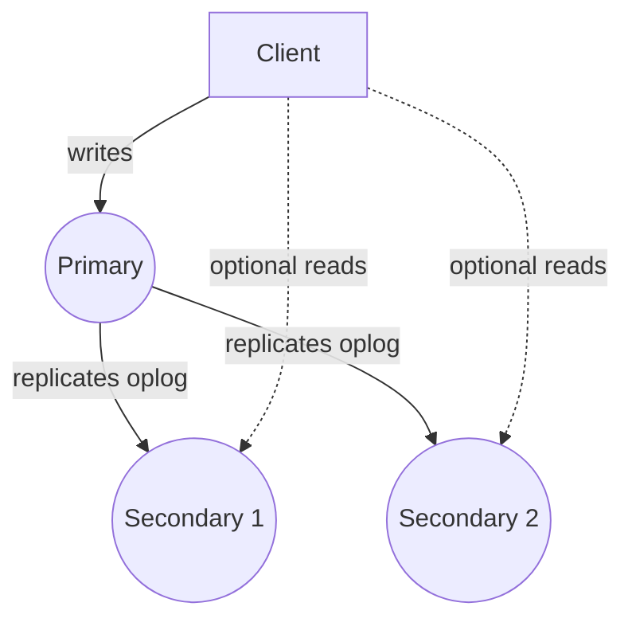
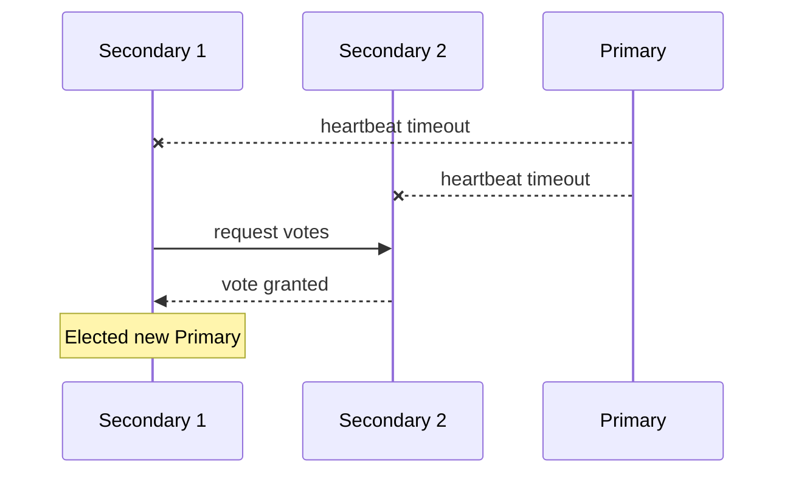

# Replication

## Replica Sets

A replica set is a group of MongoDB servers (mongod processes) that maintain the same data set, providing high availability and data redundancy. One member is elected Primary and accepts all writes; the others are Secondaries that replicate the Primary's oplog and can serve reads. If the Primary becomes unavailable, the remaining members automatically hold an election to choose a new Primary.



```javascript
rs.initiate({
  _id: "rs0",
  members: [
    { _id: 0, host: "mongo1:27017" },
    { _id: 1, host: "mongo2:27017" },
    { _id: 2, host: "mongo3:27017" }
  ]
});
```

**Advantages:**
- Automatic failover with no manual intervention required
- Data redundancy across multiple nodes protects against hardware failure
- Can offload read traffic to secondaries when eventual consistency is acceptable

**Disadvantages:**
- Secondary reads may return stale data (eventual consistency) unless using majority read concern with appropriate settings
- Requires at least 3 nodes (or a primary + secondary + arbiter) for robust automatic failover

**Interview Questions:**
- What is the minimum recommended replica set topology for automatic failover, and why? — A minimum of three data-bearing (or voting) members is recommended, since a majority of members must be reachable to elect a new Primary, and a two-node set can't safely determine a majority if either node fails.
- What happens to in-flight writes on the Primary if it suddenly becomes unreachable? — Writes that had not yet been acknowledged with a strong enough write concern (e.g., `majority`) may be lost, while writes acknowledged by a majority of nodes before the failure are preserved and reflected in the newly elected Primary.
- How does a replica set differ from a sharded cluster in terms of what problem it solves? — A replica set solves high availability and data redundancy by keeping identical copies of the full data set on multiple nodes, while a sharded cluster solves horizontal scalability by partitioning data across multiple independent shards.

## Primary

The Primary is the single replica set member that receives all write operations at any given time. All writes are recorded to its oplog, which secondaries then pull and replay to stay in sync. Only one node can be Primary at a time within a replica set.

**Interview Questions:**
- Can a replica set have more than one Primary at the same time under normal operation? — No, under normal operation a replica set has exactly one Primary at any given time; MongoDB's election protocol is designed to prevent more than one node from believing it's Primary simultaneously.
- What happens to write requests sent to a node that is not currently Primary? — Write requests sent to a Secondary are rejected with a "not writable primary" error, since only the Primary accepts writes.

## Secondary

Secondaries replicate data from the Primary by continuously applying operations from its oplog, keeping their data near real-time consistent with the Primary. They can serve read traffic if the client's read preference allows it, and are also eligible to be elected Primary if the current Primary fails.

**Differences:**

| Aspect | Primary | Secondary |
|---|---|---|
| Accepts writes | Yes | No (by default) |
| Serves reads | Yes (default) | Only if read preference allows |
| Election eligibility | N/A (already primary) | Yes (unless configured non-electable) |
| Data source | Client writes | Replicates Primary's oplog |

**Interview Questions:**
- Can a Secondary accept write operations directly from a client? — No, Secondaries only apply writes replicated from the Primary's oplog and reject direct write operations from clients.
- How would you configure a Secondary to never become Primary (e.g., for a dedicated analytics/backup node)? — Set that member's `priority` to `0` in the replica set configuration, which makes it ineligible to ever be elected Primary while still allowing it to vote and serve reads.
- What read preference would you use to allow reads from Secondaries? — Use a read preference mode such as `secondary`, `secondaryPreferred`, or `nearest` to allow (or prefer) routing reads to Secondary members.

## Automatic Failover

When the Primary becomes unreachable (crash, network partition, planned maintenance), the remaining eligible replica set members automatically detect the failure via heartbeats and initiate an election to choose a new Primary, typically completing within a few seconds, minimizing write downtime.



**Interview Questions:**
- What mechanism does a replica set use to detect that the Primary is down? — Members exchange periodic heartbeats with each other, and when a member fails to receive heartbeat responses from the Primary within the configured timeout, it triggers an election to select a new Primary.
- Roughly how long does automatic failover typically take, and what happens to writes during that window? — Failover typically completes within a few seconds, during which time the replica set has no Primary and all write operations fail until a new Primary is elected.
- Can automatic failover be disabled or delayed for specific members (e.g., a reporting-only secondary)? — Yes, a member's `priority` can be set to `0` to make it ineligible for election entirely, effectively excluding it from ever becoming Primary during a failover.

## Elections

An election is the process by which replica set members vote to select a new Primary, based on factors like member priority, most recent oplog timestamp (most up-to-date data wins), and the number of votes each member has. A majority of voting members must be reachable and agree for an election to succeed, which is why an odd number of voting members (or an arbiter) is recommended.

```javascript
cfg = rs.conf();
cfg.members[0].priority = 2; // prefer this member as Primary
rs.reconfig(cfg);
```

**Interview Questions:**
- What factors influence which member wins an election to become Primary? — Election outcome is influenced by each member's configured `priority`, how up-to-date its oplog is (most recent data wins), and whether it can secure votes from a majority of the voting members.
- Why is it important to have an odd number of voting members in a replica set? — An odd number of voting members avoids ties when determining a majority, ensuring an election can always resolve to a clear winner without a deadlock.
- How does member `priority` influence election outcomes? — Higher `priority` values make a member more likely to be elected Primary when eligible, allowing administrators to bias elections toward preferred, typically higher-capacity or lower-latency, nodes.

## Read Preference

Read preference determines which replica set members (Primary and/or Secondaries) a client will route read operations to. Modes include `primary` (default, strongest consistency), `primaryPreferred`, `secondary`, `secondaryPreferred`, and `nearest` (lowest network latency). Choosing a secondary-based mode trades consistency for read scalability or geographic latency reduction.

```javascript
db.orders.find().readPref("secondaryPreferred");
```

```java
mongoTemplate.getDb().withCodecRegistry(...); // in Spring, configure via ReadPreference on MongoClientSettings
```

**Differences:**

| Mode | Reads From | Consistency |
|---|---|---|
| `primary` | Primary only | Strongly consistent |
| `secondaryPreferred` | Secondary if available, else Primary | Possibly stale |
| `nearest` | Lowest-latency member | Possibly stale |

**Interview Questions:**
- What is the tradeoff of using `secondaryPreferred` read preference? — `secondaryPreferred` offloads read load from the Primary and improves read scalability, but reads may return slightly stale data due to asynchronous replication lag on secondaries.
- Why might `nearest` be chosen for a globally distributed application? — `nearest` routes reads to whichever member has the lowest network latency to the client, which minimizes read latency for geographically distributed applications at the cost of potentially reading from a lagging secondary.
- How does read preference interact with read concern to determine overall consistency? — Read preference chooses which node serves a read, while read concern determines what guarantee the returned data must satisfy (e.g., majority-committed); together they determine both where and how consistent a read is, such as reading from a secondary but still requiring `majority` read concern.

## Write Concern

Write concern specifies the level of acknowledgment MongoDB requires from replica set members before considering a write operation successful, expressed as `w` (number of nodes, or `"majority"`), `j` (journal acknowledgment), and `wtimeout`. Stronger write concerns (e.g., `w: "majority"`) increase durability guarantees at the cost of latency.

```javascript
db.orders.insertOne(
  { customerId: "c1", amount: 250 },
  { writeConcern: { w: "majority", j: true, wtimeout: 5000 } }
);
```

**Advantages:**
- `w: "majority"` protects against data loss from a subsequent failover/rollback
- Tunable per-operation to balance latency vs durability

**Disadvantages:**
- Higher write concern levels increase write latency, especially across geographically distributed replica sets

**Interview Questions:**
- What does `w: "majority"` guarantee that `w: 1` does not? — `w: "majority"` guarantees the write has been acknowledged by a majority of voting replica set members, protecting it from being rolled back after a failover, whereas `w: 1` only requires acknowledgment from the Primary, risking loss if the Primary fails before replicating that write.
- What is the role of the `j` (journal) option in write concern? — The `j` option requires the acknowledging node(s) to have written the operation to the on-disk journal before acknowledging, protecting against data loss from an unexpected process crash or power failure.
- Why might an application use a weaker write concern for non-critical writes (e.g., logging)? — A weaker write concern like `w: 1` reduces write latency since it doesn't wait for replication acknowledgment, which is an acceptable trade-off for non-critical data like logs where occasional loss is tolerable.

## Read Concern

Read concern controls the consistency/isolation guarantees of data returned by a read operation, with levels such as `local` (default, may return data that could later be rolled back), `available`, `majority` (only data acknowledged by a majority of nodes, safe from rollback), `linearizable`, and `snapshot` (used with transactions).

```javascript
db.orders.find({ status: "SHIPPED" }).readConcern("majority");
```

**Differences:**

| Level | Guarantee |
|---|---|
| `local` | Latest data on that node, may be rolled back later |
| `majority` | Data acknowledged by a majority, won't be rolled back |
| `linearizable` | Strongest; reflects all previously completed majority writes |

**Interview Questions:**
- Why could data returned under `local` read concern later be "rolled back"? — Data read with `local` concern reflects the queried node's current state, which may include writes that haven't yet been acknowledged by a majority and could be undone if the Primary changes during a failover before replicating them.
- When would you use `majority` read concern together with `majority` write concern? — Use both together when an application needs "read your own writes" durability guarantees, ensuring that once a majority-acknowledged write is made, subsequent majority reads will reliably see it and it won't be rolled back.
- What is the difference between `majority` and `linearizable` read concern? — `majority` guarantees data acknowledged by a majority of nodes won't be rolled back, while `linearizable` additionally guarantees the read reflects the absolute latest completed majority write, even accounting for concurrent operations, at the cost of higher latency.

## Oplog

The oplog (operations log) is a special capped collection on each replica set member (`local.oplog.rs`) that records every write operation applied to the Primary, in idempotent form. Secondaries continuously tail and replay this log to stay synchronized. Its size determines the "replication window" — how far behind a secondary can fall before it can no longer catch up via normal replication.

```javascript
db.getReplicationInfo(); // shows oplog size and time window
rs.printReplicationInfo();
```

**Interview Questions:**
- Why must operations recorded in the oplog be idempotent? — Oplog entries must be idempotent because secondaries (and initial sync/resync processes) may need to reapply entries, and idempotent operations ensure reapplying them produces the same result without corrupting data.
- What happens if a Secondary falls behind further than the oplog's retention window? — If a Secondary falls too far behind, the oplog entries it needs may have already been overwritten (since the oplog is a capped collection), requiring the Secondary to perform a full initial resync from another member instead of normal replication.
- How would you resize the oplog on a running replica set member? — Use the `replSetResizeOplog` administrative command to change the oplog size on a running member without requiring a restart or full resync.

## Arbiter Nodes

An arbiter is a replica set member that participates in elections (casting a vote) but does not hold a copy of the data and cannot become Primary. Arbiters are useful for achieving an odd number of voting members (breaking election ties) without the cost of an additional full data-bearing node.

```javascript
rs.addArb("mongo4:27017");
```

**Advantages:**
- Lightweight way to maintain odd vote count without extra storage/replication cost

**Disadvantages:**
- Cannot serve reads or hold data, so it doesn't add redundancy for data durability
- MongoDB generally recommends data-bearing nodes over arbiters where resources allow, since arbiters can complicate majority write-concern calculations

**Differences:**

| Aspect | Data-Bearing Secondary | Arbiter |
|---|---|---|
| Holds data | Yes | No |
| Can become Primary | Yes | No |
| Participates in elections | Yes | Yes |
| Resource cost | Full (storage, replication) | Minimal |

**Interview Questions:**
- What is the main purpose of adding an arbiter to a replica set? — An arbiter's main purpose is to provide an additional vote to help achieve a majority during elections (e.g., maintaining an odd number of voting members) without the storage and replication cost of a full data-bearing node.
- Why might MongoDB's documentation recommend avoiding arbiters in favor of additional data-bearing nodes when possible? — Arbiters don't hold data, so they don't add real redundancy, and their presence can complicate `majority` write concern calculations since a majority reachable but data-thin cluster may still not guarantee durability the way an all-data-bearing majority would.
- Can an arbiter ever be elected Primary? — No, an arbiter never holds data and cannot be elected Primary; it can only participate in voting.
