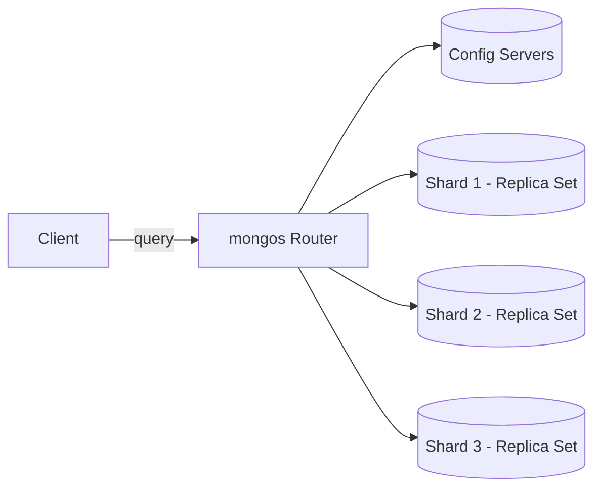
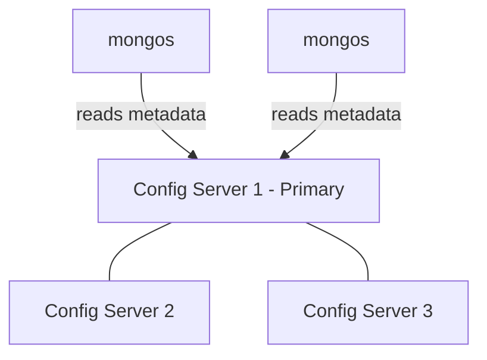
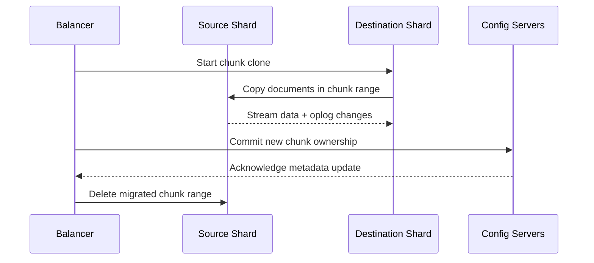

# Sharding

## Sharding Concepts

Sharding is MongoDB's horizontal scaling strategy that partitions a collection's data across multiple servers (shards) so that no single node has to hold the entire dataset or absorb all read/write load. A sharded cluster consists of shards (which store the data, typically as replica sets), config servers (which store cluster metadata), and `mongos` routers (which route client requests to the correct shards). Sharding is transparent to the application: queries are issued the same way whether the collection is sharded or not.

Use sharding when a single replica set can no longer handle the working set size, storage capacity, or throughput requirements of a workload — for example, an e-commerce order history collection growing into billions of documents where a single primary can no longer serve write traffic fast enough.



**Advantages:**
- Scales writes and storage horizontally across many machines
- Enables geographic data distribution via zone sharding
- Individual shards can be replica sets, preserving high availability

**Disadvantages:**
- Adds significant operational complexity (config servers, routers, balancer)
- Cross-shard queries and transactions are more expensive
- Poor shard key choice can lead to unbalanced clusters that are hard to fix later

**Interview Questions:**
- What problem does sharding solve that replication alone cannot? — Sharding solves horizontal scalability of storage capacity and write/read throughput by partitioning data across multiple servers, whereas replication alone only provides redundancy and read scaling while every replica still holds the entire dataset.
- What are the three main components of a sharded cluster and what does each do? — Shards store the actual partitioned data (typically as replica sets), config servers store the cluster's metadata mapping chunks to shards, and `mongos` routers direct client queries to the appropriate shard(s) based on that metadata.
- What happens to a query that doesn't include the shard key? — A query without the shard key becomes a "scatter-gather" operation, where `mongos` must broadcast the query to every shard and merge the results, which is slower than a targeted single-shard query.
- How does sharding interact with replica sets within each shard? — Each shard is typically deployed as its own replica set, so sharding provides horizontal scalability across shards while replication within each shard continues to provide high availability and failover for that shard's data.

## Shard Key

The shard key is the field (or combination of fields) used to determine how MongoDB distributes documents across shards. It is immutable for the collection's lifetime (in older versions) and is chosen at the time a collection is sharded via `sh.shardCollection()`. MongoDB uses the shard key values to compute chunk ranges (for ranged sharding) or hashed values (for hashed sharding) that determine which shard owns a given document.

```javascript
// Enable sharding on a database and shard a collection using a compound shard key
sh.enableSharding("ecommerceDb")
sh.shardCollection("ecommerceDb.orders", { customerId: 1, orderDate: 1 })
```

**Advantages:**
- Well-chosen keys enable even data and query distribution
- Compound shard keys can support both range queries and cardinality

**Disadvantages:**
- Poorly chosen keys cause "hot shards" or jumbo chunks
- Changing a shard key historically required re-sharding (dropping and reloading data), though newer MongoDB versions support limited shard key refinement

**Interview Questions:**
- What makes a good shard key in terms of cardinality, frequency, and monotonicity? — A good shard key has high cardinality (many distinct values so data can be split into many chunks), even frequency (no single value dominates, avoiding oversized chunks), and low monotonicity (avoiding ever-increasing values that concentrate new writes onto a single shard).
- What is a "hot shard" and how does shard key choice cause it? — A "hot shard" is a shard that receives a disproportionate share of reads/writes, typically caused by choosing a monotonically increasing shard key (like a timestamp or auto-incrementing ID) that always routes the newest data to the same shard.
- Can you change a shard key after a collection is sharded? — Historically no, changing a shard key required un-sharding, dropping, and reloading the collection with a new key, though newer MongoDB versions support limited in-place shard key refinement (adding suffix fields) without a full reload.
- How does a compound shard key affect query routing compared to a single-field key? — A compound shard key allows `mongos` to target a single shard efficiently for queries that include at least the leading field(s) of the key, similar to compound index prefix matching, while queries omitting the leading field(s) fall back to a scatter-gather across all shards.

## Config Servers

Config servers store the sharded cluster's metadata, including the mapping of chunks to shards, shard cluster authentication settings, and cluster-wide configuration. In production, config servers are deployed as a dedicated replica set (CSRS - Config Server Replica Set), ensuring the metadata itself is highly available. Every `mongos` instance reads from and caches this metadata to route requests efficiently.



**Advantages:**
- Centralizes cluster metadata, enabling consistent routing across many `mongos` instances
- Being a replica set itself, it tolerates node failures

**Disadvantages:**
- If the config server replica set is unavailable, chunk migrations and metadata updates halt (though reads/writes with cached metadata can often continue briefly)

**Interview Questions:**
- What metadata do config servers store? — Config servers store the sharded cluster's metadata, including the mapping of chunk ranges to shards, cluster authentication/settings, and other cluster-wide configuration used by `mongos` routers.
- Why are config servers deployed as a replica set rather than a single node? — Deploying config servers as a replica set (CSRS) ensures the critical cluster metadata itself is highly available and tolerant of individual node failures, avoiding a single point of failure for cluster routing.
- What happens to a sharded cluster if the config server replica set becomes unavailable? — Chunk migrations and metadata updates halt, and while `mongos` instances can often continue routing briefly using cached metadata, most cluster management operations and new `mongos` connections are impacted until the config servers recover.

## Mongos Router

`mongos` acts as a query router that sits between client applications and the sharded cluster. It has no persistent data of its own — it fetches and caches cluster metadata from the config servers, then routes each incoming query or write to the appropriate shard(s), merging results as needed (for example, sorting or aggregating results scattered across shards). Applications connect to `mongos` exactly as they would to a single `mongod` instance.

A typical production deployment runs multiple `mongos` instances (often co-located with application servers) behind the driver's connection pooling, so no single router process is a bottleneck or single point of failure.

**Advantages:**
- Transparent routing means application code doesn't need to know about sharding
- Stateless, so multiple instances can be run for redundancy and load distribution

**Disadvantages:**
- Adds an extra network hop compared to talking directly to a `mongod`
- Scatter-gather queries (without shard key) must fan out to all shards, which is slower

**Interview Questions:**
- What is the role of `mongos` in a sharded cluster? — `mongos` acts as a stateless query router, fetching and caching cluster metadata from config servers to route each client query or write to the appropriate shard(s) and merge results as needed.
- Why is `mongos` considered stateless, and what does it cache? — `mongos` holds no persistent data of its own; it only caches the cluster metadata (chunk-to-shard mappings) fetched from config servers, which is why multiple `mongos` instances can be run interchangeably for redundancy.
- What is a scatter-gather query and why is it less efficient than a targeted query? — A scatter-gather query is one that must be broadcast to every shard because it doesn't include the shard key, requiring `mongos` to fan out the request and merge results from all shards, which is slower than a targeted query routed to a single shard.

## Chunk Migration

Data in a sharded collection is divided into chunks — contiguous ranges of shard key values (or hash buckets). As data grows or shrinks unevenly, the balancer process moves chunks between shards to keep the data distribution even. During a migration, the source shard continues serving reads/writes for the chunk until the destination shard has fully copied the data and the metadata is atomically updated on the config servers.



**Advantages:**
- Keeps data evenly distributed automatically without manual intervention
- Migrations are designed to be non-blocking for normal operations

**Disadvantages:**
- Migrations consume extra CPU, memory, and I/O, which can affect performance during peak load
- Can be paused/scheduled to avoid business-critical hours

**Interview Questions:**
- What triggers a chunk migration? — A chunk migration is triggered by the balancer when it detects an uneven distribution of chunks across shards, moving chunks from over-loaded shards to under-loaded ones to restore balance.
- How does MongoDB ensure data consistency during a chunk migration? — The source shard continues serving reads/writes for the chunk while the destination shard copies the data and any concurrent oplog changes, and only once the copy is complete does MongoDB atomically update the chunk's ownership in the config server metadata before the source deletes its copy.
- Can chunk migrations be scheduled or throttled, and why would you want that? — Yes, the balancer's activity window can be scheduled (e.g., only running overnight) and migrations can be throttled, which is useful to avoid consuming CPU, memory, and I/O resources during peak business hours.

## Balancer

The balancer is a background process (running as part of the config server replica set primary in modern MongoDB versions) that monitors the distribution of chunks across shards and automatically migrates chunks from over-loaded shards to under-loaded ones to maintain balance. It can be enabled/disabled cluster-wide or per-collection, and its activity can be restricted to specific time windows to avoid impacting peak traffic.

```javascript
// Check balancer status
sh.getBalancerState()

// Disable the balancer temporarily (e.g. before a maintenance window)
sh.stopBalancer()

// Set a balancing window (only run between 23:00 and 06:00)
db.settings.updateOne(
  { _id: "balancer" },
  { $set: { activeWindow: { start: "23:00", stop: "06:00" } } },
  { upsert: true }
)
```

**Advantages:**
- Automates cluster-wide data balancing with no manual chunk management
- Configurable scheduling minimizes impact on production traffic

**Disadvantages:**
- Uncontrolled balancing can compete with application workload for resources
- Imbalanced shard keys can cause the balancer to run constantly without achieving good balance

**Interview Questions:**
- What is the balancer responsible for and where does it run? — The balancer monitors chunk distribution across shards and automatically migrates chunks from over-loaded to under-loaded shards to maintain balance; in modern MongoDB versions it runs as part of the config server replica set's primary.
- How would you prevent the balancer from running during business hours? — Configure a balancing activity window (e.g., `activeWindow` with start/stop times) so the balancer only migrates chunks during off-peak hours like overnight, or disable it temporarily with `sh.stopBalancer()` before a maintenance window.
- What symptoms would indicate the balancer is struggling to keep a cluster balanced? — Symptoms include persistently uneven chunk counts across shards, the balancer running continuously without converging, or repeated jumbo chunk warnings, often caused by a poorly chosen shard key with low cardinality or high monotonicity.

## Choosing a Shard Key

Selecting a shard key is one of the most consequential decisions in a sharded cluster because it directly determines query targeting, write distribution, and how easily the cluster scales. Good shard keys have high cardinality (many possible distinct values), even frequency (no single value dominates), and low monotonicity (avoiding always-increasing values like timestamps or auto-incrementing IDs, which concentrate writes on one shard). Compound shard keys are often used to balance these properties, and hashed shard keys can be used to avoid monotonic write hot-spotting at the cost of losing efficient range queries.

For example, sharding an `orders` collection purely on an ever-increasing `orderDate` would send all new writes to a single "hot" shard; using a hashed `customerId` or a compound key like `{ region: 1, orderId: 1 }` spreads writes more evenly.

**Differences:**

| Shard Key Type | Write Distribution | Range Query Support |
|---|---|---|
| Ranged (ascending, e.g. `_id`) | Poor (hot shard) | Excellent |
| Hashed | Excellent (even) | Poor (requires scatter-gather) |
| Compound (low + high cardinality) | Good | Good, if prefix field is used in query |

**Interview Questions:**
- Why is a monotonically increasing field usually a poor shard key choice? — A monotonically increasing field like a timestamp always routes new writes to the shard owning the highest current range, concentrating all write load onto a single "hot" shard instead of spreading it evenly.
- What is the trade-off between hashed and ranged shard keys? — Hashed shard keys distribute writes very evenly but destroy value ordering, making range queries inefficient (scatter-gather), while ranged shard keys preserve efficient range queries but risk uneven write distribution if the key is monotonic.
- How do you evaluate cardinality and frequency when selecting a shard key? — Evaluate cardinality by checking how many distinct values the field can take (higher is better for enabling many chunks) and frequency by checking whether any single value appears disproportionately often (high frequency for one value risks an oversized, unsplittable chunk).
- How would you shard a collection to support both even write distribution and efficient range queries? — Use a compound shard key combining a high-cardinality, evenly-distributed field (like a hashed or randomized prefix) with a field needed for range queries (like a date), so writes spread evenly while range queries on the secondary field remain efficient within a scoped prefix.

## Zone Sharding

Zone sharding (formerly called tag-aware sharding) lets you associate ranges of shard key values with specific zones, and then assign zones to specific shards. This is commonly used to keep data physically located near its users (data locality/compliance, e.g. keeping EU customer data on shards hosted in EU data centers) or to isolate specific workloads (e.g. archiving old data onto cheaper hardware).

```javascript
// Define a zone and associate it with a shard
sh.addShardTag("shard0000", "EU")
sh.addShardTag("shard0001", "US")

// Assign shard key ranges to zones
sh.addTagRange(
  "ecommerceDb.orders",
  { region: "EU", orderId: MinKey },
  { region: "EU", orderId: MaxKey },
  "EU"
)
```

**Advantages:**
- Enables data residency/compliance requirements (e.g. GDPR) at the infrastructure level
- Supports tiered storage strategies (hot vs. cold hardware)

**Disadvantages:**
- Adds configuration complexity and requires careful shard key design that includes the zoning field
- Misconfigured zones can create unintended hot spots

**Interview Questions:**
- What is zone sharding used for in a real-world multi-region deployment? — Zone sharding is used to pin specific ranges of shard key values (e.g., customers in a particular region) to specific shards, keeping data physically located near its users for latency, data residency, or compliance reasons.
- How does zone sharding relate to shard key design? — Zone sharding requires the shard key to include a field (like `region`) that can be used to define zone ranges, since zones are defined as ranges of shard key values that must be routed to particular shards.
- Give an example of a compliance requirement that zone sharding could help satisfy. — GDPR requirements that EU customer data physically reside within EU data centers can be satisfied by zoning EU-tagged shard key ranges to shards hosted in EU regions.
