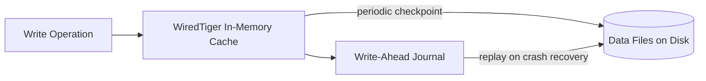
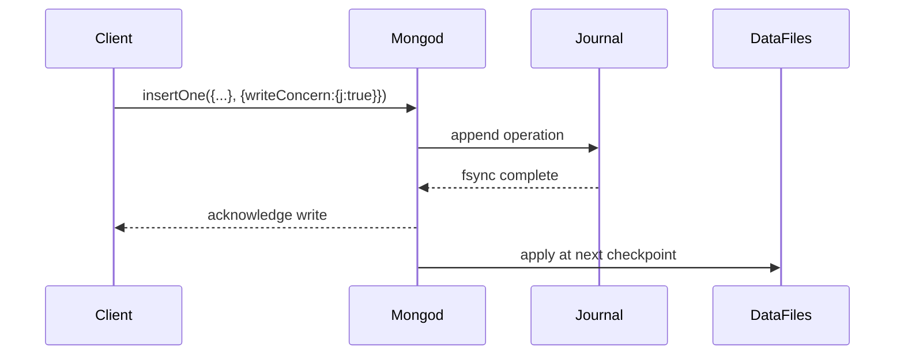

# Storage Engine

## WiredTiger

WiredTiger is MongoDB's default storage engine (since MongoDB 3.2), responsible for how data is actually stored on disk and managed in memory. It provides document-level concurrency control (instead of locking entire collections or the database), compression, and a checkpoint-based durability model combined with a write-ahead journal. Each collection and index is stored in its own WiredTiger file, allowing fine-grained I/O and compression settings.



**Advantages:**
- Document-level locking allows much higher write concurrency than the older MMAPv1 engine
- Built-in compression reduces storage footprint and I/O
- Checkpoints + journaling provide crash resilience

**Disadvantages:**
- Higher memory overhead for its internal cache compared to simpler engines
- Compression trades some CPU for reduced disk usage

**Interview Questions:**
- What concurrency model does WiredTiger use compared to MongoDB's legacy MMAPv1 engine? — WiredTiger uses document-level locking, allowing concurrent writes to different documents to proceed in parallel, whereas the legacy MMAPv1 engine used coarser collection-level (and earlier database/global) locking that serialized many unrelated writes.
- How do checkpoints and the journal work together to guarantee durability? — The journal records every write immediately as a write-ahead log, providing durability between checkpoints, while periodic checkpoints flush a consistent snapshot of the in-memory data to disk, reducing how much journal data needs replaying during crash recovery.
- Why does each collection and index get its own WiredTiger file? — Separate files per collection/index allow WiredTiger to apply fine-grained I/O, compression, and configuration settings independently, and make operations like dropping a collection simple file removal rather than complex in-place data manipulation.

## Compression

WiredTiger compresses both collection data and indexes by default to reduce disk usage and improve I/O throughput, since compressed data means fewer bytes read from/written to disk. MongoDB supports `snappy` (default, fast with moderate compression), `zlib` (higher compression ratio, more CPU cost), and `zstd` (good balance of ratio and speed, available in newer versions) for collection data, and `prefix` compression for indexes.

```javascript
// Create a collection with zstd compression for higher compression ratio
db.createCollection("auditLogs", {
  storageEngine: { wiredTiger: { configString: "block_compressor=zstd" } }
})
```

**Differences:**

| Compressor | Compression Ratio | CPU Cost | Typical Use |
|---|---|---|---|
| `snappy` | Moderate | Low | Default, general purpose |
| `zlib` | High | High | Storage-constrained, less write-heavy |
| `zstd` | High | Moderate | Modern balanced choice |
| `none` | None | None | Rare, latency-critical, ample disk |

**Interview Questions:**
- Why does MongoDB compress data by default and what's the trade-off? — Compression reduces disk usage and I/O by storing fewer bytes for the same data, at the cost of additional CPU time needed to compress and decompress data on every read/write.
- When would you choose `zlib` over `snappy`? — Choose `zlib` when storage space is more constrained than CPU capacity and the workload isn't extremely write-heavy, since `zlib` achieves a higher compression ratio at a higher CPU cost than the default `snappy`.
- How does index prefix compression differ from block compression of documents? — Index prefix compression exploits the fact that adjacent keys in a sorted B-tree index often share common prefixes, storing only the differing suffix, while block compression (used for document data) applies general-purpose compression algorithms like snappy/zlib/zstd to blocks of raw document data.

## Journaling

Journaling is WiredTiger's write-ahead log mechanism that records write operations before they are applied to the in-memory data structures are checkpointed to disk, ensuring that MongoDB can recover uncommitted-to-checkpoint data after an unclean shutdown (e.g. power loss or crash). By default, the journal is flushed to disk roughly every 100 milliseconds (previously called `commitIntervalMs`), and write concern `j: true` forces a write to wait for its journal flush before acknowledging.



**Advantages:**
- Enables crash recovery without losing acknowledged writes
- `j: true` gives per-operation durability guarantees independent of checkpoint frequency

**Disadvantages:**
- Waiting on journal flushes (`j: true`) adds write latency
- Journal files consume additional disk space and I/O bandwidth

**Interview Questions:**
- What does the journal protect against that checkpoints alone do not? — The journal protects against losing writes that occurred after the last checkpoint but before a crash, since checkpoints only persist data periodically while the journal records every write immediately as it happens.
- What happens if MongoDB crashes between two checkpoints, with journaling enabled? — On restart, MongoDB replays the journal entries recorded since the last checkpoint to bring the data files back to a consistent state reflecting all acknowledged writes, avoiding data loss.
- What is the performance trade-off of using `j: true` on every write? — Requiring a journal flush acknowledgment on every write adds latency since the write must wait for the fsync to complete, trading some throughput/latency for stronger per-operation durability.

## Checkpoints

A checkpoint is a consistent, point-in-time snapshot of the data that WiredTiger writes to disk, by default every 60 seconds or after 2GB of journal data has accumulated, whichever comes first. Between checkpoints, durability is provided by the journal; checkpoints simply reduce the amount of journal data that would need to be replayed during crash recovery, and they are how data actually becomes durable on disk in the storage engine's data files.

**Advantages:**
- Bounds crash recovery time by limiting how much journal must be replayed
- Provides a consistent on-disk snapshot for tools like file-system backups

**Disadvantages:**
- Checkpointing consumes disk I/O and can cause momentary latency spikes on busy systems

**Interview Questions:**
- What triggers a WiredTiger checkpoint by default? — A checkpoint is triggered by default every 60 seconds or after 2GB of journal data has accumulated, whichever comes first.
- How do checkpoints relate to crash recovery time? — Checkpoints bound crash recovery time by limiting how much journal data must be replayed on restart, since recovery only needs to reapply operations recorded after the most recent checkpoint.
- Why might a filesystem snapshot backup want to be taken right after a checkpoint? — Taking a snapshot right after a checkpoint captures the data files in the most recently known consistent, fully-flushed state, minimizing the amount of journal replay needed to make the backup usable.

## Cache Management

WiredTiger maintains an in-memory cache (default: 50% of (RAM - 1GB), or 256MB, whichever is greater) that holds frequently accessed, uncompressed data and indexes for fast access. When the working set exceeds the cache size, WiredTiger must evict pages to disk, which increases I/O and can degrade performance; monitoring cache utilization and eviction rates is a key part of MongoDB performance tuning.

```javascript
// Check current WiredTiger cache statistics
db.serverStatus().wiredTiger.cache
```

**Advantages:**
- Keeps hot data in memory for low-latency access
- Configurable size lets operators tune for available hardware

**Disadvantages:**
- Undersized cache relative to working set causes excessive eviction and disk I/O
- Oversized cache can starve the OS file system cache and other processes on the same host

**Interview Questions:**
- What is the default WiredTiger cache size formula? — By default, WiredTiger's cache size is 50% of (total RAM minus 1GB), or 256MB, whichever is greater.
- What happens when the working set doesn't fit in the WiredTiger cache? — WiredTiger must evict pages from cache to make room for new data, increasing disk I/O and degrading performance since frequently accessed data may need to be re-read from disk.
- Which `serverStatus` metrics would you check to diagnose cache pressure? — Check `wiredTiger.cache` metrics such as "bytes currently in the cache", "tracked dirty bytes in the cache", and eviction-related counters like "pages evicted by application threads" to diagnose cache pressure.
