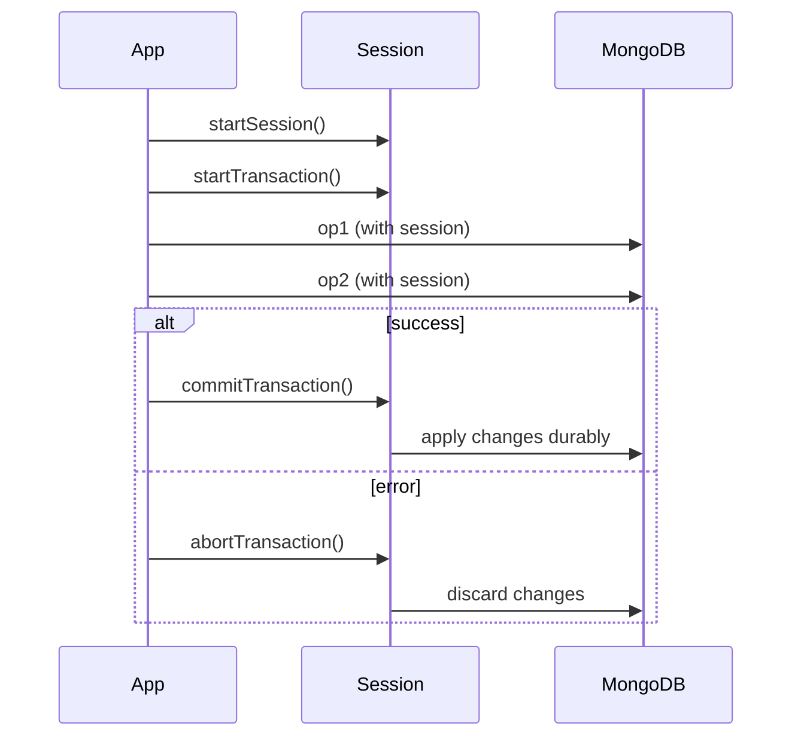

# Transactions

## Single Document Atomicity

MongoDB guarantees that all changes within a single document — including nested arrays and subdocuments — are applied atomically, even across multiple fields. This built-in atomicity is why well-designed document models (embedding related data in one document) often avoid the need for multi-document transactions entirely.

```javascript
db.accounts.updateOne(
  { _id: "acc1" },
  { $inc: { balance: -100 }, $push: { history: { type: "DEBIT", amount: 100 } } }
);
```

**Interview Questions:**
- Why is single-document atomicity considered a core design principle in MongoDB's data modeling philosophy? — Because MongoDB guarantees atomic changes across all fields, arrays, and subdocuments within a single document, schema designs that embed related data into one document can rely on this built-in atomicity for consistency, reducing the need for more expensive multi-document transactions.
- How can embedding data to leverage single-document atomicity reduce the need for multi-document transactions? — By co-locating related data that must change together (e.g., an account balance and its transaction history) within one document, a single atomic update operation can satisfy consistency requirements that would otherwise require wrapping multiple documents in a transaction.

## Multi-Document Transactions

Multi-document transactions (available since MongoDB 4.0 for replica sets, and 4.2 for sharded clusters) allow multiple read/write operations across multiple documents, collections, or even databases to be grouped into a single all-or-nothing unit, with snapshot isolation. They're used when operations spanning several documents must all succeed or all fail together, such as transferring funds between two account documents.

```javascript
const session = client.startSession();
try {
  session.startTransaction();
  accounts.updateOne({ _id: "acc1" }, { $inc: { balance: -100 } }, { session });
  accounts.updateOne({ _id: "acc2" }, { $inc: { balance: 100 } }, { session });
  session.commitTransaction();
} catch (e) {
  session.abortTransaction();
  throw e;
} finally {
  session.endSession();
}
```

```java
@Transactional
public void transferFunds(String fromId, String toId, BigDecimal amount) {
    mongoTemplate.updateFirst(query(where("_id").is(fromId)),
        new Update().inc("balance", amount.negate()), Account.class);
    mongoTemplate.updateFirst(query(where("_id").is(toId)),
        new Update().inc("balance", amount), Account.class);
}
```

**Advantages:**
- Guarantees atomicity/consistency across multiple documents and collections
- Simplifies application logic for genuinely multi-document invariants

**Disadvantages:**
- Higher latency and resource cost than single-document operations
- Long-running transactions can hold locks/snapshots and impact throughput

**Interview Questions:**
- When would you reach for a multi-document transaction instead of relying on document embedding? — Use a multi-document transaction when an operation must atomically update multiple separate documents, collections, or databases that cannot reasonably be embedded together, such as transferring funds between two independent account documents.
- What is snapshot isolation, and how does it apply to MongoDB transactions? — Snapshot isolation means a transaction sees a consistent point-in-time view of the data for its entire duration, unaffected by concurrent writes from other transactions, and its own writes aren't visible to others until it commits.
- How would you implement a multi-document transaction using Spring Data MongoDB's `@Transactional`? — Annotate a service method with `@Transactional`, ensure a `MongoTransactionManager` bean is configured, and perform multiple repository/template operations inside that method; Spring Data automatically starts, commits, or rolls back the underlying MongoDB session transaction around the method boundary.

## ACID Properties

MongoDB transactions provide the classic ACID guarantees: **Atomicity** (all operations in the transaction succeed or none do), **Consistency** (the database moves from one valid state to another), **Isolation** (concurrent transactions don't see each other's uncommitted changes, via snapshot isolation), and **Durability** (committed changes survive failures, backed by the write-ahead journal and replication).

**Interview Questions:**
- How does MongoDB implement isolation for concurrent transactions? — MongoDB implements isolation through snapshot isolation, giving each transaction a consistent view of data as of its start time and hiding uncommitted changes from other concurrent transactions until commit.
- How does write concern relate to the durability guarantee of a committed transaction? — The write concern (e.g., `majority`) used when committing a transaction determines how many replica set members must acknowledge the write before it's considered durable, directly controlling the strength of the durability guarantee.
- Can you explain atomicity in the context of a MongoDB multi-document transaction with an example? — In a funds transfer transaction that debits one account and credits another, atomicity guarantees that either both updates succeed and are committed together, or if either fails, both are rolled back, so the system never ends up with money debited from one account without being credited to the other.

## Transaction Lifecycle

A transaction moves through a defined lifecycle: start a client session, start the transaction, execute one or more operations against that session, then either commit (making all changes visible/durable) or abort (rolling back all changes). Retryable logic is often layered on top to handle transient errors like `TransientTransactionError`.



**Interview Questions:**
- What are the distinct phases of a MongoDB transaction's lifecycle? — A transaction starts a client session, starts the transaction itself, executes one or more operations scoped to that session, and finally either commits (making changes durable and visible) or aborts (discarding all changes).
- What kinds of errors should trigger a transaction retry versus an abort? — Errors labeled `TransientTransactionError` (e.g., transient network issues or replica set elections) should trigger a retry of the whole transaction, while non-transient errors like application-level validation failures should trigger an abort without retrying.
- Why is a client session required before starting a transaction? — A client session provides the context (including the transaction number and causal consistency guarantees) that MongoDB uses to associate a sequence of operations with a single transaction and to support retryable writes.

## Transaction Limitations

MongoDB transactions have practical constraints: a default 60-second maximum runtime, restrictions on certain DDL operations (e.g., creating collections/indexes inside a transaction, though this improved in later versions), increased oplog/cache pressure for large transactions, and a general recommendation to keep transactions short and touch a limited number of documents.

**Disadvantages:**
- Not designed for bulk/batch operations touching very large numbers of documents
- Can increase contention and WiredTiger cache pressure if overused

**Interview Questions:**
- What is the default time limit for a MongoDB transaction, and what happens if it's exceeded? — MongoDB transactions default to a 60-second maximum runtime; if exceeded, the transaction is automatically aborted and any changes made within it are rolled back.
- Why are multi-document transactions discouraged for large bulk-update workloads? — Large transactions touching many documents increase oplog size, WiredTiger cache pressure, and contention/lock hold time, risking timeouts and degraded throughput, so bulk updates are generally better handled with `bulkWrite()` outside a transaction.
- What operations were historically restricted from running inside a transaction? — Certain DDL-like operations, such as creating collections or indexes, were historically restricted from running inside a transaction, though later MongoDB versions relaxed some of these restrictions.

## Retryable Writes

Retryable writes automatically retry a single write operation (insert, update, delete, findAndModify) once if it fails due to a transient network error or replica set election, using a unique transaction number to ensure the operation isn't applied twice. This is enabled by default in modern drivers and improves resilience during failovers without requiring application-level retry logic for simple writes.

```javascript
// Enabled by default via connection string option
mongodb://host1,host2,host3/?retryWrites=true
```

**Differences:**

| Aspect | Retryable Writes | Multi-Document Transactions |
|---|---|---|
| Scope | Single write operation | Multiple operations/documents |
| Purpose | Resilience against transient failures | Atomicity across multiple operations |
| Overhead | Low | Higher (snapshot, locks) |

**Interview Questions:**
- How does MongoDB avoid applying a retried write twice? — Retryable writes are tagged with a unique transaction number per session, which the server uses to detect and deduplicate a retried attempt, ensuring the operation's effect is applied only once even if the client resends it.
- What kinds of failures trigger a retryable write to automatically retry? — Transient failures such as network errors or a replica set election (temporary loss of a Primary) trigger an automatic retry of the write by the driver.
- How do retryable writes differ from multi-document transactions in purpose and scope? — Retryable writes provide resilience for a single write operation against transient failures with low overhead, while multi-document transactions provide atomicity across multiple operations/documents at a higher performance cost.
