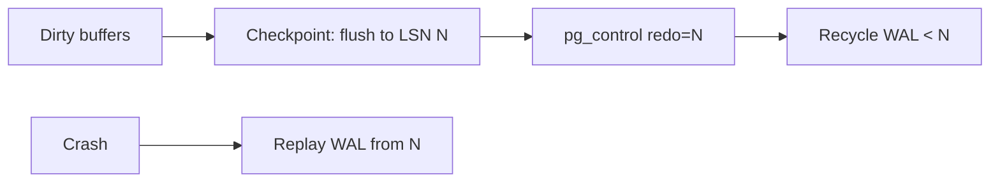

# Checkpoints and Background Writer

## Overview

Dirty pages in shared buffers are crash-safe (WAL has them) but must eventually reach heap files to bound recovery time. Checkpoints draw the recovery line; the background writer smooths the flow between checkpoints. Mistuning either turns steady writes into latency spikes.

See also:

- [WAL: Write-Ahead Logging](./wal.md)
- [PostgreSQL Write Path](./postgresql-write-path.md)
- [PostgreSQL Memory Architecture](./postgresql-memory-architecture.md)
- [Crash Recovery Internals](./crash-recovery-internals.md)

## Why This Matters

Checkpoint spikes are a top-3 "mystery p99 latency" cause. Understanding dirty-page lifecycle converts them from mystery to arithmetic.

## Checkpoints / Why They Exist / Lifecycle / Segments

A checkpoint (`src/backend/postmaster/checkpointer.c`):

1. Writes a checkpoint WAL record (with current LSN = redo point).
2. Flushes all dirty buffers up to that LSN to heap/index files (+ fsync).
3. Updates `pg_control` with the new redo pointer.
4. Allows recycling of older WAL segments.

Recovery replays only WAL after the last redo point — checkpoints bound RTO at the cost of write I/O.



## Checkpoint Timeout / Completion Target / `max_wal_size`

| Setting | Effect |
|---|---|
| `checkpoint_timeout` (5 min default) | max time between checkpoints |
| `max_wal_size` (1 GB default) | WAL growth forces an early checkpoint — the usual trigger on write-heavy systems |
| `min_wal_size` | WAL retained even when idle (avoids recycle churn) |
| `checkpoint_completion_target` (0.9) | spread flush over 90% of the interval — the smoothing knob |

Whichever hits first (time or WAL volume) triggers. On busy systems `max_wal_size` dominates; the default 1 GB checkpoints far too often — 4–16 GB is common in production with adequate disk.

## Background Writer vs Checkpointer / Dirty Buffers / Flushing

- **Background writer**: continuously writes a trickle of dirty/aged buffers (`bgwriter_delay`, `bgwriter_lru_maxpages`) so checkpoints find less work. Opportunistic, throttled, never fsyncs for durability (WAL already has that).
- **Checkpointer**: the periodic full flush + redo-pointer advance. Does the fsyncs that actually move the recovery line.

Mental model: bgwriter keeps the sink dripping; checkpointer empties the tub on schedule.

## Checkpoint I/O / Spikes / Latency / WAL Volume

A checkpoint flushes potentially gigabytes in seconds → data-device saturation → foreground queries queue on buffer locks and I/O. `log_checkpoints = on` + `log_autovacuum_min_duration` reveal the correlation:

```text
LOG: checkpoint starting: time
LOG: checkpoint complete: wrote 45012 buffers (351 MB); ... sync=12.4s
```

If p99 spikes align with these lines, it's checkpoint I/O, not queries.

## Tuning Checkpoints / Checkpoint Storms

1. Raise `max_wal_size` (fewer, larger checkpoints) and keep `checkpoint_completion_target = 0.9`.
2. Ensure bgwriter is actually cleaning (`pg_stat_bgwriter.buffers_clean` growing; `buffers_backend` high means backends do the flushing = under-tuned bgwriter).
3. Separate `pg_wal` onto its own device so checkpoint reads don't fight WAL fsyncs.
4. **Checkpoint storms**: many replicas/hosts checkpointing simultaneously after a shared event (failover, deploy) — stagger `checkpoint_timeout` or accept one slower cycle.

```sql
SELECT buffers_checkpoint, buffers_clean, buffers_backend,
       buffers_backend_fsync FROM pg_stat_bgwriter;
-- healthy: clean >> backend; sick: backend dominates
```

## What Actually Happens Internally?

Time-based checkpoint:

1. Checkpointer signals backends to pause buffer allocation briefly, records redo LSN.
2. Sorts dirty buffers, writes them (spread over `completion_target` × interval), fsyncs files.
3. Writes checkpoint record to WAL, updates `pg_control`, signals archiver/recycler.

## Hands-on Experiment

```sql
ALTER SYSTEM SET log_checkpoints = on; SELECT pg_reload_conf();
CHECKPOINT;  -- watch log: buffers written, sync time
SHOW max_wal_size; SHOW checkpoint_timeout; SHOW checkpoint_completion_target;
-- run pgbench write load, observe checkpoint cadence in logs vs p99
```

## Troubleshooting

### Symptom: periodic latency spikes every few minutes

**Diagnose:** enable `log_checkpoints`, correlate spike timestamps with checkpoint-complete lines; check `pg_stat_bgwriter`. **Fix:** raise `max_wal_size`, set `completion_target = 0.9`, tune bgwriter `lru_maxpages`, isolate `pg_wal` device.

## Interview Questions

### Intermediate

- What does a checkpoint guarantee vs what WAL already guarantees? — WAL guarantees durability; checkpoint bounds *recovery time* by moving the redo pointer forward and allowing WAL recycling.
- Bgwriter vs checkpointer in one sentence each? — Bgwriter trickles dirty pages early to smooth load; checkpointer periodically flushes everything to advance the recovery line.

### Advanced

- Why does raising `max_wal_size` reduce spikes but increase recovery time? — Fewer checkpoints = larger flush batches spread thinner, but more WAL to replay after a crash. RTO vs smoothness trade, explicitly.
- What is `buffers_backend` telling you when it dominates? — Backends are flushing their own victims because bgwriter/checkpointer can't keep up — I/O or tuning deficit.

## Key Takeaways

- Checkpoints trade recovery time for I/O smoothness; size them from WAL rate, not defaults.
- `completion_target = 0.9` + adequate `max_wal_size` + working bgwriter = flat p99.
- `log_checkpoints` is non-negotiable in production.
