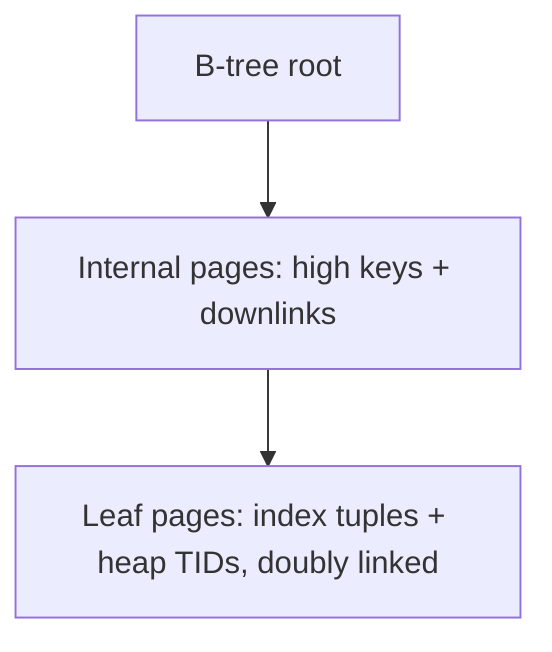

# Index Internals

## Overview

PostgreSQL indexes are pluggable access methods over the same buffer/WAL/MVCC substrate as the heap. B-tree dominates, but GiST/SP-GiST/GIN/BRIN/hash/bloom each solve a shape B-tree can't. This file explains page-level mechanics, MVCC interaction, bloat, and maintenance.

See also:

- [PostgreSQL Storage Architecture](./postgresql-storage-architecture.md)
- [Query Execution Internals](./query-execution-internals.md)
- [VACUUM Internals](./vacuum-internals.md)
- [Partitioning Internals](./partitioning-internals.md)

## Why This Matters

"Add an index" is the most prescribed and most mispredicted optimization. Index choice determines write amplification, vacuum load, and whether plans can use index-only scans. This file makes the trade-offs mechanical.

## Index Architecture / Access Methods

`src/backend/access/` hosts one directory per AM (`nbtree/`, `hash/`, `gist/`, `gin/`, `brin/`, `spgist/`, `bloom/` via extension), each implementing the `IndexAmRoutine` interface (insert, vacuum cleanup, scan paths, cost estimates). `pg_am` + `pg_opclass`/`pg_opfamily` map SQL operators (`<`, `&&`, `@>`, `<->`) to the AMs that can serve them — an index is only usable for operators in its family.

## B-tree Internals / Pages / Root / Internal / Leaf / Splits

Default AM, general ordered search (`src/backend/access/nbtree/`):



- **Inserts** descend to the leaf, insert the `(key, heap-TID)` tuple; full leaf → **page split** (half moves to a new page, parent gets a downlink; splits can cascade to the root, growing depth).
- **Rightmost behavior**: append-only keys (sequence PK, `now()`) always split the rightmost page — contention point + half-empty pages; v11+ suffix-truncation and v13+ **deduplication** (identical key payloads share one posting list) mitigate it.
- **Versions**: `pg_index.indnatts`/`indclass` evolve (deduplication, bottom-up index deletion in v14+ lets backends prune dead entries during scans, reducing vacuum urgency).

## Index Tuples / Deduplication / Versioning

Index tuples lack MVCC headers — they point at heap TIDs and inherit visibility from the heap. Dead heap versions leave dead index entries until vacuum cleanup (or bottom-up deletion prunes them during scans). Deduplication compresses repeated keys (low-cardinality + non-unique indexes shrink dramatically).

## Index-Only Scans / Visibility Map / Bitmap Scans

- **Index-only scan**: possible when all needed columns are in the index (`INCLUDE` covering) *and* the VM `all-visible` bit is set for each heap page touched. Without maintained VM bits (weak vacuum), "index-only" degrades to heap fetches — monitor `heap fetches` in `EXPLAIN (ANALYZE, BUFFERS)`.
- **Bitmap heap scan**: index builds a TID bitmap, heap fetched in physical order — the random-to-sequential I/O conversion for medium-selectivity queries. Bitmaps spill at `work_mem` (lossy pages → rechecks).

## Other AMs: Hash / GiST / SP-GiST / GIN / BRIN / Bloom

| AM | Shape | Use when |
|---|---|---|
| Hash | equality only | `=` lookups where B-tree comparison overhead matters; no ordering/scans |
| GiST | balanced tree, custom consistent/union | geometry (`PostGIS`), ranges, nearest-neighbor (`<->` with `ORDER BY ... LIMIT`) |
| SP-GiST | partitioned search (quad/radix tries) | non-overlapping ranges, IPs, texts with prefix structure |
| GIN | inverted index (item → row list) | `jsonb` `@>`, arrays `@>`, full-text `@@`, trigram `pg_trgm` |
| BRIN | per-page-block summaries | append-only time series, TB-scale scans with tiny index |
| Bloom (`bloom` ext) | probabilistic multi-column | many-column equality filters where compound B-tree is too big |

Operator classes matter: `text_pattern_ops` for `LIKE 'abc%'`, `jsonb_path_ops` for small GIN on containment-only workloads.

## Expressions / Partial / Covering / Multicolumn / Ordering / Correlation

- **Expression**: `CREATE INDEX ON t ((lower(email)))` — queries must match the expression exactly.
- **Partial**: `WHERE status = 'active'` — small index over the hot subset; planner uses it only when the query implies the predicate.
- **Covering** (`INCLUDE`): payload columns without ordering overhead — index-only scan enabler.
- **Multicolumn**: leftmost-prefix rule; order by equality-first, range/sort-last; write cost per extra column.
- **Correlation** (`pg_stats.correlation`): physical vs logical order alignment — high correlation favors index scans, low favors bitmap/seq.

## Size / Bloat / Maintenance / REINDEX / Concurrent Builds

- Indexes bloat from dead entries + splits; `pgstatindex()` (pgstattuple ext) shows leaf density.
- `REINDEX CONCURRENTLY` (v12+) rebuilds without blocking writes; plain `REINDEX` locks.
- `CREATE INDEX CONCURRENTLY`: two-pass build (scan + catch-up) that doesn't block writes but takes longer and can leave `INVALID` indexes on failure (check `pg_index.indisvalid`).
- **Write amplification**: each index adds heap-TID entries per INSERT/UPDATE(non-HOT) + WAL + vacuum cleanup. The 6th index on a hot table costs more than the first five combined in operational terms.

## What Actually Happens Internally?

`CREATE INDEX CONCURRENTLY idx ON orders (customer_id)`:

1. First snapshot scan builds initial entries while writes continue.
2. Wait for old snapshots to drain; second pass catches entries written concurrently.
3. Validate, mark valid, update planner stats (needs `ANALYZE` for best plans immediately).

B-tree split: leaf full → allocate sibling, move upper half, post downlink to parent (WAL-logged, possibly cascading).

## Hands-on Experiment

```sql
CREATE TABLE i(id serial primary key, v int);
INSERT INTO i(v) SELECT (random()*100)::int FROM generate_series(1,200000);
CREATE INDEX i_v ON i(v);
EXPLAIN (ANALYZE, BUFFERS) SELECT * FROM i WHERE v = 42;       -- index scan
EXPLAIN (ANALYZE, BUFFERS) SELECT v FROM i WHERE v BETWEEN 10 AND 90;  -- bitmap?
VACUUM i; EXPLAIN (ANALYZE, BUFFERS) SELECT v FROM i WHERE v > 0;      -- index-only after VM set
```

## Troubleshooting

### Symptom: index exists but planner seq-scans

**Diagnose:** selectivity (`EXPLAIN` rows estimate vs actual), correlation, `enable_seqscan` left off in debugging, stale stats (`last_analyze`), operator not in index's opfamily, parameterized generic plan. **Fix:** `ANALYZE`, correct opclass, covering `INCLUDE`, or accept the seq scan (small tables *should* seq-scan).

## Interview Questions

### Intermediate

- Why do index-only scans still hit the heap sometimes? — VM bit unset (vacuum lag) or columns not covered; `heap fetches` counts it.
- Leftmost-prefix rule in practice? — `(a,b)` serves `a = ?` and `a = ? AND b = ?`, not `b = ?` alone.

### Advanced

- How does bottom-up deletion change vacuum urgency? — Backends prune dead leaf entries during scans, so read-heavy indexes self-clean; write-only indexes still need vacuum cleanup.
- When is BRIN better than B-tree on a TB table? — Append-ordered data (time series): KB-sized summary vs GB-sized B-tree, at the cost of block-range rechecks.

## Key Takeaways

- AM first, columns second: match the data shape and operators to the access method.
- Every index is a write-amplification and vacuum liability — count them like dependencies.
- VM maintenance determines whether index-only scans actually skip the heap.
