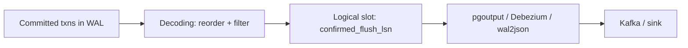

# Logical Decoding and CDC

## Overview

Logical decoding turns WAL records into ordered row-change streams consumed via replication slots — the foundation of CDC pipelines (Debezium → Kafka → warehouse). This file explains slots, plugins, streaming, ordering, and the WAL-retention economics that make CDC an operational commitment.

See also:

- [Logical Replication](./logical-replication.md)
- [WAL: Write-Ahead Logging](./wal.md)
- [Replication Internals](./replication-internals.md)

## Why This Matters

CDC looks like "just reading changes" but pins WAL, adds primary decoding CPU, and reorders failure domains: a stalled Kafka consumer can fill the database disk. Design the retention and lag budget first.

## What Decoding Does / WAL→Changes / Slots / Plugins / Streaming



- **Decoding** (`src/backend/replication/logical/`): reassembles committed transactions from WAL in commit order, filters by publication/row-filter, emits BEGIN/COMMIT-framed changes.
- **Slots** (`pg_create_logical_replication_slot`): durable consumer cursor (`confirmed_flush_lsn`); unacked changes pin WAL from `restart_lsn`.
- **Plugins**: `pgoutput` (native protocol), `wal2json` (JSON over SQL interface), `decoderbufs` (protobuf), Debezium (Kafka Connect source with schema history + SMTs).
- **Streaming** (v14+ `streaming = on`): large in-progress transactions stream before commit (with abort markers) instead of buffering whole txns in memory — essential for bulk loads.

## Retention / `pgoutput` / Transactions / Ordering / Exactly-Once

- **Retention**: slot lag = unconsumed WAL on primary disk. Alert on `pg_wal_lsn_diff(pg_current_wal_lsn(), restart_lsn)` per slot.
- **Ordering**: commit order per database; row order within txn preserved. No global order across databases.
- **Exactly-once**: not provided end-to-end. At-least-once delivery + idempotent sinks (upsert on PK, transactional outbox) is the workable contract. Debezium + Kafka transactions narrow but don't eliminate duplicates across restarts.

## Architectures: Postgres→Kafka / Debezium / Consistency / Consumer Lag

Standard pipeline: logical slot → Debezium server/Connect → Kafka topics (one per table, keyed by PK) → sink connectors (warehouse, cache invalidation, search index). Consumers lag → slot retains → disk fills: backpressure must propagate (pause source, scale consumers, expire with eyes open — dropping a slot means full re-snapshot).

**Transactional outbox** alternative: app writes business row + outbox row in one txn; relay publishes outbox (via decoding or polling). Atomic publish without dual-write anomalies.

## What Actually Happens Internally?

`INSERT` commits → WAL → reorder buffer holds txn → commit LSN → decoder emits change with LSN → consumer acks → `confirmed_flush_lsn` advances → WAL before it becomes recyclable. Consumer stall freezes the last step; everything upstream accumulates.

## Hands-on Experiment

```sql
SELECT pg_create_logical_replication_slot('cdc_test', 'pgoutput');
-- run writes; watch restart_lsn lag:
SELECT slot_name, pg_size_pretty(pg_wal_lsn_diff(pg_current_wal_lsn(), restart_lsn)) AS retained
FROM pg_replication_slots WHERE slot_name='cdc_test';
SELECT pg_drop_replication_slot('cdc_test');  -- cleanup releases WAL
```

## Troubleshooting

### Symptom: primary disk filling, biggest retained WAL is a logical slot

Stalled CDC consumer. **Fix:** restore/ scale consumer, or consciously drop + re-snapshot the slot (data loss window = changes since `restart_lsn`). Prevent: slot-lag alerts, consumer-lag SLOs, runbook for drop-vs-wait decision.

## Interview Questions

### Intermediate

- Why does CDC pin WAL even though it's "just reading"? — Slots guarantee history back to the last ack; unacked changes must be retained for correct resume.
- At-least-once vs exactly-once in CDC? — Redelivery across restarts is inherent; idempotent sinks (PK upserts, outbox) make it effectively-once.

### Advanced

- Streaming large transactions: what breaks without it? — Decoder buffers whole txns in memory; multi-GB bulk loads OOM the walsender or stall decoding.
- Outbox vs direct table CDC? — Outbox gives atomic business+event writes and stable event schema; direct CDC is simpler but couples consumers to internal table shapes.

## Key Takeaways

- CDC moves the durability burden: consumer lag becomes database disk pressure.
- Slot-lag monitoring and a drop/re-snapshot runbook are mandatory, not optional.
- Idempotent sinks + transactional outbox turn at-least-once into correctness.
