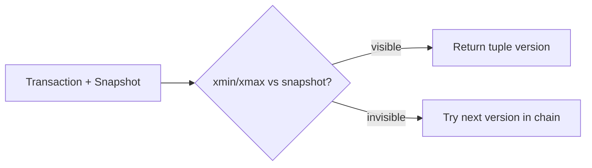
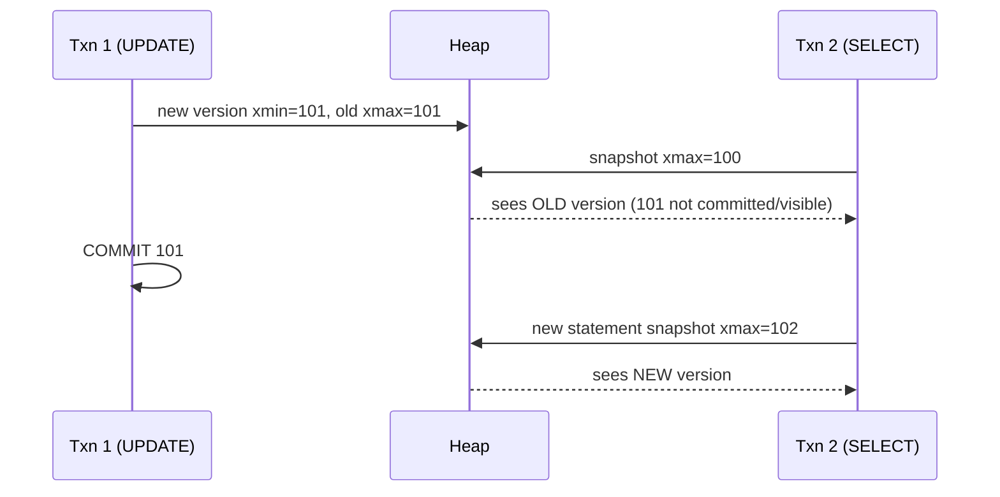

# MVCC Internals

## Overview

PostgreSQL's Multiversion Concurrency Control keeps old row versions around so readers never block writers and writers never block readers. Every `UPDATE`/`DELETE` creates version metadata (`xmin`/`xmax`), snapshots decide visibility, and VACUUM reclaims the dead. This file explains the version chain end to end.

See also:

- [VACUUM Internals](./vacuum-internals.md)
- [PostgreSQL Write Path](./postgresql-write-path.md)
- [Isolation and Transaction Internals](./isolation-transaction-internals.md)

## Why This Matters

MVCC explains bloat, HOT updates, wraparound, long-transaction hazards, and half of all "Postgres is slow" incidents. If you understand `xmin`/`xmax` + snapshots, the rest of this doc series is commentary.

## MVCC / Why PostgreSQL Uses It / Snapshot-Based Visibility

Alternatives (single-version + read locks, undo logs like InnoDB) serialize readers against writers. PostgreSQL instead stores versions *in the heap itself*: readers pick the version visible to their snapshot; writers append new versions. No read locks, no separate undo tablespace — at the cost of dead-tuple garbage that must be vacuumed.



## Transaction IDs / `xmin` / `xmax` / Tuple Visibility

Every heap tuple header carries:

- `xmin`: XID of the creating transaction.
- `xmax`: XID of the deleting/updating transaction (0 = live), or lock-only MultiXact marker.
- `ctid`: physical location of this version; updated versions chain forward.

Visibility (`src/backend/utils/time/tqual.c`, `HeapTupleSatisfiesMVCC`):

- Created by a committed XID **before** your snapshot → visible (unless deleted before your snapshot).
- Created by an XID **after** your snapshot, or still in progress → invisible.
- Deleted (`xmax` committed before snapshot) → invisible.
- Own writes → visible to self (with command-ID refinements within the transaction).

```sql
SELECT xmin, xmax, ctid, * FROM users LIMIT 5;  -- see versions directly
```

## Transaction Status / `pg_xact` / CLOG

XIDs are just numbers; commit status lives in `pg_xact` (historically CLOG, `pg_xact/` dir): 2 bits per XID (in-progress/committed/aborted). Backends consult in-memory `pg_xact` buffers, falling back to SLRU pages. Hint bits on tuples cache the verdict so later readers skip the lookup.

## Snapshots / Creation / Isolation

`GetSnapshotData()` (ProcArray scan) records `xmin` (oldest active XID), `xmax` (next XID), and the active-XID list. `READ COMMITTED` takes a fresh snapshot per statement; `REPEATABLE READ`/`SERIALIZABLE` take one per transaction. That single difference explains the classic "same SELECT twice, different rows" behavior.

## Inserted / Updated / Deleted Tuple Visibility

| Operation | Heap effect | Visible to others… |
|---|---|---|
| INSERT | new tuple, `xmin` = self | …after commit, to snapshots taken later |
| UPDATE | old version gets `xmax` = self; new version with `xmin` = self, chained via `ctid` | old disappears / new appears only post-commit |
| DELETE | `xmax` = self set | row vanishes post-commit for later snapshots |



## How UPDATE Works / New Versions / No In-Place Update

In-place update would force readers to lock or see half-written rows. Appending a version keeps readers lock-free; the price is write amplification (index entries, WAL, future vacuum). [PostgreSQL Write Path](./postgresql-write-path.md) traces the full sequence.

## HOT Updates / Heap-Only Tuples / Chains / Conditions / Pruning

If the UPDATE touches **no indexed column** and the same page has room, PostgreSQL writes the new version on the same page and leaves indexes pointing at the old slot, which redirects via the HOT chain (`heap_hot_search`). Requirements: same-page space (mind `fillfactor`), no indexed-column change, no TOAST churn forcing relocation.

- **HOT chains**: index → chain head → follow `ctid` links to the live version.
- **HOT pruning**: backends opportunistically remove dead chain links during page reads/writes (`heap_page_prune`), reclaiming space without a full VACUUM.

```text
index entry → (page 5, slot 3, xmax=101) → redirect → (page 5, slot 7, xmin=101, live)
```

Monitor with `pg_stat_user_tables.n_tup_hot_upd` vs `n_tup_upd`.

## Dead / Live / Recently Dead Tuples

- **Live**: visible to some snapshot.
- **Dead**: invisible to all snapshots — vacuumable.
- **Recently dead**: invisible to current snapshots but still needed by an old open snapshot (long transaction!) — VACUUM must skip. This is exactly how one idle-in-transaction session blocks cleanup cluster-wide.

## Transaction ID Wraparound / Frozen XIDs / `relfrozenxid` / Freezing

XIDs are 32-bit (~4B). PostgreSQL compares with modulo-2³² arithmetic, so past ~2B transactions old XIDs look "future" — catastrophic misvisibility. Defense: **freezing** — VACUUM replaces old `xmin` with `FrozenTransactionId` (always visible) and advances `relfrozenxid`. Databases halt writes at `autovacuum_freeze_max_age` (emergency autovacuum) and refuse new XIDs past the wraparound limit — a designed availability cliff to prevent corruption.

## MultiXact IDs / Internals / `relminmxid`

Row locks (`SELECT FOR UPDATE/SHARE`, foreign-key checks) by concurrent transactions need tracking beyond one `xmax`. MultiXact (`pg_multixact/`) stores the *set* of locking XIDs; `xmax` becomes a MultiXactID with infomask flags. Same wraparound discipline applies (`relminmxid`, `autovacuum_multixact_freeze_*`). `SELECT ... FOR UPDATE` failing with "multixact" errors under extreme concurrency = this subsystem under pressure.

## Snapshot-Too-Old

With `old_snapshot_threshold` set, long queries can abort instead of risking wraparound-blocking behavior (`snapshot too old` error). Rarely enabled; usually you fix the long transaction instead.

## What Actually Happens Internally?

```sql
-- T1: UPDATE users SET name='Bob' WHERE id=1;
```

1. Executor finds tuple `(block 3, slot 2)`, checks visibility for T1's snapshot.
2. New version written (same page if HOT-eligible), `xmin`=T1, old gets `xmax`=T1, chain linked.
3. Indexes updated unless HOT; WAL records generated for both versions.
4. Other snapshots still see the old version until T1 commits.
5. Post-commit, old version is dead-but-unreclaimed until no snapshot needs it + VACUUM runs.

## Hands-on Experiment

Terminal 1: `BEGIN; UPDATE users SET name='Bob' WHERE id=1;` (don't commit).
Terminal 2: `SELECT xmin, xmax, * FROM users WHERE id=1;` — sees old row (T1 uncommitted).
Terminal 1: `COMMIT;` Terminal 2 (new transaction): sees new row; `SELECT xmin, ...` shows the new XID and the old version now dead.
Then: `SELECT n_dead_tup FROM pg_stat_user_tables WHERE relname='users'; VACUUM users;` — watch it drop.

## Performance Implications

- UPDATE-heavy workloads generate garbage proportional to update rate — budget VACUUM/Autovacuum I/O as a first-class cost, not overhead.
- Long snapshots (open transactions, logical decoding slots, hot-standby feedback) extend dead-tuple lifetimes linearly.
- HOT ratio is the single best proxy for UPDATE efficiency: low HOT → index-write amplification + bloat.

## Troubleshooting

### Symptom: `n_dead_tup` grows; autovacuum runs but reclaims nothing

**Causes:** old `xmin` horizon (idle-in-transaction, abandoned replication slot, prepared transaction). **Diagnose:** `SELECT * FROM pg_stat_activity WHERE backend_xmin IS NOT NULL ORDER BY backend_xmin LIMIT 5; SELECT * FROM pg_replication_slots WHERE active = false; SELECT * FROM pg_prepared_xacts;` **Fix:** terminate the holders, then `VACUUM (VERBOSE)`.

## Interview Questions

### Beginner

- Why can't UPDATE modify the row in place? — Readers hold no locks; in-place writes would expose torn/uncommitted data. New versions keep reads lock-free.

### Intermediate

- Why does an idle transaction cause bloat on tables it never touched? — Its snapshot's `xmin` horizon forces VACUUM to retain "recently dead" tuples everywhere.
- HOT vs non-HOT update? — Same-page, non-indexed-column change → indexes untouched; otherwise new index entries + more WAL + more vacuum work.

### Advanced

- What is wraparound, and why does PostgreSQL stop accepting writes near it? — 32-bit XID reuse would invert visibility; freezing + emergency vacuum + hard stop trades availability for correctness.
- What is a MultiXact and when does `xmax` hold one? — Concurrent row lockers; `xmax` becomes an ID into the multixact members table instead of a single XID.

## Key Takeaways

- Readers pick versions via snapshots; writers append versions. No read locks, ever.
- Dead tuples are MVCC's exhaust — VACUUM is part of the design, not cleanup charity.
- `xmin`/`xmax`/`ctid` are inspectable: `SELECT xmin, xmax, ctid` turns theory into visible rows.
- Anything that pins an old snapshot (open txn, slot, prepared xact) pins garbage with it.
