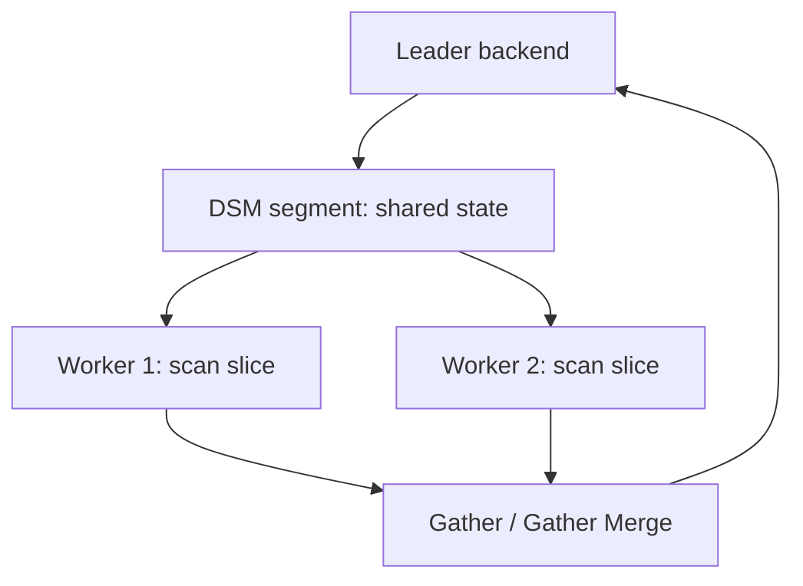

# Parallel Query Internals

## Overview

`Gather` nodes farm scan/join/aggregate fragments to background workers over DSM segments, trading startup + IPC overhead for multi-core speed on large scans. This file explains the architecture, eligible nodes, limits, and when parallelism loses.

See also:

- [Query Execution Internals](./query-execution-internals.md)
- [PostgreSQL Memory Architecture](./postgresql-memory-architecture.md) (DSM + per-worker `work_mem`)
- [PostgreSQL Performance Internals](./postgresql-performance-internals.md)

## Why This Matters

Parallel query is the main reason analytics on a single node scales with cores — and the main reason OLTP p99 regresses when enabled blindly (worker startup dwarfs short queries).

## Architecture / Workers / Gather / Limits



- `max_worker_processes` (total), `max_parallel_workers` (query pool), `max_parallel_workers_per_gather` (per plan, default 2).
- Workers are real backends (own `work_mem` each!) attached via DSM (`src/backend/storage/ipc/dsm*.c`).
- Leader decides worker count from table size vs `min_parallel_table_scan_size` / `min_parallel_index_scan_size` and cost thresholds.

## Eligible Nodes / Aggregation / Joins / Overhead / Saturation

Parallel-aware: Seq Scan, Bitmap Heap, Index/Index-Only scans, Hash Join (parallel hash), Merge pieces, Partial Aggregate → Finalize Aggregate, Append over partitions. `Gather Merge` preserves order for `ORDER BY ... LIMIT` without a final sort.

Overhead ledger: worker fork + DSM setup (~ms), tuple queue IPC, N× `work_mem` for hash/sort fragments, and CPU contention with foreground OLTP. `EXPLAIN ANALYZE` shows `Workers Planned/Launched` and per-worker rows — launched < planned means worker starvation (raise pool or reduce concurrency).

## What Actually Happens Internally?

Large seq scan: leader creates DSM, launches 2 workers, each scans a block range, partial-aggregates locally, ships partials through tuple queues; leader finalizes. Small lookup: planner prices worker startup above the scan cost → serial plan, correctly.

## Hands-on Experiment

```sql
EXPLAIN (ANALYZE) SELECT count(*) FROM big_table WHERE v > 0;
SET max_parallel_workers_per_gather = 0;  -- compare serial timing
RESET max_parallel_workers_per_gather;
-- watch Workers Launched vs Planned under concurrent pgbench load
```

## Troubleshooting

### Symptom: analytics fast solo, OLTP p99 spikes when both run

Workers steal CPUs + `work_mem` from foreground. **Fix:** cap per-gather workers, schedule heavy analytics on replicas or off-hours, consider resource groups/cgroups.

## Interview Questions

### Intermediate

- Why don't small queries go parallel? — Startup + IPC overhead exceeds the scan savings; cost thresholds encode this.
- Gather vs Gather Merge? — Gather: unordered union. Gather Merge: ordered merge preserving sort for LIMIT/top-N.

### Advanced

- Why does each worker need its own `work_mem` accounting? — Workers are full backends with private executor memory; a 4-worker hash join uses ~5× leader-estimated memory.

## Key Takeaways

- Parallelism is cost-gated, not automatic — thresholds and table sizes decide.
- Account workers as backends (memory, CPU, pool slots), not free threads.
- Isolate analytics parallelism from OLTP latency budgets.
