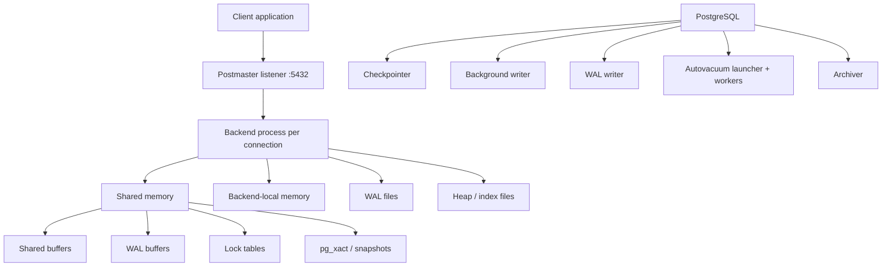
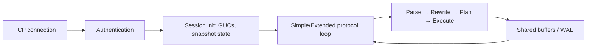
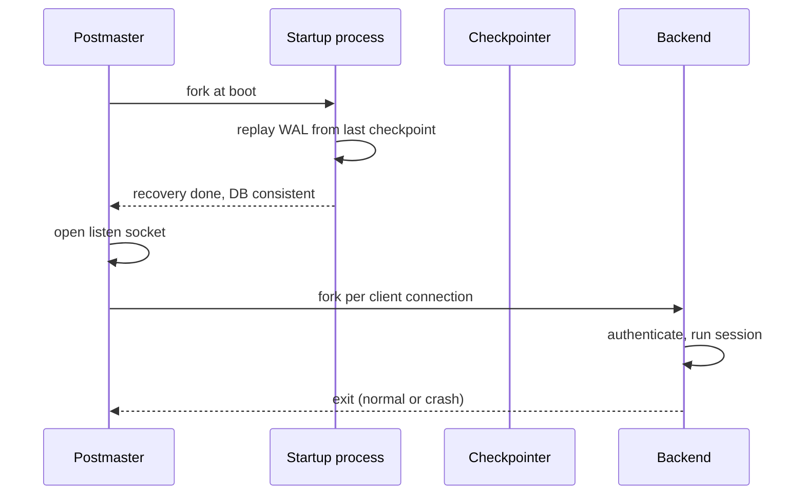

# PostgreSQL Architecture

## Overview

PostgreSQL is a process-based client-server RDBMS. A supervisor process (`postmaster`) listens for TCP connections; every client connection gets a dedicated backend process (`postgres`) that owns session state, parses and executes SQL, and coordinates with shared memory, WAL, and background workers. This file explains the moving parts, how they interact, and why PostgreSQL chose this design.

**Why this matters:** almost every PostgreSQL production behavior — connection limits, memory accounting, crash safety, autovacuum, replication — falls out of this architecture. If you can draw the process/memory diagram from memory, you can reason about most incidents from first principles.

## PostgreSQL Architecture Overview



At runtime there are three planes:

| Plane | Components | Failure domain |
|---|---|---|
| Connection plane | postmaster listener, backend processes | per-client; a backend crash only aborts its own session |
| Shared state plane | shared buffers, WAL buffers, lock table, ProcArray, pg_xact | protected by LWLocks; corruption here can take down the cluster |
| Durability plane | WAL files, heap files, archiver, checkpointer | survives crashes via WAL replay |

See also:

- [PostgreSQL Connection Internals](./postgresql-connection-internals.md)
- [PostgreSQL Memory Architecture](./postgresql-memory-architecture.md)
- [PostgreSQL Storage Architecture](./postgresql-storage-architecture.md)
- [WAL: Write-Ahead Logging](./wal.md)
- [Checkpoints and Background Writer](./checkpoints-background-writer.md)

## PostgreSQL Server Process Architecture

`src/backend/postmaster/postmaster.c` implements the postmaster. On startup it:

1. Reads `postgresql.conf` and allocates shared memory segments.
2. Starts auxiliary processes (startup, checkpointer, background writer, WAL writer, archiver, stats collector, autovacuum launcher).
3. Binds the listen socket and enters the accept loop.

The key source-level split: the postmaster never executes SQL. It only forks backends and supervises children. If any backend exits abnormally, the postmaster treats shared memory as suspect and restarts the whole cluster (crash recovery). If a *background* child like checkpointer crashes, the same restart happens — there is no "limp along with possibly corrupt buffers" mode.

## Postmaster / PostgreSQL Server Process

The postmaster owns:

- Signal handling (`SIGHUP` = reload config, `SIGTERM` = smart shutdown, `SIGINT` = fast shutdown, `SIGQUIT` = immediate shutdown).
- Backend forking (`fork()` per connection, then `ClientAuthentication` + `PostgresMain` in the child).
- Startup/recovery coordination: on boot it launches the startup process first, which replays WAL before the postmaster starts accepting connections.
- `postmaster.pid` lock file in `PGDATA`, which prevents two postmasters from sharing one data directory.

## Backend Processes

Each backend (`postgres: user db host idle/active`) runs the full query pipeline for one session:



Backends are heavyweight (~5–10 MB RSS baseline plus `work_mem`-scale allocations) because they carry a private `MemoryContext` tree, catalog caches (`relcache`, `catcache`), prepared statements, portal state, and transaction state. That weight is the root cause of the connection-scaling story in [PostgreSQL Connection Internals](./postgresql-connection-internals.md).

## One Process per Client Connection

One OS process per connection gives PostgreSQL:

- **Crash isolation:** a backend segfault (e.g., from a buggy C extension) kills one session, not the server — though the postmaster then forces recovery to be safe.
- **Simple memory management:** backend-local allocations die with the process; no cross-session allocator contention.
- **Use of OS scheduling and protection:** the kernel isolates faulty backends, and tools like `ps`, `strace`, `perf` work per session.

The price: `fork()` + session setup per connection (milliseconds), per-process memory that multiplies by connection count, and scheduler pressure past a few hundred active backends. PostgreSQL accepts this trade and pushes high-concurrency fan-in to external poolers (PgBouncer).

## Why PostgreSQL Uses Processes Instead of Threads

PostgreSQL predates robust POSIX threads and made a deliberate choice that still holds:

| Aspect | Processes (PostgreSQL) | Threads (e.g., MySQL/InnoDB) |
|---|---|---|
| Fault isolation | One crash → one session lost | One crash → whole server lost |
| Memory safety | Backend-local leaks die with the session | A leaking thread pollutes the shared heap |
| C-extension safety | Buggy extension code contained per backend | Buggy code can corrupt global state |
| Context-switch cost | Higher (separate address spaces) | Lower |
| Connection scale | ~hundreds of active backends comfortably | Thousands of threads more cheaply |

Threads would reduce per-connection overhead but widen the blast radius of every bug — including bugs in user-supplied C extensions, PL languages, and FDWs, which PostgreSQL explicitly wants to sandbox per session.

## Process-Based Architecture vs Thread-Based Architecture

Operational consequences of the process model:

```text
More connections
    ↓
More backend processes
    ↓
More private memory (work_mem × concurrent sorts/hashes each)
    ↓
More context switches + lock-manager traffic
    ↓
Throughput plateaus, then p99 latency climbs
```

This is why "add more app pods, each opening 100 connections" is the classic PostgreSQL outage recipe, and why the fix is architectural (PgBouncer in transaction pooling mode), not tuning `max_connections` upward. Full treatment in [PostgreSQL Connection Internals](./postgresql-connection-internals.md) and [PostgreSQL Scaling](./postgresql-scaling.md).

## Shared Memory Architecture

Shared memory (System V or POSIX mmap, see `shared_memory_type`) holds everything backends must coordinate on:

- **Shared buffers** — cached 8 KB relation pages.
- **WAL buffers** — in-progress WAL records before flush.
- **Lock tables** — heavyweight lock manager state plus per-backend `PGPROC` entries.
- **ProcArray / snapshots** — active transaction IDs for MVCC visibility (`src/backend/storage/ipc/procarray.c`).
- **pg_xact (CLOG) buffers** — transaction commit-status cache.
- **Checkpointer/BgWriter state, replication slots, stats, DSM segments** for parallel query.

Backends attach to the same segments at fork time. Coordination uses LWLocks (lightweight locks) and spinlocks rather than kernel mutexes on the hot path.

## Local/Backend Process Memory

Each backend additionally owns private memory: `MemoryContext` arenas for the current query (executor state, tuples, sort/hash spill buffers up to `work_mem` each), catalog caches, and GUC state. This memory is invisible to other backends and freed automatically at transaction/query end via `MemoryContextReset`. Memory-context discipline is why a backend can run for weeks without leaking: every query's allocations belong to a context that is destroyed when the query ends. Details in [PostgreSQL Memory Architecture](./postgresql-memory-architecture.md).

## Shared Buffers / WAL Buffers / Work Memory / Maintenance Work Memory / Temp Buffers

Short map (each has a dedicated file):

| Area | Scope | Typical size | Governs |
|---|---|---|---|
| `shared_buffers` | shared | 25% RAM | heap/index page cache; too small → excess OS-cache round trips; too large → checkpoint pain |
| `wal_buffers` | shared | ~16 MB auto-tuned | WAL records staged before flush; full buffers force WAL writes |
| `work_mem` | per operation, per backend | 4–64 MB | sorts, hashes, bitmaps — *per node*, so one query can use many × `work_mem` |
| `maintenance_work_mem` | per maintenance op | 256 MB–1 GB | `VACUUM`, `CREATE INDEX`, `ALTER TABLE` sorts |
| `temp_buffers` | per session | 8 MB | temp-table pages |

Misconfiguring `work_mem` is the most common memory outage: 200 backends × a 3-hash-join query × 64 MB is not 64 MB — it is potentially gigabytes. See [PostgreSQL Memory Architecture](./postgresql-memory-architecture.md) and [Temporary Files and Disk Usage](./temporary-files-disk-usage.md).

## Backend Memory vs Shared Memory

Rule of thumb:

```text
Total PG memory ≈ shared_buffers + wal_buffers + (backends × (work_mem × operations + temp_buffers + session overhead))
```

Shared memory is fixed at startup (changing `shared_buffers` needs a restart); backend-local memory is elastic and therefore the dangerous part under load. Monitoring must cover both: `pg_stat_activity` + `pg_stat_database` for the backend side, `pg_buffercache` and OS RSS for the shared/OS-cache side.

## Background Processes

| Process | Source area | Job |
|---|---|---|
| Checkpointer | `src/backend/postmaster/checkpointer.c` | periodic checkpoints: flush dirty buffers, write checkpoint WAL record |
| Background writer | same file family | opportunistic dirty-page cleaning between checkpoints |
| WAL writer | `src/backend/postmaster/walwriter.c` | flush WAL buffers on timeout (`wal_writer_delay`) so backends rarely block |
| Autovacuum launcher + workers | `src/backend/postmaster/autovacuum.c` | schedule `VACUUM`/`ANALYZE` per table thresholds |
| Archiver | `src/backend/postmaster/pgarch.c` | copy completed WAL segments to archive (`archive_command`) |
| Stats collector | stats subsystem | aggregate `pg_stat_*` counters |
| Startup process | recovery path | WAL replay at boot / standby replay |
| WAL sender / receiver | `src/backend/replication/` | streaming replication |
| Logical replication workers | `src/backend/replication/logical/` | apply logical changes on subscribers |
| Parallel query workers | executor + DSM | `Gather` children for parallel plans |
| Auxiliary (logger, syslogger) | postmaster children | log routing |

A crash in *any* of these (except a plain backend) triggers postmaster-level restart + recovery, because shared state may be inconsistent.

## PostgreSQL Process Lifecycle



Normal backend exit just releases its `PGPROC` slot and locks. Abnormal exit (signal 11, OOM-kill) makes the postmaster kill remaining children and re-enter recovery — availability cost of the safety guarantee.

## What Happens Internally When PostgreSQL Starts

1. Postmaster reads configs, validates `PGDATA`, acquires `postmaster.pid` lock.
2. Shared memory segments created/attached; semaphores initialized.
3. Startup process launched: reads `pg_control`, finds last checkpoint LSN, replays WAL (`REDO`) forward, then runs crash-recovery end checkpoint.
4. Background processes forked; listen socket opened; `PAM`/client auth ready.

If `pg_control` says "clean shutdown", replay is minimal. If it says "crash", replay can take minutes on WAL-heavy systems — this is the RTO floor for single-instance PostgreSQL.

## What Happens Internally When PostgreSQL Shuts Down

| Mode | Signal | Behavior |
|---|---|---|
| Smart | `SIGTERM` | stop accepting connections, wait for sessions to disconnect, checkpoint, exit |
| Fast (default `pg_ctl stop`) | `SIGINT` | terminate backends (transactions roll back), checkpoint, exit — no recovery needed on restart |
| Immediate | `SIGQUIT` | kill everything without checkpoint; restart requires WAL replay |

## Graceful vs Immediate Shutdown

Smart shutdown can hang forever behind one idle-in-transaction session holding a lock that blocks `ACCESS EXCLUSIVE` cleanup. Fast shutdown rolls back open transactions — safe, at the cost of aborting in-flight work. Immediate shutdown is the "pull the plug" test: durable committed data is safe (WAL replay restores it), but restart time depends on un-checkpointed WAL volume. Operational rule: automate fast shutdown; reserve immediate for a wedged postmaster.

## What Actually Happens Internally?

When `psql` connects and runs `SELECT 1`:

1. TCP SYN → postmaster `accept()`.
2. `fork()` → child runs authentication (`pg_hba.conf`, SCRAM/MD5/TLS).
3. Child becomes a backend: attaches shared memory, builds session `MemoryContexts`, loads GUCs.
4. Backend loops on the wire protocol: Parse/Bind/Execute `SELECT 1` (no table access — not even shared buffers).
5. Response written to socket; backend waits for the next message.
6. On disconnect: backend flushes stats, releases locks, exits; postmaster reaps it.

Every later file in this series zooms into one box of this flow.

## Performance Implications

- Backend-per-connection bounds practical active concurrency to the low hundreds; beyond that, throughput per connection falls while context-switch and lock-manager overhead rises.
- Shared-memory sizing (`shared_buffers`, `wal_buffers`) is a startup decision with restart cost — size from workload evidence, not rules of thumb.
- Background writers exist to smooth I/O: an under-tuned checkpointer turns steady write load into periodic latency spikes.

## Troubleshooting

### Symptom: `ps` shows hundreds of `postgres: ... idle` processes and load is climbing

**Possible causes:** application opens a connection per request/thread without pooling; idle-in-transaction sessions pinning snapshots.

**How to diagnose:**

```sql
SELECT state, count(*) FROM pg_stat_activity GROUP BY state;
SELECT pid, now() - xact_start AS xact_age, query
FROM pg_stat_activity WHERE xact_start IS NOT NULL
ORDER BY xact_start LIMIT 20;
```

**How to fix:** put PgBouncer (transaction pooling) in front; set `idle_in_transaction_session_timeout`; fix client code that holds transactions open across network calls.

## Interview Questions

### Beginner

- What is the postmaster, and what does it never do? — It supervises processes, owns the listen socket, and coordinates startup/shutdown/recovery; it never executes SQL itself.
- What is created per client connection? — A dedicated backend process with private memory, session state, and transaction state.

### Intermediate

- Why does killing -9 a backend restart the whole cluster instead of just dropping one session? — Because shared memory may hold half-updated state (buffer pins, lock table entries); the postmaster restarts everything and replays WAL to reach a known-consistent state.
- What lives in shared memory vs backend-local memory? — Shared: buffers, WAL buffers, lock tables, ProcArray, pg_xact. Local: query executor state, `work_mem` sorts/hashes, catalog caches, session GUCs.

### Advanced

- Why do processes beat threads for PostgreSQL's threat model? — C extensions, procedural languages, and FDWs run inside backends; process isolation contains their bugs to one session.
- What is the availability cost of a background-process crash? — Full restart + WAL replay; there is no degraded-but-running mode once shared state is suspect.

### Deep-Dive

- Trace `fork()` to first query: what does the child inherit vs initialize? — It inherits the address space (shared segments attached), then builds fresh `MemoryContexts`, resets signal handlers, runs authentication, and enters `PostgresMain`'s protocol loop.

## Key Takeaways

- Postmaster supervises; backends execute; background workers maintain durability and hygiene.
- One backend per connection is a deliberate isolation trade — it bounds connection scale and motivates pooling.
- Shared memory is the coordination plane; WAL is the durability plane; never confuse the two.
- Any non-backend crash means restart + recovery: PostgreSQL prefers downtime over silent corruption.
