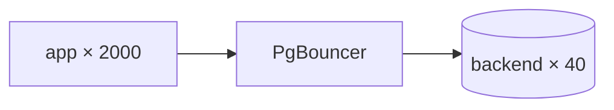

# PostgreSQL Connection Internals

## Overview

Every PostgreSQL client connection becomes a dedicated backend OS process. This file traces the full path — TCP → listener → SSL → `pg_hba.conf` → authentication → backend fork → session — and explains why connections are expensive, how exhaustion happens, and how pooling fixes it.

See also:

- [PostgreSQL Architecture](./postgresql-architecture.md)
- [PostgreSQL Memory Architecture](./postgresql-memory-architecture.md)
- [PostgreSQL Scaling](./postgresql-scaling.md)

## Why This Matters

Connections are the #1 PostgreSQL scalability bottleneck. Each one costs a `fork()`, megabytes of private memory, and a slot in the lock/ProcArray tables. Understanding this path explains connection storms, `too many clients` errors, idle-in-transaction bloat, and every PgBouncer design decision.

## What Happens When a Client Connects to PostgreSQL


1. **TCP connection establishment** — postmaster `accept()`s on `listen_addresses:port`.
2. **SSL negotiation** — client requests `SSLRequest`; if `ssl = on`, TLS handshake upgrades the socket before any credentials are sent.
3. **Startup packet** — client sends protocol version, user, database, and GUC options (`application_name`, `options`).
4. **Authentication flow** — postmaster child matches `pg_hba.conf` and runs the required method.
5. **Backend process creation** — `fork()`, shared-memory attach, `PostgresMain` entry.
6. **Connection authorization** — checks `CONNECT` privilege on the database, `max_connections`, reserved slots.
7. **Session initialization** — load user/database GUCs, initialize snapshots, caches, stats.

## PostgreSQL Wire Protocol

`src/backend/libpq/` implements two modes:

- **Simple protocol** (`Q` message): one SQL string, no bind parameters. Used by `psql` and drivers for one-shot queries.
- **Extended protocol** (`Parse/Bind/Describe/Execute/Sync`): prepared statements, parameter binding, portals. PgBouncer transaction pooling interacts badly with unnamed prepared statements and `LISTEN` here (below).

Key detail: the protocol is message-framed over TCP with no multiplexing — one query pipeline per connection. There is no "send 50 concurrent queries on one connection"; concurrency requires connections (or pipelining in v14+ libpq, still single-backend execution).

## Authentication Flow / Startup Packet / SSL Negotiation

Startup packet contains no password. The server replies with an `Authentication*` message selecting the method dictated by the matched `pg_hba.conf` line:

| Method | Wire behavior | Notes |
|---|---|---|
| `trust` | `AuthenticationOk` immediately | never on networked hosts |
| `md5` | salted MD5 challenge-response | deprecated; unsalted-equivalent weaknesses, no channel binding |
| `scram-sha-256` | SCRAM exchange (client-first, server-first, client-final) | mutual auth, salted + iterated, channel binding with TLS |
| `cert` | TLS client-cert identity mapped via `pg_ident.conf` | strong for service-to-service |
| `ldap`/`radius`/`gss`/`peer` | delegated | platform-specific |

## SCRAM Authentication / MD5 Authentication / Certificate Authentication

- **SCRAM (`scram-sha-256`)**: `src/backend/libpq/auth-scram.c`. Server stores `SCRAM-SHA-256$<iter>:<salt>$<storedkey>:<serverkey>` — never the password. Supports channel binding (`tls-server-end-point`) so a stolen handshake cannot be replayed over a different TLS connection. **Use this everywhere.**
- **MD5**: `md5(salt + md5(password + user))`. Survives only for legacy clients. Migrate with `password_encryption = scram-sha-256` then rotate.
- **Certificate**: client presents X.509 cert during TLS; server maps DN → role. Ideal for operator/automation access and mTLS meshes.

> **Version note:** PostgreSQL 14+ defaults new passwords to SCRAM when `password_encryption = scram-sha-256`. libpq older than 10 cannot do SCRAM — upgrade clients before enforcing.

## `pg_hba.conf` / Rule Evaluation

First-match-wins, top to bottom, on (connection type, database, user, address, method):

```text
# TYPE  DATABASE  USER  ADDRESS         METHOD
host    appdb     app   10.0.0.0/8      scram-sha-256
host    all       all   0.0.0.0/0       reject
```

- Evaluation happens per connection before authentication; a `reject` line short-circuits.
- Changes need `SELECT pg_reload_conf()` (SIGHUP), not a restart.
- Common outage: overly broad `trust` lines for debugging left in production; or address-ordering bug where a permissive line shadows a restrictive one above it.

## Connection Authorization / Backend Process Creation

After auth succeeds, the backend checks:

1. `CONNECT` privilege on the target database.
2. `max_connections` (+ `superuser_reserved_connections` logic below).
3. `角色` connection limits (`ALTER ROLE ... CONNECTION LIMIT`).

Then it initializes: session GUCs (`ALTER USER/DATABASE ... SET`), `pg_stat_activity` entry, temp-schema namespace, and enters the protocol loop.

## Why Every Connection Creates a Backend Process / Cost of Connections

`fork()` cost (~ms) is the small part. The large part is steady-state per-backend memory:

```text
per connection ≈ session overhead (~5-10 MB: caches, contexts)
  + temp_buffers (if temp tables used)
  + work_mem × concurrent sort/hash nodes
```

200 idle connections ≈ 1–2 GB before they do anything. 200 *active* connections running hash joins can OOM a host `work_mem` was "safely" sized for.

## Connection Memory Consumption / Connection Limits / `max_connections`

- `max_connections` caps backends (default 100). Raising it to 1000 without pooling just moves the failure from "connection refused" to "OOM / scheduler collapse".
- Each backend also consumes a `PGPROC` slot, semaphores, and file descriptors — `max_files_per_process` and kernel SHM limits matter.

## Reserved Connections / Superuser Reserved Connections

`superuser_reserved_connections` (default 3) holds slots for superusers so an operator can always connect during a storm to diagnose (`pg_terminate_backend`, lower pool sizes). Never give the app superuser credentials to use them — that defeats the purpose.

## Connection Storms / Connection Exhaustion

```text
deploy / autoscale event → N pods × M threads open connections at once
  → postmaster fork spike + auth spike
  → max_connections hit → FATAL: sorry, too many clients already
  → clients retry immediately → thundering herd
```

Mitigations: PgBouncer `max_client_conn` with small `default_pool_size`, client-side backoff+jitter, `statement_timeout`, and readiness gates that don't open DB connections until the app is actually ready.

## Idle Connections / Idle-in-Transaction Connections

- `idle`: connected, no transaction. Cheap-ish, but still a backend + memory.
- `idle in transaction`: **dangerous** — holds snapshots (`xmin` horizon), blocking VACUUM and causing bloat; may hold locks. Set `idle_in_transaction_session_timeout` (e.g., 1–5 min) as a circuit breaker and fix the client (transaction left open across RPC).

```sql
SELECT pid, usename, state, now()-xact_start AS xact_age, query
FROM pg_stat_activity WHERE state = 'idle in transaction'
ORDER BY xact_start LIMIT 20;
```

## Connection Timeout / TCP Keepalive

- `connect_timeout` (client), `statement_timeout`, `idle_in_transaction_session_timeout`, `idle_session_timeout` (v14+).
- `tcp_keepalives_*`: detect dead peers through NAT/LB idle timeouts. Enable (`tcp_keepalives_idle = 60`) whenever connections cross load balancers — otherwise a silently-dropped TCP connection leaves a backend parked forever.

## PostgreSQL Connection Lifecycle

`connect → auth → session → [BEGIN → queries → COMMIT]* → disconnect → backend exit → postmaster reap`. Backends never return to a pool inside PostgreSQL itself — process exit is the only cleanup. That absence *is* the pooling argument.

## Connection Pooling / Why Pooling Is Important / PgBouncer Architecture

PgBouncer (separate process, event-driven, tiny per-client state) multiplexes thousands of client connections onto tens of server connections:



- **Session pooling**: server connection held for whole client session. Safe, modest gain.
- **Transaction pooling**: server connection returned after each transaction. Huge fan-in; breaks session-scoped features (prepared statements, `LISTEN`, temp tables, advisory locks, `SET` without tracking).
- **Statement pooling**: returned after each statement. Rarely usable (breaks multi-statement transactions).

| Feature under pooling | Session | Transaction | Statement |
|---|---|---|---|
| `PREPARE` / unnamed statements | ok | breaks unless `ignore_startup_parameters`/`prepared_statements` handled | breaks |
| `LISTEN/NOTIFY` | ok | unreliable | unreliable |
| Temp tables | ok | breaks | breaks |
| `SET` / GUCs | ok | needs tracking | needs tracking |

## PgBouncer vs Native / Prepared Statements / Failure Scenarios / Pool Sizing / Saturation

- **Prepared statements**: use protocol-level named statements only in session pooling; otherwise use driver `prepareThreshold=0` or PgBouncer `max_prepared_statements` (newer versions) with care.
- **Failure scenarios**: pooler becomes the SPOF — run 2+ instances behind TCP LB; a pooler restart drops client connections (app must retry); mis-sized `default_pool_size` re-creates the original overload on fewer connections.
- **Sizing**: start `default_pool_size ≈ (cores × 2) + spare`, `reserve_pool_size` for bursts, `max_client_conn` high. Measure `cl_waiting` in `SHOW POOLS` — sustained waiting means pool too small *or* queries too slow (fix queries first).
- **Saturation signals**: `SHOW STATS` avg query time climbing with `cl_waiting > 0`; PostgreSQL side shows few active backends at 100% — classic pool-starvation vs DB-starvation distinction.

## What Actually Happens Internally?

`psql "host=db user=app dbname=appdb"`:

1. TCP connect to :5432; optional TLS upgrade.
2. Startup packet (user, database).
3. `pg_hba.conf` first-match → `AuthenticationSASL` (SCRAM).
4. SCRAM exchange; on success `AuthenticationOk`.
5. `fork()` backend; authorization checks; session GUC load.
6. Backend emits `ReadyForQuery`; `pg_stat_activity` row appears.

## Hands-on Experiment

1. Set `log_connections = on`, reconnect with `psql`, watch the log line with PID.
2. `SELECT pid FROM pg_stat_activity WHERE pid = pg_backend_pid();` — confirm your backend.
3. Open 200 `psql` sessions in a loop; watch `SELECT count(*) FROM pg_stat_activity;` and host RSS climb.
4. Put PgBouncer (transaction mode) in front, repeat — backend count stays flat.

## Troubleshooting

### Symptom: `FATAL: sorry, too many clients already`

**Diagnose:** `SELECT state, count(*) FROM pg_stat_activity GROUP BY 1;` — if mostly `idle`, it's a pooling problem, not a load problem. **Fix:** add/correct PgBouncer, cap app pool sizes, add retry-with-backoff.

### Symptom: bloat grows despite autovacuum

**Diagnose:** `SELECT * FROM pg_stat_activity WHERE xact_start < now() - interval '10 minutes';` — old `xmin` horizon from idle-in-transaction. **Fix:** `idle_in_transaction_session_timeout`, fix client transaction scope.

## Interview Questions

### Beginner

- What happens step by step when a client connects? — TCP → SSL → startup packet → pg_hba match → auth → fork → authorization → session loop.
- What is `pg_hba.conf` first-match semantics? — Top-to-bottom first match wins; reload (not restart) applies changes.

### Intermediate

- Why is each connection a process, and what does that cost? — Isolation and simple memory lifecycle; costs fork latency + MBs of private memory each, bounding practical concurrency.
- Session vs transaction vs statement pooling? — Lifetime of the server-connection assignment; transaction mode gives the biggest fan-in but breaks session-scoped features.

### Advanced

- Why do prepared statements break under transaction pooling? — Named prepared statements live on the server connection; returning it to the pool loses them (or worse, leaks them to another client).
- How do you size pools without guessing? — From measured active-backend need (`pg_stat_activity` active count at p99 load), then `default_pool_size` slightly above it, watching `cl_waiting`.

## Key Takeaways

- Connections are processes: safe, heavy, and finite.
- `pg_hba.conf` + SCRAM + TLS is the production baseline.
- Idle-in-transaction is a bloat/lock hazard, not a harmless state.
- PgBouncer transaction pooling is the standard answer to fan-in; size from evidence.
