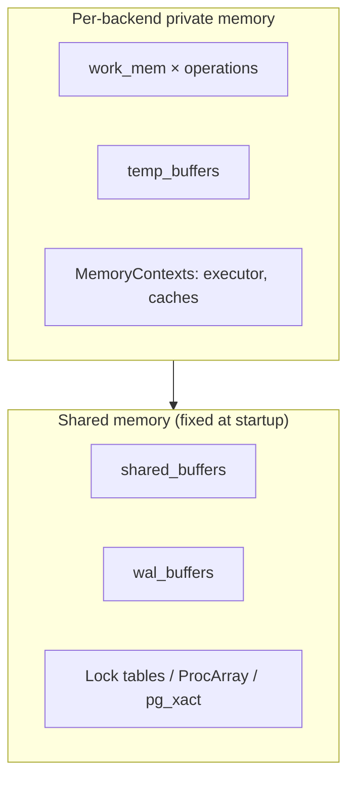

# PostgreSQL Memory Architecture

## Overview

PostgreSQL memory splits into fixed shared memory (allocated at startup) and elastic backend-private memory (grows per query). Misunderstanding the second half causes most PostgreSQL OOMs. This file maps every major area, how allocation works, and how to size without guessing.

See also:

- [PostgreSQL Architecture](./postgresql-architecture.md)
- [PostgreSQL Connection Internals](./postgresql-connection-internals.md)
- [Temporary Files and Disk Usage](./temporary-files-disk-usage.md)

## Why This Matters

`shared_buffers` too small wastes RAM on double-buffering; `work_mem` too large OOMs the host under concurrency. Sorting, hashing, VACUUM, and parallel workers each draw from different pools with different multipliers. This file gives the accounting model.

## PostgreSQL Memory Model / Shared vs Private



```text
Total ≈ shared_buffers + wal_buffers + locks/clog
        + backends × (session overhead + temp_buffers + work_mem × hash/sort nodes)
        + maintenance_work_mem × concurrent maintenance
        + parallel workers × work_mem
```

## Shared Buffers / How They Work / Buffer Descriptors

`shared_buffers` (default 128 MB; OLTP hosts often 25% RAM up to ~16–32 GB) caches 8 KB relation pages. Each buffer has a `BufferDesc` (`src/backend/storage/buffer/bufmgr.c`): tag (relfilenode, fork, block), refcount/pin count, usage count (clock-sweep hand), dirty flag. Backends look up pages by tag, pin them, take buffer content locks, and release — pins (not locks) are what keep a page from eviction.

Together with the OS page cache this forms double-buffering: PostgreSQL reads through shared buffers, the kernel caches the underlying files too. Oversizing `shared_buffers` past ~40% RAM starves the OS cache and can *reduce* throughput.

## Buffer Replacement: Clock Sweep / Pins / Locks

- **Clock sweep**: `BgBufferSync`/backend allocation sweeps a clock hand, decrementing `usage_count`; pages reaching zero with no pin are evictable. Frequently-touched pages accumulate usage count and survive — an approximation of LRU that is O(1) per decision.
- **Buffer pins**: short-lived refcounts preventing eviction while a backend reads/writes the page. Leaked pins (extension bugs) wedge the buffer.
- **Buffer locks**: `LockBuffer()` in shared/exclusive mode for consistent page reads vs modifications; held briefly, unlike heavyweight table locks.

## `work_mem` / Per-Operation Allocation / Why It Multiplies

`work_mem` caps *each* sort/hash/bitmap operation, not each query or session. A query with 4 concurrent hash joins can use ~4× `work_mem`; 50 concurrent backends running it can use 200×. Hash aggregation that exceeds `work_mem` spills to temp files (`log_temp_files` reveals it) instead of failing.

Sizing rule: estimate from `EXPLAIN (ANALYZE, BUFFERS)` sort/hash sizes at p99 concurrency, not from free RAM at idle.

## `maintenance_work_mem` / `autovacuum_work_mem` / `temp_buffers` / `wal_buffers`

| Setting | Used by | Guidance |
|---|---|---|
| `maintenance_work_mem` (per op) | `VACUUM`, `CREATE INDEX`, `ALTER TABLE`, `CLUSTER` | 256 MB–1 GB on big hosts; speeds index builds and vacuum dead-tuple arrays |
| `autovacuum_work_mem` | autovacuum workers (falls back to `maintenance_work_mem`) | cap separately so 6 workers don't each grab 1 GB |
| `temp_buffers` (per session) | temp-table pages | 8–32 MB; large temp-table users should raise per-session, not globally |
| `wal_buffers` | WAL staging | leave on `-1` (auto-tuned ≈ 1/32 of shared_buffers, cap 16 MB); full buffers trigger WAL flush |

## `shared_memory_type` / Huge Pages

- `shared_memory_type = mmap` (modern default) vs `sysv`: affects `/dev/shm` sizing and container limits — in Docker/K8s, small `--shm-size` breaks mmap-backed shared memory.
- `huge_pages = try`: fewer TLB misses for large `shared_buffers`; needs OS `vm.nr_hugepages` provisioned. Benefit is real past ~16 GB shared buffers; misconfiguration causes startup failure, so `try` (fall back) is the safe default.

## Memory Contexts / Lifecycle / Leak Discipline

`src/backend/utils/mmgr/` implements `MemoryContext` arenas: `TopMemoryContext` → per-transaction → per-query → per-tuple (resets per row). `pfree` is rare; instead whole contexts reset (`MemoryContextReset`) at portal/transaction end. A "leak" in PostgreSQL usually means allocations in a too-long-lived context (e.g., per-transaction instead of per-tuple in a tight loop) — fixed by moving allocation to a shorter-lived context.

## Backend and Query Memory Lifecycle

`Parse (short-lived) → Plan (cached if prepared) → Execute (per-node contexts) → tuple loop (per-tuple reset) → end-of-query reset → end-of-transaction release`. Long-running cursors and `LISTEN` loops hold contexts open — another reason idle-in-transaction sessions cost memory, not just snapshots.

## Memory During Sorting / Hashing / Aggregation / VACUUM

- **Sort**: quicksort in `work_mem`; spill to `pgsql_tmp` files with merge passes when exceeded. `EXPLAIN ANALYZE` shows `Sort Method: external merge Disk:`.
- **Hash join/aggregate**: in-memory hash table to `work_mem`, then batched disk partitions. Skewed keys blow one batch past estimates.
- **VACUUM**: dead-tuple TIDs array sized by `maintenance_work_mem`/`autovacuum_work_mem`; too small → multiple index-scan passes over large tables.

## Hands-on Experiment

```sql
SET work_mem = '1MB';
EXPLAIN (ANALYZE, BUFFERS)
SELECT * FROM (SELECT generate_series(1,2000000) g) s ORDER BY g;
-- Sort Method: external merge  Disk: ...
SET work_mem = '256MB';
-- same query: quicksort  Memory: ...
SHOW log_temp_files;  -- confirm spill logging threshold
```

## Troubleshooting

### Symptom: OOM-killer takes PostgreSQL backends under load

**Diagnose:** correlate OOM timestamps with `pg_stat_activity` active count × `EXPLAIN` hash/sort sizes; check `log_temp_files` for spill (paradoxically, *no* spill + OOM means `work_mem` too big to spill usefully). **Fix:** lower global `work_mem`, raise per-reporting-role only (`ALTER ROLE analyst SET work_mem`), add PgBouncer to cap concurrent actives.

## Interview Questions

### Intermediate

- Why can `work_mem = 64MB` still OOM a 32 GB host? — It is per operation: N backends × M nodes each can allocate multiples concurrently.
- Clock sweep vs LRU? — Usage-count hand approximating LRU in O(1); pins protect in-use pages from the hand.

### Advanced

- Why does oversizing `shared_buffers` hurt? — Steals OS page-cache RAM, lengthens checkpoint write bursts, and doubles management overhead for little hit-ratio gain past the working set.
- What is a MemoryContext and why does PostgreSQL use arenas? — Bulk reset/destroy per query/transaction instead of per-object free; bounds lifetimes and makes leaks structurally rare.

## Key Takeaways

- Account memory as shared-fixed plus backend-elastic; the elastic part kills hosts.
- `work_mem` multiplies by operations × backends — size from measured plans at p99 concurrency.
- Doubled caching (shared buffers + OS cache) is normal; tune the split, don't fight it.
