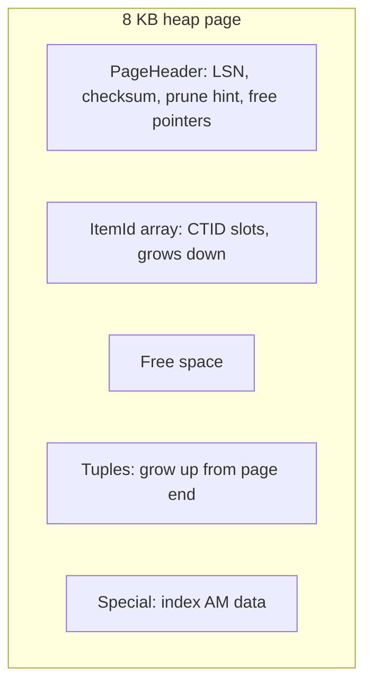

# PostgreSQL Storage Architecture

## Overview

PostgreSQL stores every table and index as 8 KB pages inside files addressed by OID, with TOAST side-tables for wide values and FSM/visibility-map forks to make VACUUM and index-only scans cheap. This file maps `PGDATA` to pages to tuples.

See also:

- [PostgreSQL Architecture](./postgresql-architecture.md)
- [MVCC Internals](./mvcc-internals.md)
- [VACUUM Internals](./vacuum-internals.md)
- [Tablespaces and Storage](./tablespaces-storage.md)

## Why This Matters

Bloat, page splits, TOAST thresholds, and "VACUUM can't return space" are all storage-layout consequences. You cannot reason about them without the page/tuple/fork model.

## Data Directory / `PGDATA` / Cluster vs Database

```text
PGDATA/
  base/           # one subdir per database (named by database OID)
  global/         # shared catalogs (pg_database, pg_authid...)
  pg_wal/         # WAL segments
  pg_xact/        # transaction commit status (CLOG)
  pg_multixact/   # MultiXact status
  pg_tblspc/      # symlinks to tablespace locations
  pg_stat_tmp/    # transient stats
  postgresql.conf, pg_hba.conf, pg_control, postmaster.pid
```

A *cluster* (one postmaster + one `PGDATA`) hosts many *databases*; catalogs in `global/` are shared, everything else is per-database OID directory. `SHOW data_directory;` and `pg_ls_dir()` expose this at runtime.

## Relation Files / OIDs / File Nodes / Forks

Each relation (table/index/sequence/TOAST) gets a `relfilenode` (usually = its OID until rewritten by `VACUUM FULL`/`CLUSTER`/TRUNCATE). Files live at `base/<dboid>/<relfilenode>`, segmented at 1 GB (`<relfilenode>.1`, `.2` …). Each fork appends a suffix:

| Fork | Suffix | Purpose |
|---|---|---|
| Main | (none) | heap/index pages |
| FSM | `_fsm` | free-space map: per-page free bytes for insert placement |
| Visibility map | `_vm` | all-visible / all-frozen bits per page (VACUUM + index-only scans) |
| Init | `_init` | unlogged-table init fork, rewritten at crash recovery |

Map names to files with:

```sql
SELECT oid::regclass, relfilenode, reltablespace FROM pg_class WHERE relname = 'users';
SELECT pg_relation_filepath('users');  -- base/16384/16385
```

## Tablespaces / Database OID / Relation OID

Tablespaces (`CREATE TABLESPACE fast LOCATION '/ssd/pg'`) redirect files outside `PGDATA` via `pg_tblspc/<oid>` symlinks. Use them for I/O isolation (WAL on separate devices, hot indexes on SSD) — not as a backup or quota mechanism. Per-file paths: `pg_relation_filepath('idx_users_email')` resolves tablespace + segment for you.

## PostgreSQL Page Structure / 8 KB Pages / Layout



- **Page header** (`PageHeaderData`, `src/include/storage/bufpage.h`): LSN of last WAL change, checksum, flags (`PD_ALL_VISIBLE`), `pd_prune_xid` hint, lower/upper free-space pointers.
- **Item pointers** (`ItemIdData`): (offset, length, flags) per tuple slot; `ctid` = (block, slot). Updates redirect the old slot to the new tuple (or HOT-chain within the page).
- **Tuples** grow upward; item array grows downward; free space is the middle. A page is "full" when they meet (modulo fillfactor reservation).
- **Special space**: index AMs store sibling links, high keys, FSM roots here.

Why 8 KB: matches common filesystem/SSD block multiples and keeps per-page header overhead (~24 B) small while bounding random-read amplification. Larger pages would waste I/O on narrow rows; smaller pages would inflate per-tuple overhead.

## Heap Pages / Tuple Headers / Alignment / CTID

Heap tuple header (`HeapTupleHeaderData`, `src/include/access/htup_details.h`): `xmin`, `xmax`, `ctid`, infomask bits (has-nulls, has-varwidth, HOT-updated, moved), null bitmap, then user columns with alignment padding (`MAXALIGN`: int4 on 4-byte, int8/float8/timestamp on 8-byte boundaries). A "small" row of three ints can occupy 40+ bytes after the ~23–27 B header + padding — this is why row-count × width math consistently underestimates table size.

- **CTID** `(block, tuple-index)` is the physical address, changed by every UPDATE (new tuple version) — never use it as a logical key.
- **Physical location** matters for HOT: same-page updates avoid index writes; cross-page updates don't.

## TOAST / Why It Exists / Tables / Compression / External Storage

Rows must fit in ~8 KB pages, but `text`/`jsonb`/`bytea` can be megabytes. TOAST (The Oversized-Attribute Storage Technique, `src/backend/access/table/toast*.c`) transparently:

1. Tries inline compression (pglz/LZ4, `SET STORAGE EXTENDED/MAIN`).
2. Moves values past `TOAST_TUPLE_THRESHOLD` (~2 KB) out-of-line into a TOAST table (`pg_toast.pg_toast_<oid>`) in ~2 KB chunks (`EXTERNAL` skips compression, `MAIN` prefers inline).
3. Reassembles on read (extra I/O per toasted column — `SELECT *` on wide rows pays per-column chunk fetches).

```sql
SELECT relname, relkind FROM pg_class WHERE relname LIKE 'pg_toast_%' LIMIT 3;
SELECT attname, attstorage FROM pg_attribute WHERE attrelid = 'docs'::regclass;
```

**Row width implications:** wide JSONB documents look like one row but behave like many random chunk reads; updates rewrite all out-of-line chunks (WAL amplification). Keep hot narrow columns in a separate table from cold wide payloads.

## Free Space Map / Visibility Map / Relation Extension

- **FSM** (`_fsm` fork): per-page free-byte estimates guiding `heap_insert` placement. Stale after bulk loads → `VACUUM` rebuilds it.
- **Visibility map** (`_vm` fork): per-page `all-visible` (no dead tuples → index-only scans can skip heap fetch) and `all-frozen` (page's XIDs all frozen → skips in anti-wraparound vacuum). Set by VACUUM, cleared by writes.
- **Relation extension**: writers take a relation-extension lock, append zeroed pages, update the FSM. Contention on the rightmost pages of insert-heavy tables (with a sequence PK) is a classic bottleneck — see [Why PostgreSQL Can Struggle With Write-Heavy Workloads](./why-postgres-struggles-with-writes.md).

## File Segmentation / Relation vs Filesystem Files

Files split at 1 GB for portability (`relfilenode`, `relfilenode.1`, …). `pg_class.relpages`/`reltuples` track planner-visible size; the filesystem shows more (FSM/VM forks, bloat, dead space). Never confuse `pg_total_relation_size()` (includes TOAST+indexes+FSM/VM) with `pg_relation_size()` (main fork only).

## Table Bloat / Index Bloat

Bloat = pages holding dead tuples or fragmented free space that VACUUM marked reusable but couldn't return to the OS (only `VACUUM FULL`/`CLUSTER`/rewrite returns file tails, and only if the tail pages are empty). Index bloat = dead index entries + half-empty pages fromdeletes/updates. Detection:

```sql
SELECT schemaname, relname, n_dead_tup, n_live_tup,
       round(100.0*n_dead_tup/GREATEST(n_live_tup+n_dead_tup,1),1) AS dead_pct
FROM pg_stat_user_tables ORDER BY n_dead_tup DESC LIMIT 10;
```

Full lifecycle in [VACUUM Internals](./vacuum-internals.md).

## What Actually Happens Internally?

`INSERT INTO docs(title, body) VALUES ('a', repeat('x', 100000))`:

1. Wide `body` exceeds TOAST threshold → compressed, chunked into `pg_toast` rows.
2. Main tuple (with TOAST pointers) placed via FSM into a page with room; CTID assigned.
3. WAL records for heap page + TOAST pages generated; commit flushes WAL (data pages may stay dirty in buffers).
4. FSM/VM bits updated; visibility map cleared for the touched page.

## Hands-on Experiment

```sql
CREATE TABLE t(id serial primary key, payload text);
INSERT INTO t(payload) SELECT repeat('x', 5000) FROM generate_series(1,100);
SELECT pg_relation_size('t'), pg_total_relation_size('t');
SELECT relname FROM pg_class WHERE oid = (SELECT reltoastrelid FROM pg_class WHERE relname='t');
-- shows the TOAST table; compare main-fork vs total size
SELECT ctid, xmin, xmax FROM t LIMIT 3;  -- physical addresses + tuple versions
```

## Interview Questions

### Intermediate

- Why can't a row exceed ~8 KB inline, and where does the overflow go? — Page size bound; TOAST tables with compression + chunking.
- What do FSM and VM forks buy? — FSM avoids scanning for free space on every insert; VM lets VACUUM skip clean pages and index-only scans skip heap fetches.

### Advanced

- Why does `SELECT *` on a wide table cost more than the row count suggests? — Per-column TOAST chunk reassembly = extra random reads + WAL-amplified updates.
- When does VACUUM free OS disk space vs just mark reusable? — Only truncated empty tail pages return space; interior holes stay as reusable free space.

## Key Takeaways

- Files are OID-addressed page arrays with FSM/VM sidecars; OIDs survive, `relfilenode`s change on rewrite.
- TOAST makes wide values transparent but not free — model hot/cold columns accordingly.
- Bloat is the storage-visible half of MVCC; VACUUM is the other half.
