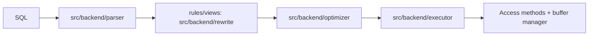

# Query Execution Internals

## Overview

`SQL → parse tree → rewritten tree → cheapest plan → executor nodes → buffers`. The planner is cost-based and statistics-driven; the executor is a Volcano-style node tree with parallel and JIT extensions. This file explains each stage, the plan shapes you'll actually see, and why plans go wrong.

See also:

- [PostgreSQL Statistics](./postgresql-statistics.md)
- [Index Internals](./index-internals.md)
- [Parallel Query Internals](./parallel-query-internals.md)
- [PostgreSQL Performance Internals](./postgresql-performance-internals.md)

## Why This Matters

Slow queries are planner misestimates, stale statistics, or executor spills far more often than "Postgres is slow". Reading `EXPLAIN (ANALYZE, BUFFERS)` is the highest-leverage PostgreSQL skill.

## Lifecycle: Parse / Rewrite / Plan / Execute



- **Parser** (`gram.y`, `scan.l`): raw parse tree, no semantics.
- **Analyzer**: resolves names/types, produces query tree.
- **Rewrite**: views expanded, rules (`ON SELECT DO INSTEAD`) applied, RLS predicates injected.
- **Planner**: enumerates paths, costs them with statistics + cost parameters, emits plan tree.
- **Executor**: initializes nodes, pulls tuples (`ExecProcNode`), manages memory contexts per node.

## Statistics-Driven Costing / Selectivity / Cardinality

Every choice reduces to estimated rows × cost model. Inputs: `pg_statistic` histograms/MCVs (`[PostgreSQL Statistics](./postgresql-statistics.md)`), `pg_class.reltuples/relpages`, and cost GUCs:

| Parameter | Meaning | Tuning direction |
|---|---|---|
| `seq_page_cost` (1.0) | sequential page read | lower on SSD (0.1–0.5 often) |
| `random_page_cost` (4.0) | random page read | the big SSD lever: 1.1–2.0 typical |
| `cpu_tuple_cost`, `cpu_operator_cost` | CPU per row/op | rarely touched |
| `effective_cache_size` | OS+PG cache estimate | raise to real RAM-cache size → favors index scans |

Misestimates compound per join level — a 10× error at the leaf becomes 1000× at the third join. `EXPLAIN ANALYZE` rows-estimated vs actual is the diagnostic.

## Execution Plans / Plan Nodes

Scan nodes: Seq Scan, Index Scan, Index Only Scan, Bitmap Heap + Bitmap Index, TID Scan. Join nodes: Nested Loop (small outer + indexed inner), Hash Join (equijoin, builds hash on smaller side — `work_mem` bound), Merge Join (both sides sorted, great for large ordered inputs). Aux nodes: Sort, HashAggregate vs GroupAggregate (sorted input), Materialize (cache inner side of nested loop), Memoize (v14+: cache parameterized inner results — huge for correlated subqueries), Gather/Gather Merge (parallel), Limit, Unique, WindowAgg.

Read plans inside-out: the most-indented node runs first; `actual rows` × `loops` = true row flow; `Buffers: shared hit/read` shows cache behavior.

## Parallel Query / Generic vs Custom Plans / Plan Cache / JIT

- **Parallel**: `Gather` forks workers (DSM segments), each scans a slice; leader merges. Overhead (worker startup,IPC) only pays past `parallel_setup_cost`/`parallel_tuple_cost` thresholds — small queries correctly stay serial.
- **Prepared statements**: first 5 executions use custom plans (parameter values visible); then PostgreSQL may switch to a **generic plan** (parameter-independent). `plan_cache_mode = force_custom_plan` when skew makes generic plans catastrophic.
- **JIT** (LLVM, `jit = on`): compiles expression evaluation per query. Helps CPU-heavy analytics (aggregates, complex expressions); hurts short OLTP queries (compile time dominates). `EXPLAIN (ANALYZE)` shows `JIT: Functions: N, Generation: Xms`.

## What Actually Happens Internally?

```sql
EXPLAIN (ANALYZE, BUFFERS)
SELECT o.id FROM orders o JOIN customers c ON c.id = o.customer_id
WHERE c.country = 'DE' ORDER BY o.created_at LIMIT 20;
```

Planner: estimates DE customers via MCV, picks hash vs nested loop by size estimates, checks `orders(customer_id)` index, considers sort-vs-index order for `ORDER BY ... LIMIT`. Executor: scans, joins, sorts (or stops early at 20 via Limit), returns. `Buffers` reveals whether it was cache-resident.

## Hands-on Experiment

```sql
EXPLAIN (ANALYZE, BUFFERS, TIMING OFF)
SELECT * FROM orders WHERE status = 'shipped' ORDER BY created_at LIMIT 10;
-- compare: CREATE INDEX ... (status, created_at); re-run; watch Sort node vanish
SET enable_seqscan = off;  -- force plan shape comparison (debugging only, never production)
```

## Troubleshooting

### Symptom: plan flips to seq scan after data growth

Stale stats or default `random_page_cost = 4` on SSD. **Fix:** `ANALYZE`, raise stats target on skewed columns, lower `random_page_cost`, check `auto_explain` for the actual production plan (not psql's).

## Interview Questions

### Intermediate

- What does `Buffers: shared hit=10 read=500` mean? — 10 pages from cache, 500 from OS/disk during this execution; high `read` on repeats = cache pressure or bigger-than-memory scan.
- Nested loop vs hash vs merge — when each? — NL: small outer, indexed inner. Hash: equijoin, fits `work_mem`. Merge: both sides already sorted / huge ordered inputs.

### Advanced

- Why would a prepared statement suddenly get slow on the 6th execution? — Switch from custom to generic plan; parameter-sensitive shapes need `force_custom_plan` or replanning.
- Memoize vs Materialize? — Memoize caches inner results keyed by outer parameters (correlated NL); Materialize dumb-caches the whole inner side once.

## Key Takeaways

- Plans are costed guesses from statistics — fix stats before forcing plans.
- Read `EXPLAIN ANALYZE` inside-out, estimate-vs-actual first.
- Parallelism and JIT are conditional wins with measurable overheads; verify per workload.
