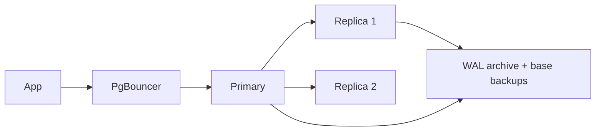

# Real-World PostgreSQL Architecture

## Overview

Reference topologies from single instance to Kubernetes HA: what runs where, what fails over how, and what each layer costs. Pick by measured need using the ladder in [PostgreSQL Scaling](./postgresql-scaling.md); implement with the mechanics in [Replication](./replication-internals.md) and [Connections](./postgresql-connection-internals.md).

## Topologies

- **Single instance + PgBouncer**: dev/staging, small prod with good backups. RTO = restore time; RPO = archive lag.
- **Primary + async replicas**: read scaling + manual failover. Add sync replica for zero-data-loss failover (commit latency cost).
- **HA with Patroni + etcd/Consul**: leader election, fencing, automated failover, sync-standby management. The production default for self-hosted HA.
- **Kubernetes (CloudNativePG / Crunchy / Zalando operators)**: StatefulSets + PVs, operator-driven failover/backup/pooling, PodDisruptionBudgets. Storage: fast CSI volumes for data, separate for WAL; backups to object storage via pgBackRest/Barman sidecars.
- **Cloud-managed (RDS/Aurora/AlloyDB/Neon)**: automated HA/backup/patching; Aurora's storage-compute separation changes replica-lag and snapshot economics (understand the bill, not just the topology).

## Cross-Cutting Concerns

| Concern | Implementation |
|---|---|
| Pooling in K8s | PgBouncer sidecar/pool per AZ or centralized pool tier; `max_client_conn` high, `default_pool_size` low |
| Backup in K8s | object-storage base + WAL streaming; tested restore Job, not just CronJob success |
| Storage | StatefulSet PVCs with `volumeClaimTemplates`, `storageClass` per I/O class; never `emptyDir` for data |
| Observability | `postgres_exporter` + `pg_stat_statements` → Prometheus → Grafana (lag, bloat, xmin age, checkpoint, pool wait); Loki/ELK for CSV/JSON logs; OpenTelemetry traces with `application_name` + queryid correlation |
| Fencing | Patroni `fencing` / operator Pod deletion + storage fencing; split-brain prevention is architectural, not procedural |

## Cloud Notes (RDS/Aurora/CloudNativePG)

RDS: Multi-AZ standby (block-replicated, not WAL-readable) vs read replicas (WAL, lag-visible). Aurora: shared distributed storage → fast clones/failover, but replica-lag semantics and I/O billing differ from stock PG. CloudNativePG: declarative `Cluster` CRD (instances, storage, backup to S3, pooler) — GitOps-native HA without leaving Kubernetes primitives.

## Interview Questions

### Advanced

- Why does fencing matter more than fast failover? — A fast wrong promotion (split-brain) corrupts data; a slow safe one only costs downtime. Election without fencing is half a system.
- StatefulSet vs Deployment for PG? — Stable identity + stable storage per pod; Deployments' interchangeable pods destroy the WAL/history model.

## Key Takeaways

- Topology = failure-domain arithmetic: pooler, primary, sync/async replicas, archive, observer (etcd), all in separate domains.
- Operators encode the runbooks (failover, backup, fencing) — adopt them instead of scripting PG primitives by hand.
- Observability (lag, bloat, xmin, pool-wait) ships with the topology, not after it.
