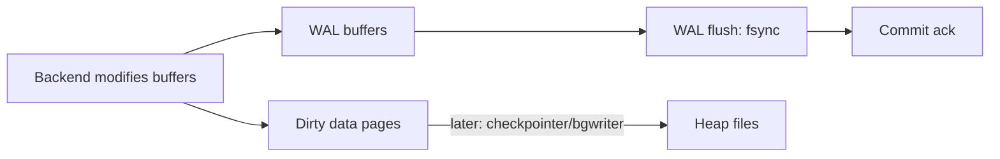

# WAL: Write-Ahead Logging

## Overview

WAL is PostgreSQL's durability and replication journal: every change hits sequential WAL files before touching data pages, so crashes replay forward and standbys replay remotely. This file explains record flow, flush semantics, retention dangers, and performance behavior.

See also:

- [PostgreSQL Write Path](./postgresql-write-path.md)
- [Checkpoints and Background Writer](./checkpoints-background-writer.md)
- [Replication Internals](./replication-internals.md)
- [Crash Recovery Internals](./crash-recovery-internals.md)
- [Backup and Recovery Internals](./backup-recovery-internals.md)

## Why This Matters

`synchronous_commit`, checkpoint tuning, replica lag, disk-full outages from retained WAL, and PITR all reduce to WAL mechanics. Understand WAL and half of PostgreSQL operations becomes predictable.

## Why PostgreSQL Uses WAL / WAL vs Data Files

Data pages scatter randomly across heap/index files; WAL appends sequentially. Sequential log writes are orders of magnitude cheaper than random page fsyncs per commit, and the log is the single ordered truth that crash recovery and replication both replay. Rule: **WAL first, data pages whenever** — a commit is durable once its WAL is durable, even if heap pages are still dirty in buffers.



## Architecture / Records / Segments / Buffers / LSN

- **WAL records** (`src/backend/access/transam/xlog*.c`): tagged mutations (heap insert/update/delete, index changes, commit markers, checkpoint records, FPI headers).
- **Segments**: 16 MB files in `pg_wal/` (`000000010000000000000001`), recycled or archived.
- **WAL buffers** (`wal_buffers`): shared staging; backends reserve space via WAL insertion locks, copy records, then request flush.
- **LSN** (Log Sequence Number, `pg_lsn` like `0/16A2B8`): byte offset in the infinite WAL stream — the universal cursor for replication (`sent_lsn`/`replay_lsn`), slots, and recovery targets.

## Insertion / Flushing / Sync / `fsync` / Durability

Commit path per backend:

1. Reserve WAL buffer space, write records (still in memory).
2. Request flush to current LSN; WAL writer or the backend itself `write()`+`fsync()`s `pg_wal` files.
3. On fsync success: release locks, report commit.

`fsync` (not `write`) is the durability line — OS-buffered bytes die with a power loss. `open_datasync`/`fdatasync` variants tune the syscall; misconfigured storage that lies about fsync is the classic "durable commit lost" horror story (verify with `pg_test_fsync`).

## `synchronous_commit`

| Setting | Guarantees | Latency |
|---|---|---|
| `on` (default) | flush to local disk before ack | one fsync round trip |
| `remote_write/remote_apply` | + standby receipt/apply | network + standby replay |
| `off` | ack after WAL buffered (≤ `wal_writer_delay` window of loss) | minimal |
| `local` | local flush only, explicit vs replica confusion | like `on` |

`off` risks only the last ~600 ms of commits on crash — acceptable for analytics ingest, never for money. `remote_apply` is the only mode where a commit ack means "readable on the standby".

## WAL Write vs Flush Path / Group Commit / Commit Latency

Backends coordinate so one fsync covers many commits: the first committer to reach the flush point does the syscall while others piggyback (**group commit**). Commit latency ≈ fsync latency / batching efficiency — hence `commit_delay`/`commit_siblings` micro-tuning and why fast `pg_wal` devices (low-latency SSD, separate from data) matter disproportionately.

## Full-Page Writes / `full_page_writes` / WAL Volume / Compression

After a checkpoint, the first modification of each page writes the **full page image** (FPI) into WAL — necessary because a torn page (half-written 8 KB) can't be fixed by replaying deltas. Cost: major WAL amplification on write-heavy workloads (often 2–3×). `wal_compression = on` (pglz/lz4/zstd) compresses FPI at CPU cost. Disabling `full_page_writes` is only safe with page-atomic storage (verified ZFS/battery-backed cache) — otherwise torn pages corrupt silently.

## Retention / Recycling / Archiving / Corruption / Recovery

- **Recycling**: segments past the last checkpoint + replication-slot horizons are renamed and reused (`max_wal_size` bounds this growth; `checkpoint_timeout` bounds time).
- **Archiving** (`archive_mode`, `archive_command`): copies completed segments for PITR; a failing archive command retains WAL forever → disk full.
- **Slots** (`pg_replication_slots.restart_lsn`): inactive slots pin WAL — the #1 disk-full cause on replicated clusters.
- **Corruption**: checksum failures during replay halt recovery; `ignore_invalid_pages` is a last-resort data-salvage switch, not a fix.

```sql
SELECT slot_name, active, restart_lsn, pg_size_pretty(pg_wal_lsn_diff(pg_current_wal_lsn(), restart_lsn)) AS retained
FROM pg_replication_slots;
SELECT * FROM pg_stat_wal;  -- wal_records, wal_bytes, wal_buffers_full
```

## Performance Bottlenecks / WAL-Heavy Workloads

```text
heavy small writes → WAL insert-lock contention + fsync rate limit
  → group commit helps to a point → then: faster pg_wal device,
     synchronous_commit=off for non-critical paths, batching (COPY, multi-row INSERT),
     fewer indexes (each index entry is more WAL)
```

Monitor `pg_stat_wal.wal_bytes` rate alongside checkpoint frequency — spiky WAL with frequent checkpoints means `max_wal_size` too small (see [Checkpoints and Background Writer](./checkpoints-background-writer.md)).

## What Actually Happens Internally?

`UPDATE users SET balance = balance - 100 WHERE id = 1` + COMMIT:

1. Heap + index buffer modifications staged; WAL records (possibly FPI) appended to WAL buffers under insert locks.
2. Commit record appended; backend requests flush to its LSN.
3. WAL writer (or backend) writes + fsyncs segments; commit ack sent.
4. Dirty heap pages stay in shared buffers for checkpointer/bgwriter — crash-safe because WAL has them.

## Hands-on Experiment

```sql
SELECT pg_current_wal_lsn();
CREATE TABLE w(id serial primary key, v text);
INSERT INTO w(v) SELECT 'x' FROM generate_series(1,100000);
SELECT pg_size_pretty(pg_wal_lsn_diff(pg_current_wal_lsn(), '0/0'));  -- total WAL ever; compare before/after via saved LSNs
SELECT wal_records, wal_bytes, wal_buffers_full FROM pg_stat_wal;
-- repeat with full_page_writes=on + CHECKPOINT between runs to see FPI amplification
```

## Troubleshooting

### Symptom: `pg_wal/` growing unboundedly

**Diagnose:** slots (`pg_replication_slots`), `archiver failed` in logs (`SELECT * FROM pg_stat_archiver`), `max_wal_size` vs checkpoint cadence. **Fix:** drop dead slots, repair `archive_command`, raise `max_wal_size` only after fixing retention (raising it without fixing the slot just delays the same outage).

## Interview Questions

### Intermediate

- Why WAL before data pages, and what breaks if reversed? — Random page writes per commit would be catastrophically slow and unorderable; crash recovery needs the ordered log to reconstruct page states.
- What does `synchronous_commit = off` actually risk? — Commits acked from memory; OS crash loses ~one WAL-writer-delay window. PostgreSQL crash alone loses nothing (WAL still on disk).

### Advanced

- Full-page writes: why do they exist, and what do they cost? — Torn-page protection after checkpoints; cost is 2–3× WAL volume on first-touch-heavy workloads.
- Why can an idle replication slot fill a disk? — `restart_lsn` pins segments from recycling; the primary keeps every byte since the slot's last confirmed flush.

## Key Takeaways

- Commit durability = WAL durability. Heap flush timing is a performance detail, not a safety property.
- LSN is the universal position: replication, slots, archiving, and PITR all speak it.
- WAL retention (slots, archiver) is the operational sharp edge — monitor retained bytes, not just disk percent.
