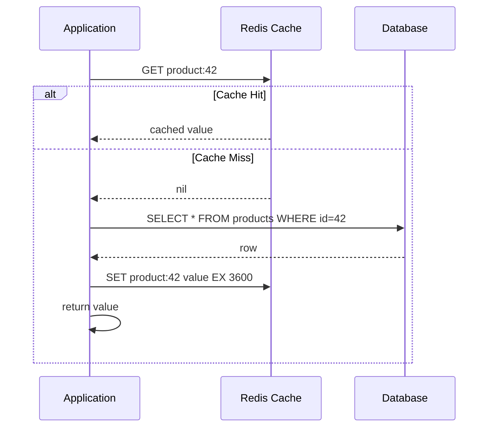
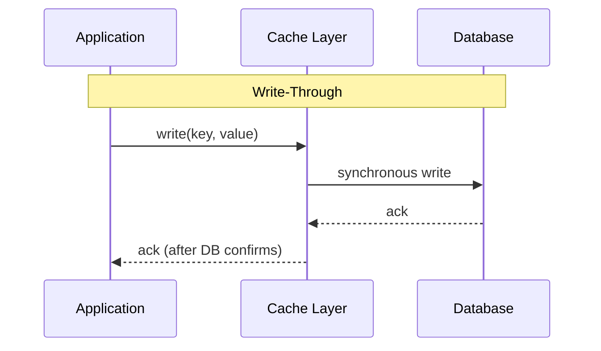
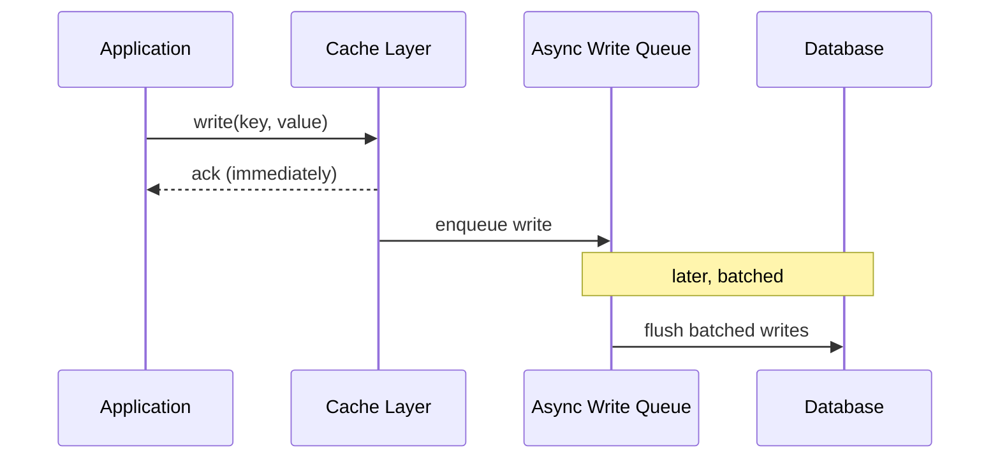
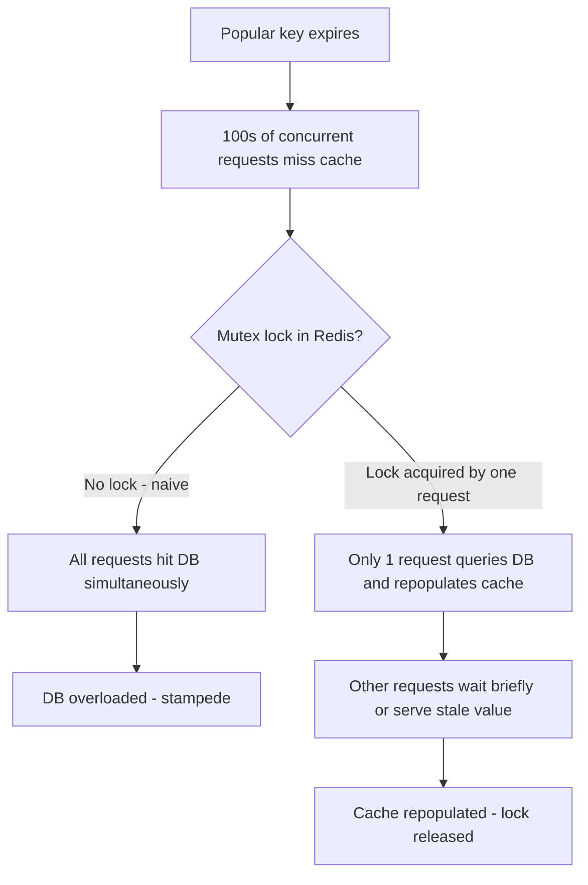
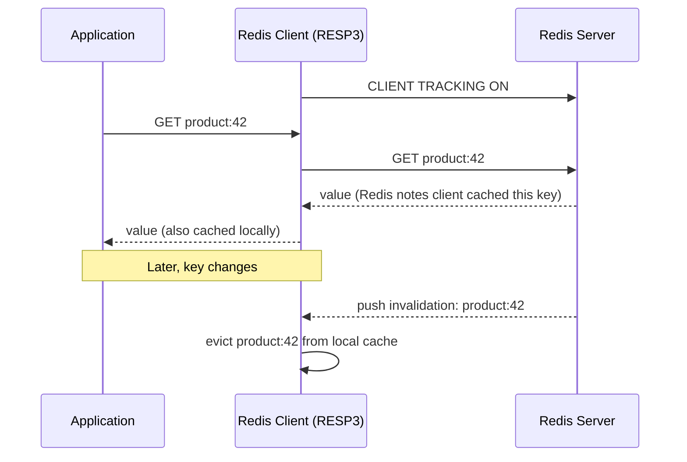

# Caching Concepts

## Theory

### Cache Aside Pattern

**Cache-aside** (also called **lazy loading**) is the most common caching pattern used with Redis, and the one Spring Data Redis's `@Cacheable` abstraction implements by default. The application code is responsible for managing the cache explicitly: on a read, it first checks Redis; on a cache miss, it queries the database itself, then writes the result back into Redis (usually with a TTL) before returning it. On a write, the application updates the database directly and then either **deletes** the corresponding cache key (most common — forces the next read to repopulate it) or updates it in place.



```java
@Service
public class ProductService {

    @Autowired private StringRedisTemplate redisTemplate;
    @Autowired private ProductRepository productRepository;

    public Product getProduct(Long id) {
        String key = "product:" + id;
        String cached = redisTemplate.opsForValue().get(key);
        if (cached != null) {
            return deserialize(cached);
        }
        Product product = productRepository.findById(id).orElseThrow();
        redisTemplate.opsForValue().set(key, serialize(product), Duration.ofHours(1));
        return product;
    }

    public void updateProduct(Product product) {
        productRepository.save(product);
        redisTemplate.delete("product:" + product.getId());  // invalidate, don't update in place
    }
}
```

```java
// Equivalent using Spring's caching abstraction
@Cacheable(value = "products", key = "#id")
public Product getProduct(Long id) {
    return productRepository.findById(id).orElseThrow();
}

@CacheEvict(value = "products", key = "#product.id")
public void updateProduct(Product product) {
    productRepository.save(product);
}
```

| Advantage | Disadvantage |
|---|---|
| Only requested data gets cached (no wasted cache space) | First request after a miss/expiry always pays full DB latency |
| Cache failure doesn't break reads — falls back to DB | Application owns cache-population logic (more code, more places to get it wrong) |
| Simple mental model, widely supported by frameworks | Risk of momentarily stale data between a DB write and cache invalidation |

**Production scenario:** A product catalog service uses cache-aside with a 1-hour TTL: most reads are served from Redis, the database only sees traffic for products not recently viewed, and if Redis were to become unavailable, the application would simply serve every request from the database (degraded performance, not an outage).

### Read Through Cache

**Read-through** caching moves the "load from DB on a miss" responsibility out of the application and into the caching layer itself: the application always talks to the cache abstraction, and the cache (backed by a configured loader function) transparently fetches from the database when it doesn't already have the data. The functional outcome looks similar to cache-aside, but the key architectural difference is **who owns the loading logic** — with cache-aside the application explicitly checks the cache and explicitly queries the DB on a miss; with read-through, the application only ever calls the cache, and the cache's own loader plugs into the database.

```java
// Spring Cache abstraction with a CacheLoader-style pattern approximates read-through semantics
// using a Caffeine-backed near-cache in front of Redis, or a custom CacheManager wrapper
@Bean
public CacheManager cacheManager(RedisConnectionFactory factory) {
    RedisCacheConfiguration config = RedisCacheConfiguration.defaultCacheConfig()
        .entryTtl(Duration.ofMinutes(30));
    return RedisCacheManager.builder(factory).cacheDefaults(config).build();
}

// The @Cacheable-annotated method acts as the "loader" the cache calls on a miss,
// but the client code (below) only ever calls through the cache-manager-backed proxy
@Cacheable("products")
public Product getProduct(Long id) {
    return productRepository.findById(id).orElseThrow();  // only invoked by the cache on a miss
}
```

| Aspect | Cache-Aside | Read-Through |
|---|---|---|
| Who queries the DB on a miss | Application code, explicitly | The cache provider itself, via a configured loader |
| Coupling | Application knows about both cache and DB | Application only talks to the cache abstraction |
| Flexibility | More control over custom loading/merging logic | Simpler application code, less flexibility |

**Production scenario:** Teams using Spring's `@Cacheable` annotation are effectively using a read-through-style abstraction from the application code's perspective — the annotated method is only invoked (by Spring's proxy) when the cache reports a miss, so calling code never manually checks the cache itself.

### Write Through Cache

In **write-through** caching, writes go to the cache first, and the cache synchronously propagates the write to the underlying database before acknowledging success back to the application. This keeps the cache and database always in sync (no window where the cache is stale relative to the DB), at the cost of added write latency, since every write now waits on both the cache write and the database write to complete.



```java
public void updateProductWriteThrough(Product product) {
    // Write to DB and cache together, synchronously, before returning
    productRepository.save(product);
    redisTemplate.opsForValue().set("product:" + product.getId(), serialize(product), Duration.ofHours(1));
}
```

**Production scenario:** A pricing service that cannot tolerate even brief staleness between cache and database (e.g., displayed price must always match the authoritative price) uses write-through so that every price update is durably persisted and cache-consistent before any client can observe it.

### Write Behind Cache

**Write-behind** (or **write-back**) caching accepts a write into the cache immediately and acknowledges the client right away, then asynchronously flushes the change to the database later — often batched, delayed, or coalesced with other pending writes for efficiency. This dramatically reduces write latency and database load (many rapid updates to the same key can be collapsed into a single eventual DB write), but introduces a real risk: if the cache crashes before the asynchronous flush completes, those writes can be **lost**, since they were never durably persisted to the database.



| Strategy | Write Latency | Consistency Risk | Typical Use |
|---|---|---|---|
| Write-Through | Higher (waits on DB) | Low - always in sync | Financial/pricing data requiring strong consistency |
| Write-Behind | Very low (async flush) | Higher - risk of data loss on crash before flush | High write-throughput analytics, view counters, telemetry |
| Write-Around | N/A for cache (writes bypass cache) | Cache can be stale until next read repopulates it | Write-heavy data rarely re-read soon after writing |

**Production scenario:** A view-count or "likes" counter service accepts write-behind semantics, buffering increments in Redis and flushing aggregated counts to the database every few seconds — an occasional lost increment on crash is an acceptable trade-off for the massive reduction in database write load.

### Refresh Ahead Cache

**Refresh-ahead** proactively re-fetches and repopulates a cache entry **before** it expires, typically triggered when the entry is accessed within some threshold of its TTL (e.g., accessed with less than 20% of its TTL remaining). This smooths out the latency spike that would otherwise occur when a hot key expires and the next request has to pay full database latency synchronously — instead, a background refresh keeps serving the (still valid) cached value to current requests while quietly updating it behind the scenes.

```java
public Product getProductWithRefreshAhead(Long id) {
    String key = "product:" + id;
    Long ttl = redisTemplate.getExpire(key, TimeUnit.SECONDS);
    String cached = redisTemplate.opsForValue().get(key);

    if (cached != null && ttl != null && ttl < REFRESH_THRESHOLD_SECONDS) {
        // still serve the current value, but kick off an async refresh
        asyncRefreshExecutor.submit(() -> refreshProductCache(id));
    }
    if (cached != null) {
        return deserialize(cached);
    }
    return loadAndCacheProduct(id);
}
```

**Production scenario:** A frequently-read configuration value with a 5-minute TTL is refreshed ahead of expiry whenever it's accessed with under 30 seconds remaining, so that heavy read traffic never experiences the latency spike of a synchronous cache-miss reload during peak load.

### Cache Warming

**Cache warming** (or pre-warming) is the practice of populating cache entries proactively — often at application startup, via a scheduled batch job, or right before an anticipated traffic spike — instead of waiting for organic traffic to trigger cache-aside misses. This avoids a "cold cache" period where the first wave of production traffic all misses simultaneously and floods the database.

```bash
# Efficient bulk population using a pipeline to avoid one round trip per key
redis-cli --pipe <<'EOF'
SET product:1 "{...serialized product 1...}"
SET product:2 "{...serialized product 2...}"
SET product:3 "{...serialized product 3...}"
EOF
```

```java
@Component
public class CacheWarmupRunner implements ApplicationRunner {

    @Autowired private ProductRepository productRepository;
    @Autowired private StringRedisTemplate redisTemplate;

    @Override
    public void run(ApplicationArguments args) {
        List<Product> topProducts = productRepository.findTopSellingProducts(1000);
        redisTemplate.executePipelined((RedisCallback<Object>) connection -> {
            topProducts.forEach(p ->
                connection.stringCommands().set(
                    ("product:" + p.getId()).getBytes(), serialize(p).getBytes()));
            return null;
        });
    }
}
```

**Production scenario:** Ahead of a scheduled flash sale, an e-commerce platform runs a warmup job that loads the top 10,000 expected-to-be-popular SKUs into Redis, avoiding a stampede of cache misses against the database the instant the sale goes live.

### Cache Invalidation

Cache invalidation is the process of removing or updating stale cache entries once the underlying data changes, and is famously one of the trickier problems in caching design — a cache that never invalidates correctly will serve incorrect data indefinitely. Common strategies, often combined:

- **TTL-based expiry** — the simplest approach; every entry naturally expires after a fixed duration, bounding staleness even if explicit invalidation is missed. Simple but means data can be up to `TTL` seconds stale.
- **Explicit invalidation on write** — the writing service directly `DEL`s (cache-aside) or updates (write-through) the affected key(s) as part of the write path.
- **Event-driven invalidation** — a write publishes an event (via Pub/Sub or keyspace notifications) that other services/instances subscribe to, so they can invalidate their own local or distributed cache copies without being directly coupled to the writer.
- **Versioned/namespaced keys** — instead of deleting a key, embed a version number in the key name (e.g., `product:42:v3`) and bump the version pointer on write, effectively "orphaning" old cached entries without needing to actively delete them (they simply age out via TTL).

```bash
# Explicit invalidation
redis-cli DEL product:42

# Versioned key pattern - bump the version instead of deleting
redis-cli INCR product:42:version
redis-cli GET product:42:version   # "3"
redis-cli SET product:42:v3 "{...}"
```

**Production scenario:** A multi-service architecture where several microservices each maintain their own read cache of "customer profile" data uses event-driven invalidation: the customer-service publishes a `customer.updated` event on write, and every other service's cache listener deletes its local copy of that customer's cached data in response.

### Cache Stampede

A **cache stampede** (also called "dog-piling") happens when a single, popular cache key expires (or is evicted) and a large number of concurrent requests all experience a cache miss for that key **at the same time**, causing all of them to hit the database simultaneously — potentially overwhelming it, even though the aggregate request rate hadn't actually changed.



Common mitigations:
- **Mutex/lock on rebuild** — the first request to miss acquires a short-lived Redis lock (`SET lock:key token NX PX 5000`) and is the only one allowed to query the database and repopulate the cache; other concurrent requests either wait briefly and retry the cache, or serve a stale value if one is available.
- **Probabilistic early expiration** (e.g., the XFetch algorithm) — requests probabilistically decide to recompute a value slightly *before* its actual expiry, with probability increasing as expiry nears, spreading recomputation out over time instead of all at once.
- **Request coalescing** — the application layer de-duplicates concurrent in-flight requests for the same key into a single database call, fanning the result out to all waiters.

```bash
# Basic stampede protection: only the lock-winner rebuilds the cache
redis-cli SET lock:product:42:rebuild "worker-token" NX PX 5000
```

**Production scenario:** A celebrity's profile page cache key expires during a viral traffic spike; without stampede protection, thousands of concurrent requests would all query the database at once — a rebuild lock ensures only one request repopulates the cache while the rest briefly wait or receive the previous (slightly stale) cached value.

### Cache Penetration

**Cache penetration** occurs when requests target keys that exist in **neither** the cache **nor** the database — for example, a client (or attacker) probing sequential or random IDs that don't correspond to real records. Because the data genuinely doesn't exist, a naive cache-aside implementation never caches anything for these lookups, so every such request bypasses the cache entirely and hits the database, repeatedly, for data that will never be found.

Mitigations:
- **Cache negative results** — explicitly cache a sentinel "not found" marker (with a short TTL) for keys confirmed absent from the database, so repeated lookups of the same missing ID are served from the cache instead of re-querying the DB.
- **Bloom filter pre-check** — maintain a Bloom filter (e.g., via the RedisBloom module) of all valid IDs; check the filter before even attempting a cache/DB lookup, and short-circuit immediately if the filter says the ID definitely doesn't exist (a Bloom filter has no false negatives, only a tunable false-positive rate).

```bash
# Caching a negative result with a short TTL to absorb repeated lookups of a missing key
redis-cli SET product:99999999:notfound "1" EX 60

# Using RedisBloom to pre-filter obviously-invalid IDs before touching cache or DB
redis-cli BF.RESERVE valid_product_ids 0.01 1000000
redis-cli BF.ADD valid_product_ids "42"
redis-cli BF.EXISTS valid_product_ids "99999999"
# (integer) 0   <- definitely not a real ID, skip cache/DB lookup entirely
```

**Production scenario:** An API endpoint exposed to the public internet is targeted by an automated scanner requesting thousands of non-existent user IDs; a Bloom filter of valid IDs in front of the cache/DB lookup absorbs this traffic with negligible memory and CPU cost, protecting the database from a flood of guaranteed-miss queries.

### Cache Avalanche

A **cache avalanche** occurs when a large number of cache keys expire **at the same time** (e.g., they were all set with the same TTL during a bulk load or cache warmup), or when the cache layer itself becomes unavailable (node crash, network partition) — in either case, a large fraction of traffic that would normally be absorbed by the cache suddenly lands on the database simultaneously, risking a cascading overload.

Mitigations:
- **TTL jitter** — add a small random offset to each key's TTL (e.g., `baseTTL + random(0, 300)` seconds) so mass-loaded keys don't all expire in the same instant.
- **Multi-tier caching** — an in-process (L1) cache in front of Redis (L2) means even a full Redis outage doesn't send 100% of traffic straight to the database.
- **Circuit breakers around the database** — protect the DB from a sudden traffic surge by failing fast or shedding load rather than letting every request queue up against an overloaded database.
- **Redis high availability** — Sentinel or Cluster deployments reduce the chance that a single node failure removes the entire cache layer at once.

```java
// TTL jitter to avoid mass simultaneous expiry
Duration baseTtl = Duration.ofHours(1);
Duration jitter = Duration.ofSeconds(new Random().nextInt(300));  // up to 5 minutes of jitter
redisTemplate.opsForValue().set(key, value, baseTtl.plus(jitter));
```

| Failure Mode | Cause | Primary Mitigation |
|---|---|---|
| Cache Stampede | One hot key expires; many concurrent requests race to rebuild it | Rebuild lock / mutex, probabilistic early refresh |
| Cache Penetration | Requests for keys absent from both cache and DB | Cache negative results, Bloom filter |
| Cache Avalanche | Many keys expire together, or the cache layer itself goes down | TTL jitter, multi-tier caching, Redis HA, circuit breakers |

**Production scenario:** A batch job that reloads the entire product catalog into Redis every night sets identical TTLs on tens of thousands of keys; adding TTL jitter prevents all of them from expiring in the same second the next day, which would otherwise cause an avalanche of simultaneous database queries.

### Hot Keys

A **hot key** is a single key (or a small number of keys) that receives disproportionately more traffic than the rest of the keyspace — for example, a viral post, a celebrity's profile, or a globally shared configuration flag. In a clustered Redis deployment, all requests for a hot key hash to the **same shard**, meaning that shard's single node can become a throughput bottleneck even though the cluster as a whole has ample capacity — since Redis Cluster distributes by key *hash slot*, not by request rate, a hot key cannot be "spread out" the way normal keys are.

Mitigations:
- **Local (in-process) caching layer** on top of Redis for known hot keys, so most reads never even reach Redis.
- **Key replication/sharding of the hot key itself** — store the same value under multiple key variants (e.g., `product:42:copy0` .. `product:42:copy9`) and have clients pick a copy at random, spreading load across shards artificially.
- **Read replicas** — route read traffic for hot keys across multiple replicas rather than a single primary.

```java
// Client-side sharding of a known hot key across N copies
int shardIndex = ThreadLocalRandom.current().nextInt(10);
String key = "leaderboard:global:copy" + shardIndex;
String value = redisTemplate.opsForValue().get(key);
```

**Production scenario:** A global leaderboard key read by every client on every app-open becomes a hot key under viral growth; the team splits it into 10 replicated copies refreshed by the same writer, and clients randomly choose a copy to read, spreading load evenly across cluster shards.

### Client-Side Caching

Redis 6 introduced native **client-side caching** (built on RESP3 and a feature called **tracking**): the Redis server remembers which keys a client has recently read, and proactively **pushes an invalidation message** to that client whenever one of those keys is modified or evicted — letting the client maintain a local, in-process cache of recently-read values while still being notified the instant they become stale, without polling or manual TTL guessing.

Two tracking modes exist: **default mode**, where the server maintains a per-client table of exactly which keys each client has read (more server memory, precise invalidation); and **broadcasting mode** (`BCAST`), where the server doesn't track individual client reads at all, and instead broadcasts invalidation messages for any key matching a set of registered prefixes to all clients subscribed to that prefix (less server memory, coarser invalidation).

```bash
# Enable tracking on a RESP3 connection (typically negotiated by the client library)
redis-cli -3 CLIENT TRACKING ON

# Broadcasting mode, only for keys under a given prefix
redis-cli -3 CLIENT TRACKING ON BCAST PREFIX product:
```



**Production scenario:** A read-heavy service that re-reads the same handful of configuration keys thousands of times per second enables client-side caching so most reads are served entirely from local process memory, falling back to Redis only after receiving an invalidation push when the underlying value actually changes — cutting network round trips dramatically for effectively-static hot data.

### Interview Questions

- Explain the cache-aside pattern and walk through both its read and write paths. — On read, the application checks the cache first; on a hit it returns the cached value, on a miss it queries the database, then populates the cache before returning; on write, the application updates the database and explicitly invalidates (deletes) the corresponding cache entry rather than updating it in place, so the next read repopulates it fresh.
- What's the architectural difference between cache-aside and read-through caching? — With cache-aside, the application explicitly checks the cache and explicitly queries the database on a miss; with read-through, the application only ever calls the cache abstraction, and the cache itself (via a configured loader) transparently fetches from the database when data isn't already present.
- Compare write-through and write-behind caching in terms of latency and durability trade-offs. — Write-through synchronously writes to both cache and database before acknowledging, giving higher latency but always-in-sync consistency with low data-loss risk; write-behind acknowledges the write immediately after updating the cache and flushes to the database asynchronously later, giving very low latency but a real risk of losing writes if the cache crashes before the flush completes.
- What is refresh-ahead caching, and what problem does it solve versus a simple TTL expiry? — Refresh-ahead proactively re-fetches and repopulates a cache entry before it expires (e.g., when accessed with less than 20% of its TTL remaining), avoiding the latency spike that a simple TTL expiry causes when the next request after expiry must pay full database latency synchronously.
- Why would a team run a cache-warming job, and how would you implement one efficiently in Redis? — Cache warming proactively populates entries (at startup, on a schedule, or before an anticipated traffic spike) to avoid a "cold cache" period where the first wave of traffic all misses simultaneously and floods the database; it's implemented efficiently using a pipeline (`redis-cli --pipe` or `executePipelined`) to bulk-load many keys without one round trip per key.
- What strategies exist for cache invalidation, and what are the trade-offs of each? — TTL-based expiry is simple but can leave data stale for up to the TTL duration; explicit invalidation on write directly deletes/updates the affected key but requires the writer to know every affected key; event-driven invalidation decouples writers from cache consumers via Pub/Sub or keyspace notifications but adds messaging infrastructure; versioned/namespaced keys avoid active deletion by orphaning old entries to age out via TTL, at the cost of extra key-space complexity.
- Define cache stampede, cache penetration, and cache avalanche, and explain how each is caused differently. — A cache stampede happens when one popular key expires and many concurrent requests all miss and rebuild it simultaneously; cache penetration happens when requests target keys absent from both cache and database, bypassing the cache entirely on every request; a cache avalanche happens when many keys expire together (or the whole cache layer goes down), sending a large fraction of traffic to the database at once.
- How would you protect a system from a cache stampede on a single hot key? — Use a rebuild mutex/lock (`SET lock:key token NX PX 5000`) so only the first request to miss queries the database and repopulates the cache while other concurrent requests wait briefly or serve a stale value, or use probabilistic early expiration (e.g., XFetch) to spread recomputation out before the actual expiry.
- How does a Bloom filter help mitigate cache penetration? — A Bloom filter of all valid IDs is checked before attempting a cache/DB lookup; since it has no false negatives (only a tunable false-positive rate), a "definitely not present" result short-circuits the request immediately, protecting the database from repeated queries for IDs that are guaranteed not to exist.
- Why does TTL jitter help prevent a cache avalanche? — Adding a small random offset to each key's TTL (e.g., `baseTTL + random(0, 300)` seconds) ensures mass-loaded keys with an otherwise identical base TTL don't all expire in the same instant, spreading their eventual re-fetch load over time instead of hitting the database all at once.
- What makes a "hot key" especially problematic in a clustered Redis deployment, compared to a single-node deployment? — Redis Cluster distributes keys by hash slot, not by request rate, so all requests for a hot key always hash to the same single shard/node, making that node a throughput bottleneck even though the rest of the cluster has ample spare capacity — a problem a single-node deployment doesn't have since there's only one node to begin with.
- How would you mitigate a hot key problem in Redis Cluster? — Add a local in-process caching layer in front of Redis for known hot keys, artificially shard the hot key into multiple copies (e.g., `product:42:copy0`..`copy9`) with clients picking a copy at random, or route hot-key read traffic across multiple read replicas instead of a single primary.
- What is Redis client-side caching, and how does RESP3 tracking enable it? — Client-side caching (Redis 6+, built on RESP3 "tracking") lets the server remember which keys a client has recently read and proactively push an invalidation message to that client whenever one of those keys is modified or evicted, letting the client maintain a local in-process cache that's notified the instant it becomes stale, without polling or manual TTL guessing.
- What is the difference between default tracking mode and broadcasting (`BCAST`) mode for client-side caching?
- In a real system, how would you decide between cache-aside, write-through, and write-behind for a given data type?

