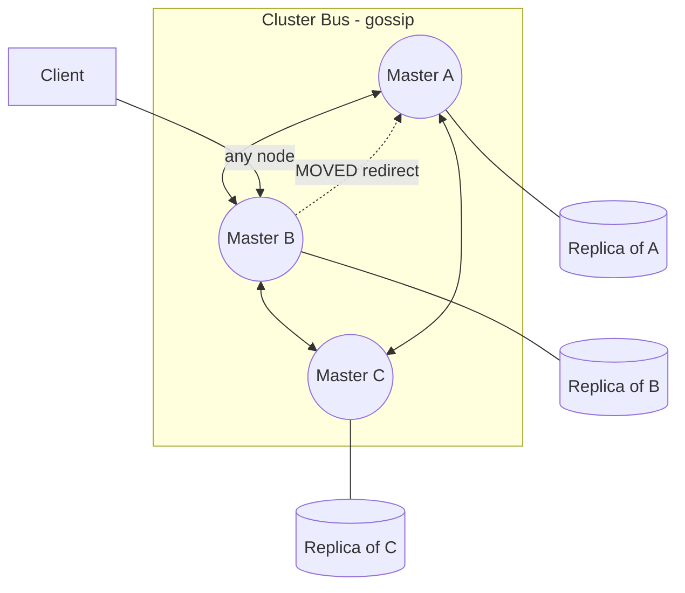
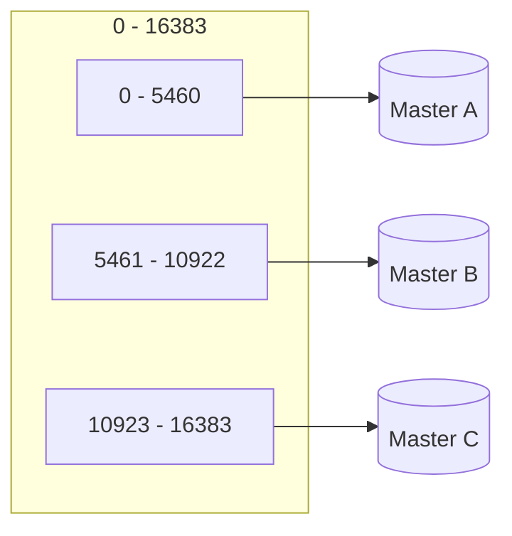
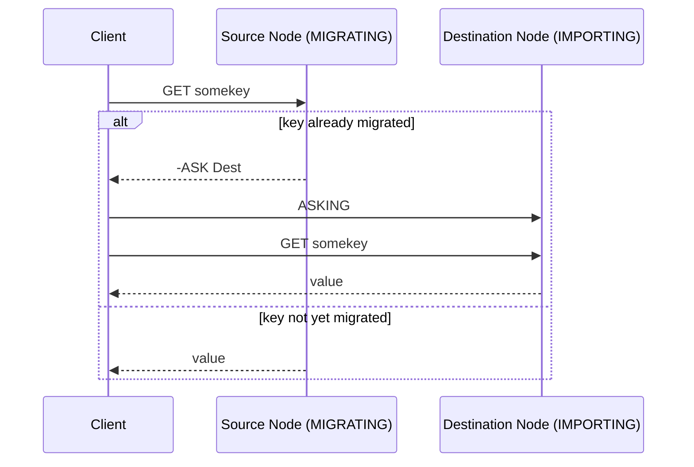
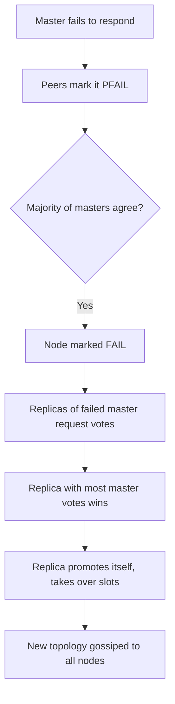

# Redis Cluster

## Theory

### Cluster Architecture

Redis Cluster is Redis's native solution for horizontal scaling and high availability, distributing data across multiple nodes without needing an external coordinator like Sentinel or a proxy. A cluster is made up of multiple master nodes, each owning a subset of the keyspace, and optionally one or more replicas per master for redundancy. Every node in the cluster talks to every other node over a dedicated **cluster bus** — a binary protocol on port `<client-port> + 10000` — using a gossip protocol to continuously exchange state: which nodes are alive, which hash slots each master owns, and configuration changes.

Clients can connect to *any* node in the cluster. If that node doesn't own the requested key's slot, it replies with a `MOVED` redirection pointing the client to the correct node. Cluster-aware clients cache the slot-to-node mapping so subsequent requests go directly to the right node, avoiding an extra redirect hop.

```conf
# redis.conf on every cluster node
cluster-enabled yes
cluster-config-file nodes.conf
cluster-node-timeout 15000
appendonly yes
```

```bash
# Create a 3-master, 3-replica cluster (6 nodes) with redis-cli
redis-cli --cluster create \
  10.0.0.1:6379 10.0.0.2:6379 10.0.0.3:6379 \
  10.0.0.4:6379 10.0.0.5:6379 10.0.0.6:6379 \
  --cluster-replicas 1
```



A production cluster requires a **minimum of 3 master nodes** so that the cluster can reach majority agreement when marking a node as failed; running with fewer masters undermines the cluster's ability to safely tolerate failures.

### Hash Slots

Redis Cluster splits the entire keyspace into **16384 hash slots** (numbered 0–16383). Every key is mapped to exactly one slot using `CRC16(key) mod 16384`, and each master node in the cluster is assigned ownership of a contiguous or scattered range of these slots. This is fundamentally different from consistent hashing (used by many other distributed caches) — Redis Cluster uses a fixed, pre-determined slot count that is then distributed among nodes, which makes resharding a matter of moving whole slots (and their keys) between nodes rather than rehashing everything.

If a key contains a `{...}` hash tag, only the substring inside the braces is hashed — this lets applications force multiple related keys onto the same slot (necessary for multi-key operations to work in cluster mode).

```bash
# Which slot does a key hash to?
redis-cli -c CLUSTER KEYSLOT user:1000

# Hash tags force related keys onto the same slot
# "user:{1000}:profile" and "user:{1000}:cart" both hash only on "1000"
redis-cli -c CLUSTER KEYSLOT "user:{1000}:profile"
redis-cli -c CLUSTER KEYSLOT "user:{1000}:cart"

# Inspect which node owns which slot ranges
redis-cli -c CLUSTER SLOTS
redis-cli -c CLUSTER SHARDS
```



### Data Partitioning

Because each master owns a distinct range of hash slots, data is naturally partitioned across the cluster: a given key always lives on exactly one master (plus its replicas). This gives Redis Cluster linear scalability for both storage capacity and write throughput — adding masters increases the total number of slots available to spread data across.

Partitioning is transparent to well-behaved cluster-aware clients: they maintain a local slot map (refreshed from `CLUSTER SLOTS`/`CLUSTER SHARDS` or from `MOVED` responses) and route each command directly to the owning node, avoiding unnecessary hops in the common case.

**Real-life scenario:** A multi-tenant SaaS platform uses hash tags like `{tenant-123}` on every key belonging to a tenant, guaranteeing all of that tenant's data lands on the same slot/node — enabling safe use of multi-key operations and Lua scripts scoped to a single tenant, while still getting cluster-wide horizontal scaling across tenants.

### Resharding

Resharding is the process of moving hash slots (and the keys within them) from one master node to another — done to rebalance load after adding/removing nodes, or to fix an uneven distribution. Redis Cluster supports **live resharding**: it can move slots while the cluster continues serving reads and writes, using the `CLUSTER SETSLOT ... MIGRATING/IMPORTING` mechanism combined with per-key `MIGRATE` commands.

During migration of a slot, the source node marks it `MIGRATING` and the destination marks it `IMPORTING`. Keys are moved one at a time. If a client asks the source node for a key that has already moved, the source responds with an `ASK` redirect (a one-time redirect, unlike `MOVED` which is a permanent redirect for a slot that has fully moved) telling the client to retry against the destination node with an `ASKING` command first.

```bash
# Interactive resharding wizard
redis-cli --cluster reshard 10.0.0.1:6379

# Non-interactive resharding: move 1000 slots to a specific node
redis-cli --cluster reshard 10.0.0.1:6379 \
  --cluster-from <source-node-id> \
  --cluster-to <dest-node-id> \
  --cluster-slots 1000 \
  --cluster-yes

# Rebalance slots automatically across all masters
redis-cli --cluster rebalance 10.0.0.1:6379
```



**ASK vs MOVED:**

| Redirect | Meaning | Client behavior |
|---|---|---|
| `MOVED` | The slot has permanently moved to another node | Update local slot map permanently, always route there |
| `ASK` | This *specific key* is mid-migration to another node | Retry once against the new node with `ASKING`, don't update the permanent slot map |

### Cluster Failover

Each master's health is tracked by its peers via the gossip protocol, using periodic `PING`/`PONG` messages over the cluster bus. If a node doesn't respond within `cluster-node-timeout`, other nodes mark it as `PFAIL` (possible failure) — analogous to Sentinel's SDOWN. If enough master nodes (a majority of the masters that hold slots) agree on the `PFAIL` status, it's upgraded to `FAIL` — analogous to ODOWN.

Once a master is `FAIL`, its own replicas race to be promoted: each eligible replica waits a short, randomized delay (favoring the replica with the most up-to-date replication offset), then requests votes from the master nodes. If it obtains a majority of master votes, it promotes itself with an internal failover, taking over the failed master's hash slots, and announces this to the cluster via gossip.



### Multi-Key Operation Limitations

Because data is sharded by hash slot across independent nodes, multi-key commands (`MGET`, `MSET`, transactions with `MULTI`/`EXEC`, and Lua scripts using multiple keys) only work if **all involved keys map to the same hash slot**. If keys span different slots on different nodes, Redis returns a `CROSSSLOT` error rather than silently doing a partial or two-phase operation — Redis Cluster deliberately does not support distributed multi-key transactions across nodes.

```bash
# This fails if the two keys hash to different slots
MSET user:1000 "Alice" user:2000 "Bob"
# -> (error) CROSSSLOT Keys in request don't hash to the same slot

# Using hash tags forces both keys onto the same slot - now it works
MSET "user:{shard1}:1000" "Alice" "user:{shard1}:2000" "Bob"
```

This is a deliberate design trade-off: Redis Cluster favors horizontal scalability and operational simplicity over supporting arbitrary cross-shard atomicity. Applications that need multi-key atomic operations across arbitrarily chosen keys must either co-locate those keys with hash tags or restructure the data model (e.g., combining related fields into a single Hash instead of separate keys).

### Interview Questions

- What problem does Redis Cluster solve that Sentinel does not?
- Explain the role of the cluster bus and the gossip protocol between nodes.
- How many hash slots does Redis Cluster use, and how is a key mapped to a slot?
- What are hash tags and why are they necessary for certain multi-key operations?
- What is the minimum recommended number of master nodes for a production cluster, and why?
- How does a client discover which node owns a given key, and what does a `MOVED` response mean?
- Describe the steps involved in resharding slots between two live nodes.
- What is the difference between an `ASK` redirect and a `MOVED` redirect?
- How does Redis Cluster detect and confirm a master node failure (PFAIL vs FAIL)?
- How is a replacement master chosen during a cluster failover?
- Why does Redis Cluster raise a `CROSSSLOT` error instead of supporting arbitrary cross-node transactions?
- How would you design a multi-tenant data model so that per-tenant multi-key operations still work in a cluster?
- What is `cluster-node-timeout` and how does it affect failover responsiveness vs false-positive risk?
- Compare Redis Cluster's partitioning approach to classic consistent hashing.
- What tooling (`redis-cli --cluster ...`) would you use to create, reshard, and rebalance a cluster?

