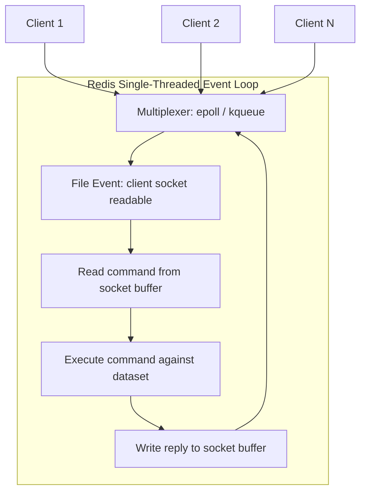
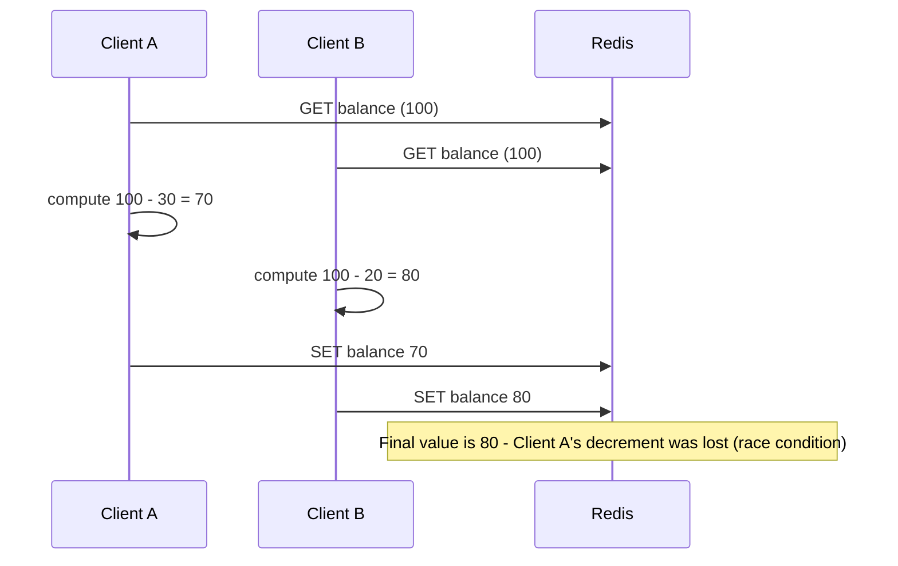
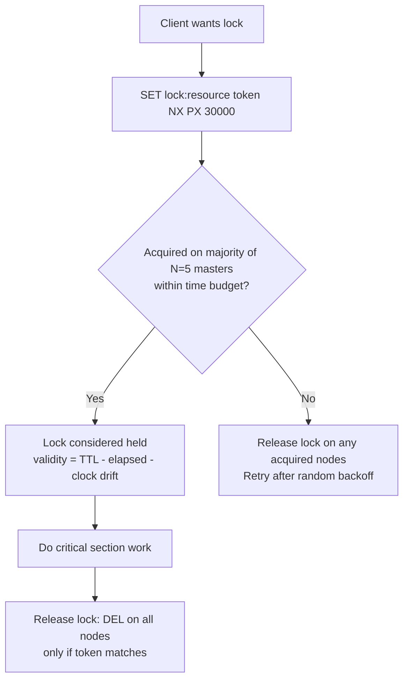

# Concurrency and Atomicity

## Theory

### Single-Threaded Execution Model

The core of Redis processes commands using a **single thread** running an event loop, historically built on a multiplexing mechanism like `epoll` (Linux) or `kqueue` (macOS/BSD) — architecturally similar in spirit to Node.js. All client connections are multiplexed onto this one thread: Redis waits for a socket to become readable, reads the command, executes it against the in-memory dataset, writes the reply, and moves to the next ready socket. Because command execution itself never runs concurrently with another command, **every single Redis command is inherently atomic** with respect to other commands — there is no possibility of two commands interleaving mid-execution the way there could be with genuinely parallel threads mutating shared memory.

Since Redis 6.0, Redis added optional **I/O threading** (`io-threads` config) to parallelize the *network* read/parse/write work across multiple threads, since that had become a bottleneck at very high throughput — but the actual execution of commands against the dataset remains strictly single-threaded. This distinction is important: I/O threading improves network throughput, not command concurrency or atomicity guarantees, which continue to hold exactly as before.

The single-threaded model has a critical operational implication: any command that takes a long time to execute **blocks every other client** for that duration, since there's no other thread to service them. Commands like `KEYS *` (full keyspace scan), `FLUSHALL`, `SMEMBERS` on a huge set, or a poorly-written Lua script/`EVAL` can cause noticeable latency spikes across the entire system. This is why Redis provides non-blocking alternatives like `SCAN` (cursor-based, incremental iteration) instead of `KEYS`.



```bash
# Bad: blocks the single thread while scanning the entire keyspace
redis-cli KEYS "user:*"

# Good: non-blocking, incremental cursor-based iteration
redis-cli SCAN 0 MATCH "user:*" COUNT 100
```

**Production scenario:** A team debugging periodic latency spikes discovers a scheduled job calling `KEYS pattern:*` on a database with millions of keys every few minutes — replacing it with `SCAN` eliminates the blocking behavior since `SCAN` processes the keyspace incrementally across many small non-blocking calls.

### Atomic Operations

Because of the single-threaded execution model, every individual Redis command executes atomically — nothing else can observe or mutate the dataset mid-command. Redis leverages this heavily by providing compound commands that perform what would otherwise be a "read, compute, write" sequence as one atomic step: `INCR`/`INCRBY`/`DECRBY`/`HINCRBY` (atomic increment), `GETSET`/`GETDEL` (atomic read-and-replace / read-and-delete), `SETNX` and `SET key value NX` (atomic "set only if not exists"), `SET key value XX` (set only if exists), and `RPOPLPUSH`/`LMOVE` (atomic move between lists, useful for reliable queues).

```bash
# Atomic counter - safe even with thousands of concurrent clients
redis-cli INCR page:views:home

# Atomic "acquire if absent" - classic building block for simple locks
redis-cli SET lock:job:42 "worker-7" NX PX 10000

# Atomic move - pop from one list and push to another as a single step (reliable queue pattern)
redis-cli RPOPLPUSH queue:pending queue:processing
```

It's important to recognize the boundary of this atomicity: a **single command** is atomic, but a **sequence of separate commands issued by the client** (e.g., `INCR` followed by a separate `EXPIRE` call) is *not* atomic as a pair — another client's command could execute between them. For that, you need `MULTI`/`EXEC`, a Lua script, or (as of Redis 7) `SET key value EX seconds` style combined options where available, or `GETEX`.

```bash
# NOT atomic as a pair - a crash/race between these two lines leaves a key with no TTL
redis-cli INCR rate_limit:user:42
redis-cli EXPIRE rate_limit:user:42 60

# Better - do it in a single Lua script (atomic) or use SET with options where the command supports it
redis-cli EVAL "local c = redis.call('INCR', KEYS[1]) if c == 1 then redis.call('EXPIRE', KEYS[1], ARGV[1]) end return c" 1 rate_limit:user:42 60
```

**Production scenario:** A per-user API rate limiter increments a counter key per request; using `INCR` alone guarantees the counter itself is race-free, but setting the TTL only on the *first* request of the window requires wrapping the increment-then-conditionally-expire logic in a Lua script to keep the whole sequence atomic.

### Race Conditions

Even though every single Redis command is atomic, a **race condition** can still occur whenever application logic performs a *read, then decide, then write* sequence using multiple separate round trips, because another client's write can slip in between the read and the write. The classic example: two clients both `GET` a balance of 100, each independently computes a new balance in application code, and each issues a separate `SET` — the second `SET` silently overwrites the first, and one of the two updates is lost, even though each individual `GET`/`SET` was itself atomic.



Redis provides three main tools to eliminate this class of race condition, each with different trade-offs already discussed elsewhere in this document:

1. **Use an atomic single command** instead of read-then-write when possible (e.g., `DECRBY balance 30` instead of `GET`+compute+`SET`).
2. **Optimistic locking** with `WATCH`/`MULTI`/`EXEC` when the write logic is too complex for a single atomic command but conflicts are rare.
3. **Lua scripting / distributed locks** when you need guaranteed atomic multi-step logic or need to coordinate across processes with genuinely complex critical sections.

**Production scenario:** A "first come, first served" ticket-booking system that reads remaining ticket count, checks if `> 0`, and decrements, must not use plain `GET` + `DECR` — it should use `DECR` directly with a post-check-and-rollback pattern, or a Lua script that atomically checks-and-decrements, to avoid overselling under concurrent bookings.

### Distributed Locks (Concept)

A distributed lock coordinates exclusive access to a resource across multiple, independent application processes (potentially on different machines) — something a language-level `synchronized` block or in-process mutex cannot do, since those only protect against contention within a single process. Redis is commonly used to implement distributed locks because `SET key value NX PX ttl` is atomic: it sets the key only if it doesn't already exist, with an expiry, in a single round trip, meaning only one client can "win" the lock at a time even if many request it simultaneously.

A safe implementation requires two extra details beyond the basic `SET ... NX PX`: the lock's **value must be a unique token** per lock holder (e.g., a UUID), and **releasing the lock must verify the token before deleting**, using a small Lua script executed atomically — otherwise a client could delete a lock it no longer owns (e.g., after its own TTL expired and a different client acquired it in the meantime).

```bash
# Acquire: only succeeds if the key does not already exist; auto-expires after 30s as a safety net
redis-cli SET lock:order:123 "client-uuid-9f8e" NX PX 30000

# Safe release - only delete if the value still matches our token (avoids deleting someone else's lock)
redis-cli EVAL "if redis.call('GET', KEYS[1]) == ARGV[1] then return redis.call('DEL', KEYS[1]) else return 0 end" 1 lock:order:123 client-uuid-9f8e
```

```java
// Using Redisson (a popular Java Redis client with a proper RLock implementation)
RedissonClient redisson = Redisson.create(config);
RLock lock = redisson.getLock("lock:order:123");

lock.lock(30, TimeUnit.SECONDS);  // auto-expiring, safe unlock handled internally
try {
    processOrder(orderId);
} finally {
    lock.unlock();
}
```

**Production scenario:** Two instances of a scheduled batch job (deployed for high availability) must ensure only one of them actually runs a nightly reconciliation task at a time — each instance attempts `SET lock:nightly-reconciliation <token> NX PX 300000` at startup, and only the one that acquires the lock proceeds, preventing duplicate processing.

### Redlock (Overview)

**Redlock** is an algorithm (proposed by Redis's original author) for acquiring a distributed lock with stronger guarantees than a single-instance lock, by using **multiple independent Redis masters** (typically 5, deployed without replication between them). A client attempts to acquire the same lock key/value on all N instances; it considers the lock successfully acquired only if it obtains it on a **majority** (e.g., 3 of 5) within a time budget that is small relative to the lock's TTL. This protects against a single Redis instance failing or a network partition isolating one node from causing an incorrect lock grant.



Redlock is also one of the more **debated** patterns in distributed systems circles: Martin Kleppmann published a well-known critique arguing Redlock is not safe for correctness-critical use cases, because it relies on assumptions (bounded clock drift, bounded process pauses) that don't always hold in practice — a long GC pause or clock jump could cause a client to believe it still holds a lock after it has actually expired and been granted to someone else. Redis's own documentation acknowledges this debate. The practical takeaway used in interviews and system design discussions: Redlock is reasonable for **efficiency locks** (avoiding duplicate work, best-effort deduplication), but for **correctness-critical locks** (where a violation causes real data corruption or financial loss), a system with fencing tokens and a consensus-based store (e.g., ZooKeeper, etcd) is the safer choice.

| Approach | Guarantee Strength | Complexity | Typical Use |
|---|---|---|---|
| Single-instance Redis lock (`SET NX PX`) | Best-effort, single point of failure | Low | Non-critical mutual exclusion, deduplication |
| Redlock (multiple Redis masters) | Stronger, but debated under clock/GC assumptions | Medium | Cross-node coordination where full consensus is overkill |
| ZooKeeper / etcd (consensus-based) | Strong, with fencing tokens | Higher | Correctness-critical distributed locking |

**Production scenario:** A distributed cron-like scheduler running across five Redis masters uses Redlock to decide which node runs a given job this cycle — acceptable because occasionally running a job twice (in a rare failure edge case) is a tolerable inefficiency, not a correctness violation.

### Interview Questions

- Why is every individual Redis command atomic, and how does the single-threaded event loop enable that? — A single main thread executes commands sequentially against the in-memory dataset with no other thread able to interleave, so any given command runs to completion before the next one starts, making every individual command inherently atomic without requiring locks.
- What did Redis 6's I/O threading change, and what did it *not* change about concurrency? — Redis 6 added optional I/O threads that parallelize reading/parsing/writing bytes on the socket to reduce networking overhead at high throughput, but command execution itself remains strictly single-threaded, so individual commands are still atomic and no new concurrency hazards around data access were introduced.
- Give an example of a race condition that can occur in Redis despite individual commands being atomic. — Two clients both `GET` a balance of 100, each computes a new balance in application code (100-30=70 and 100-20=80), and each issues a separate `SET`; the second `SET` silently overwrites the first, losing one client's update even though each individual `GET`/`SET` was itself atomic.
- How would you make a "check remaining stock, then decrement" operation safe under concurrency? — Avoid a plain `GET` + check + `DECR` sequence and instead use `DECR` directly with a post-check-and-rollback pattern, or a Lua script that atomically checks the stock count and decrements only if sufficient, preventing overselling under concurrent bookings.
- Walk through how to implement a safe distributed lock using `SET key value NX PX`. — Acquire the lock with `SET lock:resource <unique-token> NX PX <ttl>`, which only succeeds if the key doesn't already exist and auto-expires as a safety net; to release, run a Lua script that first checks the stored value matches the caller's unique token before issuing `DEL`, ensuring a client can never release a lock it no longer owns.
- Why is it unsafe to release a distributed lock with a plain `DEL` without checking a token first? — If the lock's TTL expired and a different client acquired it in the meantime, a plain `DEL` from the original holder would delete the new holder's lock, breaking mutual exclusion; checking that the stored value still matches the releasing client's unique token (atomically, via Lua) prevents this.
- What is Redlock, and how does it differ from a single-instance Redis lock? — Redlock acquires the same lock key/value across multiple independent Redis masters (typically 5) and considers the lock held only if a majority (e.g., 3 of 5) grant it within a time budget, protecting against a single instance failing or being network-partitioned, unlike a single-instance lock which is a single point of failure.
- What is the well-known criticism of Redlock, and in what scenarios is it still considered acceptable? — Martin Kleppmann's critique argues Redlock is unsafe for correctness-critical use cases because it relies on assumptions like bounded clock drift and bounded process pauses that don't always hold (a long GC pause or clock jump could let a client believe it still holds an expired lock); it remains acceptable for best-effort efficiency locks like avoiding duplicate work, where occasionally running a job twice is a tolerable inefficiency rather than a correctness violation.
- What Redis commands or patterns would you avoid because they block the single-threaded event loop? — Commands like `KEYS *` and unbounded `SORT` on large collections run O(N) over the whole keyspace/collection and block every other client for their duration; `SCAN` and its type-specific siblings should be used instead for iterating large keyspaces without blocking.
- Why is `SCAN` preferred over `KEYS` in production? — `SCAN` uses a cursor-based protocol to incrementally walk the keyspace in small, non-blocking batches, whereas `KEYS *` is O(N) and blocks the single-threaded server for its entire duration, causing latency spikes for every other client on a large dataset.
- How do fencing tokens help address the weaknesses of naive distributed locks? — A fencing token is a monotonically increasing number issued with each lock grant that downstream resources can check before accepting an operation; even if a client mistakenly believes it still holds an expired lock, its stale (lower) fencing token is rejected by the resource, closing the gap that pure lock-expiry-based schemes like Redlock are criticized for.
- What is the difference between atomicity and isolation in the context of a single Redis command versus a Redis transaction? — A single command's atomicity means it executes as one indivisible, uninterruptible step; a transaction's isolation (via `MULTI`/`EXEC`) means the whole queued batch runs uninterrupted by other clients' commands, but unlike a single command's atomicity, the transaction still provides no rollback if an individual queued command fails at runtime.

