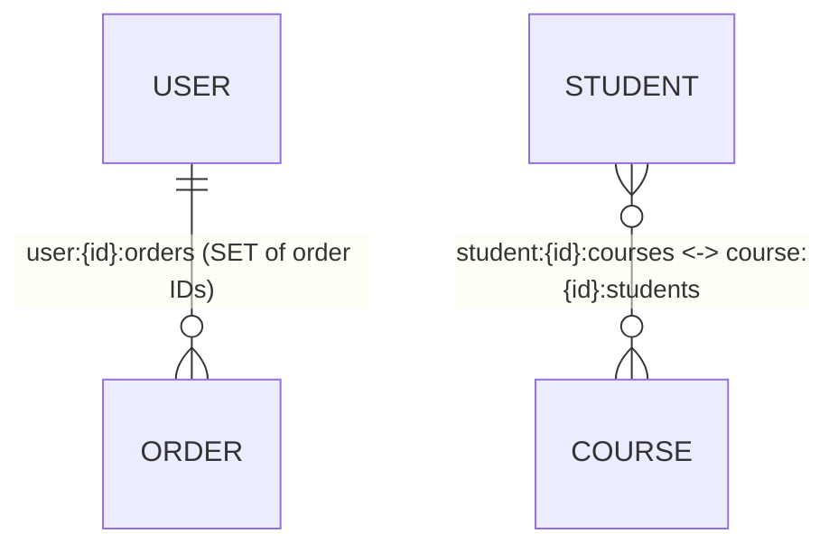

# Data Modeling

## Theory

### Choosing the Right Data Type

Redis is not just a key-value string store; it offers a rich set of native data structures, and choosing the right one for a use case is the single biggest factor in both performance and memory efficiency. The core types are: `STRING` (text, numbers, serialized blobs, binary data), `HASH` (field-value maps, ideal for objects), `LIST` (ordered, doubly-linked list — queues, recent activity feeds), `SET` (unordered unique collection — tags, membership checks), `SORTED SET`/`ZSET` (unique members ordered by score — leaderboards, priority queues, range queries), `STREAM` (append-only log — event sourcing, message queues with consumer groups), `HYPERLOGLOG` (probabilistic cardinality estimation), `BITMAP` (bit-level operations for flags/analytics), and `GEO` (geospatial indexes built on sorted sets).

The decision usually comes down to the access pattern you need, not just the shape of the data. For example, storing a user profile as a JSON string in a `STRING` key is simple but forces you to rewrite the entire blob for a single field update; storing it as a `HASH` lets you use `HSET`/`HGET` to read or update individual fields cheaply. Similarly, a naive "list of user IDs" might look like a `LIST`, but if you need to check membership frequently, a `SET` is O(1) for `SISMEMBER` versus O(N) for scanning a `LIST`.

```bash
# STRING: simple counter or cached blob
SET page:views:home 1042
INCR page:views:home

# HASH: object with independently updatable fields
HSET user:1001 name "Alice" email "alice@example.com" plan "pro"
HGET user:1001 email
HINCRBY user:1001 login_count 1

# SET: tags / unique membership
SADD article:42:tags "redis" "caching" "databases"
SISMEMBER article:42:tags "redis"

# SORTED SET: leaderboard, ranked by score
ZADD leaderboard 1500 "player:7"
ZREVRANGE leaderboard 0 9 WITHSCORES

# STREAM: append-only event log
XADD orders:events * order_id 555 status "created"
```

| Data Type | Best For | Avoid When |
|---|---|---|
| STRING | Simple values, counters, serialized objects, caching whole objects | Frequent partial updates to large objects |
| HASH | Objects with many fields updated independently | Very large number of fields per hash (millions) |
| LIST | Queues, recent-N feeds, FIFO/LIFO buffers | Random access by index at scale, huge lists |
| SET | Uniqueness, tagging, membership checks, set algebra | Need for ordering |
| ZSET | Leaderboards, ranges, priority queues, rate limiting | Simple existence checks (SET is cheaper) |
| STREAM | Event sourcing, durable pub/sub with consumer groups | One-off pub/sub without replay needs |
| HYPERLOGLOG | Approximate unique counts at massive scale | Exact counts required |
| BITMAP | Compact boolean flags, daily active user tracking | Sparse data with huge key ranges |
| GEO | Location-based queries (radius search) | Complex spatial queries beyond radius/distance |

### Modeling Relationships

Redis has no native joins or foreign keys, so relationships between entities must be modeled explicitly using key naming conventions and secondary structures such as sets or sorted sets that hold references (IDs) to other keys. This is conceptually similar to modeling relationships in a NoSQL document store: you decide up front which access patterns you need to support, and you denormalize or index accordingly, rather than normalizing and joining at query time.

For a one-to-many relationship (e.g., a user has many orders), a common pattern is to store the order objects as hashes (`order:{id}`) and maintain a set or sorted set of order IDs per user (`user:{id}:orders`) so you can efficiently look up "all orders for user X" with `SMEMBERS`/`ZRANGE`, then fetch each order with a pipelined `HGETALL`. For a many-to-many relationship (e.g., students and courses), two index sets are maintained: `student:{id}:courses` and `course:{id}:students`, both storing the related IDs.

```bash
# One-to-many: user -> orders
HSET order:9001 user_id 1001 total 49.99 status "shipped"
SADD user:1001:orders 9001 9002 9003

# Many-to-many: students <-> courses
SADD student:55:courses course:101 course:203
SADD course:101:students student:55 student:78

# Fetch all orders for a user (pipeline HGETALL for each ID returned)
SMEMBERS user:1001:orders
```



### Denormalization

Because Redis lacks joins, the standard modeling technique is denormalization: duplicating data across multiple keys so that each access pattern can be satisfied by a single, fast lookup instead of multiple round trips or client-side joins. This trades additional memory usage and write complexity (you must update every duplicate on change) for read speed and simplicity — a trade-off that is almost always worth it in Redis, since Redis's core value proposition is low-latency reads.

A typical example is storing a product's name and price directly inside an "order line item" hash, in addition to the canonical `product:{id}` hash. This avoids an extra round trip to fetch product details when only rendering an order summary, at the cost of the order line item becoming stale if the product price changes later (which is often acceptable for historical order records — indeed, often *desirable*, since an order should reflect the price at time of purchase).

```bash
# Canonical product record
HSET product:77 name "Wireless Mouse" price 29.99 stock 120

# Denormalized snapshot embedded in the order (price captured at purchase time)
HSET order:9001:item:1 product_id 77 product_name "Wireless Mouse" price_at_purchase 29.99 qty 2
```

The key discipline with denormalization is identifying which fields are safe to duplicate because they are either immutable, rarely change, or intentionally represent a point-in-time snapshot — and being deliberate about the write-fan-out needed to keep frequently-changing duplicated fields in sync (often handled via application-level write-through logic or a background reconciliation job).

### Composite Keys

Composite keys encode multiple dimensions of identity into a single Redis key using a delimiter (conventionally `:`), turning what would be columns in a relational table into segments of a hierarchical key name. This is the primary mechanism for namespacing and organizing a Redis keyspace, and it directly enables efficient lookups, `SCAN` pattern matching, and logical grouping without requiring a schema.

A well-designed composite key convention typically follows `{object-type}:{id}:{sub-resource}:{sub-id}` and stays consistent across the whole application, e.g. `session:{userId}:{deviceId}`, `cart:{userId}:{sku}`, or `rate-limit:{userId}:{endpoint}:{window}`. Consistent, predictable naming makes debugging with `redis-cli --scan --pattern` far easier and reduces accidental key collisions.

```bash
# Composite keys for multi-dimensional identity
SET session:1001:mobile-app "session-token-abc"
SET session:1001:web "session-token-xyz"

HSET cart:1001:sku-2003 qty 3 added_at 1732550000

# Pattern-scan a specific dimension without KEYS (non-blocking)
redis-cli --scan --pattern "session:1001:*"
```

One caveat: overly deep or overly generic composite keys (e.g., using a single giant key with dozens of `:`-separated segments) can make pattern scanning inefficient and the keyspace hard to reason about — keep the hierarchy shallow and purposeful, generally 2–4 segments.

### Secondary Index Patterns

Redis has no built-in secondary indexes (aside from RediSearch, a separate module), so any query pattern other than "get by primary key" must be built manually using auxiliary sets or sorted sets that map a queryable attribute to the primary keys/IDs that match it. This is the same idea used by relational secondary indexes, just implemented explicitly at the application level.

For example, to support "find all users in a given city," you maintain a set per city value (`index:user:city:London` → set of user IDs) alongside the canonical `user:{id}` hash, and update both the hash and the index set whenever the city field changes. For range-queryable attributes (e.g., age, price, timestamp), a sorted set indexed by the numeric value (using the value as the ZSET score) enables efficient `ZRANGEBYSCORE` queries.

```bash
# Exact-match secondary index (city -> set of user IDs)
HSET user:1001 name "Alice" city "London"
SADD index:user:city:London 1001

# Range-queryable secondary index (age as ZSET score)
ZADD index:user:age 34 1001
ZRANGEBYSCORE index:user:age 30 40

# Updating the index when the indexed field changes (must be done atomically, e.g. via Lua/transaction)
SREM index:user:city:London 1001
HSET user:1001 city "Berlin"
SADD index:user:city:Berlin 1001
```

The critical operational discipline is keeping the index and the source of truth in sync — every write path that changes an indexed field must also update the corresponding index structure, ideally inside a `MULTI`/`EXEC` transaction or a Lua script to avoid partial updates leaving the index stale or inconsistent.

### Time-Series Modeling

Time-series data (metrics, sensor readings, event logs) has a natural, monotonically increasing key dimension (time), and Redis offers several ways to model it depending on query needs. The simplest approach uses sorted sets with the timestamp as the score, enabling efficient range queries over time windows via `ZRANGEBYSCORE`. For high write-throughput, append-only event logs, Redis Streams (`XADD`/`XRANGE`) are purpose-built, providing an ordered, immutable log with automatic ID generation (`<ms-time>-<sequence>`) and native support for consumer groups. For dedicated time-series workloads (downsampling, retention policies, aggregation), the RedisTimeSeries module is the specialized tool, though it requires the module to be loaded (available by default on Redis Stack / Redis Cloud).

```bash
# ZSET approach: timestamp as score
ZADD sensor:42:readings 1732550000 "23.5"
ZRANGEBYSCORE sensor:42:readings 1732540000 1732550000

# STREAM approach: natural fit for append-only time-ordered events
XADD sensor:42:stream * temperature 23.5 humidity 40
XRANGE sensor:42:stream - +
XRANGE sensor:42:stream (1732540000-0 1732550000-0

# RedisTimeSeries module (if loaded): built-in downsampling/retention
TS.CREATE sensor:42:temp RETENTION 86400000
TS.ADD sensor:42:temp * 23.5
TS.RANGE sensor:42:temp - +
```

For bounded memory usage, time-series keys should always be paired with a retention strategy: either a `TTL` on time-bucketed keys (e.g., one sorted set per day: `sensor:42:readings:2026-08-02`), `XTRIM`/`MAXLEN` on streams, or the automatic retention policies of RedisTimeSeries.

### Leaderboard Modeling

A leaderboard is the canonical example of Redis's sorted set being the perfect fit for a problem: `ZADD` to set/update a score, `ZINCRBY` to increment it atomically (e.g., after a game round), `ZREVRANGE` to get the top-N players, and `ZREVRANK`/`ZSCORE` to get a specific player's rank and score in O(log N) time — all without scanning the whole dataset.

```bash
# Add/update scores
ZADD leaderboard:global 4500 "player:12"
ZINCRBY leaderboard:global 150 "player:12"

# Top 10 players (highest score first) with scores
ZREVRANGE leaderboard:global 0 9 WITHSCORES

# A specific player's rank (0-based, descending) and score
ZREVRANK leaderboard:global "player:12"
ZSCORE leaderboard:global "player:12"

# Players "around" a given player (e.g., rank ± 5) for a "nearby competitors" view
ZREVRANGE leaderboard:global 45 55 WITHSCORES
```

For ties (equal scores), Redis sorted sets break ties lexicographically by member name, which is often not the desired behavior (e.g., "first to reach the score should rank higher"). A common trick is to encode a secondary tiebreaker into the score itself, such as combining score and a negated timestamp into a single floating-point or composite integer value, so the natural sort order reflects both dimensions.

### Interview Questions

1. How do you decide which Redis data type to use for a given access pattern? — Start from the operations you need to perform efficiently rather than the shape of the data: use `STRING` for atomic whole-value reads/writes, `HASH` when individual fields are updated independently, `SET`/`ZSET` when membership checks or ranking/range queries matter, `LIST` for FIFO/LIFO ordering, and `STREAM` when you need an immutable, replayable event log with consumer groups.
2. How would you model a one-to-many and a many-to-many relationship in Redis without native joins? — For one-to-many, store the "many" side as hashes keyed by ID and maintain a set or sorted set of those IDs on the "one" side (e.g., `user:{id}:orders`); for many-to-many, maintain a reciprocal index set on both sides (e.g., `student:{id}:courses` and `course:{id}:students`), fetching related objects with a pipelined lookup after reading the index.
3. What is denormalization in the context of Redis modeling, and what trade-offs does it introduce? — Denormalization means duplicating data across multiple keys so each access pattern is satisfied by a single fast lookup instead of a join; the trade-off is extra memory usage and the write-side burden of keeping every duplicate in sync, which is often acceptable in Redis since the core value proposition is low-latency reads.
4. What naming conventions do you use for composite keys, and why does key hierarchy matter? — Use colon-delimited, general-to-specific segments such as `{object-type}:{id}:{sub-resource}` (e.g., `session:{userId}:{deviceId}`), kept shallow (2-4 segments); a consistent hierarchy makes `SCAN --pattern` matching predictable, avoids key collisions, and documents the data model implicitly through the keyspace itself.
5. How do you implement a secondary index in Redis, and how do you keep it consistent with the source of truth? — Maintain an auxiliary set (for exact-match indexes, e.g. `index:user:city:London`) or sorted set (for range-queryable indexes, using the attribute as the score) that maps the queryable value to the primary IDs; every write path that changes the indexed field must update both the record and the index atomically, typically inside a `MULTI`/`EXEC` transaction or a Lua script.
6. How would you model time-series data in Redis, and what are the trade-offs between ZSETs, Streams, and RedisTimeSeries? — A ZSET with the timestamp as score supports simple range queries (`ZRANGEBYSCORE`) but requires manual retention management; Streams (`XADD`/`XRANGE`) are purpose-built for high-throughput, append-only event logs with native consumer-group support and `XTRIM` for bounding size; RedisTimeSeries offers built-in downsampling and retention policies but requires the module to be loaded, making it the best fit for dedicated metrics workloads.
7. Why is a sorted set the ideal structure for a leaderboard, and what is the time complexity of getting a player's rank? — A ZSET keeps members ordered by score automatically as updates occur, so `ZADD`/`ZINCRBY` maintain the ranking in O(log N) without needing to re-sort, and `ZREVRANK`/`ZSCORE` retrieve a player's rank or score in O(log N) as well, avoiding a full scan of the dataset that a manual sort-on-read approach would require.
8. How do you break ties in a Redis sorted set leaderboard when two members have equal scores? — Redis breaks ties lexicographically by member name by default, which is rarely the desired behavior; the common fix is to encode a secondary tiebreaker (such as a negated timestamp) into the score itself, e.g. combining score and time into a single composite numeric value so the natural sort order reflects both dimensions (such as "first to reach the score ranks higher").
9. What are the risks of using `KEYS` or unbounded collection reads when implementing a data model at scale? — `KEYS *` and unbounded reads like `SMEMBERS`/`HGETALL`/`LRANGE 0 -1` on large collections are O(N) operations that block Redis's single-threaded event loop for the duration of the scan, causing latency spikes for every other client; `SCAN`-family cursors (`SCAN`, `HSCAN`, `SSCAN`, `ZSCAN`) should be used instead since they iterate incrementally without blocking.
10. How would you support a range query (e.g., "users aged 30-40") in Redis? — Maintain a sorted set secondary index with the queryable numeric attribute (age) as the score for every user ID, then use `ZRANGEBYSCORE index:user:age 30 40` to retrieve matching IDs in O(log N + M) time, followed by a pipelined fetch of each user's full record.
11. What's the difference between using a `HASH` versus a `STRING` holding a serialized JSON blob for an object? — A `HASH` allows atomic, independent reads/writes of individual fields (`HGET`/`HSET`/`HINCRBY`) without touching the rest of the object, while a `STRING` holding serialized JSON requires deserializing, mutating, and rewriting the entire blob for even a single field change, which is both less efficient and not atomic unless wrapped in a transaction or Lua script.
12. How do you manage retention/expiration for time-series data modeled as ZSETs or Streams? — For ZSETs, bucket data into time-scoped keys (e.g., one sorted set per day) with a `TTL` so whole buckets expire automatically, or periodically `ZREMRANGEBYSCORE` to prune old entries; for Streams, use `XTRIM ... MAXLEN` (or `MINID`) to cap the log length, or RedisTimeSeries's built-in `RETENTION` policy if that module is in use.
13. What are the memory implications of denormalizing data across many keys? — Every duplicated copy of a field consumes additional RAM proportional to the number of places it's stored, so denormalizing a frequently-changing, large field across thousands of keys can multiply memory usage significantly; the discipline is to duplicate only fields that are immutable, rarely change, or represent an intentional point-in-time snapshot, and to be deliberate about the write fan-out needed to keep the rest in sync.
14. How would you design a Redis key schema for a multi-tenant application to avoid key collisions? — Prefix every key with a tenant identifier as the outermost segment (e.g., `tenant:{tenantId}:user:{id}`), and optionally combine this with Redis Cluster hash tags (`{tenantId}`) so all of a tenant's keys land on the same shard, enabling efficient per-tenant operations (bulk expiry, migration, or deletion) without affecting other tenants' data.

