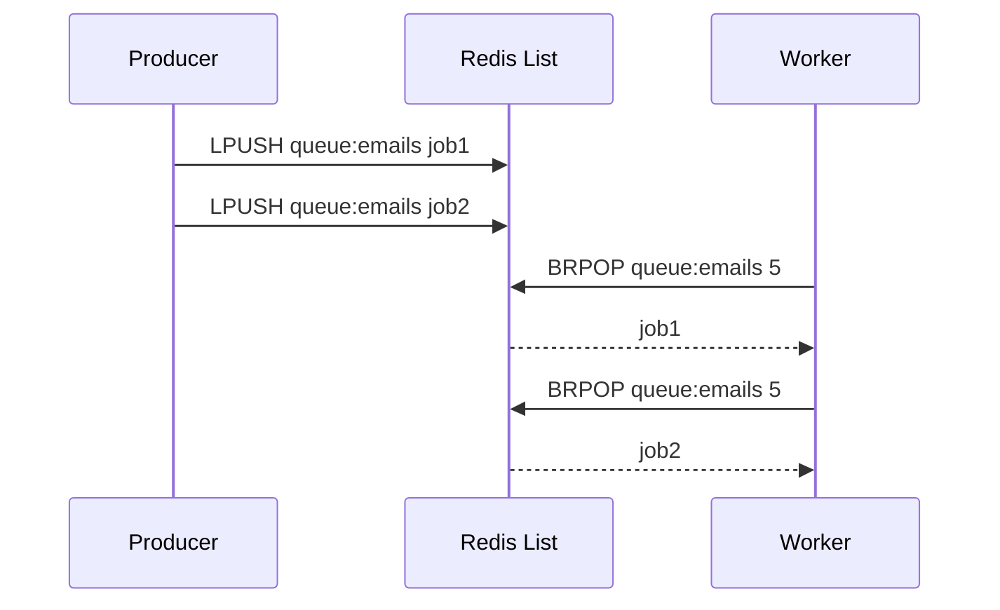
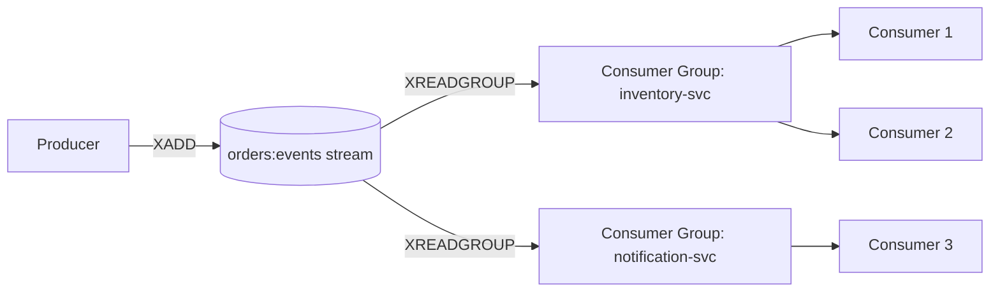

# Redis Data Types

## Theory

### Strings

The string type is Redis's most fundamental data structure: a binary-safe sequence of bytes up to 512MB, which means it can hold text, serialized JSON, images, or any binary payload. Strings support far more than simple get/set — Redis provides atomic increment/decrement (`INCR`, `INCRBY`, `INCRBYFLOAT`), atomic substring/append operations (`APPEND`, `GETRANGE`, `SETRANGE`), and bit-level operations (`SETBIT`, `GETBIT`, `BITCOUNT`) that are the foundation of the Bitmaps data type.

Strings are the natural fit for simple caching (serialized objects, HTML fragments), counters (page views, rate limits), distributed locks (`SET key value NX PX 30000`), and feature flags. Because `INCR`/`DECR` are atomic at the server level, they're a reliable building block for counters shared across many concurrent clients without any application-level locking.

```bash
SET session:abc123 '{"userId":42,"role":"admin"}' EX 1800
GET session:abc123

INCR page:views:home
INCRBY inventory:sku:1001 -5
INCRBYFLOAT wallet:user:7 12.50

# Atomic lock pattern
SET lock:order:987 "worker-1" NX PX 30000
```

```java
// Spring Data Redis - simple string operations
StringRedisTemplate redisTemplate = new StringRedisTemplate(connectionFactory);
redisTemplate.opsForValue().set("session:abc123", sessionJson, Duration.ofMinutes(30));
Long views = redisTemplate.opsForValue().increment("page:views:home");
```

### Hashes

Hashes store a mapping of field-value pairs under a single key, similar to a small object/dictionary. They are ideal for representing structured entities — a user profile, a product record, or a cart — without needing to serialize/deserialize the entire object just to read or update one field. Internally, small hashes are stored in a compact `listpack` encoding and automatically convert to a full hash table once they exceed `hash-max-listpack-entries` or `hash-max-listpack-value`.

Because individual fields can be read and written independently (`HGET`, `HSET`, `HINCRBY`, `HDEL`), hashes avoid the classic "read-modify-write whole blob" race condition that plagues storing a full JSON string for an entity that has frequently-updated sub-fields (e.g., incrementing a view counter on a product without touching its name/description).

```bash
HSET user:1000 name "Alice" email "alice@example.com" login_count 0
HINCRBY user:1000 login_count 1
HGET user:1000 email
HGETALL user:1000
HDEL user:1000 email
```

```java
HashOperations<String, String, String> hashOps = redisTemplate.opsForHash();
hashOps.put("user:1000", "name", "Alice");
hashOps.increment("user:1000", "login_count", 1);
Map<String, String> user = hashOps.entries("user:1000");
```

**Real-life scenario:** A shopping cart service stores each cart as a hash (`cart:{sessionId}`) with `productId -> quantity` field pairs, allowing individual line-item updates (`HINCRBY`) without reading/rewriting the entire cart.

### Lists

Lists are ordered collections of strings, implemented internally as a `listpack`/`quicklist` structure, supporting efficient push/pop operations at both ends (`LPUSH`/`RPUSH`, `LPOP`/`RPOP`) in O(1) time, plus blocking variants (`BLPOP`, `BRPOP`) that let a consumer wait efficiently for new items rather than polling. This makes lists a natural fit for queues, activity feeds, and simple message buffering.

A common production pattern is a work queue: producers `LPUSH` jobs onto a list, and one or more workers `BRPOP` to consume them in FIFO order, blocking (rather than busy-polling) until work arrives. For patterns needing guaranteed delivery/acknowledgment, Redis Streams (covered later) are generally preferred over plain lists, since a popped list item is gone the instant it's popped, with no re-delivery mechanism if the consumer crashes mid-processing.

```bash
LPUSH queue:emails '{"to":"a@example.com","template":"welcome"}'
BRPOP queue:emails 5
LRANGE queue:emails 0 -1
LLEN queue:emails
```

```java
ListOperations<String, String> listOps = redisTemplate.opsForList();
listOps.leftPush("queue:emails", jobJson);
String job = listOps.rightPop("queue:emails", Duration.ofSeconds(5));
```



### Sets

Sets are unordered collections of unique strings, supporting O(1) membership tests (`SISMEMBER`), additions/removals (`SADD`/`SREM`), and powerful set-algebra operations — union, intersection, and difference (`SUNION`, `SINTER`, `SDIFF`) — computed server-side without pulling data into the application.

Sets shine for tagging systems, deduplication, and relationship modeling: tracking unique visitors per day, tags associated with a blog post, or the mutual friends between two users via `SINTER`. Because set operations run inside Redis, they avoid transferring large collections over the network just to compute an intersection in application code.

```bash
SADD post:123:tags "redis" "caching" "backend"
SISMEMBER post:123:tags "redis"
SADD user:1:following "u2" "u3" "u4"
SADD user:2:following "u3" "u4" "u5"
SINTER user:1:following user:2:following      # mutual follows
SCARD post:123:tags
```

```java
SetOperations<String, String> setOps = redisTemplate.opsForSet();
setOps.add("post:123:tags", "redis", "caching", "backend");
Boolean isTagged = setOps.isMember("post:123:tags", "redis");
Set<String> mutual = redisTemplate.opsForSet().intersect("user:1:following", "user:2:following");
```

### Sorted Sets (ZSets)

Sorted sets combine the uniqueness guarantee of a set with an associated floating-point **score** per member, and Redis keeps members ordered by that score internally (via a skip list + hash table combination). This makes range queries by rank or by score (`ZRANGE`, `ZRANGEBYSCORE`, `ZRANK`) extremely fast — O(log N) for inserts and range lookups.

Sorted sets are the canonical Redis data structure for **leaderboards** (score = player points), **priority queues** (score = priority/timestamp), **rate limiting with sliding windows** (score = request timestamp, trimming old entries with `ZREMRANGEBYSCORE`), and **time-ordered indexes**. Their combination of uniqueness + ordering + O(log N) operations makes them one of the most powerful and heavily used Redis structures in real systems.

```bash
ZADD leaderboard 1500 "alice" 2200 "bob" 900 "carol"
ZREVRANGE leaderboard 0 2 WITHSCORES     # top 3, descending
ZRANK leaderboard "alice"
ZINCRBY leaderboard 50 "alice"
ZRANGEBYSCORE leaderboard 1000 2000

# Sliding-window rate limiter: keep only requests in the last 60s
ZADD rl:user:42 1690000000 "req-1"
ZREMRANGEBYSCORE rl:user:42 -inf (1690000000-60)
ZCARD rl:user:42
```

```java
ZSetOperations<String, String> zsetOps = redisTemplate.opsForZSet();
zsetOps.add("leaderboard", "alice", 1500);
zsetOps.incrementScore("leaderboard", "alice", 50);
Set<String> top3 = zsetOps.reverseRange("leaderboard", 0, 2);
```

### Bitmaps

Bitmaps aren't a distinct data type in Redis — they're an interpretation of the string type as a bit array, manipulated with bit-oriented commands (`SETBIT`, `GETBIT`, `BITCOUNT`, `BITOP`, `BITPOS`). Because a string can hold up to 512MB, a single bitmap key can represent up to roughly 4 billion bits, making bitmaps extraordinarily memory-efficient for tracking boolean state across huge populations — e.g., "did user N do X today" as one bit per user.

Classic use cases include daily active user tracking (one bit per user ID, one key per day), feature-flag rollouts, and real-time analytics where `BITOP AND`/`OR` across multiple daily bitmaps can answer questions like "how many users were active every day this week" in a single, extremely fast operation.

```bash
# Mark user 123 and 578 active today
SETBIT active:2026-08-02 123 1
SETBIT active:2026-08-02 578 1

# Count how many users were active today
BITCOUNT active:2026-08-02

# Users active both yesterday and today
BITOP AND active:both active:2026-08-01 active:2026-08-02
BITCOUNT active:both
```

### HyperLogLog

HyperLogLog (HLL) is a probabilistic data structure used to estimate the cardinality (count of unique elements) of a set using a fixed, tiny amount of memory — roughly 12KB regardless of whether the underlying set has thousands or billions of elements. It trades perfect accuracy for massive space savings: Redis's HLL implementation guarantees a standard error of about 0.81%.

This makes HLL perfect for approximate unique counting at scale where exact precision isn't required — unique visitors to a website per day, unique search queries, or unique IPs hitting an endpoint — problems that would otherwise require a full set (with memory proportional to the number of unique items) to solve exactly.

```bash
PFADD unique_visitors:2026-08-02 "user:1" "user:2" "user:3"
PFCOUNT unique_visitors:2026-08-02
PFADD unique_visitors:2026-08-03 "user:2" "user:4"
PFMERGE unique_visitors:week unique_visitors:2026-08-02 unique_visitors:2026-08-03
PFCOUNT unique_visitors:week
```

| Approach | Memory for 10M unique items | Accuracy |
|---|---|---|
| Redis Set | ~ hundreds of MB (proportional to cardinality) | Exact |
| HyperLogLog | ~12 KB (fixed) | ~0.81% standard error |

### Streams

Redis Streams (added in Redis 5.0) model an append-only log of entries, each with a unique, monotonically increasing ID (`<milliseconds>-<sequence>`), designed to emulate the semantics of systems like Kafka in a lightweight form. Unlike lists, entries are not removed on read by default — multiple independent consumers (or **consumer groups**) can read the same stream at their own pace, and consumer groups provide at-least-once delivery with explicit acknowledgment (`XACK`) and the ability to claim messages abandoned by a crashed consumer (`XCLAIM`/`XAUTOCLAIM`).

Streams are the right tool when you need durable, ordered event logs with multiple consumer groups, replay capability, and delivery guarantees — for example, an order-events stream consumed independently by an inventory service, a notification service, and an analytics pipeline, each tracking its own read position.

```bash
XADD orders:events '*' orderId 1001 status "CREATED"
XADD orders:events '*' orderId 1001 status "PAID"

XGROUP CREATE orders:events inventory-svc 0
XREADGROUP GROUP inventory-svc consumer-1 COUNT 10 STREAMS orders:events '>'
XACK orders:events inventory-svc 1690000000000-0

XLEN orders:events
XRANGE orders:events - +
```

```java
StreamOperations<String, Object, Object> streamOps = redisTemplate.opsForStream();
streamOps.add(StreamRecords.newRecord()
        .in("orders:events")
        .ofObject(Map.of("orderId", "1001", "status", "CREATED")));
```



### Geospatial Data

Redis's geospatial commands (`GEOADD`, `GEOSEARCH`, `GEODIST`, `GEOPOS`) let you store longitude/latitude coordinates and query them by proximity, all built on top of sorted sets under the hood (coordinates are encoded into a geohash-based score). This gives you "find all X within N kilometers of point P" queries without needing a separate specialized geospatial database for simple radius/location use cases.

Typical applications include store/restaurant locators ("find the 5 nearest coffee shops"), ride-sharing driver matching (nearest available drivers to a rider), and geofencing-style features, all served with Redis's usual low-latency guarantees.

```bash
GEOADD stores 13.361389 38.115556 "store:palermo"
GEOADD stores 15.087269 37.502669 "store:catania"

GEODIST stores store:palermo store:catania km

GEOSEARCH stores FROMLONLAT 15 37 BYRADIUS 200 km ASC WITHCOORD WITHDIST
```

```java
GeoOperations<String, String> geoOps = redisTemplate.opsForGeo();
geoOps.add("stores", new Point(13.361389, 38.115556), "store:palermo");
Distance distance = geoOps.distance("stores", "store:palermo", "store:catania", Metrics.KILOMETERS);
```

### Interview Questions

1. What Redis data types are you familiar with, and how would you decide which one fits a given problem? — Strings (simple values/counters/locks), hashes (structured entities with independently updated fields), lists (queues/feeds), sets (uniqueness/tagging/set algebra), sorted sets (leaderboards/ranked data), bitmaps (compact boolean flags per ID), HyperLogLog (approximate cardinality), streams (durable ordered event logs), and geospatial (location queries); the choice depends on whether you need ordering, uniqueness, scoring, field-level updates, or approximate counting at scale.
2. How is the string type used for atomic counters and distributed locks? — `INCR`/`INCRBY`/`INCRBYFLOAT` atomically increment a string interpreted as a number, giving a reliable counter shared across concurrent clients without application-level locking; distributed locks use `SET key value NX PX 30000`, which atomically sets the key only if it doesn't already exist and attaches an expiry so the lock self-releases if the holder crashes.
3. Why are hashes better than serialized JSON strings for entities with independently updated fields? — Hashes let you read/write individual fields directly (`HGET`, `HSET`, `HINCRBY`, `HDEL`) without touching the rest of the entity, avoiding the classic read-modify-write-whole-blob race condition that a serialized JSON string suffers from when multiple fields are updated concurrently or frequently.
4. What is the difference between a Redis list-based queue and a Redis Stream for job processing? — A list-based queue (`LPUSH`/`BRPOP`) removes an item the instant it's popped with no re-delivery mechanism if the consumer crashes mid-processing, whereas Redis Streams retain entries and support consumer groups with explicit acknowledgment (`XACK`) and reclaiming of abandoned messages (`XCLAIM`/`XAUTOCLAIM`), giving at-least-once delivery guarantees plain lists lack.
5. How would you compute mutual followers/friends between two users using Redis sets? — Store each user's follows/friends in a set (e.g., `user:1:following`, `user:2:following`) and run `SINTER user:1:following user:2:following`, which computes the intersection server-side without pulling either collection into the application.
6. Why are sorted sets the natural choice for implementing a leaderboard? — Sorted sets keep members ordered by an associated floating-point score via a skip list + hash table, giving O(log N) inserts/updates (`ZADD`, `ZINCRBY`) and O(log N) ranked range queries (`ZREVRANGE`, `ZRANK`), which directly matches a leaderboard's need to rank players by score and fetch top-N efficiently.
7. How would you implement a sliding-window rate limiter using a sorted set? — Add each request with its timestamp as the score (`ZADD rl:user:42 <timestamp> <req-id>`), then trim entries older than the window with `ZREMRANGEBYSCORE rl:user:42 -inf (now-60)`, and use `ZCARD` to count remaining requests in the current window to decide whether to allow or reject the new request.
8. What is a bitmap in Redis, and how is it different from a "real" data type like a set? — A bitmap isn't a distinct data type but an interpretation of the string type as a bit array manipulated with bit-oriented commands (`SETBIT`, `GETBIT`, `BITCOUNT`, `BITOP`); unlike a set, which stores each member as a distinct entry with per-member overhead, a bitmap represents membership as a single bit per possible ID, making it far more memory-efficient for tracking boolean state across huge populations.
9. How does HyperLogLog achieve constant memory usage, and what accuracy trade-off does it make? — HyperLogLog uses a probabilistic algorithm that estimates cardinality from the statistical distribution of hashed values rather than storing every unique element, using a fixed ~12KB regardless of set size, at the cost of an approximate count with a standard error of about 0.81%.
10. When would you choose HyperLogLog over a Set for counting unique items? — When you need approximate unique counts at scale (e.g., millions/billions of unique visitors or search queries) and exact precision isn't required, since a Set's memory grows proportionally with cardinality (potentially hundreds of MB) while HyperLogLog stays at a fixed ~12KB.
11. What delivery guarantees do Redis Streams provide that plain lists do not? — Streams support consumer groups with at-least-once delivery via explicit acknowledgment (`XACK`) and the ability to claim messages abandoned by a crashed consumer (`XCLAIM`/`XAUTOCLAIM`), and entries aren't removed on read so multiple independent consumer groups can replay the same stream at their own pace — none of which plain lists offer, since a popped list item is gone immediately with no re-delivery.
12. What is a consumer group in Redis Streams, and what problem does `XACK`/`XCLAIM` solve? — A consumer group (`XGROUP CREATE`) is a named cursor over a stream shared by multiple consumers, each tracking delivery independently of other groups; `XACK` marks an entry as successfully processed, and `XCLAIM`/`XAUTOCLAIM` let another consumer take over entries that were delivered but never acknowledged because their original consumer crashed.
13. How are Redis's geospatial commands implemented internally? — Geospatial commands (`GEOADD`, `GEOSEARCH`, `GEODIST`, `GEOPOS`) are built on top of sorted sets, encoding each longitude/latitude pair into a geohash-based score so that proximity queries can reuse the sorted set's ordered range-query machinery instead of needing a separate specialized geospatial engine.
14. What's the internal encoding difference between a small hash/list/set and a large one, and why does Redis switch representations? — Small collections use a compact `listpack` (or `intset` for small integer-only sets) encoding that minimizes per-element overhead; once a collection exceeds configured thresholds (e.g., `hash-max-listpack-entries`, `list-max-listpack-size`, `set-max-intset-entries`), Redis converts it to a more general structure (full hash table, quicklist, or hash-table-backed set) that scales better for large collections at the cost of higher per-element memory overhead.
15. Given a requirement to track daily active users across millions of accounts, which Redis data type(s) would you pick and why? — A bitmap (one bit per user ID, one key per day) is ideal if you need exact per-user activity and fast `BITCOUNT`/`BITOP` set-style aggregation across days at minimal memory; if only an approximate unique count is needed without per-user detail, HyperLogLog (`PFADD`/`PFCOUNT`/`PFMERGE`) uses even less memory at the cost of exactness.

