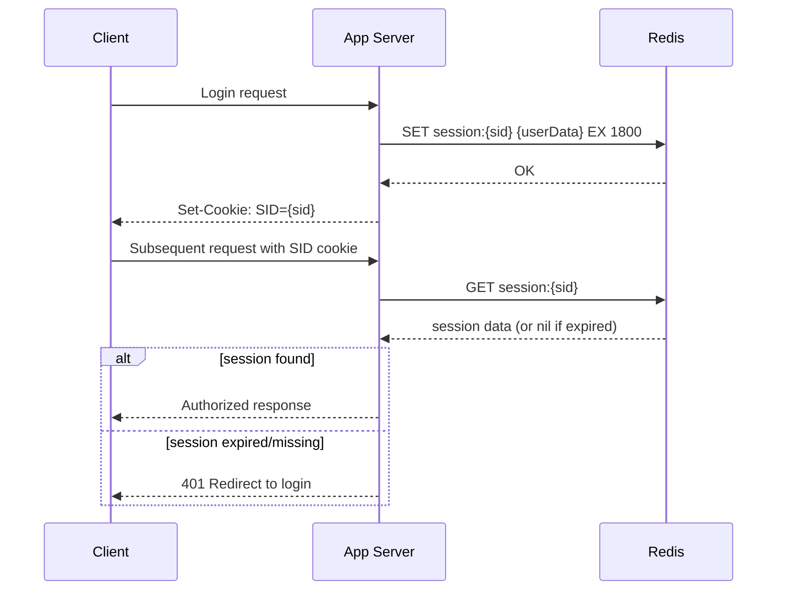
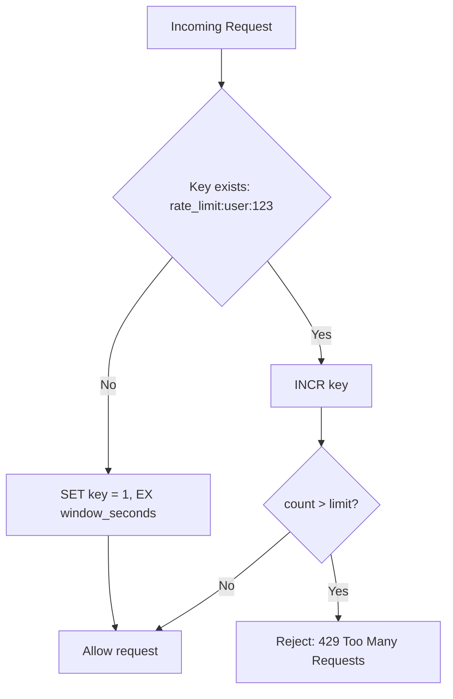
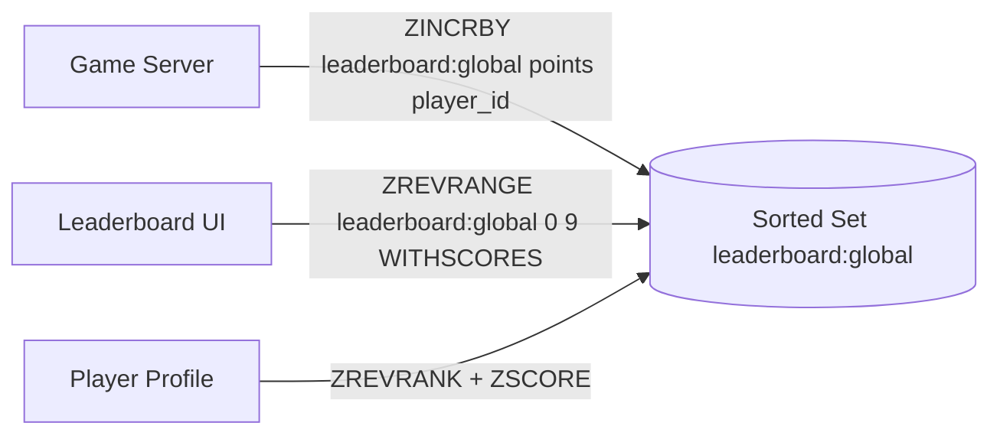
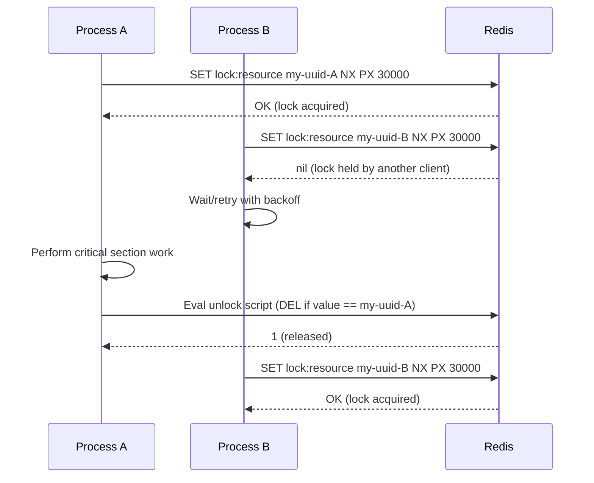
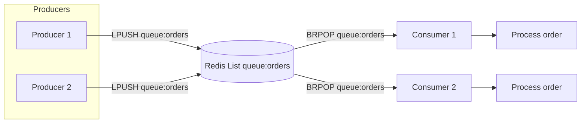
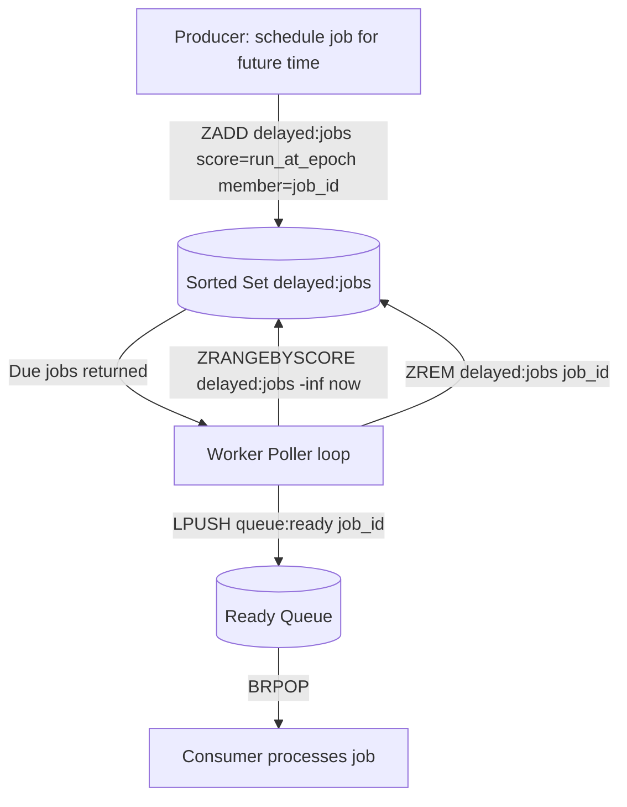

# Common Redis Design Patterns

## Theory

### Session Store

Storing HTTP session data in Redis is one of the most common Redis use cases in web applications, especially once an application scales beyond a single server instance and can no longer rely on in-memory (sticky) sessions. Redis is well suited to this because sessions are naturally key-value data (session ID → user/session payload), need very fast reads on nearly every request, and benefit from Redis's native `EXPIRE`/TTL support, which maps directly onto session timeout semantics without requiring a separate cleanup job.

A typical implementation stores the session as a `HASH` (for partial field updates like "last active timestamp") or as a serialized `STRING` (simpler, but requires rewriting the whole blob on any change), keyed by a random, unguessable session ID, with a TTL refreshed (`EXPIRE`) on each request to implement sliding-window expiration. In a Spring Boot application, this pattern is often used transparently via **Spring Session Data Redis**, which replaces the default in-memory `HttpSession` with a Redis-backed implementation with almost no code changes.

```bash
# Create/update a session with a 30-minute TTL
SET session:a1b2c3 '{"userId":1001,"roles":["USER"]}' EX 1800

# Refresh TTL on activity (sliding expiration)
EXPIRE session:a1b2c3 1800

# Retrieve and validate
GET session:a1b2c3
```



**Real-life scenario**: An e-commerce site running multiple stateless application instances behind a load balancer uses Redis-backed sessions so that a user's shopping cart and login state survive regardless of which instance handles a given request, enabling horizontal auto-scaling without sticky-session load balancer configuration.

### Distributed Cache

Redis's flagship use case is as a distributed, shared cache sitting in front of a slower system of record (typically a relational database), reducing database load and request latency by serving frequently-accessed data from memory. The core pattern is **cache-aside** (a.k.a. lazy loading): on a read, the application checks Redis first; on a miss, it reads from the database, then populates Redis with a TTL before returning the result. Writes typically invalidate or update the cache entry directly (write-through) or simply delete it and let the next read repopulate it (write-invalidate), depending on consistency requirements.

```java
// Cache-aside pattern with StringRedisTemplate + Jackson serialization
public Optional<Product> getProduct(String productId) {
    String cacheKey = "product:" + productId;
    String cached = redisTemplate.opsForValue().get(cacheKey);
    if (cached != null) {
        return Optional.of(objectMapper.readValue(cached, Product.class));
    }
    Product product = productRepository.findById(productId).orElse(null);
    if (product != null) {
        redisTemplate.opsForValue().set(cacheKey, objectMapper.writeValueAsString(product),
                Duration.ofMinutes(10));
    }
    return Optional.ofNullable(product);
}
```

In Spring Boot, this pattern is almost always implemented declaratively with the caching abstraction (`@Cacheable`, `@CacheEvict`) backed by a `RedisCacheManager`, rather than hand-written cache-aside logic (see the Spring Data Redis section for details). Key design decisions include TTL selection (balancing freshness against cache hit ratio), avoiding cache stampedes (many concurrent requests missing the cache simultaneously and hammering the database — mitigated with locks or request coalescing), and choosing an appropriate eviction policy at the Redis instance level.

**Real-life scenario**: A product catalog API caches product detail responses for 10 minutes, cutting database read load by over 90% during flash-sale traffic spikes, while accepting that a price change may take up to 10 minutes to become visible (an acceptable trade-off communicated to the business).

### Rate Limiter

A rate limiter restricts how many operations a client (user, IP, API key) can perform within a time window, protecting downstream systems from abuse or accidental overload. Redis is a natural fit because rate limiting requires a fast, atomic counter shared across all application instances — a per-instance in-memory counter would not work correctly behind a load balancer with multiple app servers.

The simplest implementation is the **fixed window counter**: `INCR` a key named for the current time bucket (e.g., `rate_limit:user:123:2026-08-02T10:15`) and set its TTL to the window length on first increment; if the counter exceeds the allowed limit, reject the request. This is simple and cheap but has a boundary problem — a burst right at the edge of two windows can allow up to 2x the intended rate. A **sliding window log** (storing timestamps in a sorted set and counting members within the trailing window via `ZREMRANGEBYSCORE` + `ZCARD`) or a **token bucket** implemented with a Lua script for atomicity are more precise alternatives.

```bash
# Fixed window counter (simple, has edge-boundary burst issue)
INCR rate_limit:user:123:window
EXPIRE rate_limit:user:123:window 60 NX  # only set TTL if not already set

# Sliding window log using a sorted set
ZADD rate_limit:user:123:log 1732550000123 "1732550000123"
ZREMRANGEBYSCORE rate_limit:user:123:log -inf (1732549940123
ZCARD rate_limit:user:123:log
```



```java
// Atomic fixed-window rate limiter using RedisTemplate + Lua for atomicity
private static final String SCRIPT =
    "local current = redis.call('INCR', KEYS[1]) " +
    "if current == 1 then redis.call('EXPIRE', KEYS[1], ARGV[1]) end " +
    "return current";

public boolean isAllowed(String userId, int limit, int windowSeconds) {
    DefaultRedisScript<Long> script = new DefaultRedisScript<>(SCRIPT, Long.class);
    Long count = redisTemplate.execute(script,
            List.of("rate_limit:" + userId), String.valueOf(windowSeconds));
    return count != null && count <= limit;
}
```

**Real-life scenario**: A public API gateway limits each API key to 1,000 requests per minute using Redis-backed counters shared across all gateway instances, returning `429 Too Many Requests` with a `Retry-After` header once the limit is exceeded.

### Leaderboard

Leaderboards rank entities (players, sellers, articles) by a numeric score and need to answer three query types efficiently: "what's in the top N," "what is this entity's rank," and "update this entity's score." Redis sorted sets (`ZSET`) satisfy all three natively in O(log N) time, which is why leaderboards are frequently cited as a textbook Redis use case.

```bash
ZADD leaderboard:global 4500 "player:12"
ZINCRBY leaderboard:global 150 "player:12"
ZREVRANGE leaderboard:global 0 9 WITHSCORES
ZREVRANK leaderboard:global "player:12"
```



```java
// Spring Data Redis: ZSetOperations for a leaderboard
ZSetOperations<String, String> zSetOps = redisTemplate.opsForZSet();
zSetOps.incrementScore("leaderboard:global", "player:12", 150);
Set<TypedTuple<String>> top10 = zSetOps.reverseRangeWithScores("leaderboard:global", 0, 9);
Long rank = zSetOps.reverseRank("leaderboard:global", "player:12");
```

**Real-life scenario**: A mobile game updates a player's score with `ZINCRBY` after every match and renders a "Top 100" screen with a single `ZREVRANGE` call, while also showing "players near you" using rank-relative range queries — all without touching the primary database.

### Distributed Lock

A distributed lock coordinates mutually-exclusive access to a shared resource across multiple processes/hosts — for example, ensuring only one instance of a scheduled job runs at a time in a horizontally-scaled deployment. Redis supports a simple, well-known locking pattern: `SET key value NX PX ttl`, which atomically sets the key only if it does not already exist (`NX`) and attaches an expiry (`PX`, in milliseconds) so the lock is automatically released even if the holder crashes without unlocking.

The lock **value** must be a unique token (e.g., a UUID) per lock holder, and releasing the lock must be done via a Lua script that checks the value matches before deleting — otherwise, a client could accidentally release a lock it no longer holds (e.g., after its own lock expired and was acquired by someone else). For higher-guarantee distributed locking across multiple independent Redis nodes, Redis's author proposed the **Redlock** algorithm, though it has known theoretical criticisms (notably from Martin Kleppmann) regarding clock-drift and process-pause assumptions, so it should be used only when the risk profile of a rare double-execution is acceptable, or combined with fencing tokens for true correctness.

```bash
# Acquire (atomic set-if-not-exists with TTL)
SET lock:resource:42 "process-uuid-A" NX PX 30000

# Release (must check ownership before deleting — via Lua for atomicity)
EVAL "if redis.call('get', KEYS[1]) == ARGV[1] then return redis.call('del', KEYS[1]) else return 0 end" 1 lock:resource:42 process-uuid-A
```



```java
// Spring Data Redis: acquiring a lock with SET NX PX semantics
Boolean acquired = redisTemplate.opsForValue()
        .setIfAbsent("lock:resource:42", lockToken, Duration.ofSeconds(30));

if (Boolean.TRUE.equals(acquired)) {
    try {
        // critical section
    } finally {
        redisTemplate.execute(unlockScript, List.of("lock:resource:42"), lockToken);
    }
}
```

**Real-life scenario**: A batch reconciliation job runs on every instance of a Spring Boot application deployed across three pods, but only one instance should actually perform the reconciliation each night; a Redis lock ensures exactly one pod wins and executes the job while the others detect the lock and skip.

### Message Queue

Redis can act as a lightweight message queue using `LPUSH`/`RPOP` (or `BRPOP` for blocking pops) on a `LIST`, giving simple FIFO producer/consumer semantics without needing a dedicated broker like Kafka or RabbitMQ. This pattern fits well for lower-throughput, best-effort workloads where the operational simplicity of reusing an existing Redis instance outweighs the need for advanced broker features (dead-letter queues, complex routing, exactly-once delivery).

```bash
# Producer pushes a job payload
LPUSH queue:orders '{"orderId":9001,"action":"process"}'

# Consumer blocks until a job is available (0 = block indefinitely)
BRPOP queue:orders 0
```



For workloads that need consumer groups, message replay, and at-least-once delivery guarantees with acknowledgment, **Redis Streams** (`XADD`, `XREADGROUP`, `XACK`, `XCLAIM`) are a significantly more robust choice than plain lists, since lists offer no concept of "in-flight but not yet acknowledged" messages — a crashed consumer using `BRPOP` simply loses the message it had popped.

```bash
# Streams-based queue with consumer groups (more robust than LIST)
XADD queue:orders * orderId 9001 action process
XGROUP CREATE queue:orders workers $ MKSTREAM
XREADGROUP GROUP workers consumer-1 COUNT 1 STREAMS queue:orders >
XACK queue:orders workers 1732550000000-0
```

**Real-life scenario**: A notification service pushes outbound email jobs onto a Redis list; a pool of worker processes uses `BRPOP` to pick up and send emails, decoupling the web request path from the (slower) email-sending call.

### Delayed Queue

A delayed queue schedules work to become visible/processable only after a specific future time — for example, "send a reminder email in 24 hours" or "retry this failed webhook in 5 minutes with exponential backoff." Redis models this elegantly with a sorted set where the score is the Unix timestamp at which the job should run: producers `ZADD` jobs with their target execution time, and a poller process periodically runs `ZRANGEBYSCORE` from negative infinity to "now" to find due jobs, atomically removes them (`ZREM`, or better, a Lua script combining the range-fetch and removal), and pushes them onto a regular ready-to-process queue (a `LIST`) for workers to consume.

```bash
# Schedule a job to run at a specific future Unix timestamp
ZADD delayed:jobs 1732553600 "job:reminder:1001"

# Poller: fetch due jobs (score <= now)
ZRANGEBYSCORE delayed:jobs -inf 1732550000

# Atomically move due jobs to the ready queue (Lua script recommended for atomicity)
ZREM delayed:jobs "job:reminder:1001"
LPUSH queue:ready "job:reminder:1001"
```



**Real-life scenario**: A payment retry system schedules a failed webhook delivery to retry after an exponentially increasing delay (1 min, 5 min, 30 min) using a delayed queue, avoiding both immediate re-hammering of a failing endpoint and the need for a separate cron-based retry scheduler.

### Job Queue

A job queue (background task queue) is a more general form of the message queue pattern, typically layered with additional features: job priorities, retries with backoff, dead-letter handling for permanently failed jobs, and visibility/progress tracking. Redis-backed job queue libraries (Sidekiq for Ruby, Bull/BullMQ for Node.js, Celery with a Redis broker for Python) build these semantics on top of Redis lists, sorted sets (for delayed/scheduled jobs and priority), and hashes (for job metadata/status), rather than reinventing them per application.

A common design combines several structures: a `LIST` for the ready queue, a sorted set for delayed/scheduled jobs (see Delayed Queue above), a `HASH` per job for status/metadata/result, and a separate "processing" list or set that a job is moved into while a worker holds it, enabling detection and recovery of jobs whose worker crashed mid-processing (a "reliable queue" pattern using `RPOPLPUSH`/`LMOVE`).

```bash
# Reliable queue pattern: atomically move a job from ready -> processing
RPOPLPUSH queue:ready queue:processing

# Worker finishes, removes it from the processing list
LREM queue:processing 1 "job:9001"

# Store job metadata/status alongside the queue
HSET job:9001 status "processing" attempts 1 started_at 1732550000
```

**Real-life scenario**: An image processing service enqueues thumbnail-generation jobs after every upload; a worker pool pulls jobs with `RPOPLPUSH` for crash-safe processing, tracks status in a per-job hash so the UI can poll for completion, and moves permanently failing jobs (after N retries) to a `failed:jobs` list for manual inspection.

### Real-Time Analytics

Redis's in-memory speed and atomic counter operations make it a strong fit for real-time analytics dashboards that need sub-second aggregation — page view counters, active-user tracking, funnel metrics — where a traditional OLAP/data-warehouse pipeline would introduce too much latency (minutes to hours) for the use case. Common building blocks include `INCR`/`HINCRBY` for simple counters, `PFADD`/`PFCOUNT` (HyperLogLog) for approximate unique-visitor counts at very low memory cost, `SETBIT`/`BITCOUNT` (bitmaps) for daily-active-user tracking, and sorted sets for "trending" rankings (e.g., most-viewed articles in the last hour, using time-decayed scores).

```bash
# Simple real-time counters
INCR page:views:2026-08-02
HINCRBY article:42:stats views 1

# Approximate unique visitors per day (constant ~12KB memory regardless of cardinality)
PFADD unique_visitors:2026-08-02 "user:1001"
PFCOUNT unique_visitors:2026-08-02

# Daily active users via bitmap (1 bit per user ID)
SETBIT dau:2026-08-02 1001 1
BITCOUNT dau:2026-08-02

# Trending content in the last hour using a time-decayed sorted set
ZINCRBY trending:articles 1 "article:42"
```

Because these structures live entirely in memory and are updated synchronously on the request path, real-time analytics built this way trades exact historical accuracy and long-term retention (better served by a proper analytics pipeline like Kafka + a data warehouse) for immediacy — Redis-based counters are usually periodically flushed/aggregated into a durable analytics store rather than kept indefinitely.

### Notification System

Redis Pub/Sub (`PUBLISH`/`SUBSCRIBE`) provides a simple fire-and-forget messaging mechanism well suited to real-time notification delivery — for example, pushing a "new message" event to whichever application server holds the WebSocket connection for a given user in a horizontally-scaled chat or notification service. Because Pub/Sub messages are not persisted (a subscriber that is offline when a message is published simply never receives it), it is appropriate for ephemeral, best-effort notifications, not for guaranteed delivery (Streams or a proper broker should be used when delivery guarantees matter).

```bash
# Publisher (e.g., after a new chat message is saved)
PUBLISH notifications:user:1001 '{"type":"new_message","from":"user:2002"}'

# Subscriber (each app server instance subscribes to channels for users connected to it)
SUBSCRIBE notifications:user:1001

# Pattern subscription across many channels
PSUBSCRIBE notifications:*
```

```java
// Spring Data Redis: publishing and subscribing
redisTemplate.convertAndSend("notifications:user:1001", payloadJson);

@Bean
RedisMessageListenerContainer container(RedisConnectionFactory cf, MessageListener listener) {
    RedisMessageListenerContainer container = new RedisMessageListenerContainer();
    container.setConnectionFactory(cf);
    container.addMessageListener(listener, new ChannelTopic("notifications:user:1001"));
    return container;
}
```

**Real-life scenario**: A chat application uses Pub/Sub so that when a user sends a message, any application server instance holding that recipient's active WebSocket connection receives the event and forwards it in real time, regardless of which instance the sender's request landed on.

### Counters and Atomic Counters

Many use cases boil down to a simple, high-concurrency counter — view counts, like counts, inventory stock levels, API usage quotas — and Redis's single-threaded command execution guarantees that `INCR`, `DECR`, `INCRBY`, and `HINCRBY` are atomic even under massive concurrent access, eliminating the classic read-modify-write race condition that plagues naive "read value, add one, write value back" implementations against a relational database without explicit locking.

```bash
# Atomic increment/decrement
INCR product:77:views
DECRBY inventory:77:stock 3
HINCRBY user:1001:stats login_count 1

# Conditional decrement pattern (e.g., inventory) needs a Lua script for atomicity
# since "check then decrement" is not itself atomic across two commands
EVAL "local stock = tonumber(redis.call('get', KEYS[1])) if stock >= tonumber(ARGV[1]) then return redis.call('decrby', KEYS[1], ARGV[1]) else return -1 end" 1 inventory:77:stock 3
```

```java
// Spring Data Redis atomic counter operations
redisTemplate.opsForValue().increment("product:77:views");
redisTemplate.opsForHash().increment("user:1001:stats", "login_count", 1);
```

The important nuance is that while a *single* command like `INCR` is atomic, a sequence of separate commands (e.g., `GET` then `SET`) is **not** atomic and is vulnerable to race conditions between concurrent clients; any "check-then-act" counter logic (like conditional stock decrements) must be wrapped in a Lua script or a `WATCH`/`MULTI`/`EXEC` transaction to remain correct under concurrency.

### Interview Questions

1. How would you design a Redis-backed session store, and what TTL strategy would you use? — Store each session as a `HASH` keyed by session ID (`session:{id}`) holding user attributes, and set a TTL matching the desired session timeout; use a sliding-expiration strategy by refreshing the TTL (`EXPIRE`) on every active request so idle sessions expire naturally while active ones stay alive.
2. What is the cache-aside pattern, and how does it differ from write-through caching? — In cache-aside, the application reads from the cache first, and on a miss reads from the database and populates the cache itself; in write-through, every write goes through the cache layer, which immediately writes to the underlying store, keeping the cache always in sync at the cost of write latency, whereas cache-aside only updates the cache lazily on reads (or invalidates it on writes).
3. How do you prevent a cache stampede when a popular key expires under high concurrent load? — Common mitigations include using a distributed lock (`SET NX`) so only one client recomputes the value while others wait or serve stale data, adding jitter to TTLs so keys don't all expire simultaneously, and using a "logical expiration" pattern where the value carries its own expiry timestamp and is refreshed slightly before the hard TTL by a background process.
4. How would you implement a rate limiter in Redis, and what's the difference between a fixed window and a sliding window approach? — A fixed-window limiter uses `INCR` on a key scoped to the current time bucket (e.g., `rate:{user}:{minute}`) with a TTL equal to the window, which is simple but allows bursts at window boundaries; a sliding-window limiter (e.g., using a sorted set of timestamps trimmed with `ZREMRANGEBYSCORE`, or the sliding-window-log/counter algorithm) tracks requests continuously, giving smoother, more accurate rate enforcement at the cost of slightly more complexity.
5. Why are Redis sorted sets an ideal fit for leaderboards, and what is the time complexity of the key operations? — ZSETs maintain members ordered by score automatically, so `ZADD`/`ZINCRBY` update rankings in O(log N) and `ZREVRANGE`/`ZREVRANK`/`ZSCORE` retrieve top-N lists or a specific player's rank in O(log N + M), avoiding the need to sort the whole dataset on every read.
6. How does the `SET NX PX` pattern implement a distributed lock, and why must the unlock operation check ownership atomically? — `SET lock:resource token NX PX 5000` atomically acquires the lock only if it doesn't already exist and sets a TTL as a safety net against a crashed holder; the unlock must verify the stored token matches the caller's own token (typically via a Lua script combining `GET`+`DEL`) so a client never releases a lock it doesn't hold, which could happen if its own lock had already expired and been reacquired by another client.
7. What are the known weaknesses of the Redlock algorithm, and when would you still choose to use it? — Redlock has been criticized (notably by Martin Kleppmann) for relying on system clocks and timing assumptions that can be violated by GC pauses, clock drift, or network delays, potentially allowing two clients to believe they hold the same lock simultaneously; it's still a reasonable choice for efficiency-oriented locking (avoiding duplicate work) where an occasional double-execution is tolerable, but not for correctness-critical locking where safety must be guaranteed.
8. How would you build a message queue using Redis lists versus using Redis Streams, and when would you prefer Streams? — A list-based queue uses `LPUSH`/`BRPOP` for simple FIFO producer/consumer semantics but offers no concept of an in-flight, unacknowledged message, so a crashed consumer simply loses the item it popped; Streams (`XADD`/`XREADGROUP`/`XACK`/`XCLAIM`) add consumer groups, message IDs, and acknowledgment, making them the better choice whenever at-least-once delivery or replay is required.
9. How do you implement a delayed/scheduled job queue using Redis, and what structure holds the "not yet due" jobs? — Jobs are scheduled with `ZADD delayed:jobs <run_at_epoch> <job_id>` on a sorted set, where the score is the future execution timestamp; a poller periodically runs `ZRANGEBYSCORE delayed:jobs -inf now`, atomically removes due jobs, and pushes them onto a ready `LIST` for workers to consume via `BRPOP`.
10. What is the "reliable queue" pattern (`RPOPLPUSH`/`LMOVE`), and what failure mode does it protect against? — Instead of a plain `RPOP`, a worker atomically moves a job from the ready queue into a separate "processing" list with `RPOPLPUSH`/`LMOVE`, so if the worker crashes mid-processing, the job remains visible in the processing list and can be detected/re-queued by a recovery process, protecting against silent job loss on worker failure.
11. How would you use HyperLogLog or bitmaps to implement real-time analytics counters at scale? — HyperLogLog (`PFADD`/`PFCOUNT`) estimates unique-visitor cardinality within roughly 0.81% error using only about 12KB of memory regardless of how many elements are added, making it ideal for approximate unique counts at massive scale; bitmaps (`SETBIT`/`BITCOUNT`) compactly track per-user boolean flags such as daily-active-user status, using a single bit per user ID.
12. What are the delivery guarantees (or lack thereof) of Redis Pub/Sub, and when is it inappropriate to use? — Pub/Sub is fire-and-forget with no persistence: a subscriber that is offline or disconnected when a message is published simply never receives it, and there is no replay or acknowledgment mechanism; it's inappropriate whenever guaranteed or at-least-once delivery is required, in which case Redis Streams or a dedicated broker should be used instead.
13. Why is a single Redis command like `INCR` atomic, but a `GET`-then-`SET` sequence is not — and how do you make the latter atomic? — Redis executes each individual command atomically because of its single-threaded command loop, but a `GET` followed by a separate `SET` involves a gap between the two round trips where another client can interleave a write, causing a lost update; making it atomic requires either a single native command (`INCR`), a Lua script (`EVAL`), or a `WATCH`/`MULTI`/`EXEC` transaction that aborts if the watched key changed.
14. How would you design an inventory decrement operation in Redis so it never goes negative under concurrent requests? — Use a Lua script (`EVAL`) that atomically checks the current stock value and only performs the `DECRBY` if sufficient stock remains, returning a sentinel (e.g., -1) otherwise, since the check-then-decrement logic must run as a single atomic server-side operation to avoid a race between concurrent requests both passing the check before either decrements.
15. What are the trade-offs of using Redis as a message/job queue compared to a dedicated broker like Kafka or RabbitMQ? — Redis offers operational simplicity (reusing infrastructure you likely already run) and low latency for lower-throughput, best-effort workloads, but lacks the advanced routing, exactly-once semantics, long-term log retention, and horizontal partitioning that dedicated brokers like Kafka (high-throughput event streaming) or RabbitMQ (complex routing, dead-letter queues) provide out of the box.

