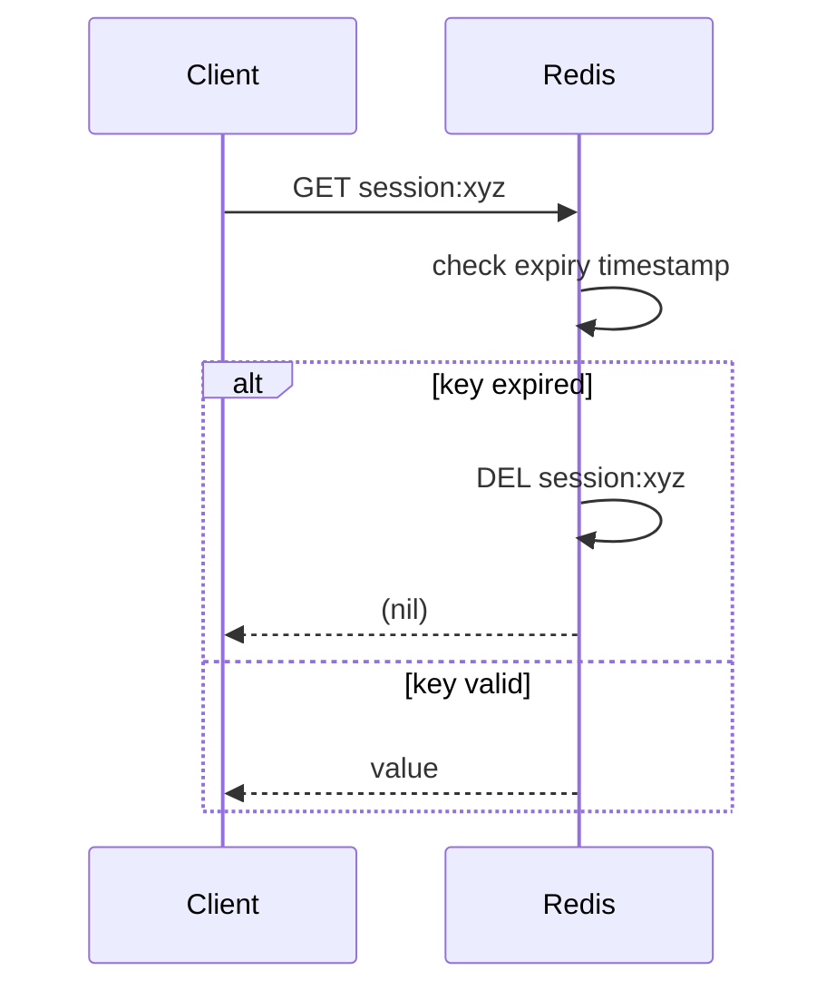
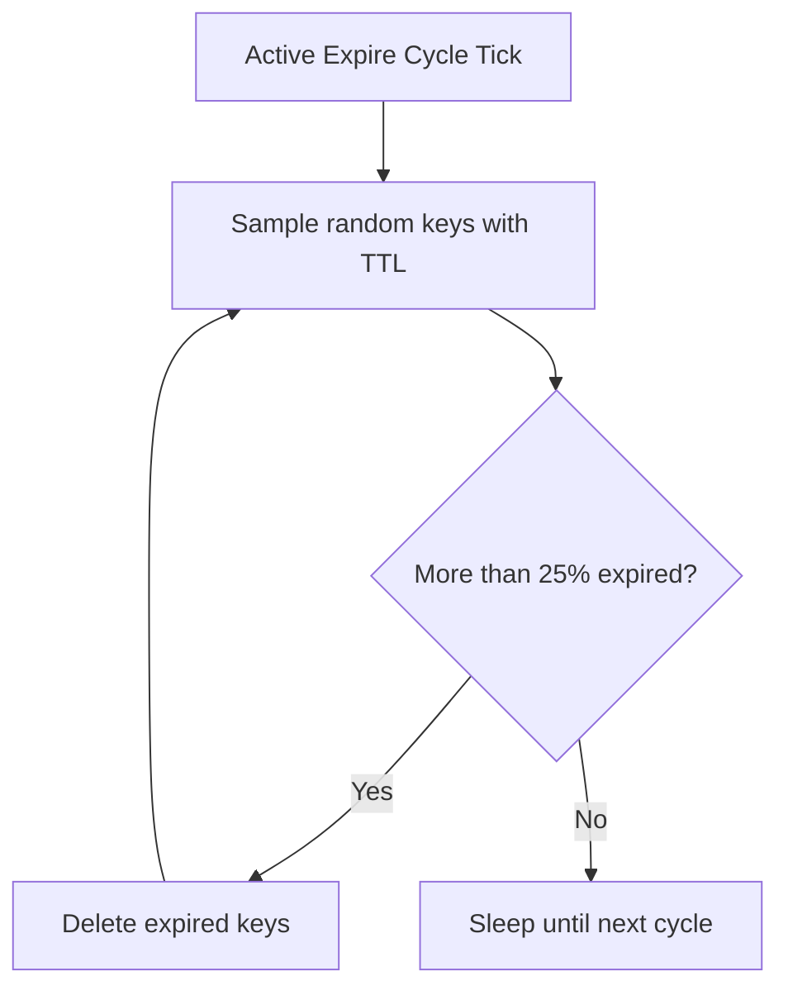

# Expiration and Eviction

## Theory

### TTL

TTL (Time To Live) is the mechanism Redis uses to track how much longer a key will remain in the keyspace before it is automatically removed. Every key can optionally carry an expiration timestamp, stored internally as an absolute Unix time in milliseconds. When a key has no expiration set, it lives forever (or until explicitly deleted), and Redis reports this as a TTL of `-1`. If the key does not exist at all, Redis reports `-2`.

The `TTL` command returns the remaining time to live in seconds, while `PTTL` returns the same information in milliseconds for higher precision. These commands are read-only and non-destructive — checking a key's TTL does not affect it in any way. This is heavily used by applications to decide whether to refresh a cache entry, extend a session, or simply to expose debugging/observability information about cache freshness.

```bash
# Set a key with a 60 second expiration
SET session:abc123 "user-data" EX 60

# Check remaining TTL in seconds
TTL session:abc123
# -> (integer) 57

# Check remaining TTL in milliseconds
PTTL session:abc123
# -> (integer) 56732

# A key with no expiration
SET config:flag "on"
TTL config:flag
# -> (integer) -1

# A key that does not exist
TTL nonexistent:key
# -> (integer) -2
```

**Production scenario:** In session-management systems, TTL is checked before renewing a user's session to decide whether a "sliding expiration" should be applied (extend it) or whether the session is close to expiry and the user should be prompted to re-authenticate soon.

### Expire

The `EXPIRE` family of commands sets or updates a key's time-to-live. `EXPIRE key seconds` sets a relative expiration in seconds, `PEXPIRE key milliseconds` does the same in milliseconds, and `EXPIREAT` / `PEXPIREAT` set an absolute Unix timestamp instead of a relative duration. Since Redis 7.0, these commands also accept optional flags — `NX` (set expiry only if the key has no TTL), `XX` (set expiry only if the key already has a TTL), `GT` (set only if the new expiry is greater than the current one), and `LT` (set only if the new expiry is less than the current one).

Any write command that overwrites a key's value (e.g. `SET` without `KEEPTTL`) removes its existing TTL by default. This is a common source of bugs: developers set a TTL on a cache key, then later update the value with a plain `SET`, unintentionally making the key persist forever. Using `SET key value KEEPTTL` or reapplying `EXPIRE` after every write avoids this.

```bash
# Set expiration to 120 seconds from now
EXPIRE user:1001:cart 120

# Only apply if the key currently has no TTL
EXPIRE user:1001:cart 300 NX

# Only extend the TTL if the new one is greater (sliding expiration pattern)
EXPIRE user:1001:cart 600 GT

# Set an absolute expiration timestamp (Unix epoch seconds)
EXPIREAT report:daily 1893456000

# Update the value but keep the existing TTL
SET user:1001:cart "{...}" KEEPTTL
```

**Real-life use case:** Rate limiters commonly use `EXPIRE ... NX` to set a window's expiry only on the very first increment, ensuring the counter resets cleanly every fixed window without accidentally resetting the TTL on every subsequent request.

### Persist

`PERSIST` removes any existing expiration from a key, converting it back into a permanent key that will never expire until explicitly deleted. It returns `1` if a TTL was removed, and `0` if the key had no TTL (or didn't exist) to begin with.

This is the inverse operation of `EXPIRE`, and it's important in workflows where a temporary object needs to be "promoted" to permanent status — for example, a shopping cart that is normally cleaned up after 24 hours of inactivity but should stop expiring once the order is confirmed and moved into a "completed" state, or a temporary lock/token that becomes a long-lived record.

```bash
SET promo:code:XYZ "10-percent-off" EX 3600
TTL promo:code:XYZ
# -> (integer) 3598

PERSIST promo:code:XYZ
# -> (integer) 1

TTL promo:code:XYZ
# -> (integer) -1   (no longer expires)
```

### Passive Expiration

Passive (lazy) expiration means Redis does not proactively scan for and remove expired keys as its primary mechanism. Instead, whenever a client accesses a key (via `GET`, `EXISTS`, or virtually any read/write command), Redis first checks if the key has an expiration timestamp in the past. If so, the key is deleted on the spot before the command proceeds, and the client sees the equivalent of the key not existing.

This lazy check is cheap and only pays the cost of expiration when a key is actually touched. The downside is that a key which is set to expire but never read again would sit in memory indefinitely if passive expiration were the *only* mechanism — which is why Redis combines it with active expiration (below).



### Active Expiration

Because passive expiration alone would let unread expired keys linger in memory forever, Redis also runs an active expiration cycle in the background. By default, Redis runs this cycle 10 times per second (configurable via the `hz` directive in `redis.conf`). On each cycle, Redis randomly samples a set of keys from the keys that have a TTL set, checks how many are expired, and deletes them.

The algorithm is adaptive: if more than 25% of the sampled keys were found expired, Redis immediately repeats the sampling process (without waiting for the next cycle) since it assumes there are likely more expired keys to clean up. This keeps CPU usage low during normal conditions but ramps up cleanup effort proportionally to how many keys are actually expiring, preventing large backlogs of dead keys from accumulating.

```conf
# redis.conf
# Frequency of internal background tasks, including active expire cycle
hz 10
```



**Production note:** On replicas, active expiration does *not* delete keys directly — replicas wait for the master to send an explicit `DEL`/`UNLINK` for the expired key, to keep master and replica data consistent (avoiding split-brain interpretations of "now").

### Eviction Strategies

When Redis is used as a cache and memory is bounded via `maxmemory`, expiration alone isn't enough to keep memory in check — new writes can arrive faster than TTLs naturally clear space. Eviction strategies decide what Redis does when memory is full and a new write needs room. Configured via `maxmemory-policy`, the main strategies are:

| Policy | Behavior |
|---|---|
| `noeviction` | Returns errors for write commands once memory limit is reached; reads still work |
| `allkeys-lru` | Evicts the least-recently-used key across the entire keyspace |
| `volatile-lru` | Evicts the least-recently-used key, but only among keys that have a TTL set |
| `allkeys-lfu` | Evicts the least-frequently-used key across the entire keyspace |
| `volatile-lfu` | Evicts the least-frequently-used key, but only among keys with a TTL |
| `allkeys-random` | Evicts a random key from the entire keyspace |
| `volatile-random` | Evicts a random key, but only among keys with a TTL |
| `volatile-ttl` | Evicts the key with the nearest expiration time first |

```conf
# redis.conf
maxmemory 2gb
maxmemory-policy allkeys-lru
```

**Choosing a policy:**

- Use `allkeys-lru` for a pure cache where every key is disposable and recency of access predicts future access.
- Use `volatile-lru` or `volatile-ttl` when the same instance mixes permanent, critical data (no TTL) with disposable cached data (TTL set) — this protects permanent keys from ever being evicted.
- Use `noeviction` for primary data stores where losing data silently is unacceptable and you'd rather get `OOM` errors and alert on them.

**Real-life scenario:** An e-commerce product catalog cache uses `volatile-lru` so that permanent configuration keys (no TTL) are never evicted, while product detail cache entries (with a 1-hour TTL) are evicted least-recently-used-first when memory pressure hits.

### Interview Questions

- What is the difference between `TTL` and `PTTL`, and what do the special return values `-1` and `-2` mean? — `TTL` returns the remaining time-to-live in seconds while `PTTL` returns it in milliseconds; both return `-1` if the key exists but has no expiration set, and `-2` if the key doesn't exist at all.
- How does `EXPIRE` behave when combined with the `NX`, `XX`, `GT`, and `LT` flags? — `NX` sets the expiry only if the key currently has no TTL, `XX` only if it already has a TTL, `GT` only if the new expiry is greater than the current one, and `LT` only if the new expiry is less than the current one — these let you conditionally adjust TTLs (e.g., sliding expiration) without accidentally shortening or overwriting an unrelated expiry.
- Why does a plain `SET` remove an existing key's TTL, and how do you avoid that? — `SET` without `KEEPTTL` overwrites the entire key including its metadata, so any existing expiration is discarded by default, unintentionally making the key persist forever; using `SET key value KEEPTTL` or reapplying `EXPIRE` after every write preserves the original TTL.
- What does `PERSIST` do, and when would you use it in a real application? — `PERSIST` removes any existing expiration from a key, converting it back into a permanent key (returning `1` if a TTL was removed, `0` if there was none); it's used to "promote" a temporary object to permanent status, such as a shopping cart that should stop expiring once an order is confirmed.
- Explain the difference between passive (lazy) and active expiration in Redis. — Passive expiration checks and deletes a key only when it's actually accessed, at which point Redis notices the TTL has passed and removes it before the command proceeds; active expiration is a background cycle (default 10 times/second via `hz`) that randomly samples keys with TTLs and proactively deletes any that have expired, even if never accessed again.
- Why isn't passive expiration alone sufficient to reclaim memory from expired keys? — A key that's set to expire but never read again would sit in memory indefinitely under passive expiration alone, since nothing ever triggers the lazy check; the active expiration cycle is needed to reclaim memory from expired-but-unaccessed keys.
- How does the active expiration cycle decide how aggressively to run, and what role does `hz` play? — `hz` (default 10) controls how many times per second the active expire cycle runs; the algorithm is adaptive — if more than 25% of a sampled batch of TTL'd keys are found expired, Redis immediately repeats the sampling without waiting for the next cycle, ramping up cleanup effort proportionally to how many keys are actually expiring.
- Why do replicas not delete expired keys on their own, and how do they find out a key expired? — Replicas wait for the master to send an explicit `DEL`/`UNLINK` for an expired key rather than deleting it independently, avoiding split-brain interpretations of "now" between master and replica clocks and keeping master/replica data consistent.
- List and explain the eviction policies available via `maxmemory-policy`. — `noeviction` rejects writes once full; `allkeys-lru`/`volatile-lru` evict the least recently used key from all keys or only TTL'd keys; `allkeys-lfu`/`volatile-lfu` evict the least frequently used key from all keys or only TTL'd keys; `allkeys-random`/`volatile-random` evict a random key from all keys or only TTL'd keys; `volatile-ttl` evicts the key with the nearest expiration time first.
- What is the difference between `allkeys-lru` and `volatile-lru`? — `allkeys-lru` considers every key in the keyspace as eligible for eviction regardless of whether it has a TTL, while `volatile-lru` restricts eviction candidates to only keys that have an expiration set, leaving permanent (no-TTL) keys untouched.
- What happens to write commands when `maxmemory` is reached and the policy is `noeviction`? — Write commands are rejected with an out-of-memory error while reads continue to work normally, since `noeviction` evicts nothing and simply refuses further writes once the memory limit is reached.
- How would you choose between LRU and LFU eviction for a given workload? — Choose LRU for bursty, time-clustered access patterns where recency predicts future access; choose LFU for workloads with steady, frequently-hit "hot" keys that may have irregular gaps between accesses, since pure LRU could mistakenly evict a frequently-used key just because it wasn't the most recent access.
- What is `volatile-ttl` eviction and in what scenario is it a better choice than `volatile-lru`? — `volatile-ttl` evicts the key with the nearest expiration time first among keys with a TTL, which is preferable when you want eviction to align with keys that were already about to expire soon anyway, rather than picking based on access recency/frequency — minimizing surprise by evicting what would have disappeared shortly regardless.
- How does Redis approximate LRU internally instead of maintaining a perfectly ordered access list? — Each object stores a 24-bit "last access" clock value updated on touch; rather than maintaining a true globally-ordered access list, Redis randomly samples a small pool of keys (`maxmemory-samples`, default 5) at eviction time and evicts whichever sampled key has the oldest access time, trading perfect accuracy for much lower CPU/memory overhead.
- What are the risks of using `allkeys-random` in production? — `allkeys-random` evicts keys with no regard for recency or frequency of access, so it can evict a genuinely hot, frequently-accessed key just as readily as a cold one, causing unpredictable cache-miss spikes on data that LRU/LFU policies would have correctly protected.

