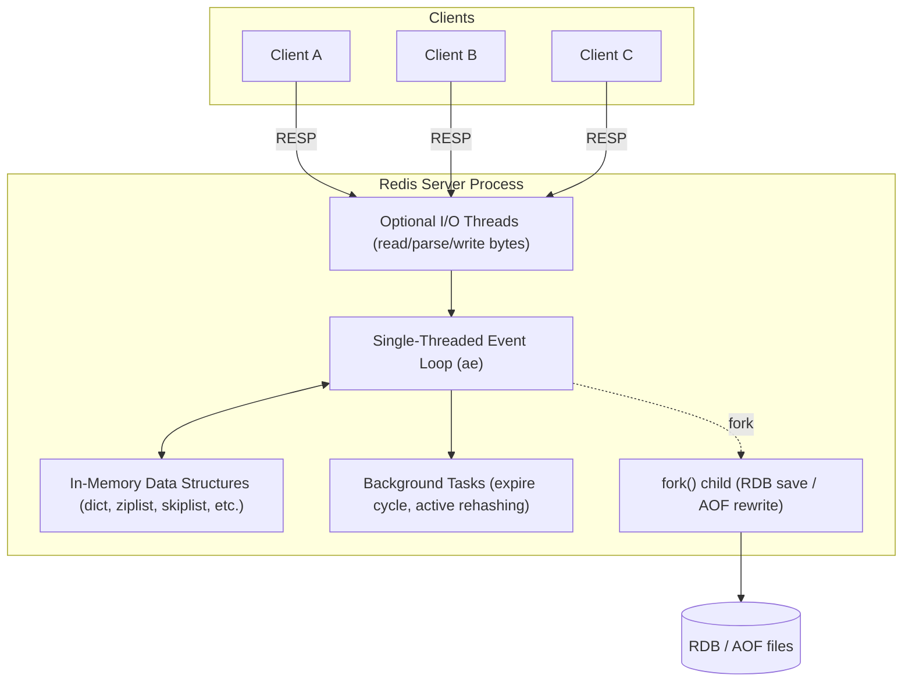
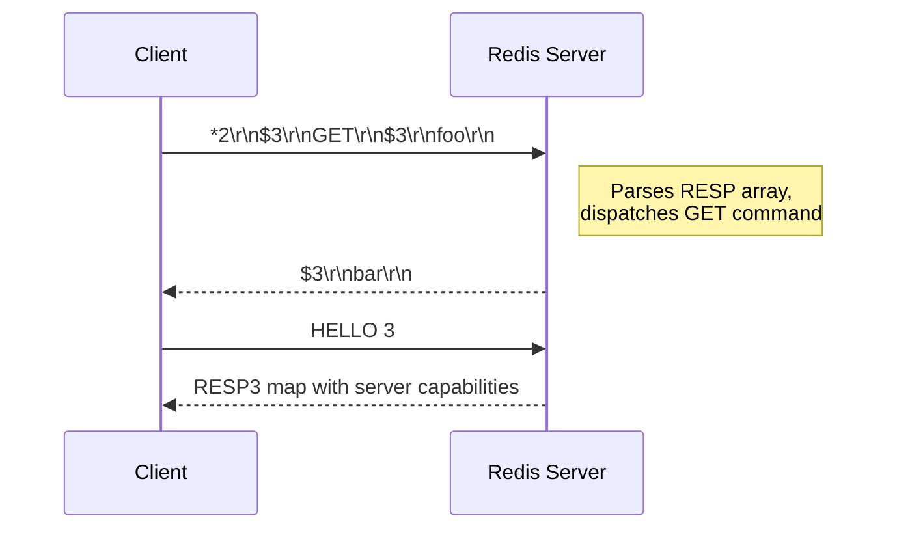

# Redis Fundamentals

## Theory

### What is Redis?

Redis (**RE**mote **DI**ctionary **S**erver) is an open-source, in-memory data structure store that can be used as a database, cache, message broker, and streaming engine. Unlike traditional relational databases that store data on disk and organize it into tables and rows, Redis keeps its entire dataset in RAM and exposes it through a small set of rich data structures — strings, hashes, lists, sets, sorted sets, streams, bitmaps, and more. Because memory access is orders of magnitude faster than disk I/O, Redis can serve millions of operations per second with sub-millisecond latency on modest hardware.

Redis was originally created by Salvatore Sanfilippo in 2009 to solve a real scaling problem for his startup, and it has since become one of the most widely deployed pieces of infrastructure in modern backend systems. It is commonly placed in front of a primary datastore (like PostgreSQL or MySQL) to absorb read traffic, but it is equally capable of acting as a standalone system of record when durability is configured correctly via RDB/AOF persistence. Its single-threaded command execution model (for the core data commands) means that every command is atomic by default, which removes an entire class of concurrency bugs that plague multi-threaded caches.

Redis (Remote Dictionary Server) is an open source, in-memory, NoSQL key/value store that is used primarily as an application cache or quick-response database.

```bash
# Connect to a local Redis instance and check it's alive
redis-cli PING
# PONG

redis-cli SET greeting "hello redis"
# OK
redis-cli GET greeting
# "hello redis"
```

**Real-life scenario:** An e-commerce checkout service stores shopping cart contents in Redis hashes keyed by session ID, so cart reads/writes never touch the relational database during the browsing phase, and the cart is only persisted to the SQL database when the order is finalized.

### In-Memory Data Store

Being an in-memory data store means Redis keeps the working dataset resident in RAM rather than reading it from disk on every access. This is the core architectural decision that gives Redis its performance characteristics: a `GET` on a string key is essentially a hash table lookup in process memory, taking microseconds, compared to disk-backed databases where a cache miss can mean a multi-millisecond seek even on SSDs.

The trade-off is cost and capacity — RAM is more expensive per gigabyte than disk, and the dataset size is bounded by available memory (or by the `maxmemory` setting combined with an eviction policy). To mitigate durability concerns that come with volatile memory, Redis offers optional persistence layers (RDB snapshots and AOF logs) that write to disk asynchronously, so a restart or crash doesn't necessarily mean total data loss. Redis also supports replication so that a copy of the in-memory dataset lives on multiple nodes, further protecting against a single point of failure.

```bash
# Inspect how much memory the dataset is currently using
redis-cli INFO memory | grep used_memory_human
# used_memory_human:1.23M
```

| Aspect | In-Memory (Redis) | Disk-Based (traditional RDBMS) |
|---|---|---|
| Typical latency | Microseconds | Single-digit to double-digit milliseconds |
| Durability | Optional, via RDB/AOF | Durable by default (WAL, fsync) |
| Cost per GB | Higher (RAM) | Lower (disk/SSD) |
| Max practical dataset size | Bound by RAM | Bound by disk capacity |

### Redis Architecture

Redis follows a **single-threaded event loop** architecture for command processing, built around a multiplexed I/O model (historically based on `epoll`/`kqueue`/`select` depending on OS, exposed via the internal `ae` event library). A single main thread accepts client connections, reads commands, executes them against the in-memory dataset, and writes responses — all sequentially. This design avoids the need for locks around data structures, so every command that touches the keyspace is inherently atomic.

Since Redis 4.0, some expensive operations (like freeing large objects via `UNLINK`, or lazy-freeing on `FLUSHALL ASYNC`) can happen on background threads, and Redis 6.0+ added an optional **I/O threading** model that parallelizes reading/parsing/writing bytes on the socket (not command execution) to reduce the cost of network I/O for very high-throughput workloads. Redis also runs background processes for tasks like RDB snapshotting (`fork()`-based) and expiration/eviction sweeps. In a production deployment, the architecture typically expands beyond a single node into a **primary-replica** topology for read scaling and failover, coordinated by **Redis Sentinel**, or a **Redis Cluster** for horizontal sharding across multiple primaries.



**Real-life scenario:** Because command execution is single-threaded, teams must watch out for long-running commands like `KEYS *` or unbounded `SORT` on a large collection blocking the entire server for all clients — this is why `SCAN` and command-level time budgeting are emphasized in production Redis usage.

### Redis Use Cases

Redis's versatility comes from combining raw speed with purpose-built data structures, which makes it suitable for far more than "just a cache." Common production use cases include: **caching** (database query results, HTML fragments, computed API responses), **session storage** (web session state shared across stateless app server instances), **rate limiting** (using `INCR` with `EXPIRE`, or the sliding-window pattern with sorted sets), **leaderboards** (sorted sets ranked by score), **pub/sub messaging** (real-time notifications, chat fan-out), **job queues** (lists with `LPUSH`/`BRPOP`), **distributed locks** (via `SET key value NX PX`), and **real-time analytics** (HyperLogLog for unique counts, bitmaps for feature flags/activity tracking).

In a typical Spring Boot microservices architecture, Redis is frequently wired in through Spring Data Redis for declarative caching (`@Cacheable`), through Spring Session for centralized HTTP session management across horizontally scaled instances, and through Lettuce/Jedis clients for direct data-structure manipulation such as rate limiters or leaderboards.

```java
// Spring Boot: declarative caching backed by Redis
@Service
public class ProductService {

    @Cacheable(value = "products", key = "#productId")
    public Product getProduct(String productId) {
        return productRepository.findById(productId)
                .orElseThrow(() -> new ProductNotFoundException(productId));
    }
}
```

```bash
# Simple fixed-window rate limiter using INCR + EXPIRE
redis-cli INCR "rate_limit:user:42"
redis-cli EXPIRE "rate_limit:user:42" 60
```

### Redis vs Traditional Databases

Traditional relational databases (PostgreSQL, MySQL, Oracle) are designed around durable, disk-based storage with strong ACID guarantees, rich query languages (SQL), joins, and complex transactional semantics. Redis, by contrast, is a data-structure server optimized for speed and simplicity: it has no query planner, no joins, and a limited (though growing) notion of transactions via `MULTI`/`EXEC`. It trades relational query expressiveness for raw throughput and predictable low-latency operations on well-known access patterns.

This does not mean Redis is "worse" — it means Redis and an RDBMS solve different problems and are usually deployed together. The RDBMS remains the system of record for complex, relational, durable business data, while Redis accelerates read-heavy or latency-sensitive paths, handles ephemeral state, and offloads structures (like counters, queues, and leaderboards) that would be awkward and slow to model relationally at high write volume.

| Dimension | Redis | Traditional RDBMS |
|---|---|---|
| Data model | Key-value + rich structures | Tables, rows, relations |
| Query language | Command-based (no SQL) | SQL, joins, aggregations |
| Durability | Optional/tunable | Durable by default (ACID) |
| Latency | Microseconds | Milliseconds |
| Transactions | `MULTI`/`EXEC`, no rollback on runtime errors | Full ACID with rollback |
| Best for | Caching, sessions, queues, counters, real-time | Complex relational business data |

### Redis vs Memcached

Memcached and Redis are both popular in-memory caching systems, and they're often compared directly because both can serve as a simple key-value cache in front of a database. Memcached is deliberately minimal: it supports only strings/blobs as values, uses a multi-threaded architecture to maximize throughput per core, and offers no persistence, replication, or advanced data structures out of the box.

Redis, on the other hand, supports rich data types (hashes, lists, sets, sorted sets, streams, geospatial), optional persistence (RDB/AOF), built-in replication and clustering, pub/sub messaging, Lua scripting, and transactions. For pure "cache a blob of bytes behind a key" workloads at extreme throughput per node, Memcached's multi-threaded design can have an edge; but for anything requiring durability, replication, richer data modeling, or additional messaging/queueing capability, Redis is almost always the better fit — which is why it has become the default choice for most new projects.

| Feature | Redis | Memcached |
|---|---|---|
| Data structures | Strings, hashes, lists, sets, zsets, streams, geo | Strings/blobs only |
| Persistence | RDB, AOF | None (pure cache) |
| Replication | Built-in (primary-replica, Cluster) | None natively |
| Threading model | Single-threaded core + optional I/O threads | Multi-threaded |
| Pub/Sub | Yes | No |
| Transactions | `MULTI`/`EXEC`, Lua scripts | No |
| Typical use | Cache + data store + broker | Pure cache |

### Redis Persistence Overview

Although Redis is an in-memory store, it offers two complementary mechanisms to persist data to disk so that a restart, crash, or planned failover doesn't necessarily lose the dataset: **RDB (Redis Database) snapshots**, which write a compact, point-in-time binary dump of the dataset at configured intervals, and the **AOF (Append Only File)**, which logs every write command as it happens and replays it on restart. Redis 4.0+ also supports a **hybrid** mode where the AOF file begins with an RDB-format preamble followed by incremental commands, combining fast restarts with fine-grained durability.

Choosing a persistence strategy is a trade-off between durability guarantees, restart time, disk I/O overhead, and write-amplification. A pure cache in front of a source-of-truth database might disable persistence entirely (`save ""`), accepting that a restart simply results in cache misses, while a Redis instance acting as a primary data store (e.g., backing a queue or session store with no other copy of the data) will typically enable AOF with `appendfsync everysec` for a strong durability/performance balance. This topic is explored in full depth in the dedicated **Redis Persistence** section below.

```conf
# redis.conf - disable persistence entirely (pure cache mode)
save ""
appendonly no
```

```conf
# redis.conf - production-grade durability
appendonly yes
appendfsync everysec
```

### RESP Protocol (Redis Serialization Protocol)

RESP (REdis Serialization Protocol) is the wire protocol Redis clients and servers use to communicate. It's a simple, text-based, binary-safe protocol designed to be trivial to parse quickly while remaining human-readable enough to debug over a raw TCP connection with tools like `telnet` or `nc`. RESP2 has been the protocol since Redis's early days; **RESP3**, introduced with Redis 6.0, adds richer types (maps, sets, doubles, booleans, big numbers, verbatim strings, push messages) primarily to support features like client-side caching and better typed responses, while remaining backward compatible — clients opt in via the `HELLO 3` command.

Every RESP message begins with a type-indicating byte: `+` for simple strings, `-` for errors, `:` for integers, `$` for bulk strings, and `*` for arrays. Requests from client to server are always sent as RESP arrays of bulk strings (i.e., a command and its arguments), which keeps the parser on both ends extremely simple and fast — a key ingredient in Redis's low-latency profile.

```text
# Raw RESP request/response for: SET foo bar
Client sends:
*3\r\n$3\r\nSET\r\n$3\r\nfoo\r\n$3\r\nbar\r\n

Server responds:
+OK\r\n

# Raw RESP for: GET foo
Client sends:
*2\r\n$3\r\nGET\r\n$3\r\nfoo\r\n

Server responds:
$3\r\nbar\r\n
```



```bash
# You can literally speak RESP over raw TCP for debugging
printf '*1\r\n$4\r\nPING\r\n' | nc localhost 6379
# +PONG
```

### Interview Questions

1. What is Redis and how does it differ from a conventional disk-based database? — Redis is an in-memory data structure store that keeps its entire dataset in RAM and exposes it through rich structures like strings, hashes, lists, sets, and sorted sets, whereas conventional disk-based databases organize data into tables/rows and read from disk, giving Redis microsecond-level latency versus the millisecond-level latency of disk-based systems at the cost of capacity being bounded by RAM.
2. Why is Redis single-threaded for command execution, and what problem does that design choice solve? — Redis processes commands sequentially on a single main thread via an event loop, so every command that touches the keyspace executes atomically without needing locks, eliminating an entire class of concurrency bugs such as race conditions and deadlocks that plague multi-threaded caches.
3. What is the role of the event loop / `ae` library in Redis's architecture? — The `ae` event library implements a multiplexed I/O event loop (backed by `epoll`/`kqueue`/`select` depending on OS) that lets a single thread accept client connections, read commands, execute them against the dataset, and write responses sequentially without blocking on any one client.
4. What are the main trade-offs of storing data in memory versus on disk? — In-memory storage gives microsecond-level access versus the single- to double-digit millisecond latency of disk-based databases, but RAM is more expensive per gigabyte than disk and bounds the dataset size to available memory (or the `maxmemory` limit with an eviction policy), whereas disk is cheaper per GB and durable by default.
5. When would you choose Redis over Memcached, and vice versa? — Choose Memcached for pure "cache a blob of bytes" workloads at extreme per-node throughput thanks to its multi-threaded design; choose Redis when you need rich data structures, optional persistence, built-in replication/clustering, pub/sub, Lua scripting, or transactions — which is why Redis has become the default choice for most new projects.
6. What are the most common production use cases for Redis besides caching? — Session storage, rate limiting (`INCR` combined with `EXPIRE`, or sliding-window sorted sets), leaderboards (sorted sets ranked by score), pub/sub messaging, job queues (`LPUSH`/`BRPOP`), distributed locks (`SET key value NX PX`), and real-time analytics using HyperLogLog for unique counts and bitmaps for feature flags.
7. How does Redis provide durability despite being an in-memory store? — Redis offers two persistence mechanisms: RDB snapshots that write a compact point-in-time binary dump of the dataset at configured intervals, and the AOF that logs every write command as it happens and replays it on restart, with Redis 4.0+ also supporting a hybrid mode combining an RDB preamble with incremental AOF commands.
8. What is RESP, and why does Redis use a custom protocol instead of something like JSON over HTTP? — RESP (REdis Serialization Protocol) is a simple, binary-safe, text-based wire protocol designed to be trivial and extremely fast to parse while still being human-readable enough to debug over a raw TCP connection, avoiding the parsing and connection overhead that a JSON-over-HTTP protocol would add to Redis's microsecond-scale operations.
9. What changed between RESP2 and RESP3, and why was RESP3 introduced? — RESP3, introduced in Redis 6.0, adds richer types (maps, sets, doubles, booleans, big numbers, verbatim strings, push messages) primarily to support features like client-side caching and better typed responses, while remaining backward compatible since clients must explicitly opt in via the `HELLO 3` command.
10. How would you explain Redis's atomicity guarantees given its threading model? — Because a single thread executes commands sequentially against the in-memory dataset with no other thread able to interleave, every individual command is inherently atomic — there is no concurrent access to guard against, so no locking is required.
11. What are the risks of running long-blocking commands (e.g., `KEYS *`) on a production Redis instance? — Since command execution is single-threaded, a long-running command like `KEYS *` or an unbounded `SORT` on a large collection blocks the entire event loop, stalling every other client's requests until it completes, which is why `SCAN` and command-level time budgeting are emphasized in production.
12. How does Redis Cluster/Sentinel change the "single node" architecture picture? — In production, the architecture typically expands beyond a single node into a primary-replica topology for read scaling and failover coordinated by Redis Sentinel, or a Redis Cluster for horizontal sharding of data across multiple primaries.
13. What is the difference between RDB and AOF at a conceptual level (deferred to the Persistence section, but expect a high-level question here)? — RDB is a compact, point-in-time binary snapshot of the whole dataset taken at configured intervals, favoring fast restarts and small files at the risk of losing writes since the last snapshot, while AOF logs every write command as it happens and replays it on restart, favoring fine-grained durability at the cost of larger files and slower replay.
14. Why might a team choose to disable persistence entirely for a given Redis deployment? — A pure cache deployed in front of a source-of-truth database can disable persistence (`save ""`, `appendonly no`) because a restart simply results in cache misses that get repopulated from the primary datastore, avoiding the disk I/O overhead of snapshotting or append-only logging.
15. What I/O threading improvements were introduced in Redis 6.0, and what problem do they address? — Redis 6.0 added an optional I/O threading model that parallelizes reading/parsing/writing bytes on the socket (not command execution itself) across multiple threads, reducing the networking-related CPU bottleneck for very high-throughput workloads while keeping command execution single-threaded and atomic.

