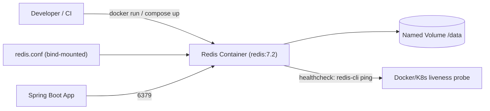

# Redis Installation and Configuration

## Theory

### Redis Server

`redis-server` is the executable that runs the Redis daemon itself. It can be started with no arguments (using built-in defaults), with a path to a configuration file, or with individual configuration directives passed directly on the command line — the latter is convenient for quick overrides in containerized environments.

On Linux, Redis is commonly installed via the distribution's package manager (`apt`, `yum`) or compiled from source for the latest features; on macOS, `brew install redis` is the standard route for local development. In production, most teams run Redis inside a container (Docker/Kubernetes) or use a managed service (AWS ElastiCache, Azure Cache for Redis, Redis Cloud) rather than managing the server process directly on bare metal.

```bash
# Start with defaults (binds 127.0.0.1:6379, no persistence directives beyond built-in defaults)
redis-server

# Start with an explicit config file
redis-server /etc/redis/redis.conf

# Override a directive inline without editing the file
redis-server /etc/redis/redis.conf --port 6380 --requirepass "s3cr3t"

# Check the running server's version and process
redis-cli INFO server | grep redis_version
```

### Redis CLI

`redis-cli` is the official interactive command-line client for talking to a Redis server. It supports an interactive REPL mode, a single-shot command mode (great for scripting), a `--pipe` mode for bulk-loading commands from a file at high speed, and a `--cluster` mode for administering Redis Cluster deployments.

Beyond basic command execution, `redis-cli` has several features that are extremely useful during development and incident response: `MONITOR` streams every command hitting the server in real time (never use in production under load — it has a real performance cost), `--latency` measures round-trip latency to the server, `--bigkeys` samples the keyspace to find unusually large keys, and `--stat` gives a continuously refreshing overview of server load.

```bash
# Interactive mode
redis-cli
127.0.0.1:6379> SET user:1:name "Alice"
OK
127.0.0.1:6379> GET user:1:name
"Alice"

# One-shot command mode (useful in shell scripts)
redis-cli SET user:1:name "Alice"
redis-cli GET user:1:name

# Connect to a remote host/port with auth
redis-cli -h redis.prod.internal -p 6379 -a "$REDIS_PASSWORD" PING

# Live command stream (debugging only, avoid in high-throughput prod)
redis-cli MONITOR

# Find big keys in the keyspace
redis-cli --bigkeys

# Measure latency to the server
redis-cli --latency
```

### Configuration File (redis.conf)

`redis.conf` is the primary configuration file Redis reads on startup, containing directives for networking, persistence, memory, security, replication, logging, and more. It is a plain-text file with one directive per line, and Redis ships with a heavily commented example `redis.conf` that documents every option and its default value — an invaluable reference.

Most directives can also be inspected and, for many, changed at runtime without a restart via `CONFIG GET`/`CONFIG SET`, though changes made this way are not persisted back to the file unless you explicitly run `CONFIG REWRITE`. This split between "file-based" and "runtime" configuration is important operationally: a `CONFIG SET maxmemory 500mb` takes effect immediately but will be lost on the next restart unless written back.

```conf
# redis.conf (excerpt)
port 6379
bind 127.0.0.1 -::1
daemonize no
logfile ""
dir /var/lib/redis
maxmemory 512mb
maxmemory-policy allkeys-lru
requirepass changeme
```

```bash
# Inspect and change config at runtime
redis-cli CONFIG GET maxmemory
redis-cli CONFIG SET maxmemory 256mb
redis-cli CONFIG REWRITE   # persist runtime changes back to redis.conf
```

### Basic Configuration Options

Beyond persistence and memory (covered separately), a handful of directives form the baseline of almost every Redis deployment: `port` (TCP port to listen on, default `6379`), `bind` (which network interfaces to listen on — critical for security), `daemonize` (whether to run as a background daemon), `pidfile`, `logfile` and `loglevel` (operational logging), `databases` (number of logical DBs selectable via `SELECT`, default 16), and `timeout` (idle client timeout).

Getting these basics right matters more than it might seem: leaving `bind` unset or set to `0.0.0.0` without a firewall/`requirepass` is one of the most common ways Redis instances get compromised (mass-scanned by botnets looking for open Redis ports to exploit for cryptomining or ransom). Production configuration should always explicitly scope `bind`, set a strong `requirepass` or ACL, and disable dangerous commands as appropriate.

```conf
port 6379
bind 127.0.0.1 10.0.0.5
daemonize yes
pidfile /var/run/redis.pid
logfile /var/log/redis/redis.log
loglevel notice
databases 16
timeout 300
```

### Memory Configuration

Memory configuration governs how much RAM Redis is allowed to consume and what happens once that ceiling is reached. The central directive is `maxmemory`, which sets a hard cap (e.g., `maxmemory 2gb`); when the dataset approaches this limit, Redis's behavior is determined by `maxmemory-policy` (covered in depth in the **Memory Management** section) — options range from refusing writes (`noeviction`) to evicting keys under various LRU/LFU/TTL-aware strategies.

Other memory-related directives fine-tune how Redis represents small collections internally for compactness — e.g., `hash-max-listpack-entries`, `list-max-listpack-size`, `set-max-intset-entries` — which control when Redis switches a data type's internal encoding from a compact representation to a more general (but heavier) one as the collection grows. Tuning these thresholds can meaningfully reduce memory footprint for workloads with many small hashes/lists/sets.

```conf
maxmemory 2gb
maxmemory-policy allkeys-lru

# Compact-encoding thresholds
hash-max-listpack-entries 128
hash-max-listpack-value 64
list-max-listpack-size 128
set-max-intset-entries 512
```

```bash
redis-cli CONFIG SET maxmemory 2gb
redis-cli CONFIG SET maxmemory-policy allkeys-lru
redis-cli INFO memory | grep -E "used_memory_human|maxmemory_human"
```

### Security Configuration

Redis was historically designed for use within a trusted network, so its default posture is permissive — no authentication, no encryption, and every command available to any connected client. Modern production deployments must actively harden this: enable `requirepass` (simple shared-secret auth) or, preferably, **Redis ACLs** (Redis 6.0+) for fine-grained per-user permissions on commands and key patterns; bind to specific interfaces rather than `0.0.0.0`; enable TLS for encrypted client connections; and rename or disable dangerous administrative commands like `FLUSHALL`, `CONFIG`, and `SHUTDOWN` in untrusted environments.

ACLs are the recommended modern approach because they let you create least-privilege users — for example, an application user who can only run `GET`/`SET` on keys matching `app:*`, versus an operations user with full administrative access. This is a major improvement over the single global password model.

```conf
# redis.conf
requirepass "a-very-strong-password"
rename-command FLUSHALL ""
rename-command CONFIG ""
```

```bash
# ACL: create a least-privilege application user
redis-cli ACL SETUSER app_user on >app_password \
  ~app:* +get +set +del -@admin

# List configured ACL users
redis-cli ACL LIST

# Verify the user's effective permissions
redis-cli ACL GETUSER app_user
```

| Mechanism | Granularity | Notes |
|---|---|---|
| `requirepass` | Single shared password, full access | Simple, but no per-user scoping |
| ACLs (`ACL SETUSER`) | Per-user, per-command, per-key-pattern | Recommended for multi-tenant/least-privilege setups |
| TLS | Transport encryption | Protects data in transit, independent of auth |
| `bind` / firewall | Network-level | First line of defense — never expose Redis publicly |

### Running Redis with Docker

Docker is the most common way developers run Redis locally and increasingly how it's run in production (often orchestrated via Kubernetes/Helm). The official `redis` image on Docker Hub provides ready-to-run builds for all supported versions, and mounting a volume for `/data` combined with a custom `redis.conf` gives you a fully configurable, disposable Redis instance.

```bash
# Quick ephemeral instance for local development
docker run --name redis-dev -p 6379:6379 -d redis:7.2

# Persistent instance with a custom config and a named volume
docker run --name redis-prod \
  -p 6379:6379 \
  -v redis-data:/data \
  -v $(pwd)/redis.conf:/usr/local/etc/redis/redis.conf \
  -d redis:7.2 redis-server /usr/local/etc/redis/redis.conf

# Tail logs / open a CLI inside the running container
docker logs -f redis-prod
docker exec -it redis-prod redis-cli
```

```yaml
# docker-compose.yaml
services:
  redis:
    image: redis:7.2
    ports:
      - "6379:6379"
    volumes:
      - redis-data:/data
      - ./redis.conf:/usr/local/etc/redis/redis.conf
    command: ["redis-server", "/usr/local/etc/redis/redis.conf"]
    healthcheck:
      test: ["CMD", "redis-cli", "ping"]
      interval: 5s
      timeout: 3s
      retries: 5

volumes:
  redis-data:
```



**Real-life scenario:** A team's `docker-compose.yaml` spins up Redis alongside the application and a Postgres database for local development and integration tests, ensuring the exact same Redis major version is used locally as in production, eliminating "works on my machine" version drift.

### Client Connection Configuration

Client connection configuration covers both server-side settings that govern how clients connect (`timeout`, `tcp-keepalive`, `maxclients`) and client-side configuration in the application (connection pool size, timeouts, retry policy). Getting this right is critical for resilience: a Spring Boot service using Lettuce or Jedis needs a properly sized connection pool, sane command timeouts, and a reconnection strategy so that a brief network blip or Redis failover doesn't cascade into application-wide errors.

Lettuce (the default client in Spring Boot's `spring-boot-starter-data-redis`) is built on Netty and is asynchronous/non-blocking by nature, sharing a small number of connections efficiently via multiplexing, whereas Jedis is a simpler synchronous client that typically requires a connection pool (via Apache Commons Pool2) sized to match expected concurrency.

```yaml
# application.yml (Spring Boot, Lettuce)
spring:
  data:
    redis:
      host: redis.prod.internal
      port: 6379
      password: ${REDIS_PASSWORD}
      timeout: 2000ms
      lettuce:
        pool:
          max-active: 16
          max-idle: 8
          min-idle: 2
        shutdown-timeout: 200ms
```

```java
@Configuration
public class RedisConfig {

    @Bean
    public LettuceConnectionFactory redisConnectionFactory(RedisProperties properties) {
        RedisStandaloneConfiguration standalone = new RedisStandaloneConfiguration(
                properties.getHost(), properties.getPort());
        standalone.setPassword(properties.getPassword());

        LettuceClientConfiguration clientConfig = LettuceClientConfiguration.builder()
                .commandTimeout(Duration.ofSeconds(2))
                .build();

        return new LettuceConnectionFactory(standalone, clientConfig);
    }
}
```

```conf
# redis.conf server-side connection tuning
tcp-keepalive 300
timeout 0
maxclients 10000
```

### Interview Questions

1. What are the different ways to start `redis-server`, and how do command-line overrides interact with `redis.conf`? — You can start it with no arguments (built-in defaults), with a path to a config file (`redis-server /etc/redis/redis.conf`), or with individual directives on the command line; directives passed on the command line after the config file path override the corresponding values loaded from that file, which is convenient for quick overrides in containers.
2. What is the difference between changing configuration via `CONFIG SET` and editing `redis.conf` directly? — `CONFIG SET` changes a directive at runtime immediately without a restart but is not persisted to disk, so the change is lost on the next restart unless `CONFIG REWRITE` is run, whereas editing `redis.conf` directly only takes effect after the server is restarted (or reloaded) with that file.
3. Why is `CONFIG REWRITE` needed, and when would you use it? — `CONFIG REWRITE` persists the current runtime configuration (including changes made via `CONFIG SET`) back to the `redis.conf` file; it's needed whenever you want a runtime tuning change (e.g., `CONFIG SET maxmemory 500mb`) to survive a server restart instead of reverting to the file's original values.
4. What security risks come from binding Redis to `0.0.0.0` without authentication? — Binding to `0.0.0.0` without `requirepass`/ACLs exposes Redis to any host that can reach the port, and since Redis's default posture assumes a trusted network with every command available, this is one of the most common ways instances get compromised by botnets scanning for open Redis ports for cryptomining or ransom.
5. How do Redis ACLs improve on the legacy `requirepass` model? — `requirepass` is a single shared password granting full access to whoever has it, while ACLs (Redis 6.0+) let you create least-privilege users scoped to specific commands and key patterns — for example, an application user restricted to `GET`/`SET` on keys matching `app:*` versus an operations user with full administrative access.
6. What are some dangerous commands you might rename or disable in a production configuration, and why? — Commands like `FLUSHALL`, `CONFIG`, and `SHUTDOWN` can destroy the entire dataset or alter server behavior/shut it down if misused or exploited, so `rename-command FLUSHALL ""` (or renaming to an obscure string) in `redis.conf` disables or obscures them in untrusted environments.
7. How would you run a persistent Redis instance in Docker with a custom configuration file? — Mount a named volume for `/data` and bind-mount a custom `redis.conf` into the container, then start the container pointing `redis-server` at that mounted config file, e.g. `docker run -v redis-data:/data -v $(pwd)/redis.conf:/usr/local/etc/redis/redis.conf -d redis:7.2 redis-server /usr/local/etc/redis/redis.conf`.
8. What is the difference between Lettuce and Jedis as Redis clients in a Spring Boot application? — Lettuce (the default in `spring-boot-starter-data-redis`) is built on Netty and is asynchronous/non-blocking, sharing a small number of connections efficiently via multiplexing, whereas Jedis is a simpler synchronous client that typically requires an explicit connection pool (via Apache Commons Pool2) sized to match expected concurrency.
9. Why does Lettuce need fewer connections than Jedis for the same level of concurrency? — Lettuce multiplexes many concurrent commands over a small number of shared connections asynchronously via Netty, whereas Jedis's synchronous model ties up one connection per in-flight command/thread, requiring a pool sized close to the expected concurrent request count.
10. What is `redis-cli --bigkeys` used for, and why should `MONITOR` be used cautiously in production? — `--bigkeys` samples the keyspace to find unusually large keys that may be consuming disproportionate memory; `MONITOR` streams every command hitting the server in real time, which has a real performance cost and should never be run against a production instance under load.
11. What directives control how Redis represents small hashes/lists/sets compactly in memory? — Directives like `hash-max-listpack-entries`, `hash-max-listpack-value`, `list-max-listpack-size`, and `set-max-intset-entries` control the thresholds at which Redis switches a collection's internal encoding from a compact representation to a more general (but heavier) one as it grows.
12. How would you size a Lettuce/Jedis connection pool for a Spring Boot service under load? — For Lettuce, a small pool (e.g., `max-active: 16`) is usually sufficient since connections are multiplexed asynchronously; for Jedis, size the pool closer to the expected peak concurrent command count since each in-flight synchronous command occupies its own connection.
13. What is `maxclients`, and what happens when it's exceeded? — `maxclients` (default 10000) caps the maximum number of simultaneous client connections Redis will accept; once exceeded, new connection attempts are refused with an error until existing connections are closed.
14. How does TLS configuration differ from ACL/password-based authentication in Redis? — TLS encrypts the transport channel between client and server, protecting data in transit, while ACLs/`requirepass` govern authentication and authorization (who can connect and what they can do) — the two are independent and complementary, with TLS not verifying identity or permissions on its own.
15. What operational steps would you take to hardened a freshly installed Redis instance before exposing it to an application? — Explicitly scope `bind` to trusted interfaces, set a strong `requirepass` or configure ACL users with least privilege, enable TLS for encrypted connections, rename/disable dangerous commands like `FLUSHALL`/`CONFIG`/`SHUTDOWN`, and ensure a firewall restricts access so Redis is never exposed directly to the public internet.

