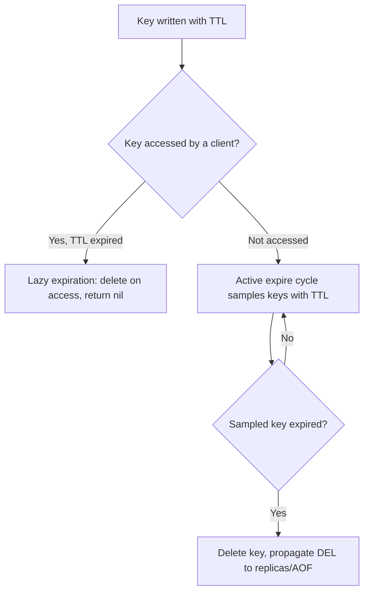

# Key Management

## Theory

### Keys

Keys are the primary identifiers under which all Redis values are stored — every piece of data in Redis, regardless of its data type, is addressed by a unique binary-safe string key. Redis provides a broad set of key-level commands that work uniformly across data types: `EXISTS`, `TYPE`, `TTL`, `EXPIRE`, `DEL`, `RENAME`, and `SCAN`, all operating purely on the key without needing to know or care what kind of value it points to.

Understanding that keys and values are decoupled from "collections/tables" (as in a relational model) is fundamental to thinking in Redis: there's no schema enforcing that all "user" keys look alike, so naming discipline and application-level conventions are what keep a large keyspace organized and maintainable.

```bash
SET user:1000:name "Alice"
EXISTS user:1000:name
TYPE user:1000:name
TTL user:1000:name
DEL user:1000:name
```

### Namespaces

Redis has no built-in concept of namespaces or schemas — instead, the community convention is to encode a logical namespace directly into the key using a delimiter (traditionally `:`), e.g., `app:user:1000:profile`. This is purely a naming convention enforced by application discipline, not a server-side feature, though tools like `SCAN` with pattern matching and RedisInsight's tree view rely on this convention to present a navigable hierarchy.

Namespacing keys by service/domain/entity is essential in any shared Redis instance to avoid collisions between unrelated features and to make operational tasks (like "delete all cache entries for the pricing service") tractable via pattern-based scanning rather than needing to track every key individually.

```bash
SET orders:svc:order:1001:status "PAID"
SET pricing:svc:sku:2002:price "19.99"
SET auth:svc:session:abcxyz "user:42"

# Discover keys within a namespace (never use KEYS in production - see Key Scanning)
redis-cli --scan --pattern "orders:svc:*"
```

### Key Naming Conventions

A consistent key naming convention makes a large keyspace debuggable, scannable, and safe to operate on. The most common convention is colon-delimited segments moving from general to specific: `{namespace}:{entity}:{id}:{field-or-subresource}`, e.g., `shop:cart:user123:items`. Keeping keys human-readable (rather than opaque hashes) pays off enormously during incident response, when an engineer needs to `SCAN` and reason about what's in the keyspace.

Other conventions worth adopting: keep key names reasonably short (very long keys waste memory across millions of entries), avoid embedding highly variable data that would explode cardinality unnecessarily, and pick a single delimiter convention and enforce it via shared client libraries/wrappers rather than ad hoc string concatenation scattered through the codebase.

```text
Good:
  cache:product:1001
  session:user:42
  rl:api:user:42:2026-08-02T10

Avoid:
  product_1001_cache_data_v2_final   (inconsistent, unstructured)
  1001                                (no context, collision-prone)
```

```java
// Centralize key construction so conventions are enforced in one place
public final class CacheKeys {
    public static String product(String productId) {
        return "cache:product:" + productId;
    }
}
```

### Key Expiration (TTL)

Redis supports attaching a **time-to-live** to any key, after which it is automatically deleted. TTLs can be set at creation (`SET key value EX 60`) or applied/adjusted afterward (`EXPIRE`, `PEXPIRE`, `EXPIREAT`), and inspected via `TTL`/`PTTL` (returning remaining seconds/milliseconds, `-1` if the key has no TTL, `-2` if it doesn't exist). `PERSIST` removes an existing TTL, making the key permanent again.

Internally, Redis does not scan the whole keyspace continuously for every possible expiration — it uses a combination of **lazy expiration** (a key is checked and deleted the moment it's accessed if its TTL has passed) and an **active expiration cycle** that periodically samples a subset of keys with TTLs set and proactively removes expired ones, keeping memory from being needlessly held by expired-but-unaccessed keys.

```bash
SET session:abc123 "user-data" EX 1800
TTL session:abc123
PERSIST session:abc123
TTL session:abc123          # -1, no longer expires
EXPIRE session:abc123 60
PTTL session:abc123
```



**Real-life scenario:** Session tokens are stored with `EX 1800` (30 minutes) so an inactive user's session data is reclaimed automatically without any application-side cleanup job.

### Persistent Keys

A "persistent key" is simply a key with no expiration set — it remains in the keyspace indefinitely (subject to eviction under memory pressure, unless the eviction policy specifically protects keys without a TTL). Most durable application data — user accounts, product catalogs, configuration — should be stored as persistent keys, since accidental TTL leakage into permanent data would be a serious bug.

A common defensive practice is to choose an eviction policy like `volatile-lru` when persistent keys must never be evicted even under memory pressure — this policy only ever evicts keys that do have a TTL set, guaranteeing permanent keys are safe from eviction (though they can still trigger `OOM` errors on writes if memory is fully exhausted with no evictable keys available).

```bash
SET config:feature:dark_mode "enabled"      # no TTL - persistent by default
TTL config:feature:dark_mode                # -1
```

### Key Eviction

Key eviction is the process by which Redis proactively removes keys to reclaim memory once `maxmemory` is reached, governed by the configured `maxmemory-policy`. This is covered in full depth under **Memory Management**, but at the key-management level, it's important to understand which keys are eligible: policies prefixed `volatile-*` only ever evict keys that have a TTL set, while `allkeys-*` policies can evict any key regardless of expiration.

```bash
CONFIG SET maxmemory 100mb
CONFIG SET maxmemory-policy volatile-lru
INFO stats | grep evicted_keys
```

### Key Scanning

Iterating over the keyspace safely is a common operational need — for debugging, running maintenance scripts, or bulk-deleting a namespace. The naive `KEYS *` command is **dangerous in production** because it's O(N) over the entire keyspace and blocks the single-threaded server for the full duration on a large dataset, causing latency spikes for every other client.

The correct tool is `SCAN` (and its type-specific siblings `HSCAN`, `SSCAN`, `ZSCAN`), which uses a cursor-based protocol to incrementally walk the keyspace in small batches without blocking the server, at the cost of weaker consistency guarantees (a key present throughout a full scan is guaranteed to be returned at least once, but keys added/removed during the scan may or may not appear).

```bash
# Dangerous in production on a large keyspace - avoid
KEYS "cache:product:*"

# Safe, non-blocking, cursor-based iteration
SCAN 0 MATCH "cache:product:*" COUNT 100
# returns a cursor + a batch of keys; repeat with the returned cursor until it's 0
```

```bash
redis-cli --scan --pattern "cache:product:*" | xargs redis-cli DEL
```

| Command | Blocking | Consistency | Production-safe |
|---|---|---|---|
| `KEYS *` | Yes, O(N) | Full snapshot | No |
| `SCAN` | No, incremental | At-least-once per key | Yes |

### Key Deletion

Redis provides two commands for removing keys: `DEL`, which frees the key's memory synchronously on the main thread, and `UNLINK` (Redis 4.0+), which reclaims memory **asynchronously** on a background thread while removing the key from the keyspace immediately. For large values (a huge hash, list, or set with millions of entries), `DEL` can briefly block the server while it frees memory; `UNLINK` avoids this by deferring the actual memory deallocation.

```bash
DEL session:abc123
UNLINK big:collection:key      # non-blocking free for large values
FLUSHDB ASYNC                  # clear current DB without blocking
FLUSHALL ASYNC                 # clear all DBs without blocking
```

### Key Renaming

`RENAME` and `RENAMENX` atomically rename a key, with `RENAMENX` only succeeding if the destination key does not already exist (useful to avoid accidentally clobbering existing data). Renaming is atomic and preserves the key's TTL, type, and value untouched.

```bash
SET tmp:import:batch42 "processed-data"
RENAME tmp:import:batch42 import:batch42:final
RENAMENX import:batch42:final import:batch41:final    # fails: destination exists
```

### Interview Questions

1. How does Redis handle the absence of namespaces/schemas, and what conventions fill that gap? — Redis has a single flat keyspace per logical database with no built-in namespacing, so teams fill the gap with colon-delimited key naming conventions (e.g., `orders:svc:order:1001:status`) that emulate namespacing and make pattern-based operations like `SCAN --pattern "orders:svc:*"` tractable.
2. What key naming convention would you adopt for a multi-service Redis deployment, and why? — A colon-delimited, general-to-specific convention like `{namespace}:{entity}:{id}:{field-or-subresource}` (e.g., `shop:cart:user123:items`), enforced centrally via a shared key-construction helper class rather than ad hoc string concatenation, keeps keys human-readable, scannable, and prevents collisions between unrelated services sharing one instance.
3. What's the difference between lazy expiration and active expiration in Redis? — Lazy expiration checks and deletes a key only at the moment it's accessed if its TTL has passed; active expiration is a background cycle that periodically samples a subset of keys with TTLs set and proactively removes expired ones, so memory isn't needlessly held by expired-but-unaccessed keys.
4. What do `TTL` return values of `-1` and `-2` mean? — `-1` means the key exists but has no TTL set (it's persistent); `-2` means the key does not exist at all.
5. Why is `KEYS *` dangerous in production, and how does `SCAN` avoid the same problem? — `KEYS *` is O(N) over the entire keyspace and blocks the single-threaded server for its full duration, causing latency spikes for every other client on a large dataset; `SCAN` uses a cursor-based protocol to incrementally walk the keyspace in small, non-blocking batches instead.
6. What consistency guarantees does `SCAN` provide during concurrent modifications to the keyspace? — A key present throughout the entire scan duration is guaranteed to be returned at least once, but keys added or removed during the scan may or may not appear in the results — weaker than the full point-in-time snapshot consistency `KEYS *` provides.
7. What's the difference between `DEL` and `UNLINK`, and when would you prefer one over the other? — `DEL` frees a key's memory synchronously on the main thread, which can briefly block the server for very large values; `UNLINK` (Redis 4.0+) removes the key from the keyspace immediately but reclaims its memory asynchronously on a background thread, making it preferable for deleting huge hashes/lists/sets with millions of entries.
8. How would you safely bulk-delete all keys matching a pattern in production? — Use `redis-cli --scan --pattern "cache:product:*" | xargs redis-cli DEL` (or `UNLINK` for large values), which relies on the non-blocking cursor-based `SCAN` rather than `KEYS *`, avoiding a server-wide blocking pause.
9. What is the difference between `RENAME` and `RENAMENX`? — Both atomically rename a key while preserving its TTL, type, and value, but `RENAME` always succeeds and overwrites an existing destination key, whereas `RENAMENX` only succeeds if the destination key does not already exist, preventing accidental clobbering.
10. How do `volatile-*` and `allkeys-*` eviction policies relate to whether a key has a TTL? — `volatile-*` policies (e.g., `volatile-lru`) only ever evict keys that have a TTL set, leaving persistent keys untouched, while `allkeys-*` policies (e.g., `allkeys-lru`) can evict any key regardless of whether it has an expiration.
11. How would you ensure a piece of permanent configuration data is never accidentally evicted or expired? — Store it without a TTL (so `TTL` returns `-1`) and configure the `maxmemory-policy` to a `volatile-*` variant like `volatile-lru`, which only evicts keys that do have a TTL, guaranteeing persistent keys are never chosen for eviction (though writes can still fail with `OOM` if no evictable keys remain).
12. What tools or commands would you use to audit unusually large keys in a Redis instance? — `redis-cli --bigkeys` samples the keyspace to find unusually large keys, and `redis-cli --stat` gives a continuously refreshing overview of server load that can help spot memory growth trends.
13. How is `FLUSHALL ASYNC` different from a plain `FLUSHALL`? — Plain `FLUSHALL` frees all databases' memory synchronously on the main thread, blocking the server; `FLUSHALL ASYNC` clears all DBs while reclaiming the freed memory on a background thread, avoiding a blocking pause on large datasets.
14. Why might inconsistent key naming become an operational liability at scale? — Without a single delimiter/structure convention, engineers can't reliably `SCAN` or pattern-match keys during incident response or bulk maintenance, keys become hard to reason about, and unstructured or overly variable names risk both collisions and unnecessary cardinality/memory waste.
15. How would you design a key schema for a multi-tenant SaaS application sharing one Redis instance? — Prefix every key with the tenant identifier as the outermost namespace segment (e.g., `tenant:{tenantId}:{entity}:{id}:{field}`), enforced through a shared key-construction helper, so per-tenant data can be scanned, audited, or bulk-deleted independently via pattern matching without colliding with other tenants' keys.

