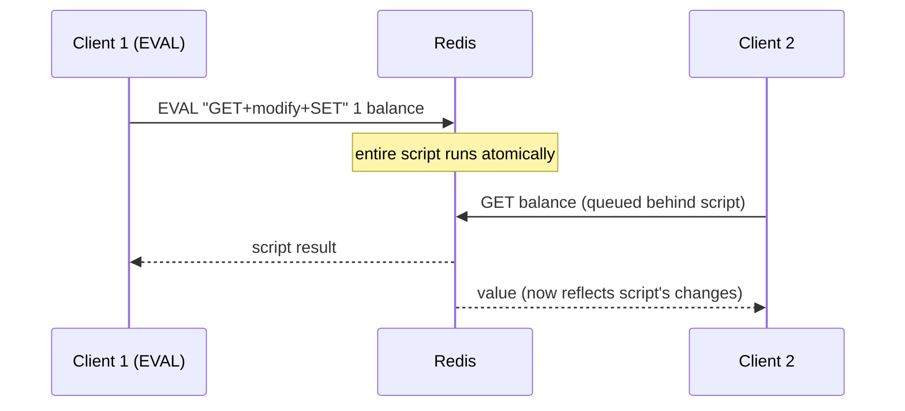

# Lua Scripting

## Theory

### Lua Script Basics

Redis embeds a Lua interpreter, letting clients send small scripts that execute directly on the server via the `EVAL` command. The syntax is `EVAL script numkeys key [key ...] arg [arg ...]` — the script source is sent as a string, `numkeys` tells Redis how many of the following arguments are Redis keys (accessible inside the script as the `KEYS` table), and everything after that is passed as plain arguments (accessible as the `ARGV` table). Separating keys from arguments this way lets Redis Cluster statically analyze which slots a script touches without having to parse the Lua source.

Inside a script, `redis.call(...)` invokes any normal Redis command and returns its result converted into a Lua value; `redis.pcall(...)` does the same but catches errors and returns them as a Lua table instead of raising, letting the script handle failures gracefully.

```bash
# Simple EVAL: set a key to a value passed as ARGV, return it
EVAL "return redis.call('SET', KEYS[1], ARGV[1])" 1 mykey "hello"

# Read a key back
EVAL "return redis.call('GET', KEYS[1])" 1 mykey
# -> "hello"

# Using redis.pcall to handle an error without aborting the script
EVAL "local ok, err = pcall(function() return redis.call('INCR', KEYS[1]) end) \
      if not ok then return 'not-a-number' end \
      return ok" 1 mykey
```

```lua
-- A more realistic script: increment a counter and set expiry only on first increment
-- KEYS[1] = counter key, ARGV[1] = TTL seconds
local current = redis.call('INCR', KEYS[1])
if current == 1 then
    redis.call('EXPIRE', KEYS[1], ARGV[1])
end
return current
```

### Atomic Execution

Redis is single-threaded for command execution, and this guarantee extends to Lua scripts: while a script is running via `EVAL`/`EVALSHA`, no other client command can interleave — the entire script executes as one atomic, uninterruptible unit from every other client's point of view. This makes Lua scripting one of the most powerful tools for implementing check-and-set logic, multi-step business rules, or coordination primitives that would otherwise require a `MULTI`/`EXEC` transaction combined with `WATCH` (optimistic locking) — but without the possibility of the transaction being aborted due to a concurrent modification.

The trade-off is that a long-running or inefficient script blocks the entire server for its duration — there is no timeslice-sharing between the script and other clients. Redis mitigates runaway scripts with `lua-time-limit` (or `busy-reply-threshold` in newer versions), after which Redis starts responding to certain commands (like `SCRIPT KILL`) even while the script appears to be stuck, but write commands remain blocked until the script finishes or is forcibly killed (which itself can leave the dataset in an inconsistent partial state, so it's a last resort).



**Lua script vs MULTI/EXEC transaction:**

| Aspect | Lua Script (`EVAL`) | `MULTI`/`EXEC` + `WATCH` |
|---|---|---|
| Conditional logic | Full Lua language (if/loops/local vars) | None — commands are queued blindly |
| Can abort based on read value | Yes, natively | Only via optimistic-lock retry loop |
| Atomicity | Guaranteed, no interleaving | Guaranteed within the transaction block |
| Failure mode of long op | Blocks server until done/killed | Each command is fast individually |

### Script Caching

Sending the full script text on every `EVAL` call wastes bandwidth for scripts that are reused frequently. Redis addresses this with a script cache: `SCRIPT LOAD script` uploads a script to the server's cache without executing it, returning its SHA1 hash. Subsequent calls can then use `EVALSHA sha1 numkeys key [key ...] arg [arg ...]` to execute the cached script by its hash alone, avoiding retransmission of the source.

If a client calls `EVALSHA` with a SHA1 that isn't in the cache (e.g. after a server restart, since the script cache is not persisted), Redis returns a `NOSCRIPT` error; the client is expected to fall back to a normal `EVAL` (which also (re-)populates the cache) or reload it explicitly via `SCRIPT LOAD`.

```bash
# Load a script and get its SHA1 digest
SCRIPT LOAD "return redis.call('GET', KEYS[1])"
# -> "e0e1f9fabfc9d4800c877a703b823ac0578ff831"

# Execute using the cached hash
EVALSHA e0e1f9fabfc9d4800c877a703b823ac0578ff831 1 mykey

# Check whether specific SHA1s are cached
SCRIPT EXISTS e0e1f9fabfc9d4800c877a703b823ac0578ff831

# Clear the entire script cache
SCRIPT FLUSH
```

**Production note:** Client libraries (Jedis, Lettuce, redis-py) typically automate this pattern transparently — they try `EVALSHA` first, and on `NOSCRIPT` they transparently retry with `EVAL`, caching the SHA1 for next time.

### Common Use Cases

Lua scripting shines whenever an operation needs to read, decide, and write in one atomic round trip. Typical production patterns:

- **Rate limiting** — atomically increment a counter and set its expiry only on the first hit within the window, then compare against a limit, all in one script.
- **Distributed locks** — implementing safe lock acquisition/release (e.g., only deleting a lock key if its value still matches the token the caller set, preventing one client from releasing another's lock).
- **Conditional updates** — "compare-and-swap" logic such as "only update this key if its current value equals X."
- **Leaderboard adjustments** — atomically updating a sorted set score and evicting the lowest entries if the leaderboard exceeds a max size.
- **Idempotency checks** — atomically check-and-set a processed-flag for a message ID before acting on it, to guard against duplicate processing in at-least-once messaging systems.

```lua
-- Safe distributed lock release: only delete if value matches the caller's token
-- KEYS[1] = lock key, ARGV[1] = expected token
if redis.call('GET', KEYS[1]) == ARGV[1] then
    return redis.call('DEL', KEYS[1])
else
    return 0
end
```

```bash
EVAL "if redis.call('GET', KEYS[1]) == ARGV[1] then return redis.call('DEL', KEYS[1]) else return 0 end" \
  1 my:lock "unique-token-abc123"
```

### Redis Functions (Server-Side Functions)

Introduced in Redis 7.0, **Redis Functions** are the modern, more structured evolution of ad-hoc `EVAL` scripts. Instead of shipping a raw script string with every call, functions are organized into named **libraries**, registered once via `FUNCTION LOAD`, and then invoked repeatedly by name using `FCALL`/`FCALL_RO`. Because they are registered server-side objects (not just cached by content hash), they persist across restarts when the library is saved, and they are automatically replicated to replicas and propagated across a cluster more predictably than relying on ad-hoc `EVALSHA` cache hits.

A function library is defined with a special shebang line declaring the engine and library name, and each function is registered explicitly via `redis.register_function`.

```lua
#!lua name=mylib

local function my_set(keys, args)
    return redis.call('SET', keys[1], args[1])
end

redis.register_function('my_set', my_set)
```

```bash
# Load the library (from a file or inline)
FUNCTION LOAD "#!lua name=mylib\n\nredis.register_function('my_set', function(keys, args) return redis.call('SET', keys[1], args[1]) end)"

# Call the registered function
FCALL my_set 1 mykey "hello"

# List loaded libraries/functions
FUNCTION LIST

# Persist functions so they survive a restart (via RDB/AOF)
FUNCTION DUMP
```

**EVAL/EVALSHA vs Functions comparison:**

| Aspect | `EVAL`/`EVALSHA` | Redis Functions (`FCALL`) |
|---|---|---|
| Registration | Implicit, via content-hash cache | Explicit, via named libraries |
| Survives restart | No (cache is ephemeral) | Yes, if persisted with RDB/AOF |
| Organization | One-off scripts | Grouped into reusable libraries |
| Read-only variant | Not distinguished | `FCALL_RO` enforces read-only execution |
| Recommended for | Quick, ad-hoc scripting | Production, long-lived server-side logic |

### Interview Questions

- What is the syntax of `EVAL`, and why does Redis require keys and arguments to be passed separately (`KEYS` vs `ARGV`)?
- What is the difference between `redis.call` and `redis.pcall`?
- Why are Lua scripts atomic in Redis, and what mechanism guarantees that?
- What are the risks of running a long, CPU-heavy Lua script on a production Redis instance?
- How does `SCRIPT LOAD` and `EVALSHA` reduce bandwidth compared to repeated `EVAL` calls?
- What happens when a client calls `EVALSHA` with a hash Redis doesn't have cached, and how do client libraries typically handle it?
- Describe a real use case where a Lua script is a better fit than `MULTI`/`EXEC` with `WATCH`.
- How would you implement a safe distributed-lock release using a Lua script?
- What are Redis Functions and how do they differ from ad-hoc `EVAL` scripts?
- What is the purpose of the `#!lua name=...` shebang line in a function library?
- What does `FCALL_RO` guarantee that a normal `FCALL` does not?
- Why don't scripts cached via `SCRIPT LOAD` survive a Redis restart, while Redis Functions can?
- How does Redis Cluster use the declared `KEYS` of a script to validate slot ownership before execution?
- What configuration limits how long a script can run before Redis considers it "busy"?
- Give an example of a rate-limiting algorithm implemented atomically with a Lua script.

