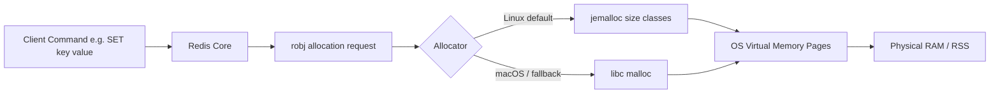
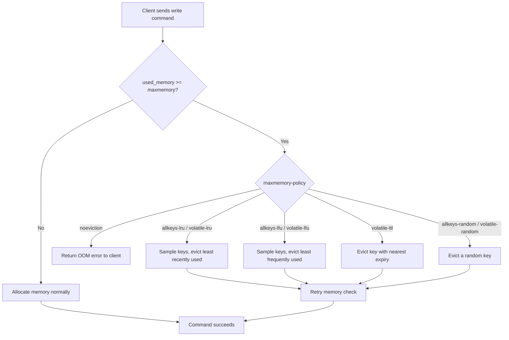
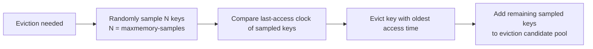
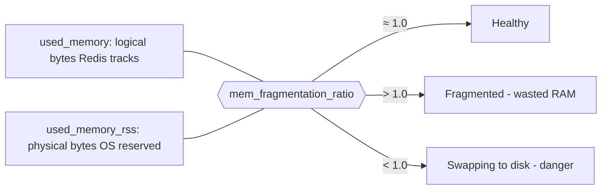

# Memory Management

## Theory

### Memory Allocation

Redis is an in-memory data store, which means every key, value, and internal data structure lives in RAM for the lifetime of the process (persistence to disk is a separate, asynchronous concern). Redis does not implement its own low-level memory allocator from scratch; instead it delegates raw allocation to a pluggable allocator, defaulting to **jemalloc** on Linux (a general-purpose allocator originally developed for FreeBSD/Facebook workloads) because it handles fragmentation and small-object allocation patterns better than the glibc allocator for Redis's typical workload of many small, short-lived objects. On macOS builds, Redis typically falls back to the system's `libc` allocator.

Every Redis object (a `String`, `Hash`, `List`, `Set`, `ZSet`, `Stream`, etc.) is wrapped in a `robj` (Redis Object) structure that carries type, encoding, refcount, and LRU/LFU metadata alongside the raw payload — so the "cost" of a key is always larger than just the bytes of its value. Understanding this overhead matters for capacity planning: a Redis instance holding a million tiny integers can still consume hundreds of megabytes because of per-object bookkeeping, pointers, and allocator rounding (jemalloc allocates memory in fixed-size classes, so a 17-byte request might actually consume a 32-byte slot).

```bash
# Inspect how much memory Redis believes it is using, and how the allocator is configured
redis-cli INFO memory

# Key fields to look at:
#   used_memory_human          -> memory used by Redis data + overhead
#   used_memory_rss_human      -> actual physical memory the OS says Redis is using
#   mem_allocator               -> jemalloc / libc
#   maxmemory_human             -> configured hard cap (0 = unlimited)
```

```conf
# redis.conf - cap Redis at 2GB of used memory and pick jemalloc explicitly at build time
maxmemory 2gb
maxmemory-policy noeviction
```



**Production scenario:** When sizing a Redis instance for a session store holding 5 million sessions of ~500 bytes each, naive math suggests 2.5 GB, but real-world sizing must budget an extra 30-50% for per-key overhead, allocator fragmentation, and replication buffers — under-provisioning `maxmemory` here leads to unexpected evictions or OOM errors under load.

### Memory Usage

Redis exposes several tools to introspect exactly how memory is spent, which is essential before choosing an eviction policy or deciding whether to shard/scale. The `MEMORY USAGE` command reports the number of bytes a specific key (including its value, encoding overhead, and key name) consumes, while `MEMORY STATS` gives a global breakdown (dataset size, replication backlog, client output buffers, Lua scripts cache, etc.) and `MEMORY DOCTOR` gives a human-readable diagnostic opinion about the instance's health.

Data type **encoding** heavily influences memory usage. Redis uses compact encodings for small collections — e.g., a `Hash` with few fields and short values is stored as a `listpack` (a flat, cache-friendly byte array) rather than a full hash table; once it crosses `hash-max-listpack-entries`/`hash-max-listpack-value` thresholds, Redis converts it to a proper hash table, which uses significantly more memory per entry but offers O(1) access at scale. The same pattern applies to `Sets` (`intset`/`listpack` vs `hashtable`) and `Sorted Sets` (`listpack` vs `skiplist`).

```bash
# Per-key memory footprint
redis-cli MEMORY USAGE user:1001

# Check the internal encoding Redis chose for a key
redis-cli OBJECT ENCODING user:1001
# -> "listpack" (small hash) or "hashtable" (large hash)

# Global memory breakdown
redis-cli MEMORY STATS

# Human readable health check
redis-cli MEMORY DOCTOR

# Find the largest keys in the keyspace (sampling scan, safe for production)
redis-cli --bigkeys
```

**Production scenario:** Before migrating a product catalog cache from a single Redis node to Redis Cluster, an SRE team runs `redis-cli --bigkeys` and `MEMORY USAGE` across a sample of keys to estimate per-shard memory needs and to catch pathological cases (e.g., a single `Hash` accidentally holding an entire catalog as one giant key, which would create a hot, oversized shard).

### Eviction Policies

When Redis's used memory reaches the configured `maxmemory` limit, it must decide what to do with new write commands. This behavior is controlled by `maxmemory-policy`, and Redis supports eight policies, split across two dimensions: **which keys are eligible for eviction** (all keys vs only keys with a TTL) and **which algorithm picks the victim** (LRU, LFU, random, or TTL-based).

| Policy | Eligible Keys | Eviction Strategy |
|---|---|---|
| `noeviction` | none | Returns an error on writes once memory is full; reads still work |
| `allkeys-lru` | all keys | Evicts the least recently used key |
| `volatile-lru` | keys with TTL only | Evicts the least recently used key among those with an expiry |
| `allkeys-lfu` | all keys | Evicts the least frequently used key |
| `volatile-lfu` | keys with TTL only | Evicts the least frequently used key among those with an expiry |
| `allkeys-random` | all keys | Evicts a random key |
| `volatile-random` | keys with TTL only | Evicts a random key among those with an expiry |
| `volatile-ttl` | keys with TTL only | Evicts the key with the nearest expiration time |

Eviction is not a background sweep — it happens lazily, inline with the command that would push memory over the limit. Redis checks memory usage before executing a write, and if over budget, it evicts keys (according to policy) until enough memory is freed or there is nothing left to evict, then proceeds with (or rejects) the original command.

```bash
redis-cli CONFIG SET maxmemory 100mb
redis-cli CONFIG SET maxmemory-policy allkeys-lru
redis-cli CONFIG GET maxmemory-policy
```



**Production scenario:** A pure caching layer (nothing else depends on the data surviving) typically runs `allkeys-lru` or `allkeys-lfu` so Redis can reclaim any key. A Redis instance that mixes cache data (with TTLs) and important operational data (without TTLs, e.g., feature flags) should use a `volatile-*` policy so the eviction never touches the keys without an expiry.

### LRU

Redis does not implement textbook, perfectly accurate LRU (which would require a doubly linked list reordered on every access — too expensive at Redis's scale). Instead it implements **approximated LRU** using random sampling: each `robj` stores a 24-bit "last access" clock value, updated whenever the key is touched. When eviction is needed, Redis randomly samples a small pool of keys (controlled by `maxmemory-samples`, default 5) and evicts whichever sampled key has the oldest access time. Increasing `maxmemory-samples` makes the approximation closer to true LRU at the cost of extra CPU per eviction; Redis also maintains a small "eviction pool" of candidate keys across invocations to further improve accuracy without full-table scans.

```bash
redis-cli CONFIG SET maxmemory-policy allkeys-lru
redis-cli CONFIG SET maxmemory-samples 10   # closer to true LRU, more CPU cost

# Inspect how long (in seconds) a key has been idle - i.e. not read/written
redis-cli OBJECT IDLETIME session:abc123
```



**Production scenario:** A leaderboard-adjacent session cache using `allkeys-lru` with the default `maxmemory-samples 5` is usually good enough; a small business increases it to 10 only after observing (via `MEMORY DOCTOR` and hit-rate metrics) that too many "warm" keys were being evicted under memory pressure.

### LFU

Introduced in Redis 4.0, LFU (Least Frequently Used) tracks *access frequency* instead of *recency*, which better protects keys that are accessed constantly but might have a large gap between two specific accesses (LRU would otherwise mistakenly evict them). Redis implements this with a compact **probabilistic counter** (a Morris-style logarithmic counter) packed into the same 24 bits normally used for the LRU clock — an exact counter would need far more memory per key, so Redis trades a small amount of accuracy for massive memory savings. The counter increases probabilistically (higher counts require more accesses to increment further, following a logarithmic curve controlled by `lfu-log-factor`), and it periodically **decays** over time (rate controlled by `lfu-decay-time`) so that keys that were hot yesterday but are cold today gradually become eligible for eviction again.

```bash
redis-cli CONFIG SET maxmemory-policy allkeys-lfu
redis-cli CONFIG SET lfu-log-factor 10   # higher = counter grows more slowly (favors precision at high freq)
redis-cli CONFIG SET lfu-decay-time 1    # minutes; higher = frequency counters decay more slowly

# Inspect a key's current logarithmic access frequency counter (0-255)
redis-cli OBJECT FREQ product:catalog:42
```

| Aspect | LRU | LFU |
|---|---|---|
| Tracks | Recency of access (when) | Frequency of access (how often) |
| Good for | Bursty, time-clustered access patterns | Steady, frequently-hit "hot" keys with irregular gaps |
| Risk | Evicts frequently-used keys accessed just slightly less recently | Slow to "forget" keys that were hot but are now cold (mitigated by decay) |
| Redis storage cost | 24-bit access timestamp | 24-bit probabilistic frequency counter |
| Config knobs | `maxmemory-samples` | `lfu-log-factor`, `lfu-decay-time` |

**Production scenario:** A product catalog cache where a small set of best-selling SKUs are read thousands of times per minute, interspersed with sporadic long-tail SKU lookups, benefits from `allkeys-lfu` — pure LRU could evict a best-seller simply because it wasn't the *most recent* access, whereas LFU correctly keeps it resident due to its high access count.

### Volatile vs AllKeys Policies

This is the axis that decides **which keys are even considered** for eviction, independent of the algorithm (LRU/LFU/random/TTL). `allkeys-*` policies treat every key in the keyspace as fair game, regardless of whether it has a TTL set — appropriate when the entire Redis instance is a disposable, rebuildable cache. `volatile-*` policies restrict eviction candidates to only keys that have an expiration set via `EXPIRE`/`SET ... EX`/`PEXPIRE`; keys without a TTL are treated as "permanent" and are never evicted (though they can still consume memory that leads to `noeviction`-style OOM if no volatile keys remain to evict).

```bash
# Instance used purely as a cache -> anything can be evicted
redis-cli CONFIG SET maxmemory-policy allkeys-lru

# Instance mixing cache entries (with TTL) and durable data (no TTL, e.g. counters, flags)
redis-cli CONFIG SET maxmemory-policy volatile-lru

redis-cli SET feature:flag:new-checkout "on"          # no TTL -> never evicted under volatile-*
redis-cli SET session:xyz "..." EX 1800                # has TTL -> eligible for eviction under volatile-*
```

**Production scenario:** A shared Redis instance storing both short-lived rate-limit counters (with TTL) and long-lived application configuration (no TTL) should use `volatile-lru` rather than `allkeys-lru`, so that a spike of rate-limit keys can never accidentally evict configuration data — though the safer long-term fix is to run separate Redis instances/databases for concerns with different durability requirements.

### Memory Fragmentation

Memory fragmentation is the gap between memory Redis *thinks* it's using (`used_memory`) and the memory the operating system has actually reserved for the process (`used_memory_rss`, Resident Set Size). Redis reports this as `mem_fragmentation_ratio = used_memory_rss / used_memory`. A ratio close to `1.0` is healthy. A ratio significantly above `1.0` (e.g., `1.5`+) indicates fragmentation — often caused by frequent allocation/deallocation of variably-sized objects (allocators leave unusable gaps between allocated blocks) or by large keys being deleted/resized repeatedly. A ratio **below** `1.0` is actually a more alarming signal: it means the OS has swapped some of Redis's memory to disk, which will cause severe latency spikes on access.

Since Redis 4.0, an **active defragmentation** feature can reclaim fragmented memory in the background without blocking clients, by incrementally moving data to more compact allocations when jemalloc supports it.

```bash
redis-cli INFO memory | grep -E "used_memory:|used_memory_rss:|mem_fragmentation_ratio"
# used_memory:1073741824
# used_memory_rss:1717986918
# mem_fragmentation_ratio:1.60   <- meaningful fragmentation, consider active defrag

redis-cli CONFIG SET activedefrag yes
redis-cli CONFIG SET active-defrag-ignore-bytes 100mb
redis-cli CONFIG SET active-defrag-threshold-lower 10
```



**Production scenario:** After a workload that repeatedly writes and deletes large `Hash` objects of varying sizes (e.g., ephemeral shopping carts), an on-call engineer notices `used_memory_rss` is 1.6x `used_memory` in `INFO memory`, and enables `activedefrag` rather than immediately provisioning more RAM, since the fragmentation — not real dataset growth — was inflating the container's memory footprint.

### Interview Questions

- What is the difference between `used_memory` and `used_memory_rss`, and what does a high `mem_fragmentation_ratio` indicate? — `used_memory` is the logical memory Redis tracks itself using, while `used_memory_rss` is the actual resident set size the OS has reserved for the process; a ratio (`mem_fragmentation_ratio`) significantly above 1.0 indicates fragmentation from allocator gaps or resized/deleted large objects, while a ratio below 1.0 signals Redis's memory has been swapped to disk.
- Why does Redis use jemalloc instead of the default glibc allocator on Linux? — jemalloc is a general-purpose allocator originally developed for FreeBSD/Facebook workloads that handles Redis's many small, variably-sized allocations more efficiently and with better fragmentation characteristics than glibc's default allocator, and it also enables the active defragmentation feature.
- Explain all eight `maxmemory-policy` options and when you would choose each. — `noeviction` rejects writes once full (data safety over availability); `allkeys-lru`/`volatile-lru` evict the least recently used key from all keys or only TTL'd keys; `allkeys-lfu`/`volatile-lfu` evict the least frequently used key from all keys or only TTL'd keys; `allkeys-random`/`volatile-random` evict a random key from all keys or only TTL'd keys; `volatile-ttl` evicts the key with the nearest expiration — the `volatile-*` variants suit instances mixing cache and permanent data, `allkeys-*` suit pure caches, and LFU is preferred over LRU for steady, frequently-hit keys with irregular access gaps.
- What happens to write commands when `maxmemory` is reached and the policy is `noeviction`? — Write commands are rejected with an out-of-memory error while reads continue to work normally, since `noeviction` evicts nothing and simply refuses to let the dataset grow further.
- How does Redis approximate LRU without maintaining a true access-ordered linked list? — Each object stores a 24-bit "last access" clock value updated on touch; when eviction is needed, Redis randomly samples a small pool of keys (`maxmemory-samples`, default 5) and evicts whichever sampled key has the oldest access time, avoiding the cost of a globally maintained access-ordered structure.
- What is `maxmemory-samples` and how does increasing it affect accuracy vs performance? — `maxmemory-samples` controls how many keys Redis randomly samples per eviction decision when approximating LRU/LFU; increasing it makes the eviction choice closer to true LRU/LFU accuracy at the cost of additional CPU work per eviction.
- How does Redis's LFU counter work, and what role do `lfu-log-factor` and `lfu-decay-time` play? — LFU uses a compact probabilistic (Morris-style logarithmic) counter packed into the same 24 bits as the LRU clock, incrementing probabilistically so higher counts require more accesses to grow further; `lfu-log-factor` controls how quickly the counter grows at high frequencies, and `lfu-decay-time` controls how fast counters decay over time so previously hot keys become evictable again.
- When would you choose LFU over LRU, or vice versa? — Choose LFU for steady, frequently-hit "hot" keys with irregular access gaps (e.g., best-selling SKUs), since pure LRU could evict them simply for not being the most recent access; choose LRU for bursty, time-clustered access patterns where recency is the better signal of future access.
- What is the difference between `allkeys-*` and `volatile-*` eviction policies? — `allkeys-*` policies treat every key as eligible for eviction regardless of whether it has a TTL, appropriate for a fully disposable cache; `volatile-*` policies only ever evict keys that have an expiration set, leaving keys without a TTL untouched as "permanent" data.
- Why might a Redis instance still hit `noeviction` OOM errors even with `volatile-lru` configured? — `volatile-lru` only evicts keys that have a TTL; if memory pressure persists after every TTL'd key has been evicted and only permanent (no-TTL) keys remain, there is nothing left eligible for eviction, so further writes fail with an OOM error just as under `noeviction`.
- How can you inspect the internal encoding of a key, and why does encoding affect memory usage? — `OBJECT ENCODING <key>` reports whether a key uses a compact encoding (e.g., `listpack`, `intset`) or a general one (e.g., `hashtable`, `skiplist`); compact encodings use far less memory per entry for small collections but are converted to general encodings once size/entry thresholds are crossed, trading memory efficiency for O(1)/O(log N) access at scale.
- What tools would you use to find the largest keys in a production Redis instance safely? — `redis-cli --bigkeys` performs a heuristic, scan-based sample of the keyspace to surface unusually large keys without blocking the server, and offline RDB analyzers like `redis-rdb-tools` can analyze a snapshot file for keyspace-wide memory distribution without adding any load to the live instance.
- What is active defragmentation and when should it be enabled? — Active defragmentation (`activedefrag yes`, Redis 4.0+) incrementally moves data to more compact memory allocations in the background without blocking clients; it should be enabled when `mem_fragmentation_ratio` in `INFO memory` is significantly above 1.0, indicating wasted RAM from allocator fragmentation rather than genuine dataset growth.
- If `mem_fragmentation_ratio` is below 1.0, what does that suggest, and why is it worse than a high ratio?
- How would you estimate the memory required to store N sessions of a known average size in Redis?

