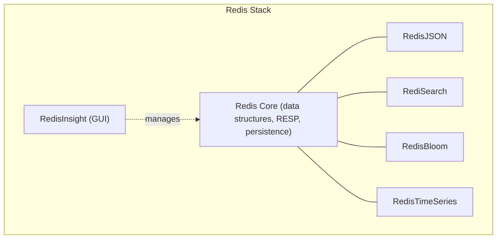

# Redis Modules and Extensions

## Theory

### RedisJSON

RedisJSON is a module that adds a native JSON data type to Redis, allowing you to store, update, and query JSON documents in place using JSONPath expressions, rather than reading an entire serialized JSON string, deserializing it in the application, mutating a field, and writing the whole thing back. Commands like `JSON.SET`, `JSON.GET`, and `JSON.NUMINCRBY` operate directly on nested fields inside the stored document.

This is valuable when Redis needs to act as a document-oriented store or a fast cache layer for JSON-shaped API responses where partial updates matter — for example, incrementing a nested `stock` field in a product document without a full read-modify-write round trip, avoiding both extra network overhead and race conditions.

```bash
JSON.SET product:1001 $ '{"name":"Widget","price":9.99,"stock":{"available":42}}'
JSON.GET product:1001 $.price
JSON.NUMINCRBY product:1001 $.stock.available -1
JSON.SET product:1001 $.name '"Super Widget"'
```

### RediSearch (Full-Text and Vector Search)

RediSearch adds secondary indexing, full-text search, and vector similarity search directly on top of Redis hashes or JSON documents. You define an index over specific fields (`FT.CREATE`), and RediSearch maintains it automatically as matching keys are written, letting you run rich queries — full-text search with ranking, numeric range filters, tag filters, and (in recent versions) approximate nearest-neighbor vector search — using `FT.SEARCH`/`FT.AGGREGATE`.

The vector search capability has become particularly significant with the rise of AI/RAG (retrieval-augmented generation) applications: embeddings generated by an LLM can be stored alongside application data and queried for similarity (`KNN`) directly in Redis, letting a single system serve both the operational cache and the vector index rather than standing up a separate vector database.

```bash
FT.CREATE idx:products ON HASH PREFIX 1 product: SCHEMA \
  name TEXT SORTABLE \
  price NUMERIC SORTABLE \
  category TAG

FT.SEARCH idx:products "widget" LIMIT 0 10
FT.SEARCH idx:products "@category:{electronics} @price:[10 50]"
```

### RedisBloom (Probabilistic Data Structures)

RedisBloom adds a family of probabilistic data structures beyond HyperLogLog: **Bloom filters** (fast, space-efficient "definitely not present / possibly present" membership tests with a tunable false-positive rate), **Cuckoo filters** (similar, but support deletion), **Count-Min Sketch** (approximate frequency counting), and **Top-K** (tracking the most frequent items in a stream).

Bloom filters are widely used to avoid unnecessary expensive lookups — for example, checking a Bloom filter before querying a database or cache to quickly rule out "definitely doesn't exist" cases (a classic technique for preventing cache-penetration attacks where clients repeatedly request non-existent keys).

```bash
BF.RESERVE seen_urls 0.01 1000000
BF.ADD seen_urls "https://example.com/a"
BF.EXISTS seen_urls "https://example.com/a"     # 1 (possibly present)
BF.EXISTS seen_urls "https://example.com/z"     # 0 (definitely absent)

CMS.INITBYDIM freq_sketch 2000 5
CMS.INCRBY freq_sketch "sku:1001" 1
CMS.QUERY freq_sketch "sku:1001"
```

### RedisTimeSeries

RedisTimeSeries is purpose-built for storing and querying time-stamped numeric data efficiently, with native support for automatic downsampling/aggregation (compaction rules), retention policies, and labels for multi-dimensional querying — similar in spirit to specialized time-series databases like InfluxDB or Prometheus, but embedded in Redis.

This module fits naturally into observability and IoT-style pipelines: ingesting sensor readings, application metrics, or financial tick data at high frequency, with built-in rollups (e.g., automatically maintaining a 1-minute average alongside the raw per-second series) so downstream dashboards don't need to compute aggregates on the fly.

```bash
TS.CREATE temperature:sensor1 RETENTION 86400000 LABELS sensor "1" location "warehouse"
TS.ADD temperature:sensor1 '*' 21.5
TS.CREATE temperature:sensor1:avg1m
TS.CREATERULE temperature:sensor1 temperature:sensor1:avg1m AGGREGATION avg 60000
TS.RANGE temperature:sensor1 - +
```

### Redis Stack Overview

**Redis Stack** is a distribution that bundles Redis with the most popular modules — RedisJSON, RediSearch, RedisBloom, RedisTimeSeries, and RedisGraph (deprecated in favor of other graph solutions as of recent releases) — plus **RedisInsight**, a GUI for browsing and managing data. It exists so teams don't need to compile or separately load each module: `docker run redis/redis-stack` gets you a fully-loaded Redis with document, search, probabilistic, and time-series capabilities out of the box.

Choosing Redis Stack versus vanilla Redis is largely about whether your application needs these extended capabilities. A simple cache/session-store deployment has no need for the extra modules (and thus extra memory/attack-surface overhead), while an application doing JSON document modeling, full-text/vector search, or time-series analytics benefits substantially from having them natively available rather than integrating separate specialized systems.

```bash
docker run -p 6379:6379 -p 8001:8001 redis/redis-stack:latest
# Port 6379: Redis + modules
# Port 8001: RedisInsight web UI
```



| Need | Module |
|---|---|
| Native JSON documents, partial updates | RedisJSON |
| Full-text / vector similarity search | RediSearch |
| Approximate membership / frequency | RedisBloom |
| Time-stamped metrics with rollups | RedisTimeSeries |
| All of the above, bundled | Redis Stack |

### Interview Questions

1. What problem does RedisJSON solve that plain string-based JSON storage does not? — RedisJSON lets you update or read nested fields directly in place using JSONPath (`JSON.SET`, `JSON.GET`, `JSON.NUMINCRBY`), avoiding the read-entire-string, deserialize, mutate-one-field, re-serialize, write-whole-thing-back cycle that plain string-based JSON storage requires, which removes both network overhead and race-condition risk on partial updates.
2. How does RediSearch enable vector similarity search, and why is that relevant to AI/RAG applications? — RediSearch supports approximate nearest-neighbor vector search (`KNN`) as part of its indexing over hashes or JSON documents, letting embeddings generated by an LLM be stored alongside application data and queried for similarity directly in Redis, so a single system serves both the operational cache and the vector index rather than requiring a separate specialized vector database.
3. What is a Bloom filter, and what does "false positive but never a false negative" mean in practice? — A Bloom filter is a space-efficient probabilistic structure for membership testing; "false positive but never false negative" means `BF.EXISTS` may occasionally say an item is "possibly present" when it was never added, but it will never say an item is absent if it actually was added, making it safe to use as a quick pre-check before a more expensive definitive lookup.
4. How does a Bloom filter help prevent cache-penetration attacks? — By checking a Bloom filter before querying the database or cache, requests for keys that were never populated (a classic cache-penetration attack pattern) are recognized as "definitely absent" and rejected immediately, avoiding the expensive downstream lookup entirely.
5. What's the difference between a Bloom filter and a Cuckoo filter? — Both are space-efficient probabilistic membership structures with tunable false-positive rates, but a Cuckoo filter additionally supports deletion of previously added items, which a classic Bloom filter cannot do without rebuilding the entire structure.
6. When would you choose RedisTimeSeries over storing time-series data in sorted sets manually? — RedisTimeSeries is preferable when you need native retention policies, automatic downsampling/aggregation (compaction rules like a 1-minute average alongside the raw series), and label-based multi-dimensional querying out of the box, rather than manually implementing trimming, rollups, and filtering logic on top of sorted sets.
7. What is Redis Stack, and how does it differ from vanilla open-source Redis? — Redis Stack is a distribution that bundles Redis core with the most popular modules (RedisJSON, RediSearch, RedisBloom, RedisTimeSeries) plus RedisInsight for GUI management, whereas vanilla open-source Redis ships only the core data structures/persistence/replication without these extended document, search, probabilistic, or time-series capabilities unless modules are compiled/loaded separately.
8. What is RedisInsight, and what role does it play in a development workflow? — RedisInsight is a GUI bundled with Redis Stack for browsing keys, running commands, and managing data and modules visually, making it easier for developers to inspect data structures, debug queries, and monitor a Redis instance during development without relying solely on `redis-cli`.
9. How would you decide whether a project needs Redis Stack versus plain Redis? — If the application only needs caching/session storage/simple data structures, plain Redis avoids the extra memory footprint and attack surface of unused modules; if it needs JSON document modeling, full-text/vector search, probabilistic structures, or time-series analytics natively, Redis Stack avoids standing up separate specialized systems for those capabilities.
10. What are the trade-offs of using Redis modules versus a dedicated specialized system (e.g., Elasticsearch for search, InfluxDB for time series)? — Redis modules keep everything in one system with lower operational overhead and shared low latency, but a dedicated specialized system typically offers deeper, more mature features (e.g., Elasticsearch's advanced text analysis, InfluxDB's specialized time-series query language) at the cost of running and integrating an additional piece of infrastructure.

