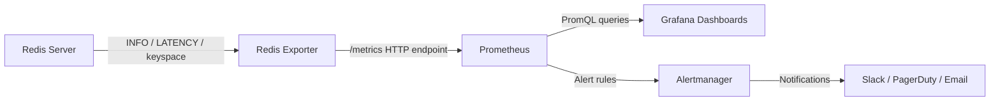

# Monitoring and Performance

## Theory

### INFO Command

The `INFO` command is the single most important diagnostic tool built into Redis. It returns a large, human-readable text blob divided into sections (`server`, `clients`, `memory`, `persistence`, `stats`, `replication`, `cpu`, `cluster`, `keyspace`, and more) that together describe the complete runtime state of a Redis instance. Rather than exposing a rigid schema, Redis returns key-value pairs per line, which makes the command easy to parse with simple text tools while still being extensible across versions.

In production, `INFO` is typically polled periodically by monitoring agents (Redis Exporter for Prometheus, Datadog agent, CloudWatch agent for ElastiCache, etc.) rather than being run manually except during incident triage. Knowing which section to look at quickly narrows down a problem: `memory` for OOM/eviction issues, `stats` for hit/miss ratios and expired-key counters, `replication` for replica lag, and `clients` for connection exhaustion.

```bash
# Full report
redis-cli INFO

# Only memory-related metrics
redis-cli INFO memory

# Only replication state (master/replica offsets, connected replicas)
redis-cli INFO replication

# Example fields worth watching
redis-cli INFO stats | grep -E "keyspace_hits|keyspace_misses|evicted_keys|expired_keys"
```

Key fields to watch routinely:

| Field | Section | Meaning |
|---|---|---|
| `used_memory` / `used_memory_rss` | memory | Actual vs. OS-reported memory usage; large gap indicates fragmentation |
| `mem_fragmentation_ratio` | memory | RSS/used_memory; values well above 1.5 suggest fragmentation issues |
| `connected_clients` | clients | Current open connections; compare against `maxclients` |
| `keyspace_hits` / `keyspace_misses` | stats | Cache effectiveness |
| `evicted_keys` | stats | Non-zero and climbing means memory pressure is causing data loss |
| `instantaneous_ops_per_sec` | stats | Current command throughput |
| `role`, `master_repl_offset`, `slave_repl_offset` | replication | Replication topology and lag |
| `rdb_changes_since_last_save` | persistence | How far ahead of the last RDB snapshot the dataset is |

### Slow Log

The Slow Log is an in-memory, ring-buffer log of commands that took longer than a configurable threshold to execute, excluding the time spent waiting for I/O (only the actual command execution time is measured). It is invaluable for catching pathological commands — `KEYS *` on a large keyspace, unbounded `SMEMBERS`/`HGETALL` on huge collections, or expensive `SORT`/`ZRANGEBYSCORE` calls — that block the single-threaded Redis event loop and hurt every other client.

The threshold is controlled by `slowlog-log-slower-than` (in microseconds; `0` logs everything, a negative value disables logging) and the buffer size by `slowlog-max-len`. Because Redis is single-threaded for command execution, even a handful of slow commands per second can meaningfully degrade p99 latency for all other clients, so the Slow Log should be reviewed as part of routine operational health checks, not only during incidents.

```bash
# Log any command taking longer than 10ms (10000 microseconds)
redis-cli CONFIG SET slowlog-log-slower-than 10000

# Keep the last 256 slow entries
redis-cli CONFIG SET slowlog-max-len 256

# Inspect the 10 most recent slow entries
redis-cli SLOWLOG GET 10

# Number of entries currently in the log
redis-cli SLOWLOG LEN

# Clear the log after investigation
redis-cli SLOWLOG RESET
```

Each entry returned by `SLOWLOG GET` includes a unique entry ID, the Unix timestamp, the execution time in microseconds, the full command and arguments, and (in newer versions) client IP/name — enough context to identify which application or endpoint issued the offending command.

### Latency Monitoring

Beyond the Slow Log (which only tracks command execution time), Redis has a dedicated Latency Monitoring subsystem (`LATENCY` commands) that samples latency spikes across different internal *events*: `command` (slow commands), `fast-command`, `fork` (time spent forking for RDB/AOF rewrite), `expire-cycle`, `eviction-cycle`, `aof-write`, and others. This is critical because a slow `fork()` call (e.g., during `BGSAVE` on a host with a huge dataset and no transparent huge page tuning) can freeze the entire server for tens or hundreds of milliseconds, and that would never show up in the Slow Log since it isn't a client command.

```bash
# Enable monitoring for events taking longer than 100ms
redis-cli CONFIG SET latency-monitor-threshold 100

# List latency spike events recorded, with timestamps
redis-cli LATENCY HISTORY fork

# Latest max latency per event class
redis-cli LATENCY LATEST

# Get a human-readable analysis/report for a specific event
redis-cli LATENCY DOCTOR

# Reset all latency history
redis-cli LATENCY RESET
```

`LATENCY DOCTOR` is particularly useful because it produces a natural-language diagnosis (e.g., pointing at slow forks caused by a large dataset combined with copy-on-write and swapping) instead of raw numbers, making it a good first stop when investigating intermittent latency spikes that are hard to reproduce.

### Memory Statistics

Redis stores everything in RAM, so understanding memory usage is fundamental to both cost control and stability — an out-of-memory Redis instance either starts evicting keys (if a `maxmemory-policy` is set) or starts rejecting writes (`OOM command not allowed`). The `MEMORY` command family and relevant `INFO memory` fields provide visibility at both the instance and key level.

```bash
# Overall memory usage summary
redis-cli INFO memory

# Memory used by a specific key (including overhead)
redis-cli MEMORY USAGE mykey

# Memory allocator statistics (jemalloc internals)
redis-cli MEMORY STATS

# Ask Redis to actively return unused memory to the OS (jemalloc only)
redis-cli MEMORY PURGE

# Estimate memory doctor-style diagnosis
redis-cli MEMORY DOCTOR
```

A common production task is finding what is consuming memory disproportionately. `MEMORY USAGE` per key doesn't scale to millions of keys, so tools like `redis-cli --bigkeys` (a heuristic scan-based sampler) or offline RDB analyzers (e.g., `redis-rdb-tools`) are preferred for keyspace-wide analysis without adding load from repeated `MEMORY USAGE` calls.

```bash
# Sample the keyspace for large keys per data type (uses SCAN internally, non-blocking)
redis-cli --bigkeys

# Sample memory usage distribution with a fixed number of samples per type
redis-cli --memkeys
```

### Performance Tuning

Redis performance tuning spans configuration, data modeling, and infrastructure choices. Because the core command loop is single-threaded (I/O threading was added later only for socket read/write, not command execution), the golden rule is to avoid O(N) or worse operations on large collections in the hot path, and to keep individual commands fast so the event loop is never blocked for long.

Key tuning levers:

- **Avoid expensive commands in production**: `KEYS *`, unbounded `SORT`, `SMEMBERS`/`HGETALL`/`LRANGE` on huge collections. Prefer `SCAN`-family cursors (`SCAN`, `HSCAN`, `SSCAN`, `ZSCAN`) which iterate incrementally without blocking.
- **Use appropriate data structures**: e.g., a `HASH` of small fields is more memory-efficient than many individual `STRING` keys; sorted sets outperform manual sort-on-read patterns for ranking.
- **Tune `maxmemory-policy`** to match workload (`allkeys-lru`, `volatile-lru`, `allkeys-lfu`, etc.) so evictions are predictable rather than random.
- **Disable slow persistence in latency-critical paths** or tune `appendfsync` (`always` vs `everysec` vs `no`) to balance durability against latency.
- **Pipeline and batch** to amortize round-trip network cost (see Pipelining/Batching below).
- **Scale reads with replicas** and route read-only traffic away from the primary when acceptable for the consistency model.
- **Tune OS-level settings**: disable Transparent Huge Pages (THP), set `vm.overcommit_memory=1`, adjust `somaxconn` and `net.core.somaxconn` for connection backlogs.
- **Right-size `maxmemory`** with headroom for fork-based copy-on-write during snapshotting/replication to avoid unexpected OOM kills.

```bash
# Recommended sysctl/kernel tuning frequently applied alongside Redis
echo never > /sys/kernel/mm/transparent_hugepage/enabled
sysctl -w vm.overcommit_memory=1
sysctl -w net.core.somaxconn=1024
```

### Benchmarking

`redis-benchmark` is the bundled load-testing tool used to measure raw throughput and latency under synthetic load, and to compare the impact of configuration changes (pipelining depth, data size, persistence settings) before rolling them out. It's most useful as a *relative* comparison tool (before/after a config change, or comparing instance types) rather than as an absolute prediction of real application throughput, since real workloads have different key distributions, command mixes, and payload sizes.

```bash
# Default benchmark: 50 clients, 100k requests, all common commands
redis-benchmark -h 127.0.0.1 -p 6379 -q

# Focus on specific commands with custom concurrency
redis-benchmark -t set,get -n 1000000 -c 100 -q

# Use pipelining to measure maximum achievable throughput
redis-benchmark -t set,get -n 1000000 -P 16 -q

# Custom payload size (bytes) to mimic realistic object sizes
redis-benchmark -t set,get -d 1024 -n 100000 -q

# Test against a specific keyspace size (random keys) instead of a single key
redis-benchmark -r 100000 -n 100000 -t set,get -q
```

When benchmarking, always test against a topology that resembles production (same network hop count/region, same persistence configuration, similar dataset size resident in memory) — a benchmark run from localhost against an idle instance with no dataset loaded will produce numbers that are optimistic and misleading.

### Connection Management

Every Redis client connection consumes a file descriptor and a small amount of memory on the server, and Redis enforces a `maxclients` limit (default 10,000) beyond which new connections are refused. In application architectures with many short-lived processes (e.g., serverless functions) or misconfigured connection pools that never release connections, exhausting `maxclients` is a common outage cause.

```bash
# Current and configured client limits
redis-cli INFO clients
redis-cli CONFIG GET maxclients

# List all connected clients with details (address, age, idle time, last command)
redis-cli CLIENT LIST

# Forcefully terminate a specific client by address
redis-cli CLIENT KILL ADDR 10.0.0.5:51820

# Set a name on the current connection (useful for CLIENT LIST readability)
redis-cli CLIENT SETNAME my-app-worker-1

# Configure server-side idle timeout (seconds); 0 disables timeout
redis-cli CONFIG SET timeout 300
```

On the application side, connection management means using a properly configured connection pool (Lettuce's shared, thread-safe connection by default, or Jedis's `JedisPool`) instead of opening a new TCP connection per request, and setting sane pool sizes, timeouts, and health checks so that dead connections aren't reused (see the "Connection Pooling" topic under Spring Data Redis below).

### Metrics Export (Prometheus/Grafana Integration)

For long-term observability and alerting, Redis metrics are exported to a time-series backend rather than being read ad hoc via `INFO`. The de facto standard tool is [Redis Exporter](https://github.com/oliver006/redis_exporter), which runs as a sidecar or standalone process, periodically calls `INFO`, `LATENCY`, keyspace, and (optionally) custom key metrics, and exposes them in Prometheus text format on an HTTP endpoint that Prometheus scrapes.

```yaml
# docker-compose snippet: Redis + Redis Exporter + Prometheus scrape target
services:
  redis:
    image: redis:7-alpine
    ports:
      - "6379:6379"

  redis-exporter:
    image: oliver006/redis_exporter:latest
    environment:
      - REDIS_ADDR=redis://redis:6379
    ports:
      - "9121:9121"
```

```yaml
# prometheus.yml scrape config
scrape_configs:
  - job_name: "redis"
    static_configs:
      - targets: ["redis-exporter:9121"]
```

Once scraped, Grafana dashboards (community dashboard ID 763 is a popular starting point) visualize hit ratio, memory usage trend, evictions, replication lag, and command rate. Typical alert rules built on top of these metrics include: memory usage above 80% of `maxmemory`, `evicted_keys` rate greater than zero for a cache expected to fit fully in memory, replication offset lag exceeding a threshold, and `rejected_connections` greater than zero.



### Interview Questions

1. What information does the `INFO` command provide, and which sections would you check first when diagnosing high latency? — `INFO` returns server statistics grouped into sections such as `server`, `clients`, `memory`, `persistence`, `stats`, `replication`, and `cpu`; when diagnosing high latency you'd first check `stats` (keyspace hit/miss ratio, `expired_keys`, `evicted_keys`), `memory` (fragmentation ratio, eviction pressure), `persistence` (whether a `BGSAVE`/AOF rewrite fork is in progress), and `clients` (blocked or a spike in connected clients).
2. How does the Redis Slow Log work, and how is it different from application-level latency monitoring? — The Slow Log records commands whose server-side execution time exceeds `slowlog-log-slower-than` microseconds, capturing only the time Redis itself spent executing the command (not network round trip or client-side queueing); application-level latency monitoring measures end-to-end request time including network hops, connection pool wait, and serialization, so a command can look fast in the Slow Log yet feel slow to the application.
3. How would you configure `slowlog-log-slower-than` and interpret the results of `SLOWLOG GET`? — Set it via `CONFIG SET slowlog-log-slower-than <microseconds>` (e.g., 10000 for 10ms; 0 logs every command, a negative value disables logging), and pair it with `slowlog-max-len` to bound memory used by the log; each entry returned by `SLOWLOG GET` includes a unique ID, Unix timestamp, execution time in microseconds, the full command/arguments, and client address/name, which together identify which application code path issued the offending command.
4. What is the Redis Latency Monitor, and how does it differ from the Slow Log in terms of what it captures (e.g., `fork` events)? — The Latency Monitor (`LATENCY` commands, enabled via `latency-monitor-threshold`) samples latency spikes across internal server *events* like `fork`, `expire-cycle`, `eviction-cycle`, and `aof-write`, not just client commands; this matters because a slow `fork()` during `BGSAVE` can freeze the whole server for tens of milliseconds without ever appearing in the Slow Log, which only tracks explicit client command execution time.
5. What metrics indicate memory pressure in Redis, and what happens when `maxmemory` is reached under different eviction policies? — Key signals are `used_memory` approaching `maxmemory`, a rising `mem_fragmentation_ratio`, and a nonzero `evicted_keys` rate; once `maxmemory` is hit, Redis either evicts keys according to the configured `maxmemory-policy` (`allkeys-lru`, `volatile-lru`, `allkeys-lfu`, `volatile-ttl`, etc.) to make room for new writes, or, if the policy is `noeviction`, rejects further writes with an `OOM command not allowed` error while still permitting reads.
6. How would you find large keys in a production Redis instance without impacting performance? — Use `redis-cli --bigkeys`, which samples the keyspace using non-blocking `SCAN` cursors instead of `KEYS *`, reporting the largest key per data type without holding the event loop; for keyspace-wide, offline analysis, an RDB analyzer like `redis-rdb-tools` can inspect a snapshot without touching the live instance at all.
7. What OS-level tuning parameters commonly affect Redis performance (THP, overcommit memory, somaxconn)? — Transparent Huge Pages (THP) should be disabled (`echo never > /sys/kernel/mm/transparent_hugepage/enabled`) since they cause latency spikes during copy-on-write forks; `vm.overcommit_memory=1` prevents `fork()` from failing under memory pressure during `BGSAVE`; and `net.core.somaxconn` should be raised alongside Redis's `tcp-backlog` setting to avoid dropped connections when many clients connect simultaneously.
8. How do you use `redis-benchmark` to compare the performance impact of a configuration change? — Run identical `redis-benchmark` invocations (same commands, request count, concurrency, and payload size via `-d`) before and after applying the configuration change, keeping every other variable constant, and compare throughput (requests/sec) and latency percentiles between the two runs to isolate the effect of that one change.
9. Why is Redis benchmarking from localhost potentially misleading compared to real production traffic patterns? — Localhost benchmarks eliminate real network latency, run against an idle instance with no representative dataset loaded, and typically use uniform/synthetic key distributions and command mixes, so the resulting numbers are optimistic and don't reflect production factors like cross-AZ network hops, memory fragmentation from real usage patterns, or concurrent background persistence activity.
10. What is `maxclients`, and how would you diagnose and resolve a "max number of clients reached" error? — `maxclients` (default 10,000) caps the number of simultaneous client connections Redis will accept; diagnosing the error involves checking `INFO clients` and `CLIENT LIST` for connection leaks (e.g., a pool that never releases connections or short-lived serverless processes opening a new connection per invocation), and resolving it typically means fixing the connection pool configuration on the application side or, if genuinely needed, raising `maxclients`.
11. How would you safely terminate a misbehaving or idle client connection? — Identify the offending connection with `CLIENT LIST` (using its address, idle time, or last command), then terminate it with `CLIENT KILL ADDR <ip:port>` (or by ID/type), and separately configure a server-side `timeout` so genuinely idle connections are closed automatically rather than relying solely on manual intervention.
12. How do you integrate Redis metrics with Prometheus and Grafana, and what alerts would you configure? — Run the Redis Exporter as a sidecar that periodically calls `INFO`/`LATENCY`/keyspace commands and exposes them in Prometheus text format, add it as a Prometheus scrape target, then build Grafana dashboards on top; typical alerts include memory usage above ~80% of `maxmemory`, a nonzero `evicted_keys` rate on a cache expected to fully fit in memory, replication lag exceeding a threshold, and any `rejected_connections`.
13. What is the difference between `keyspace_hits`/`keyspace_misses` and how do you compute cache hit ratio from them? — `keyspace_hits` counts successful key lookups and `keyspace_misses` counts lookups for keys that didn't exist, both found in `INFO stats`; cache hit ratio is computed as `keyspace_hits / (keyspace_hits + keyspace_misses)`, and a declining ratio over time usually signals TTLs that are too short, insufficient cache capacity, or a shift in access patterns.
14. Why can a `BGSAVE`/fork operation cause latency spikes, and how would you detect and mitigate it? — Forking a child process briefly pauses the parent (proportional to the process's page table size) and then incurs copy-on-write overhead as writes to the dataset trigger page duplication during the snapshot; detect it via `LATENCY HISTORY fork` or `LATENCY DOCTOR`, and mitigate it by disabling THP, ensuring sufficient free memory headroom, and scheduling `BGSAVE` during lower-traffic windows.
15. What is `mem_fragmentation_ratio`, and what actions would you take if it's abnormally high? — `mem_fragmentation_ratio` (found in `INFO memory`) is the ratio of memory the OS has actually allocated to Redis (`used_memory_rss`) versus what Redis reports it's using internally (`used_memory`); a high ratio (well above 1.5) indicates fragmentation from the allocator (often due to frequent large-key resizing), and can be addressed by running `MEMORY PURGE` (jemalloc), restarting the instance during a maintenance window, or tuning `activedefrag`/`active-defrag` settings for online defragmentation.

