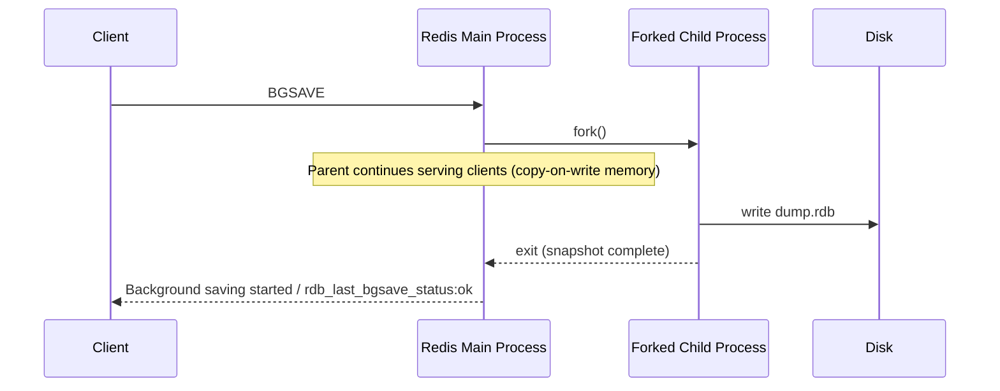
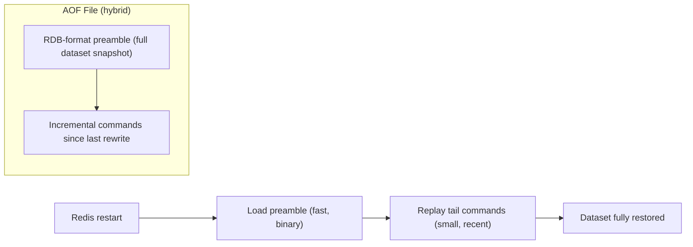
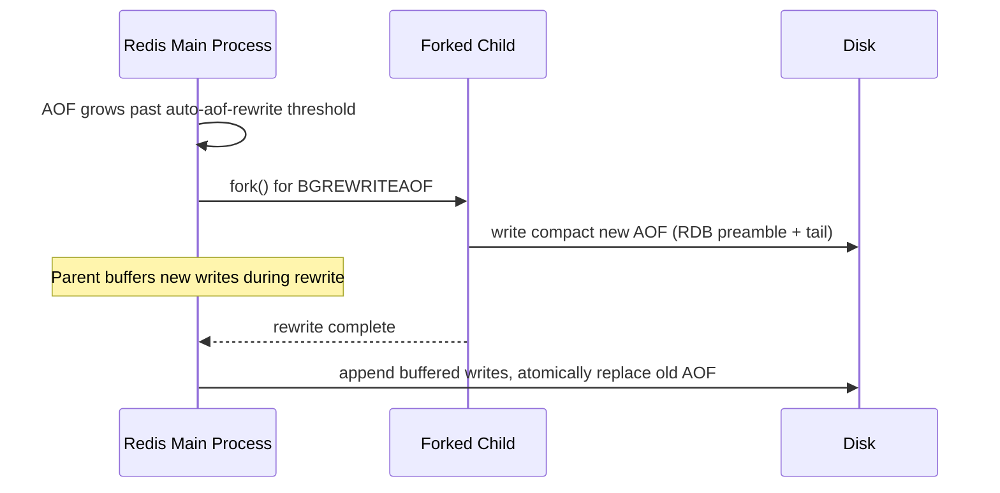

# Redis Persistence

## Theory

### RDB Snapshots

RDB (Redis Database) persistence produces a single compact binary file (`dump.rdb`) containing a point-in-time snapshot of the entire dataset. Snapshots are triggered either by configured save points (e.g., "save after 900 seconds if at least 1 key changed"), by the `SAVE`/`BGSAVE` commands, or automatically before certain operations like replication sync. `BGSAVE` is the production-relevant variant: Redis `fork()`s a child process that writes the snapshot while the parent continues serving clients, relying on the OS's copy-on-write semantics so the fork is cheap and doesn't block command processing for long.

RDB's strengths are compactness (a single file, ideal for backups and fast transfer to a new replica) and fast restarts (loading one binary snapshot is much quicker than replaying a long command log). Its weakness is durability granularity: since a snapshot only happens periodically, a crash between snapshots loses all writes since the last save point — this is the central trade-off compared to AOF.

```conf
# redis.conf save points: "save <seconds> <changes>"
save 900 1
save 300 10
save 60 10000
dbfilename dump.rdb
dir /var/lib/redis
```

```bash
redis-cli BGSAVE
redis-cli LASTSAVE
redis-cli INFO persistence | grep rdb_
```



### AOF (Append Only File)

The Append Only File logs every write command Redis executes, in order, to a file on disk, and reconstructs the dataset on restart by replaying that log from the beginning. Unlike RDB's periodic snapshots, AOF's durability is controlled by `appendfsync`, which determines how often the file is `fsync`'d to disk: `always` (every write, safest but slowest), `everysec` (fsync once per second — the recommended default, bounding potential loss to ~1 second of writes), or `no` (let the OS decide, fastest but least durable).

Because AOF logs every command, the file grows continuously and would eventually become unwieldy; Redis addresses this with **AOF rewriting** (covered separately below), which compacts the log into the minimal set of commands needed to reproduce the current dataset. AOF generally offers better durability guarantees than RDB alone, at the cost of larger file sizes and slightly slower restarts (replaying a log vs. loading a snapshot) — this is why hybrid mode (also below) is the modern default.

```conf
appendonly yes
appendfilename "appendonly.aof"
appenddirname "appendonlydir"
appendfsync everysec
```

```bash
redis-cli CONFIG SET appendonly yes
redis-cli INFO persistence | grep aof_
```

### Hybrid Persistence

Since Redis 4.0, AOF can operate in **hybrid mode** (`aof-use-rdb-preamble yes`, the default since Redis 5.0+): when the AOF is rewritten, the new file starts with the dataset encoded in the compact RDB binary format, followed by the incremental commands issued since the rewrite. This gives you the fast-loading benefit of RDB (loading the binary preamble is quick) combined with the fine-grained durability of AOF (only a small tail of recent commands needs to be replayed on top).

This is the recommended default for most production deployments requiring strong durability: enable both `appendonly yes` and `aof-use-rdb-preamble yes`, giving a restart profile that's nearly as fast as pure RDB while retaining AOF's per-second (or better) durability.

```conf
appendonly yes
aof-use-rdb-preamble yes
appendfsync everysec
```



### Persistence Trade-offs

Choosing between RDB, AOF, hybrid, or no persistence at all comes down to how much data loss is acceptable versus how much I/O overhead, disk space, and restart time the workload can tolerate. A pure cache in front of a system of record can safely disable persistence entirely, since a restart simply means repopulating from the source database on subsequent cache misses. A Redis instance holding data with no other copy (e.g., a queue, a rate-limiter's state, or a primary session store) needs AOF (or hybrid) with at least `everysec` fsync to bound potential loss to about one second of writes.

| Strategy | Data loss window | Restart speed | Disk overhead | When to use |
|---|---|---|---|---|
| None (`save ""`, `appendonly no`) | Everything since last restart | N/A (empty on start) | None | Pure cache with a reliable source of truth |
| RDB only | Up to the save-point interval | Fast (binary load) | Low (single compact file) | Backups, acceptable to lose minutes of data |
| AOF only (`everysec`) | ~1 second | Slower (replay log) | Higher (grows until rewrite) | Durability-sensitive data, no RDB needed |
| AOF only (`always`) | ~0 (every write fsynced) | Slower | Highest I/O overhead | Extreme durability needs, latency cost accepted |
| Hybrid (AOF + RDB preamble) | ~1 second | Fast (binary preamble + small tail) | Moderate | Recommended default for most production systems |

### Backup and Restore

Backing up Redis is straightforward because RDB snapshots are just files: trigger a `BGSAVE`, then copy the resulting `dump.rdb` (and/or the `appendonlydir` if AOF is enabled) to durable storage (S3, a backup server, etc.) on a schedule. Restoring is the reverse — place the backup file(s) in the configured `dir` before starting Redis, and it will load them automatically on startup.

For point-in-time recovery in a replicated setup, it's common to trigger backups against a **replica** rather than the primary, avoiding any `fork()`/I/O impact on the node serving live production traffic. Always verify restores periodically (e.g., load a backup into a scratch instance and sanity-check key counts) rather than trusting an untested backup pipeline.

```bash
# Trigger a snapshot and copy it off-box
redis-cli -h redis-replica.internal BGSAVE
scp redis-replica.internal:/var/lib/redis/dump.rdb ./backups/dump-$(date +%F).rdb

# Restore: stop Redis, place the file, start Redis
cp ./backups/dump-2026-08-01.rdb /var/lib/redis/dump.rdb
systemctl restart redis
redis-cli DBSIZE   # sanity check after restore
```

```bash
# Backing up AOF instead/in addition
redis-cli BGREWRITEAOF
tar -czf aof-backup-$(date +%F).tar.gz /var/lib/redis/appendonlydir
```

### AOF Rewrite (BGREWRITEAOF)

Because AOF logs every write command, the file would grow unbounded over time — including redundant history, like a key that was incremented a thousand times and then deleted, all of which is irrelevant once you only care about the current state. `BGREWRITEAOF` compacts the AOF by writing a new, minimal file representing the current dataset (using the RDB-preamble format in hybrid mode) and atomically replacing the old file once complete — exactly analogous to `BGSAVE`, using a forked child process so the main thread keeps serving traffic.

Redis can also trigger this automatically based on `auto-aof-rewrite-percentage` and `auto-aof-rewrite-min-size`, which fire a rewrite once the AOF has grown by a configured percentage since the last rewrite, past a minimum size threshold — preventing rewrites from firing constantly on a small, fast-growing-but-still-tiny file.

```conf
auto-aof-rewrite-percentage 100
auto-aof-rewrite-min-size 64mb
```

```bash
redis-cli BGREWRITEAOF
redis-cli INFO persistence | grep aof_rewrite
```



### Interview Questions

1. What is the difference between RDB and AOF persistence in Redis? — RDB produces a single compact binary point-in-time snapshot of the entire dataset at configured save points, favoring fast restarts and small files at the risk of losing all writes since the last snapshot, while AOF logs every write command in order and replays it on restart, offering finer-grained durability at the cost of larger files and slower restarts.
2. How does `BGSAVE` avoid blocking the main Redis process while writing a snapshot? — `BGSAVE` forks a child process that writes the snapshot to disk while the parent process continues serving client commands, relying on the OS's copy-on-write memory semantics so the fork itself is cheap and doesn't interrupt command processing for long.
3. What role does `fork()` and copy-on-write memory play in RDB and AOF rewrites? — `fork()` creates a child process sharing the parent's memory pages via copy-on-write, so the child can write a consistent snapshot (RDB) or rewritten log (AOF) of the dataset as it existed at fork time, without needing to copy the entire dataset upfront; pages are only duplicated if the parent modifies them while the child is still writing.
4. What does `appendfsync everysec` mean, and why is it the recommended default over `always` or `no`? — `appendfsync everysec` fsyncs the AOF to disk once per second, bounding potential data loss to about one second of writes; it's the recommended default because `always` (fsync every write) is safest but slowest, while `no` (letting the OS decide) is fastest but least durable, making `everysec` the best balance of durability and performance.
5. What is hybrid AOF persistence, and what problem does the RDB preamble solve? — Hybrid AOF persistence (`aof-use-rdb-preamble yes`, default since Redis 5.0+) writes a new AOF file starting with the dataset encoded in the compact RDB binary format followed by incremental commands since the rewrite, solving the slow-restart problem of pure AOF by making the bulk of the data load quickly as a binary snapshot while only a small tail of recent commands needs replaying.
6. What are the trade-offs between enabling persistence and running Redis purely as a cache with no persistence? — Disabling persistence (`save ""`, `appendonly no`) avoids all disk I/O overhead and is safe when a reliable source of truth can repopulate cache misses after a restart, whereas enabling persistence adds I/O overhead and disk space usage but is required whenever Redis holds data with no other copy, such as a queue or primary session store.
7. How would you recover a Redis instance from a backup after a total data loss? — Place the backed-up `dump.rdb` (and/or `appendonlydir` if using AOF) into the configured `dir` before starting Redis, then start the server so it loads the file(s) automatically on startup, and run a sanity check like `DBSIZE` afterward to confirm the restore worked.
8. Why would you take backups from a replica rather than the primary? — Triggering `BGSAVE` against a replica avoids any `fork()`/I/O impact on the node serving live production traffic, since the replica isn't handling the application's read/write load the way the primary is.
9. What triggers an automatic AOF rewrite, and what do `auto-aof-rewrite-percentage`/`auto-aof-rewrite-min-size` control? — Redis automatically triggers `BGREWRITEAOF` once the AOF has grown by `auto-aof-rewrite-percentage` since the last rewrite, but only past the `auto-aof-rewrite-min-size` threshold, which together prevent rewrites from firing constantly on a small, fast-growing-but-still-tiny file.
10. What data-loss window would you expect with RDB-only persistence versus AOF with `everysec`? — RDB-only persistence can lose all writes since the last save-point interval (potentially minutes), while AOF with `everysec` bounds potential loss to about one second of writes.
11. How would you verify that a Redis backup is actually restorable before you need it in an emergency? — Periodically load the backup file into a scratch/throwaway Redis instance and sanity-check key counts (`DBSIZE`) and spot-check a few known keys, rather than trusting an untested backup pipeline until a real emergency.
12. Why might a rewrite of the AOF file be necessary even though the file is technically "correct" as-is? — The AOF logs every write command including redundant history (e.g., a key incremented a thousand times then deleted), so even though replaying it produces the correct current dataset, the file grows unbounded over time; `BGREWRITEAOF` compacts it into the minimal set of commands (or an RDB preamble) needed to reproduce the current state.
13. What happens to new writes that arrive while a `BGREWRITEAOF` or `BGSAVE` is in progress? — The parent process continues serving and buffering new writes during the background fork; for `BGREWRITEAOF`, these buffered writes are appended to the new AOF file once the child's rewrite completes, and the old file is atomically replaced, so no writes are lost during the rewrite window.
14. If you needed the absolute minimum risk of data loss, what persistence configuration would you choose, and what's the cost? — `appendonly yes` with `appendfsync always`, fsyncing every single write to disk before acknowledging it, giving close to zero data-loss window at the cost of the highest I/O overhead and reduced write throughput/latency.
15. How does persistence configuration differ between a Redis node used purely as a cache versus one acting as a system of record? — A pure cache in front of a reliable source of truth can disable persistence entirely (`save ""`, `appendonly no`) since a restart just means repopulating from the source database, while a system-of-record node needs AOF or hybrid persistence with at least `everysec` fsync to bound data loss, since there is no other copy of that data.

