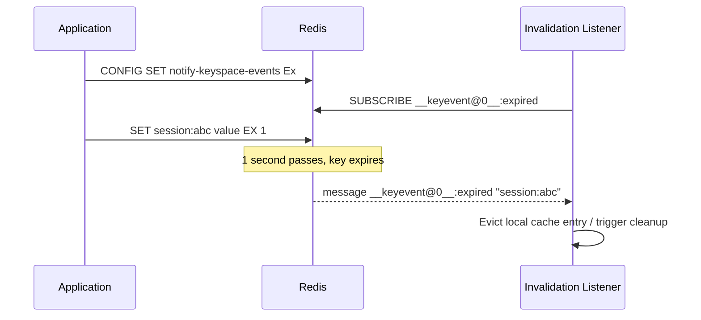

# Pub/Sub Messaging

## Theory

### Publish

The `PUBLISH channel message` command sends a message to a named channel. Redis delivers it immediately to every client currently subscribed to that channel (or matching it via a pattern subscription), and the command returns the **number of clients** that received the message. Publishing to a channel with zero subscribers is a no-op — the message is not stored, queued, or delivered to anyone; it simply disappears.

```bash
redis-cli PUBLISH notifications "New order #4521 created"
# (integer) 2   <- delivered to 2 currently-connected subscribers
```

```java
// Spring Data Redis
@Autowired
private StringRedisTemplate redisTemplate;

public void notifyOrderCreated(String orderId) {
    redisTemplate.convertAndSend("notifications", "New order " + orderId + " created");
}
```

### Subscribe

`SUBSCRIBE channel [channel ...]` puts the connection into subscriber mode, where it will receive any message published to the given channel(s). A subscribed connection is largely dedicated to receiving messages — in RESP2, a subscribed client can only issue a small set of pub/sub-related commands (`SUBSCRIBE`, `UNSUBSCRIBE`, `PSUBSCRIBE`, `PUNSUBSCRIBE`, `PING`, `QUIT`) until it unsubscribes from everything; ordinary data commands are rejected on that connection. This is why applications typically use a **separate connection** for subscribing versus issuing normal commands.

```bash
redis-cli SUBSCRIBE notifications
# Reading messages... (press Ctrl-C to quit)
# 1) "subscribe"
# 2) "notifications"
# 3) (integer) 1
# ... blocks here, printing each message as it arrives ...
```

```java
// Spring Data Redis - MessageListenerContainer keeps a dedicated subscription connection
@Bean
RedisMessageListenerContainer container(RedisConnectionFactory connectionFactory) {
    RedisMessageListenerContainer container = new RedisMessageListenerContainer();
    container.setConnectionFactory(connectionFactory);
    container.addMessageListener(
        (message, pattern) -> System.out.println("Received: " + new String(message.getBody())),
        new ChannelTopic("notifications")
    );
    return container;
}
```

### Pattern Subscriptions

`PSUBSCRIBE pattern [pattern ...]` subscribes to all channels whose name matches a glob-style pattern (`*`, `?`, `[...]`), rather than one exact channel name. This is useful when the set of concrete channel names is dynamic or hierarchical (e.g., per-tenant or per-room channels) and a consumer wants to listen to all of them without subscribing individually to each.

```bash
redis-cli PSUBSCRIBE "room.*"
# Matches: room.101, room.202, room.vip, etc.

redis-cli PUBLISH room.101 "user joined"
# Delivered to any client pattern-subscribed to room.* as well as exact subscribers of room.101
```

```java
container.addMessageListener(
    (message, pattern) -> System.out.println("Pattern: " + pattern + " -> " + new String(message.getBody())),
    new PatternTopic("room.*")
);
```

### Pub/Sub Limitations

Redis Pub/Sub is intentionally simple: it is a **fire-and-forget**, **at-most-once** messaging mechanism with no persistence layer behind it. This has several concrete implications that must be understood before relying on it for anything beyond ephemeral notifications:

- **No message history/replay** — a client that subscribes *after* a message was published never sees it; there is no backlog to catch up on.
- **No durability** — if Redis restarts, or the network drops a subscriber's connection momentarily, any messages published during that gap are lost forever.
- **No acknowledgement** — publishers have no way to know whether a specific subscriber actually processed a message, only how many subscribers were connected at publish time.
- **No consumer groups / load balancing** — every subscriber gets every message; there's no built-in way to have a pool of workers each process a distinct subset of messages (unlike Streams).
- **No back-pressure handling** — a slow subscriber can accumulate an output buffer on the server side; Redis will eventually disconnect clients whose output buffer exceeds configured limits (`client-output-buffer-limit pubsub`), silently dropping any pending messages to that client.

| Feature | Pub/Sub | Redis Streams | Kafka |
|---|---|---|---|
| Delivery guarantee | At-most-once | At-least-once (with consumer groups + ack) | At-least-once / exactly-once (configurable) |
| Message persistence | None | Yes (in-memory + optional RDB/AOF) | Yes (durable log, configurable retention) |
| Replay / history | No | Yes (by ID / offset) | Yes (by offset) |
| Consumer groups | No | Yes | Yes |
| Best for | Real-time, ephemeral broadcast | Lightweight durable event log within Redis | High-throughput durable event streaming at scale |

**Production scenario:** Pub/Sub is a poor fit for "process this payment event exactly once" business logic (use Streams or a proper message broker instead), but it is an excellent fit for "invalidate this cache entry on every app server right now" or "push a live UI update to connected dashboards" — situations where missing a message occasionally due to a transient disconnect is acceptable.

### Common Use Cases

Because of its at-most-once, fire-and-forget nature, Redis Pub/Sub is best suited to scenarios where losing an occasional message is tolerable and low latency, simple fan-out is the priority:

- **Cross-instance cache invalidation** — when one application node updates data, it publishes an invalidation event so every other node's local (in-process) cache can evict the stale entry.
- **Real-time notifications** — chat messages, live comment feeds, "user is typing" indicators.
- **Live dashboards / metrics broadcasting** — pushing updated counters or gauges to connected monitoring UIs.
- **Coordinating ephemeral cluster-wide events** — e.g., signaling all application instances to reload configuration.

### Keyspace Notifications

Redis can publish Pub/Sub events automatically whenever keys are modified, expired, or deleted — a feature called **keyspace notifications**. This is disabled by default (it has a small performance cost) and must be enabled via `notify-keyspace-events`, whose value is a combination of flags selecting which event classes to publish (e.g., `K` for keyspace channel, `E` for keyevent channel, `g` generic commands, `x` expired events, `A` all events).

Two channel naming conventions are used: `__keyspace@<db>__:<key>` (published per-key, message = event name) and `__keyevent@<db>__:<event>` (published per-event-type, message = key name). A common use is reacting to key expiration to trigger cleanup or cascading logic.

```bash
# Enable notifications for expired-key events on the keyevent channel
redis-cli CONFIG SET notify-keyspace-events "Ex"

# In one terminal: subscribe to expiration events for DB 0
redis-cli SUBSCRIBE __keyevent@0__:expired

# In another terminal: set a key with a 1 second TTL
redis-cli SET session:abc123 "data" EX 1
# ~1 second later, the subscriber receives:
# 1) "message"
# 2) "__keyevent@0__:expired"
# 3) "session:abc123"
```



**Production scenario:** A service maintains a small in-process (L1) cache on top of Redis (L2); it subscribes to `__keyevent@0__:expired` and `__keyevent@0__:del` events so that when a key naturally expires or is explicitly deleted in Redis, the local in-process copy is evicted immediately rather than waiting for its own (longer) local TTL to lapse.

### Interview Questions

- How does `PUBLISH` know how many subscribers received a message, and what does that return value mean? — `PUBLISH` returns an integer count of how many clients currently subscribed to (or pattern-matching) that channel the message was delivered to; publishing to a channel with zero subscribers returns 0 and the message simply disappears without being stored or queued.
- What commands can a client issue while in subscriber mode, and why is that restricted? — In RESP2, a subscribed connection can only issue `SUBSCRIBE`, `UNSUBSCRIBE`, `PSUBSCRIBE`, `PUNSUBSCRIBE`, `PING`, and `QUIT` until it unsubscribes from everything; ordinary data commands are rejected, which is why applications typically dedicate a separate connection to subscribing versus issuing normal commands.
- What is the difference between `SUBSCRIBE` and `PSUBSCRIBE`? — `SUBSCRIBE` listens to one or more exact channel names, while `PSUBSCRIBE` subscribes to all channels whose name matches a glob-style pattern (e.g., `room.*`), useful when the set of concrete channel names is dynamic or hierarchical.
- Why is Redis Pub/Sub described as "fire-and-forget," and what are the practical consequences? — Pub/Sub has no persistence layer behind it, so a client subscribed after a message was published never sees it, messages published during a disconnect are lost forever, and there's no acknowledgement that a subscriber actually processed a message — making it suitable only for scenarios where occasional message loss is acceptable.
- What happens to a published message if no client is currently subscribed to that channel? — The message is not stored, queued, or delivered to anyone; `PUBLISH` simply returns 0 and the message disappears entirely.
- Compare Redis Pub/Sub to Redis Streams — which delivery guarantees does each provide? — Pub/Sub provides at-most-once delivery with no persistence, replay, or consumer groups; Redis Streams provide at-least-once delivery via consumer groups with explicit acknowledgment (`XACK`), persist entries so they can be replayed by ID, and support multiple independent consumer groups reading at their own pace.
- When would you choose Kafka over Redis Pub/Sub or Streams? — Choose Kafka when you need high-throughput, durable event streaming at scale with configurable exactly-once semantics and long-term retention across a distributed cluster, whereas Redis Streams suit a lightweight durable event log embedded within an existing Redis deployment and Pub/Sub suits ephemeral, at-most-once real-time broadcast.
- What are keyspace notifications, and how do you enable them? — Keyspace notifications are Pub/Sub events Redis publishes automatically when keys are modified, expired, or deleted; they're disabled by default (small performance cost) and enabled by setting `notify-keyspace-events` to a combination of flags selecting which event classes to publish (e.g., `K` keyspace channel, `E` keyevent channel, `x` expired events, `A` all events).
- What's the difference between the `__keyspace@<db>__` and `__keyevent@<db>__` channel conventions? — `__keyspace@<db>__:<key>` is published per-key with the event name as the message, while `__keyevent@<db>__:<event>` is published per-event-type with the key name as the message — both conventions carry the same information, just organized around a different subscription axis (by key vs. by event type).
- Describe a real production use case where losing a Pub/Sub message occasionally would be acceptable. — Pushing a live UI update to connected dashboards or "user is typing" chat indicators — if a client misses one update due to a transient disconnect, the next update quickly supersedes it, so no lasting harm results from the occasional dropped message.
- Why can a slow subscriber cause Redis to disconnect it, and what configuration controls this? — A slow subscriber that can't keep up with incoming messages accumulates an output buffer on the server side; Redis enforces `client-output-buffer-limit pubsub`, and once a client's buffer exceeds the configured limits, Redis disconnects it, silently dropping any pending messages to that client.
- How would you implement cross-instance cache invalidation using Pub/Sub? — When one application node updates data, it publishes an invalidation event (e.g., the changed key) to a shared channel; every other node subscribes to that channel and, on receiving the message, evicts the corresponding entry from its own local in-process cache.

