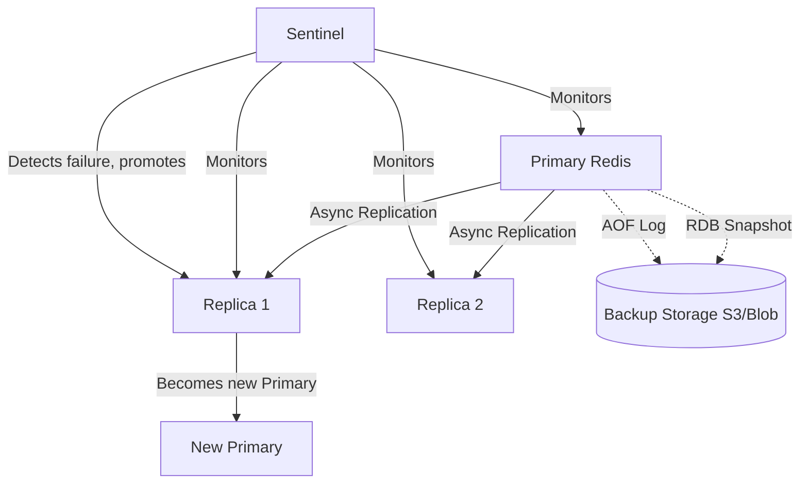

# Reliability and Recovery

## Theory

### Backup Strategies

Redis offers two complementary persistence mechanisms that double as the foundation for backups: **RDB** (Redis Database) snapshots, which are point-in-time, compact binary dumps of the entire dataset written on a configurable schedule or on demand, and **AOF** (Append-Only File), which logs every write command (or an equivalent, via `rewrite`) for finer-grained durability. For backup purposes, RDB files are the more practical artifact — they are single, compact files that can be copied off-host and restored quickly, whereas AOF files are larger and slower to replay.

A robust backup strategy combines periodic RDB snapshots (`SAVE`/`BGSAVE`, or automatic `save` rules in `redis.conf`) with off-host replication of the resulting `.rdb` file to durable storage (S3, GCS, or an equivalent), on a schedule appropriate to acceptable data loss (RPO). `BGSAVE` should always be preferred over `SAVE` in production, since `SAVE` blocks the main event loop for the entire dump duration while `BGSAVE` forks a child process to write the snapshot without blocking client commands (though the fork itself briefly pauses the server and consumes memory proportional to changed pages via copy-on-write).

```bash
# Trigger a non-blocking background save
redis-cli BGSAVE

# Check whether the last BGSAVE succeeded and when
redis-cli INFO persistence | grep -E "rdb_last_bgsave_status|rdb_last_save_time"

# Typical redis.conf snapshot schedule (save after N seconds if M keys changed)
save 900 1
save 300 10
save 60 10000
```

```bash
# Example off-host backup pipeline (cron job)
redis-cli --rdb /backup/dump-$(date +%F).rdb
aws s3 cp /backup/dump-$(date +%F).rdb s3://my-backups/redis/
```

For managed services (ElastiCache, Redis Cloud, Azure Cache for Redis), automated daily/hourly snapshotting with retention policies is typically built in and should be enabled and periodically test-restored rather than assumed to work.

### Disaster Recovery

Disaster recovery (DR) planning for Redis addresses the scenario where an entire region, availability zone, or the primary dataset is lost, and defines how quickly (RTO) and with how much data loss (RPO) service can be restored. Because Redis is in-memory, a naive single-instance deployment has an RPO bounded only by the persistence configuration (potentially losing everything since the last snapshot) and an RTO bounded by how long it takes to provision a new instance and reload the dataset from disk (which can be slow for very large datasets, since reload is single-threaded).

Production DR strategies typically layer several techniques: cross-region replication (a replica in a secondary region kept in sync asynchronously, promoted manually or via automation on regional failure), regular tested backups restorable in a different region, and infrastructure-as-code so a full Redis topology can be recreated quickly without manual configuration. For Redis Cluster deployments, DR planning must also account for restoring the correct shard/slot topology, not just the data.



The DR plan should be periodically rehearsed (a "game day" restoring from backup into a clean environment and validating data integrity/application connectivity) since an untested backup is only a theoretical safety net — corrupted or incompatible snapshots are often only discovered during an actual outage if never test-restored.

### Data Consistency Considerations

Redis replication is asynchronous by default: the primary acknowledges a write to the client before confirming the replica has received it, which means a failover (planned or unplanned) can lose the last few writes that had not yet propagated to the promoted replica — a form of eventual consistency rather than strong consistency. Applications relying on Redis as a system of record (rather than purely as a cache) must explicitly account for this, since data loss on failover is possible even with persistence enabled.

For workloads that need stronger guarantees, Redis provides `WAIT numreplicas timeout`, which blocks the client until a write has been acknowledged by at least the specified number of replicas (or the timeout elapses), trading latency for a stronger (though still not fully synchronous/linearizable) consistency guarantee. Redis Cluster, meanwhile, can lose acknowledged writes during network partitions in edge cases, since it also favors availability and performance over strict CP guarantees (Redis prioritizes AP-leaning behavior in the CAP sense, with configurable knobs to shift the balance).

```bash
# Require acknowledgment from at least 1 replica within 100ms before considering the write durable
redis-cli WAIT 1 100
```

The practical takeaway: for pure caching, eventual consistency and possible loss-on-failover is entirely acceptable (the cache simply repopulates from the source of truth). For use cases where Redis holds data with no other copy (session state without a fallback, a distributed lock, a queue with no re-derivation path), the consistency trade-offs must be deliberately assessed and mitigated (e.g., via `WAIT`, AOF with `appendfsync always`, or simply not treating Redis as the sole source of truth for critical data).

### Recovery from Failures

Recovering from a Redis failure depends on the failure mode: a process crash on a single instance with persistence enabled recovers automatically on restart by reloading the RDB file and/or replaying the AOF; a hardware/host failure requires failover to a replica (automatic via Sentinel or Cluster, or manual in simpler topologies); and data corruption (a malformed RDB/AOF file) requires restoring from the most recent known-good backup.

**Sentinel** provides automated failure detection and failover for non-clustered primary/replica deployments: multiple Sentinel processes monitor the primary and replicas, and upon quorum agreement that the primary is unreachable, they elect a replica to be promoted and reconfigure other replicas and (via pub/sub notifications) aware clients to point at the new primary. **Redis Cluster** has built-in failure detection and automatic failover per shard, promoting a replica within the affected shard without full-cluster downtime, since only the keys owned by the failed shard are briefly unavailable.

```bash
# Check replication/failover-relevant state
redis-cli INFO replication

# Sentinel: check monitored master status
redis-cli -p 26379 SENTINEL master mymaster

# Manually force a replica to become a primary (e.g., planned maintenance failover)
redis-cli REPLICAOF NO ONE
```

After any failover or recovery event, the standard operational checklist is: confirm the new topology (`INFO replication` on all nodes), verify application connectivity/DNS or service-discovery has updated, check for any data-loss window via timestamps in application logs, and review the Slow Log/Latency Monitor for lingering effects of the failure event.

### Interview Questions

1. What is the difference between RDB and AOF persistence, and how does each affect backup and recovery strategy? — RDB produces compact, point-in-time binary snapshots that are fast to restore but can lose all writes since the last snapshot; AOF logs every write command for finer-grained durability (configurable via `appendfsync`) but produces larger files that are slower to replay; for backups, RDB's single compact file is the more practical artifact to copy off-host, while AOF offers a lower RPO for recovery.
2. Why is `BGSAVE` preferred over `SAVE` in production, and what is happening under the hood during a background save? — `SAVE` blocks the main event loop for the entire dump duration, freezing all clients; `BGSAVE` forks a child process that writes the snapshot while the parent continues serving clients, relying on copy-on-write so the child sees a consistent point-in-time view without the parent needing to pause, at the cost of a brief fork-time pause and extra memory for pages that change during the save.
3. What factors determine RTO and RPO for a Redis deployment, and how do you minimize each? — RPO is bounded by the persistence configuration (snapshot frequency, `appendfsync` policy) and replication lag, minimized with more frequent AOF fsyncs or `WAIT`-enforced replica acknowledgment; RTO is bounded by dataset reload/replay time and provisioning speed of a replacement instance, minimized with automated failover (Sentinel/Cluster), warm standby replicas, and infrastructure-as-code for fast redeployment.
4. How does Redis Sentinel detect and handle a primary failure? — Multiple Sentinel processes independently monitor the primary and its replicas via periodic pings; when a quorum of Sentinels agrees the primary is unreachable, they hold a leader election among themselves, elect a replica to promote, reconfigure the remaining replicas to follow the new primary, and notify aware clients of the topology change via pub/sub.
5. How does failover differ between a simple primary/replica setup and Redis Cluster? — In a simple primary/replica setup (with Sentinel), failover promotes a replica to be the sole new primary for the entire dataset, causing a brief full-instance outage during the transition; in Redis Cluster, failover happens per-shard, so only the keys owned by the affected shard are briefly unavailable while a replica in that shard is promoted, and the rest of the cluster continues serving traffic uninterrupted.
6. Why is Redis replication asynchronous by default, and what data-loss risk does that introduce on failover? — Asynchronous replication lets the primary acknowledge a write to the client immediately, without waiting for replicas to confirm receipt, which maximizes write throughput and latency; the risk is that if the primary fails before a write propagates to the replica that gets promoted, that write is permanently lost, making Redis's default replication an eventually-consistent, not strongly-consistent, model.
7. What does the `WAIT` command do, and what consistency guarantee does it provide (and not provide)? — `WAIT numreplicas timeout` blocks the calling client until the preceding write has been acknowledged by at least the specified number of replicas or the timeout elapses, giving stronger durability confidence than fire-and-forget async replication; however, it does not provide full linearizability or a strict synchronous guarantee across all replicas, and a failure during the wait window can still result in data loss in edge cases.
8. How would you design a disaster recovery plan for a Redis deployment spanning multiple regions? — Combine cross-region asynchronous replication (a replica in a secondary region promotable on regional failure), regular RDB/AOF backups shipped to durable, region-independent storage (S3/GCS) and periodically test-restored, and infrastructure-as-code so the full topology (including Cluster shard/slot layout) can be recreated quickly in a new region without manual reconfiguration.
9. What steps would you take to recover from a corrupted RDB or AOF file? — First attempt an automated repair (`redis-check-rdb` or `redis-check-aof --fix` for a corrupted AOF, which can truncate a partially-written trailing command), and if the file cannot be safely repaired, restore from the most recent known-good backup, then reconcile any data written between that backup and the failure using application logs or a replica that may still hold a valid copy.
10. How would you validate that your Redis backups are actually restorable before you need them in an emergency? — Periodically run a "game day" restore drill: load a backup RDB file into a clean, isolated Redis instance in a non-production environment, verify data integrity (key counts, sample value checks) and application connectivity against it, since an untested backup is only a theoretical safety net and corruption or incompatibility is often only discovered when actually restoring.
11. What operational checks would you perform immediately after an unplanned Redis failover? — Confirm the new topology via `INFO replication` on every node, verify application connectivity/DNS or service-discovery has updated to point at the new primary, check application logs for a data-loss window around the failover timestamp, and review the Slow Log/Latency Monitor for any lingering performance effects of the failure event.

