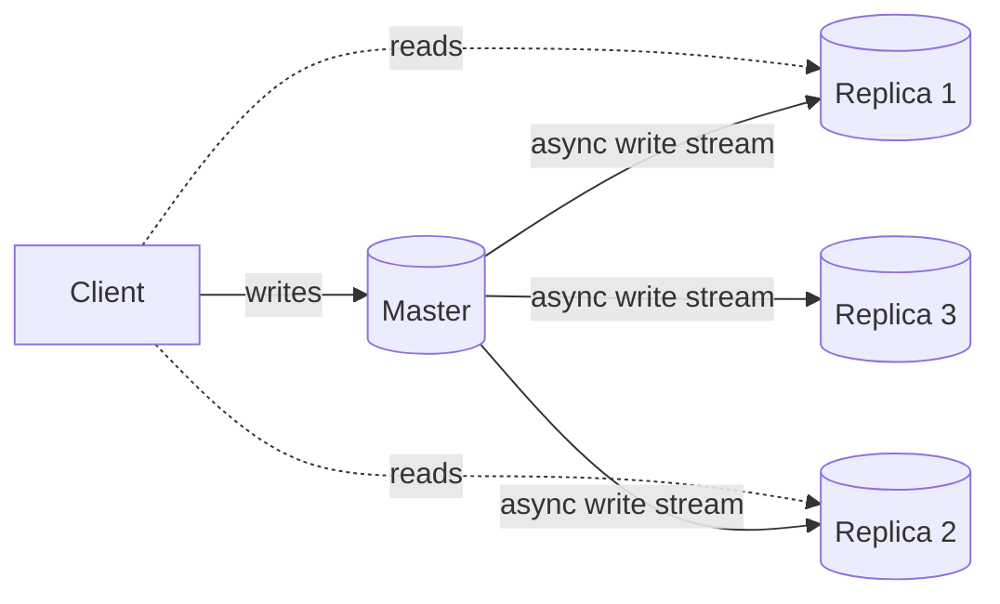
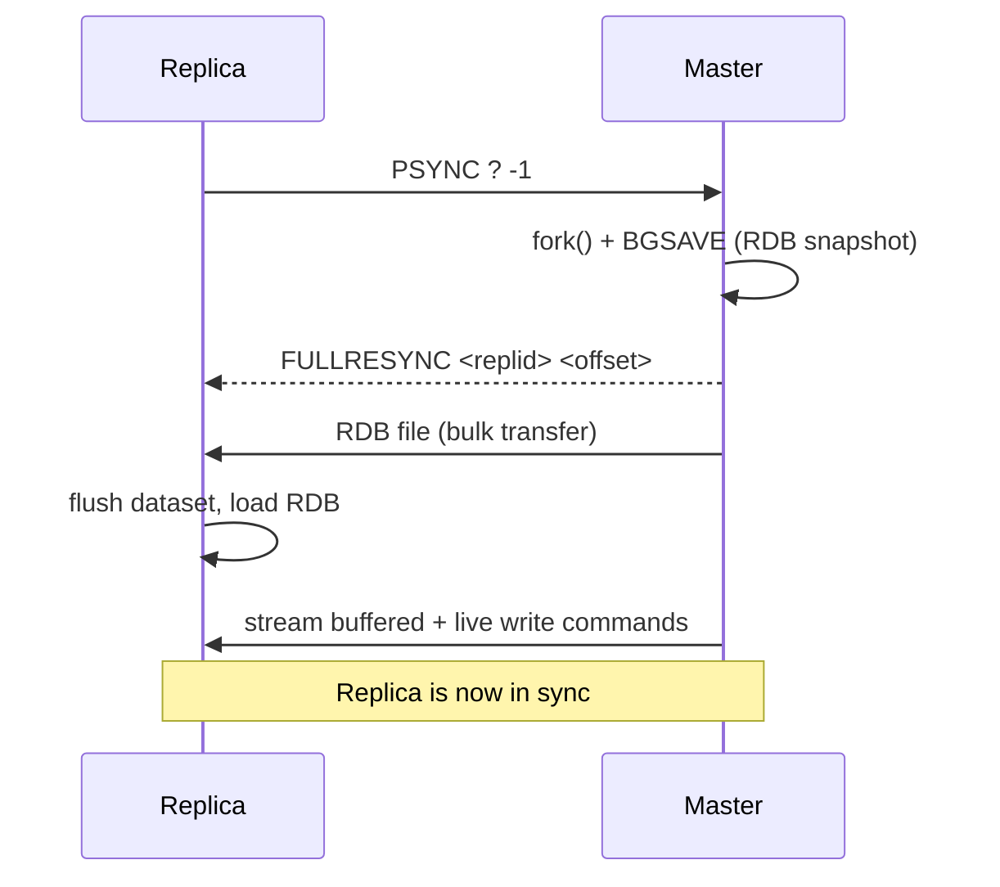
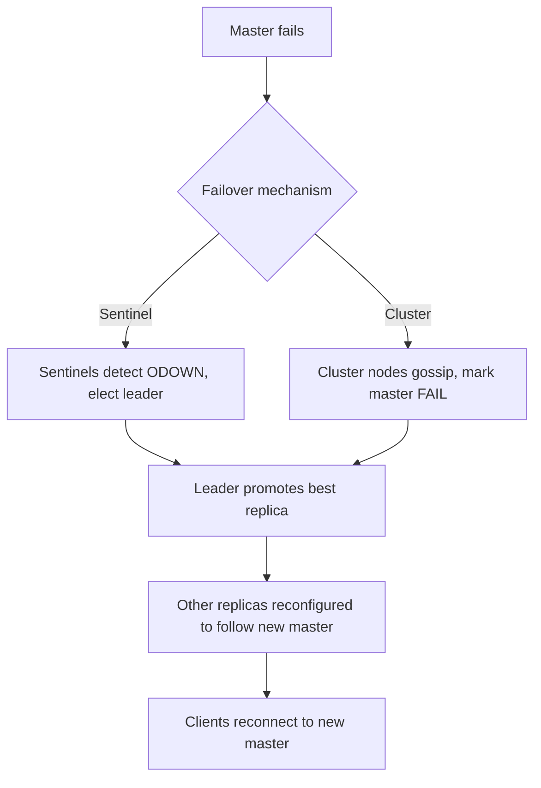
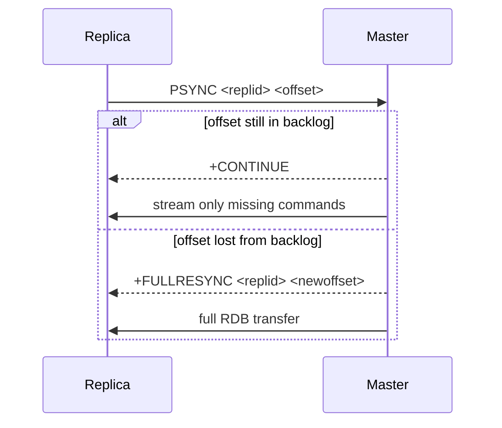

# Replication and High Availability

## Theory

### Master-Replica Replication

Redis replication lets one or more replica (formerly "slave") instances maintain an exact, continuously-updated copy of a master's dataset. Replication is asynchronous by default: the master doesn't wait for replicas to acknowledge writes before responding to the client, which keeps write latency low but means a replica can lag behind the master by a small amount at any given time. Redis also supports semi-synchronous behavior via `WAIT`, which lets a client block until a write has been propagated to at least N replicas.

A replica is configured to follow a master either in `redis.conf` with `replicaof <master-ip> <master-port>` or dynamically at runtime with the `REPLICAOF` command (`SLAVEOF` is the deprecated alias). Once connected, the replica performs an initial synchronization (typically a full resync on first connect) and then continuously receives a stream of write commands from the master to stay up to date. Replicas are read-only by default (`replica-read-only yes`), preventing accidental divergence from the master's dataset.

```conf
# On the replica's redis.conf
replicaof 10.0.0.5 6379
replica-read-only yes
```

```bash
# Or dynamically, via redis-cli connected to the replica
REPLICAOF 10.0.0.5 6379

# Check replication status
INFO replication

# Detach a replica and make it a standalone master again
REPLICAOF NO ONE
```



**Production scenario:** Replication is the foundation for both read scaling (offloading `GET`-heavy traffic to replicas) and high availability (a replica can be promoted to master if the original master fails).

### Replication Process

When a replica first connects to a master (or reconnects after being disconnected long enough that partial resync isn't possible), Redis performs a **full synchronization**:

1. The replica sends a `PSYNC ? -1` command indicating it doesn't have a previous replication ID/offset to resume from.
2. The master starts a background save, creating an RDB snapshot of its current dataset (using a forked child process so the parent can keep serving clients).
3. While the RDB is being generated, the master buffers any new write commands that arrive in a **replication backlog**.
4. The master sends the RDB file to the replica; the replica discards its old dataset and loads the RDB into memory.
5. The master then streams the buffered write commands (and any new ones) to the replica, which applies them to reach the exact same state as the master.
6. From this point on, the connection stays open and the master streams every subsequent write command in real time.



This process is I/O and CPU intensive on the master (fork cost, disk/network for the RDB transfer), which is why partial resynchronization (covered later) is preferred whenever possible to avoid repeating a full sync for brief network blips.

### Read Replicas

Because replicas maintain a live copy of the master's data and accept read commands (as long as `replica-read-only` is enabled, which is the default), they are commonly used to horizontally scale read throughput. Applications can direct read-heavy operations — analytics queries, reporting, dashboards, search-like scans — to one or more replicas while routing all writes to the master.

Client libraries and proxies (like a Spring Data Redis `LettuceClientConfiguration` with `ReadFrom.REPLICA_PREFERRED`, or `ReadFrom.NEAREST`) can automatically distribute read traffic. However, because replication is asynchronous, reads from a replica are subject to **eventual consistency** — a client that writes to the master and then immediately reads from a replica might not see its own write yet. This is an important trade-off to communicate to application teams: read replicas are great for scaling aggregate/reporting-style reads but risky for read-your-own-writes correctness requirements without additional care (e.g., reading from the master right after a write, or using `WAIT`).

```java
// Spring Data Redis example: prefer reading from replicas
LettuceClientConfiguration clientConfig = LettuceClientConfiguration.builder()
        .readFrom(ReadFrom.REPLICA_PREFERRED)
        .build();
```

### Failover Concepts

Failover is the process of promoting a replica to become the new master when the original master becomes unavailable (crash, network partition, planned maintenance). Redis distinguishes between:

- **Manual failover** — an operator (or an orchestration tool) explicitly runs `REPLICAOF NO ONE` on a chosen replica to promote it, and reconfigures other replicas and clients to point at the new master. This is predictable and safe but requires human/tooling intervention and incurs downtime while it happens.
- **Automatic failover** — handled by **Redis Sentinel** (for master-replica deployments) or natively by **Redis Cluster** (via its gossip protocol and internal voting). These systems detect master failure and promote the best-positioned replica (typically the one with the highest replication offset, i.e. the most up-to-date) without human intervention.

Key considerations during any failover: possible data loss (writes that reached the old master but hadn't yet been replicated), a brief write-unavailability window while the new master is elected and clients reconnect, and the need to avoid **split-brain** (two nodes both believing they're the master, e.g. after a network partition heals incorrectly).



### Partial Resynchronization (PSYNC)

Partial resynchronization is an optimization that avoids the expensive full-sync process (fork + RDB transfer) when a replica temporarily disconnects and reconnects shortly after — for example, due to a brief network blip. It relies on three pieces of state:

- **Replication ID (`replid`)** — a unique identifier for a given "history" of the dataset, shared by the master and its replicas.
- **Replication offset** — a monotonically increasing byte counter representing how much of the write stream has been processed.
- **Replication backlog buffer** — a fixed-size in-memory circular buffer on the master (`repl-backlog-size`, default 1MB) that retains the most recent stream of write commands.

When a replica reconnects, instead of starting from scratch it sends `PSYNC <replid> <offset>` telling the master exactly where it left off. If the master still has that offset available in its backlog buffer (i.e., the disconnect wasn't too long and the buffer wasn't overwritten), it replies `+CONTINUE` and streams only the missing commands — a partial resync. If the offset has already been evicted from the backlog, the master falls back to a full resync (`+FULLRESYNC`).

```conf
# redis.conf
repl-backlog-size 4mb
repl-backlog-ttl 3600
```



**Full resync vs partial resync comparison:**

| Aspect | Full Resync | Partial Resync (PSYNC) |
|---|---|---|
| Cost on master | High (fork, RDB generation, full transfer) | Low (just streams missing backlog data) |
| Cost on replica | High (discard + reload entire dataset) | Low (applies incremental commands) |
| Triggered when | First connect, or offset lost from backlog | Brief disconnect within backlog window |
| Network usage | Proportional to full dataset size | Proportional to missed write volume |

**Tuning tip:** Increasing `repl-backlog-size` gives replicas a larger window to reconnect and still qualify for partial resync, at the cost of more memory on the master — valuable in environments with flaky networks or frequent brief replica restarts.

### Interview Questions

- Is Redis replication synchronous or asynchronous by default, and what does `WAIT` change about that? — Replication is asynchronous by default, meaning the master doesn't wait for replicas to acknowledge writes before responding to the client, keeping write latency low but allowing replicas to lag; `WAIT numreplicas timeout` lets a client block until a write has been propagated to at least N replicas, providing a semi-synchronous guarantee when needed.
- Walk through the steps of a full synchronization between a master and a new replica. — The replica sends `PSYNC ? -1`; the master forks a child process to run `BGSAVE`, generating an RDB snapshot while buffering new writes in the replication backlog; the master sends the RDB file to the replica, which discards its old dataset and loads it; the master then streams the buffered plus any new write commands to the replica, and from then on streams every subsequent write in real time.
- Why does the master fork a child process during a full resync? — Forking lets a child process generate the RDB snapshot using copy-on-write memory while the parent process continues serving live client traffic uninterrupted, avoiding blocking command processing for the duration of the snapshot generation.
- What does `replica-read-only` do and why is it the default? — `replica-read-only yes` prevents clients from writing directly to a replica, ensuring the replica's dataset can only change via the replication stream from the master; this is the default to prevent accidental divergence between replica and master data.
- What consistency guarantees (or lack thereof) do read replicas provide, and how could stale reads affect an application? — Because replication is asynchronous, replicas only offer eventual consistency; a client that writes to the master and immediately reads from a replica might not see its own write yet, which can cause read-your-own-writes bugs unless the application reads from the master right after writing or uses `WAIT`.
- What's the difference between manual and automatic failover? — Manual failover requires an operator or tool to explicitly run `REPLICAOF NO ONE` on a chosen replica and reconfigure others, which is predictable but requires intervention and incurs downtime; automatic failover (via Sentinel or Cluster) detects master failure and promotes the best-positioned replica without human intervention.
- What is split-brain in the context of Redis high availability, and how is it avoided? — Split-brain is when two nodes both believe they are the master simultaneously, typically after a network partition heals incorrectly; it's avoided through mechanisms like Sentinel's quorum-based voting or Cluster's majority-based failure detection, ensuring only one node is recognized as master by the majority of the system at any time.
- What state does the replication backlog buffer hold, and what configuration controls its size? — The replication backlog buffer is a fixed-size in-memory circular buffer on the master holding the most recent stream of write commands, sized via `repl-backlog-size` (default 1MB); it's what allows a reconnecting replica to catch up via partial resync instead of a full resync.
- Explain how `PSYNC <replid> <offset>` enables partial resynchronization. — A reconnecting replica sends its last known replication ID and offset; if the master's backlog buffer still contains that offset, it replies `+CONTINUE` and streams only the commands the replica missed, avoiding the cost of a full RDB transfer and dataset reload.
- Under what conditions does a master fall back to a full resync instead of honoring a partial resync request? — If the requested offset has already been evicted from the replication backlog buffer (e.g., the replica was disconnected too long or too much write volume occurred in the meantime), the master replies `+FULLRESYNC` and performs a full RDB-based synchronization instead.
- How would increasing `repl-backlog-size` affect failover/reconnection behavior? — A larger backlog gives replicas a bigger window of missed write history to reconnect within and still qualify for a cheap partial resync, reducing the frequency of expensive full resyncs at the cost of additional memory consumed on the master.
- Why might a replica be several writes "behind" the master at any given moment? — Because replication is asynchronous, the master acknowledges client writes before confirming replicas have applied them, so network latency or replica processing delays can leave a replica's applied offset trailing the master's at any instant.
- How does a replica become a standalone master, and when would you do that manually? — Running `REPLICAOF NO ONE` on a replica detaches it from its master, making it an independent standalone master accepting its own writes; this is done manually during a planned failover, disaster recovery, or when permanently splitting a replica off into its own independent deployment.
- What criteria determine which replica is promoted during an automatic failover?
- How do client libraries like Lettuce decide which node to send read commands to?

