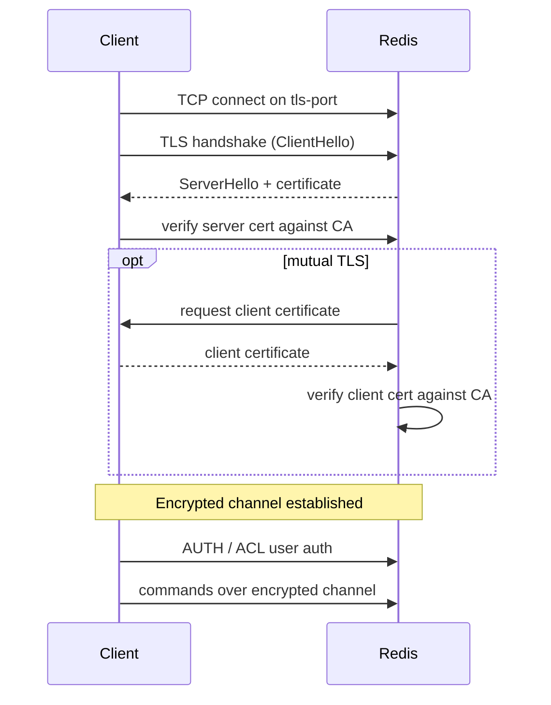
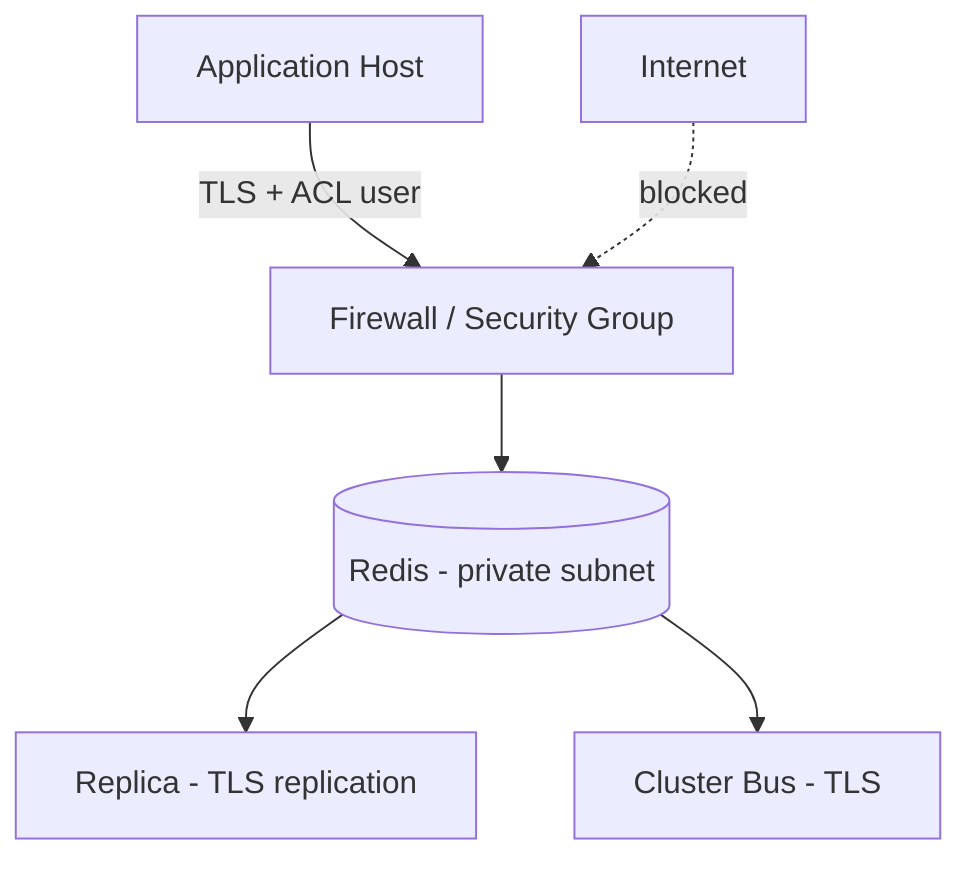

# Redis Security

## Theory

### Authentication (AUTH)

By default, classic Redis authentication is a single shared password configured via the `requirepass` directive in `redis.conf`. Once set, every client must issue `AUTH <password>` immediately after connecting (or supply it as part of the connection handshake) before any other command is accepted; unauthenticated clients receive a `NOAUTH` error for anything else.

```conf
# redis.conf
requirepass "a-very-strong-random-password"
```

```bash
redis-cli -h 10.0.0.5 -p 6379
> PING
(error) NOAUTH Authentication required.
> AUTH a-very-strong-random-password
OK
> PING
PONG

# Or authenticate inline
redis-cli -h 10.0.0.5 -p 6379 -a a-very-strong-random-password PING
```

This single-password model is simple but coarse: every client that knows the password has identical, full access to every command and every key. This limitation is precisely what ACLs (below) were introduced to solve.

### ACL (Access Control Lists)

Since Redis 6.0, Access Control Lists (ACLs) allow defining multiple named users, each with its own password(s), and fine-grained permissions over which commands and which key patterns that user may access. This replaces the "one shared password, full access" model with proper least-privilege security, similar in spirit to database user/role systems.

An ACL rule combines: enabling/disabling the user (`on`/`off`), one or more passwords (or `nopass`), allowed key patterns (`~pattern`), allowed Pub/Sub channels (`&pattern`), and allowed/denied commands or command categories (`+@category`, `-@category`, `+command`, `-command`).

```bash
# Create a read-only user restricted to keys under "session:*"
ACL SETUSER app_readonly on >StrongPass123 ~session:* +@read -@write

# Create an app user that can only run specific commands on a specific key prefix
ACL SETUSER billing_service on >AnotherPass456 ~billing:* +get +set +expire -@dangerous

# Inspect the current connection's identity
ACL WHOAMI

# List all configured users and their rules
ACL LIST

# Remove a user
ACL DELUSER app_readonly
```

```conf
# Users can also be defined declaratively in redis.conf or a separate ACL file
aclfile /etc/redis/users.acl
```

**Real-life scenario:** A microservices platform gives each service its own Redis ACL user scoped to only the key prefixes it owns (`orders:*`, `inventory:*`, etc.) and only the commands it needs — a reporting service gets `+@read` only, while an ingestion service gets `+@write` but is explicitly denied `+flushall`/`+flushdb`/`+config`. This limits blast radius if any single service's credentials are compromised.

### Protected Mode

Protected mode is a safety guard, enabled by default, that prevents Redis from being accidentally exposed to the network with no authentication configured. If Redis is bound to all interfaces (or no explicit `bind` directive limiting it to loopback) and no `requirepass`/ACL password is set, protected mode makes Redis refuse connections from any address other than loopback (127.0.0.1 / ::1) and Unix sockets, replying with an explanatory error instead of silently accepting unauthenticated remote commands.

```conf
# redis.conf
protected-mode yes
bind 127.0.0.1 -::1
```

This exists specifically because early, careless Redis deployments exposed to the public internet without a password became a well-known attack vector (attackers using them to write SSH keys, cron jobs, or ransom the data). Protected mode does not replace proper authentication and firewalling — it's a last-resort guard rail, not a security feature to rely on by itself.

### TLS Support

Since Redis 6.0, Redis supports encrypting client-server (and replication/cluster-bus) traffic natively with TLS, without requiring a separate stunnel proxy as earlier versions did. TLS protects data in transit from eavesdropping and tampering, and can additionally use mutual TLS (mTLS) to authenticate clients via certificates rather than (or in addition to) passwords.

```conf
# redis.conf
tls-port 6380
port 0
tls-cert-file /etc/redis/tls/redis.crt
tls-key-file /etc/redis/tls/redis.key
tls-ca-cert-file /etc/redis/tls/ca.crt
tls-auth-clients yes
tls-replication yes
tls-cluster yes
```

```bash
redis-cli --tls \
  --cert /etc/redis/tls/client.crt \
  --key /etc/redis/tls/client.key \
  --cacert /etc/redis/tls/ca.crt \
  -h redis.internal -p 6380 PING
```



Setting `port 0` disables the plaintext port entirely, forcing all traffic through TLS — an important step, since leaving both a TLS port and a plaintext port open defeats the purpose.

### Command Renaming

For an extra layer of defense-in-depth, Redis allows renaming (or effectively disabling) specific commands that are considered dangerous in production — most notably ones that can destroy data (`FLUSHALL`, `FLUSHDB`), leak/alter configuration (`CONFIG`), or that can be abused for reconnaissance (`KEYS` on a large keyspace). This is configured via `rename-command` in `redis.conf`.

```conf
# redis.conf
rename-command FLUSHALL ""
rename-command FLUSHDB ""
rename-command CONFIG "CONFIG_9f2a7c3b"
rename-command KEYS ""
```

Renaming a command to an empty string effectively disables it entirely — any client attempting to call it gets an "unknown command" error. Renaming it to an obscure string still allows administrators who know the new name to use it, while making it inaccessible to anyone who doesn't. Note that this is security-through-obscurity and should be treated as a supplementary control, not a substitute for ACLs, authentication, and network isolation — the renamed command is still discoverable by anyone with `CONFIG GET` access or by observing traffic if TLS isn't used.

**Trade-off:** With ACLs available since Redis 6, `+@dangerous`/`-@dangerous` categories and per-user command restrictions are generally the more maintainable, auditable way to achieve the same goal, since command renaming is a global, all-or-nothing setting that also has to be kept in sync across every client/tool that talks to Redis.

### Network Security Best Practices

Beyond application-level authentication, a defense-in-depth Redis deployment layers several network and operational controls:

- **Bind to specific interfaces** — never leave Redis listening on `0.0.0.0` without a firewall; use `bind` to restrict to private/internal interfaces only.
- **Firewall / security groups** — restrict inbound access on the Redis port (and cluster bus port) to only the specific application hosts/subnets that need it.
- **Run behind a VPC/private network** — avoid exposing Redis directly to the public internet under any circumstances.
- **Use TLS for all traffic**, including replication and cluster-bus traffic, especially across availability zones or datacenters.
- **Enforce ACLs with least privilege** per application/service rather than a single shared password.
- **Disable/rename dangerous commands** as a supplementary control.
- **Keep `protected-mode yes`** unless you have deliberately and correctly configured authentication and network restrictions.
- **Patch regularly** — subscribe to Redis security advisories, since like any server software Redis has had CVEs (e.g., in Lua sandboxing or protocol parsing) that are fixed in point releases.
- **Audit with `ACL LOG`** — Redis records failed authentication/authorization attempts, useful for detecting scanning or credential-stuffing attempts.

```bash
# Review recent ACL authentication failures
ACL LOG

# Reset the ACL log
ACL LOG RESET
```



### Interview Questions

- What does `requirepass` do, and what is its main limitation compared to ACLs?
- How do you authenticate a `redis-cli` session against a password-protected Redis instance?
- What problem do Redis ACLs solve that a single shared password cannot?
- Walk through how you'd create an ACL user with read-only access limited to a specific key pattern.
- What is protected mode, and under what conditions does it actually restrict connections?
- Why shouldn't protected mode be relied upon as a complete security solution?
- How does Redis support TLS, and what's the difference between one-way TLS and mutual TLS in this context?
- Why would you set `port 0` alongside `tls-port`?
- What is command renaming used for, and what are its limitations as a security control?
- Compare command renaming with ACL-based command restrictions — which is more maintainable and why?
- What categories of commands are typically considered "dangerous" and worth restricting in production?
- How would you audit failed authentication attempts against a Redis server?
- What network-level controls should surround a Redis deployment beyond application-level authentication?
- Why is it historically dangerous to expose a Redis instance directly to the public internet without authentication?
- How do TLS and ACL-based authentication complement each other in a defense-in-depth strategy?

