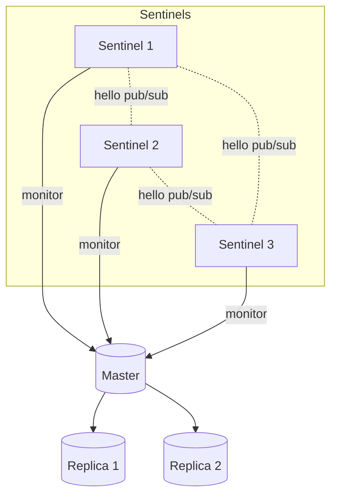
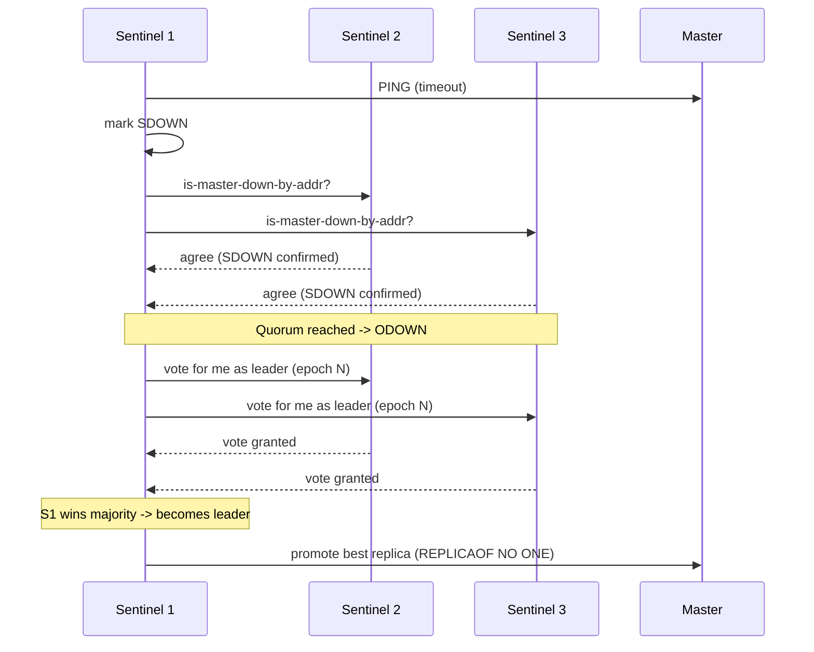

# Redis Sentinel

## Theory

### Sentinel Architecture

Redis Sentinel is a distributed system that provides high availability for Redis by monitoring master and replica instances, detecting failures, and orchestrating automatic failover — all without requiring manual intervention. Rather than being a single process, Sentinel is designed to run as a **cluster of Sentinel processes** (a minimum of 3 is the standard production recommendation) that cooperate with each other to agree on the health of the monitored Redis instances.

Each Sentinel process independently connects to the master, discovers replicas via `INFO replication`, and also discovers other Sentinels monitoring the same master through a Pub/Sub channel (`__sentinel__:hello`) that every Sentinel publishes to and subscribes on. This gossip-like discovery means administrators only need to point each Sentinel at the master initially — the Sentinels automatically learn about each other and about all replicas.

```conf
# sentinel.conf
port 26379
sentinel monitor mymaster 10.0.0.5 6379 2
sentinel down-after-milliseconds mymaster 5000
sentinel failover-timeout mymaster 60000
sentinel parallel-syncs mymaster 1
```



Running an odd number of Sentinels (3, 5, ...) spread across independent failure domains (different hosts, racks, or availability zones) is critical — it ensures a clean majority can be reached for quorum-based decisions even if one zone becomes unreachable.

### Automatic Failover

When the majority of Sentinels agree the master is down, Sentinel orchestrates a failover automatically, with no operator involvement:

1. One of the Sentinels is elected as the **failover leader** (see Leader Election below).
2. The leader selects the best replica to promote — prioritizing the one with the highest replica priority (`replica-priority`, excluding `0` which means "never promote"), then the one with the most complete replication (highest processed replication offset), then the lowest run ID as a tiebreaker.
3. The leader sends `REPLICAOF NO ONE` to the chosen replica, promoting it to master.
4. The leader reconfigures the remaining replicas to replicate from the new master via `REPLICAOF`.
5. Sentinel updates its own internal configuration and publishes the new master's address so that Sentinel-aware clients can discover it.
6. When the old master eventually comes back online, Sentinel reconfigures it as a replica of the new master (preventing split-brain).

`sentinel parallel-syncs` controls how many replicas resync with the new master simultaneously — a lower number reduces the load spike on the new master (since each resync may trigger an RDB transfer) at the cost of a longer overall convergence time.

### Monitoring

Sentinel continuously monitors the health of the master, its replicas, and its peer Sentinels via periodic `PING` commands. Two distinct failure states are tracked:

- **SDOWN (Subjectively Down)** — a single Sentinel's own opinion: it hasn't received a valid response from the instance within `sentinel down-after-milliseconds`.
- **ODOWN (Objectively Down)** — reached when a sufficient number of Sentinels (the configured **quorum**) independently report SDOWN for the master within a given window. Only ODOWN triggers a failover.

```bash
# Ask a Sentinel for its view of the master
redis-cli -p 26379 SENTINEL master mymaster

# List replicas Sentinel knows about
redis-cli -p 26379 SENTINEL replicas mymaster

# List other Sentinels monitoring this master
redis-cli -p 26379 SENTINEL sentinels mymaster

# Force Sentinel to check current state
redis-cli -p 26379 SENTINEL ckquorum mymaster
```

Sentinel also monitors replicas and other Sentinels for liveness, but only the master's ODOWN state triggers a failover procedure.

### Leader Election

Quorum determines *whether* a failover should happen (enough Sentinels agree the master is unreachable), but a separate mechanism decides *who coordinates* the failover. Sentinel uses a variant of a well-known distributed consensus approach (similar in spirit to Raft) to elect a single leader Sentinel per failover event:

1. Any Sentinel that observes ODOWN can nominate itself as leader candidate for that failover epoch.
2. It asks other Sentinels to vote for it via `SENTINEL is-master-down-by-addr`.
3. Each Sentinel votes for at most one candidate per epoch (typically the first one that asked).
4. A candidate becomes leader once it wins a **majority** of the Sentinel processes' votes (not just the configured quorum — a true majority of all known Sentinels).
5. The elected leader performs the failover steps described above.



This distinction is a frequent interview trap: **quorum** just decides whether the system agrees there's a problem; **majority vote** decides who is trusted to fix it.

### Client Interaction

Sentinel does not sit in the data path — clients never send `GET`/`SET` traffic through Sentinel. Instead, Sentinel acts purely as a **discovery and notification service**. Sentinel-aware clients (like Jedis's `JedisSentinelPool` or Lettuce's `RedisSentinelClient`) are configured with the addresses of the Sentinel processes (not the master directly) and the master's logical name (e.g. `mymaster`). On startup, the client asks any Sentinel `SENTINEL get-master-addr-by-name mymaster` to learn the current master's real IP/port, then connects directly to that master for actual commands.

When a failover happens, Sentinel publishes a `+switch-master` event on its Pub/Sub interface; well-behaved clients subscribe to this and reconnect to the new master automatically instead of polling.

```java
// Spring Data Redis Sentinel configuration
RedisSentinelConfiguration sentinelConfig = new RedisSentinelConfiguration()
        .master("mymaster")
        .sentinel("10.0.0.11", 26379)
        .sentinel("10.0.0.12", 26379)
        .sentinel("10.0.0.13", 26379);

LettuceConnectionFactory factory = new LettuceConnectionFactory(sentinelConfig);
```

**Production scenario:** A payments service uses Sentinel-backed Redis for idempotency keys; if the master fails at 3 AM, Sentinel promotes a replica within seconds and the application reconnects transparently, avoiding a page for a human operator.

### Interview Questions

- What problem does Redis Sentinel solve, and why is it typically deployed as a cluster of at least 3 processes?
- How do Sentinels discover replicas and other Sentinels monitoring the same master?
- What is the difference between SDOWN and ODOWN?
- How does the `sentinel monitor mymaster <ip> <port> <quorum>` directive work, and what does the quorum number actually gate?
- Walk through the steps Sentinel takes once it decides to fail over.
- How is the replacement master chosen among multiple replicas?
- What is `sentinel parallel-syncs` and why would you keep it low in a large replica fleet?
- How does Sentinel's leader election differ from the quorum check — why are both needed?
- What happens to the old master once it recovers after being replaced?
- Do application clients send read/write commands through Sentinel? How do they find the current master?
- What is the `+switch-master` event and how do clients use it?
- Why should Sentinel processes be deployed across independent failure domains?
- What could cause a "split-brain" scenario in a Sentinel deployment, and how does Sentinel avoid it?
- What is `sentinel down-after-milliseconds` and how does its value trade off failover speed against false positives?
- How would you manually check the quorum status of a Sentinel deployment from the CLI?

