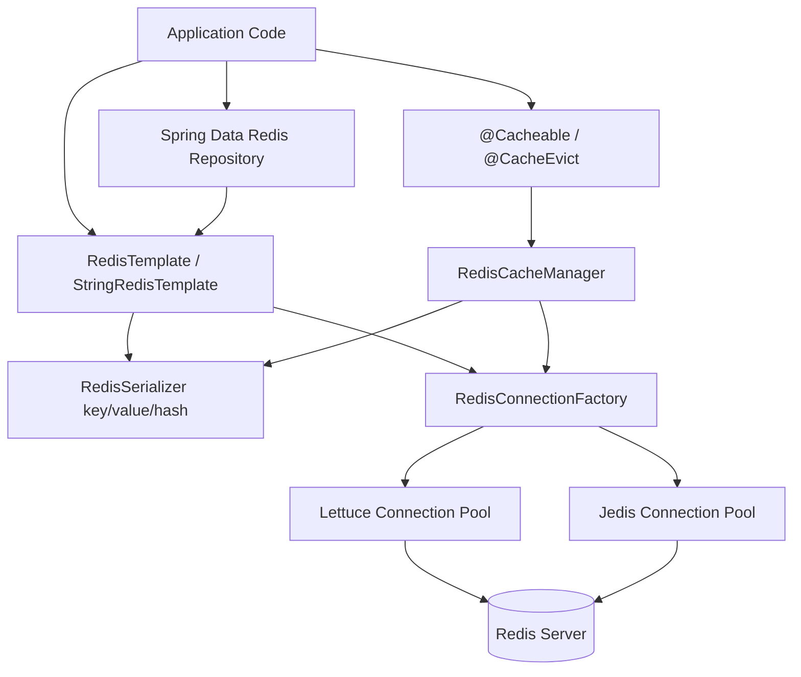

# Concepts for Spring Data Redis

## Theory

### Serialization vs Deserialization

Redis stores everything as raw bytes — it has no concept of Java objects, so Spring Data Redis must convert (serialize) Java objects into bytes before writing them, and convert (deserialize) bytes back into Java objects when reading. This conversion is handled by `RedisSerializer` implementations configured on a `RedisTemplate`, and separately for keys, values, hash keys, and hash values, since it's common to want human-readable string keys but efficient binary or JSON-encoded values.

By default, a plain `RedisTemplate<K, V>` uses `JdkSerializationRedisSerializer`, which relies on standard Java serialization — functional, but producing non-human-readable output (unusable from `redis-cli`) and requiring all stored classes to implement `Serializable`. Most production configurations override this with a `StringRedisSerializer` for keys and a JSON serializer (`GenericJackson2JsonRedisSerializer` or `Jackson2JsonRedisSerializer<T>`) for values, so data is inspectable via `redis-cli GET`/`HGETALL` and interoperable with non-Java clients.

```java
@Configuration
public class RedisConfig {

    @Bean
    public RedisTemplate<String, Object> redisTemplate(RedisConnectionFactory connectionFactory) {
        RedisTemplate<String, Object> template = new RedisTemplate<>();
        template.setConnectionFactory(connectionFactory);
        template.setKeySerializer(new StringRedisSerializer());
        template.setValueSerializer(new GenericJackson2JsonRedisSerializer());
        template.setHashKeySerializer(new StringRedisSerializer());
        template.setHashValueSerializer(new GenericJackson2JsonRedisSerializer());
        template.afterPropertiesSet();
        return template;
    }
}
```

### JSON vs Binary Serialization

Choosing between JSON and binary (Java-native or a binary format like Kryo/Protobuf) serialization for Redis values is a trade-off between interoperability/debuggability and raw performance/size efficiency. JSON serialization produces human-readable payloads that are easy to inspect with `redis-cli` and are consumable by non-Java services (polyglot microservice environments), at the cost of larger payload size and slower serialize/deserialize performance compared to compact binary formats.

Binary serialization (`JdkSerializationRedisSerializer`, or a dedicated binary codec) tends to be faster and more compact, but produces opaque byte blobs that cannot be inspected via `redis-cli`, are tightly coupled to the producing language/runtime (Java serialization is Java-only), and are more brittle across class version changes (a serialized object may fail to deserialize after the class definition changes, whereas JSON is generally more forgiving of added/removed fields).

| Aspect | JSON (Jackson) | Binary (JDK/Kryo) |
|---|---|---|
| Human-readable via `redis-cli` | Yes | No |
| Cross-language interoperability | Yes | No (JDK serialization is Java-only) |
| Payload size | Larger | Smaller (typically) |
| Serialize/deserialize speed | Slower | Faster |
| Resilience to class evolution | Generally better | Fragile (`serialVersionUID` mismatches) |
| Debuggability | Easy | Requires custom tooling |

In practice, most Spring Boot teams default to JSON (`GenericJackson2JsonRedisSerializer`) for values unless there is a demonstrated performance/size bottleneck, since the operational benefit of being able to inspect cache contents directly usually outweighs the modest performance cost.

### Object Mapping Concepts

Beyond simple key-value serialization, Spring Data Redis provides an object-mapping layer (`@RedisHash`) that maps a Java class to a Redis `HASH`, similar in spirit to how Spring Data JPA maps entities to relational tables. Annotated fields become hash fields, an `@Id` field becomes part of the key, and Spring Data Redis manages the `HSET`/`HGETALL` calls transparently through a generated repository, plus maintains secondary indexes for fields annotated `@Indexed`.

```java
@RedisHash("Product")
public class Product {

    @Id
    private String id;

    private String name;

    @Indexed
    private String category;

    private BigDecimal price;

    // getters/setters
}
```

This object-mapping layer is convenient for simple CRUD-style access patterns but has real limitations compared to a relational or document mapper: no joins, limited query capability (only exact-match on `@Indexed` fields), and every object is fully serialized/deserialized as a whole hash on each read/write — so it's best suited to straightforward domain objects rather than complex aggregates with rich query requirements.

### Connection Pooling

A Redis connection, like a database connection, is relatively expensive to establish (TCP handshake, potentially TLS negotiation, `AUTH`), so Spring Data Redis relies on connection pooling to reuse connections across requests rather than opening a new one per operation. The two supported client libraries handle this differently: **Lettuce** (the default in Spring Boot since 2.x) is built on Netty and is inherently thread-safe with a single shared, multiplexed connection by default — pooling is optional and only needed for blocking commands or specific isolation requirements. **Jedis** is not thread-safe per connection and therefore requires a proper connection pool (`JedisPool`, backed by Apache Commons Pool2) to be used safely from a multi-threaded application.

```yaml
# application.yml - Lettuce pooling (needed mainly for blocking commands or transactions)
spring:
  data:
    redis:
      host: localhost
      port: 6379
      lettuce:
        pool:
          max-active: 16
          max-idle: 8
          min-idle: 2
          max-wait: 2000ms
```

```yaml
# application.yml - Jedis pooling (required for thread safety)
spring:
  data:
    redis:
      client-type: jedis
      host: localhost
      port: 6379
      jedis:
        pool:
          max-active: 16
          max-idle: 8
          min-idle: 2
          max-wait: 2000ms
```

Pool sizing should be based on expected concurrent command volume and measured via connection-related metrics (`connected_clients` on the server side, pool exhaustion/wait-time metrics on the client side) rather than guessed — an undersized pool causes request queuing/timeouts under load, while an oversized pool wastes server-side resources and can approach `maxclients`.

### RedisTemplate (Concept)

`RedisTemplate<K, V>` is the central, low-level abstraction Spring Data Redis provides for interacting with Redis — analogous to `JdbcTemplate` for relational databases. It wraps a `RedisConnectionFactory`, applies configured serializers, and exposes typed "operations" views for each data structure: `opsForValue()` (strings), `opsForHash()`, `opsForList()`, `opsForSet()`, `opsForZSet()`, and `opsForStream()`, so application code works with Java types while the template handles the byte-level protocol details.

`StringRedisTemplate` is a convenience subclass pre-configured with `StringRedisSerializer` for keys, values, hash keys, and hash values — appropriate when everything stored is plain text/JSON strings, which is a very common case and avoids needing to configure serializers manually.

```java
@Service
public class ProductCacheService {

    private final RedisTemplate<String, Object> redisTemplate;

    public ProductCacheService(RedisTemplate<String, Object> redisTemplate) {
        this.redisTemplate = redisTemplate;
    }

    public void cacheProduct(Product product) {
        redisTemplate.opsForValue().set("product:" + product.getId(), product, Duration.ofMinutes(10));
    }

    public Product getProduct(String id) {
        return (Product) redisTemplate.opsForValue().get("product:" + id);
    }

    public void addToLeaderboard(String player, double score) {
        redisTemplate.opsForZSet().incrementScore("leaderboard", player, score);
    }
}
```



### Repository Pattern (Concept)

Spring Data Redis extends the familiar Spring Data repository abstraction (`CrudRepository`/`PagingAndSortingRepository`) to Redis-backed `@RedisHash`-annotated entities, letting you declare an interface and get CRUD operations (`save`, `findById`, `findAll`, `delete`, plus derived query methods on `@Indexed` fields) without writing implementation code — the same programming model used by Spring Data JPA/MongoDB, which lowers the learning curve for teams already familiar with those modules.

```java
public interface ProductRepository extends CrudRepository<Product, String> {
    List<Product> findByCategory(String category); // works because 'category' is @Indexed
}
```

```java
@Service
public class ProductService {

    private final ProductRepository productRepository;

    public ProductService(ProductRepository productRepository) {
        this.productRepository = productRepository;
    }

    public Product save(Product product) {
        return productRepository.save(product);
    }

    public List<Product> findByCategory(String category) {
        return productRepository.findByCategory(category);
    }
}
```

This pattern is best suited for straightforward entity storage and lookup by ID or a small number of indexed fields; for anything requiring complex queries, ranking, or cross-entity aggregation, dropping down to `RedisTemplate` (or a dedicated pattern like the ones covered under Common Redis Design Patterns) is usually more appropriate than forcing the repository abstraction.

### Hash Mapping Concepts

Hash mapping refers to the mechanism Spring Data Redis uses to convert a Java object's fields into a Redis `HASH`'s field-value pairs and back, used both by `@RedisHash` repositories and directly via `opsForHash()` on `RedisTemplate`. The conversion is handled by a `HashMapper` (Spring Data Redis provides `ObjectHashMapper` for general object-to-hash conversion, and `Jackson2HashMapper` for JSON-flattening behavior), which determines exactly how nested objects, collections, and primitive fields are flattened into a flat map of hash fields.

```java
// Direct hash operations without the repository abstraction
HashOperations<String, String, String> hashOps = stringRedisTemplate.opsForHash();
hashOps.put("user:1001", "name", "Alice");
hashOps.put("user:1001", "email", "alice@example.com");
Map<String, String> allFields = hashOps.entries("user:1001");

// Using HashMapper to convert a POJO to/from a hash
HashMapper<Object, String, String> mapper = new Jackson2HashMapper(false);
Map<String, String> hash = mapper.toHash(product);
Product restored = (Product) mapper.fromHash(hash);
```

Understanding hash mapping matters when debugging why a nested object appears as multiple flattened fields (e.g., `address.city`, `address.zip`) in `redis-cli HGETALL` output, or why a collection field is serialized in a particular structure — behavior that is controlled by the chosen `HashMapper` implementation, not implicit "magic."

### TTL for Objects

Applying a TTL to an object stored via `RedisTemplate` or a repository requires slightly different handling depending on the API used. For simple key-value pairs via `opsForValue()`, TTL can be set atomically at write time; for hash-backed entities saved via a repository, Spring Data Redis supports a `@TimeToLive` annotation on a field (of type `Long`, representing seconds) that lets the entity control its own expiration per instance, which the framework applies via `EXPIRE` after the hash is written.

```java
// Atomic TTL with a plain key-value write
redisTemplate.opsForValue().set("cache:product:77", product, Duration.ofMinutes(10));

// Per-entity TTL via @TimeToLive on a repository-managed entity
@RedisHash("Session")
public class SessionEntity {

    @Id
    private String id;

    private String userId;

    @TimeToLive
    private Long ttlSeconds; // set to desired expiration in seconds before saving
}
```

A subtlety worth remembering: because a repository `save()` typically issues the hash write and the `EXPIRE` call as two separate round trips (not a single atomic command), there is a narrow window where the key temporarily has no TTL; for strict correctness in high-consistency scenarios, an atomic Lua script setting both the hash fields and TTL is preferable.

### Optimistic Locking Concepts

Redis natively supports optimistic locking via `WATCH`, used in combination with `MULTI`/`EXEC` transactions: a client `WATCH`es one or more keys before starting a transaction, and if any watched key is modified by another client between the `WATCH` and the `EXEC`, the transaction is aborted (`EXEC` returns `nil`) rather than silently applying stale-based changes — the classic optimistic concurrency control pattern (check-then-act without a lock, but detect and reject conflicting concurrent writes).

Spring Data Redis exposes this through `SessionCallback` combined with `RedisTemplate.execute()`, since `WATCH`/`MULTI`/`EXEC` must all run against the *same* underlying connection (which Spring's `SessionCallback` guarantees, unlike normal template operations that may borrow different pooled connections per call).

```java
public boolean updateStockOptimistically(String productId, int quantityDelta) {
    return redisTemplate.execute(new SessionCallback<Boolean>() {
        @Override
        public Boolean execute(RedisOperations operations) {
            operations.watch("stock:" + productId);
            int currentStock = (int) operations.opsForValue().get("stock:" + productId);
            if (currentStock + quantityDelta < 0) {
                operations.unwatch();
                return false;
            }
            operations.multi();
            operations.opsForValue().increment("stock:" + productId, quantityDelta);
            List<Object> results = operations.exec();
            return !results.isEmpty(); // empty list means the transaction was aborted (WATCH conflict)
        }
    });
}
```

On a conflict (empty result list from `exec()`), the caller is expected to retry the whole read-modify-write sequence, typically with a bounded retry count and backoff, since repeated contention on the same key could otherwise loop indefinitely.

### Transactions with Redis

Redis transactions (`MULTI`, queued commands, `EXEC`/`DISCARD`) guarantee that a batch of commands executes as an atomic, isolated unit — no other client's commands can interleave between the queued commands once `EXEC` is invoked — but they are **not** the same as relational database transactions: there is no rollback of already-applied commands if one command in the batch fails at runtime (e.g., a type error), since Redis only checks for syntax/queueing errors before execution, not for later runtime failures within the batch.

```java
List<Object> results = redisTemplate.execute(new SessionCallback<List<Object>>() {
    @Override
    public List<Object> execute(RedisOperations operations) {
        operations.multi();
        operations.opsForValue().set("account:1:balance", 900);
        operations.opsForValue().set("account:2:balance", 1100);
        return operations.exec();
    }
});
```

For genuinely complex, conditional, multi-step atomic logic (beyond what `MULTI`/`EXEC` alone conveniently expresses), a Lua script executed via `EVAL`/`EVALSHA` (or `RedisScript`/`DefaultRedisScript` in Spring Data Redis) is often a cleaner and more powerful choice, since the entire script runs atomically on the server with full conditional logic, rather than requiring the client to pre-decide the exact command sequence to queue.

### Reactive Redis Concepts

For applications built on Spring WebFlux's non-blocking, reactive programming model, Spring Data Redis provides `ReactiveRedisTemplate`, backed by the Lettuce driver (Jedis does not support reactive/non-blocking usage), returning `Mono`/`Flux` types instead of blocking calls — keeping the entire request pipeline non-blocking from the web layer down to the data layer, which matters for maximizing throughput under high concurrency with a small, fixed-size thread pool.

```java
@Configuration
public class ReactiveRedisConfig {

    @Bean
    public ReactiveRedisTemplate<String, Product> reactiveRedisTemplate(
            ReactiveRedisConnectionFactory factory) {
        Jackson2JsonRedisSerializer<Product> serializer = new Jackson2JsonRedisSerializer<>(Product.class);
        RedisSerializationContext<String, Product> context = RedisSerializationContext
                .<String, Product>newSerializationContext(new StringRedisSerializer())
                .value(serializer)
                .build();
        return new ReactiveRedisTemplate<>(factory, context);
    }
}

@Service
public class ReactiveProductService {

    private final ReactiveRedisTemplate<String, Product> redisTemplate;

    public ReactiveProductService(ReactiveRedisTemplate<String, Product> redisTemplate) {
        this.redisTemplate = redisTemplate;
    }

    public Mono<Boolean> cacheProduct(Product product) {
        return redisTemplate.opsForValue()
                .set("product:" + product.getId(), product, Duration.ofMinutes(10));
    }

    public Mono<Product> getProduct(String id) {
        return redisTemplate.opsForValue().get("product:" + id);
    }
}
```

Reactive Redis access is only beneficial end-to-end — mixing a reactive Redis call inside an otherwise blocking (Spring MVC) controller provides no throughput benefit and adds unnecessary complexity, so this concept is relevant specifically for fully reactive (WebFlux) applications.

### Lettuce vs Jedis (Client Libraries)

Lettuce and Jedis are the two primary Java client libraries Spring Data Redis can use under the hood, selected via `spring.data.redis.client-type` (Lettuce is the Spring Boot default since 2.x). They differ significantly in threading model and feature set: Lettuce is built on Netty, is asynchronous/non-blocking at its core (with synchronous and reactive APIs layered on top), and is thread-safe with a single shared connection by default, meaning most applications don't need connection pooling at all for standard usage. Jedis is a simpler, synchronous, blocking client where each connection is not thread-safe, so any multi-threaded application must use `JedisPool` to hand out a dedicated connection per thread/operation.

| Aspect | Lettuce | Jedis |
|---|---|---|
| Threading model | Async/non-blocking core (Netty), sync & reactive APIs | Synchronous, blocking |
| Thread safety | Thread-safe, single shared connection by default | Not thread-safe; requires pooling |
| Reactive support | Yes (`ReactiveRedisTemplate`) | No |
| Connection pooling | Optional (useful for blocking commands/transactions) | Required for concurrent use |
| Spring Boot default | Yes (since Spring Boot 2.x) | No (opt-in) |
| Redis Cluster/Sentinel support | Yes | Yes |
| Maturity/community | Actively maintained, modern | Long-standing, widely used historically |

```yaml
# Explicitly selecting the client type in application.yml
spring:
  data:
    redis:
      client-type: lettuce  # or: jedis
```

For new Spring Boot projects, Lettuce is the recommended default unless there's a specific reason to use Jedis (e.g., existing organizational tooling/expertise built around it); its non-blocking core and built-in thread safety generally result in simpler configuration and better resource utilization under concurrent load.

### Interview Questions

1. Why does Redis require serialization of Java objects, and what serializers does `RedisTemplate` use by default? — Redis stores everything as raw bytes, so any Java object must be converted to/from a byte representation before it can be sent or read; `RedisTemplate` uses `JdkSerializationRedisSerializer` by default for keys and values, which produces Java's native binary serialization format (not human-readable and tied to the class's serialVersionUID), which is why many applications explicitly configure `StringRedisSerializer` for keys and a JSON serializer for values instead.
2. What are the trade-offs between JSON and binary serialization for values stored in Redis? — JSON serialization (e.g., `Jackson2JsonRedisSerializer`) is human-readable via `redis-cli`, language-agnostic, and resilient to minor class changes, but produces larger payloads and slower (de)serialization than binary formats; binary serialization (JDK serialization or a compact format like Kryo/Protobuf) is faster and more compact but opaque to inspection and often more brittle across class version changes.
3. How does `@RedisHash` map a Java object to a Redis hash, and what are its limitations compared to JPA entities? — `@RedisHash` maps each annotated field to a hash field under a key composed of the entity name and ID (`EntityName:id`), with nested objects flattened into dotted field names via a `HashMapper`; unlike JPA, it has no built-in query language beyond simple indexed lookups, no automatic joins/cascades, and no transactional rollback semantics matching a relational database.
4. Why does Lettuce generally not require connection pooling by default while Jedis does? — Lettuce is built on Netty with an asynchronous, non-blocking core and is thread-safe, sharing a single multiplexed connection across concurrent callers by default; Jedis is synchronous and blocking with connections that are not thread-safe, so any multi-threaded application must use `JedisPool` to hand out a dedicated connection per thread.
5. What is the difference between `RedisTemplate` and `StringRedisTemplate`? — `RedisTemplate<K, V>` is generic and uses configurable (often JDK or JSON) serializers for both keys and values, while `StringRedisTemplate` is a convenience subclass preconfigured with `StringRedisSerializer` for both keys and values, making it the natural choice when all data is plain text and you want output readable directly via `redis-cli`.
6. How does the Spring Data Redis repository abstraction compare to Spring Data JPA repositories, and what query capabilities does it lack? — Both provide `CrudRepository`-style save/find/delete methods and derived query methods by convention, but Redis repositories only support simple equality lookups on `@Indexed` fields (backed by secondary index sets Spring maintains automatically) rather than JPA's full JPQL/Criteria query support, joins across entities, or complex range/aggregation queries.
7. What does a `HashMapper` do, and how would you explain a nested object appearing as flattened hash fields? — A `HashMapper` converts a Java object to and from a `Map<String, String>` suitable for storage as a Redis hash; the default `Jackson2HashMapper` (and similar implementations) flattens nested objects into dotted field names (e.g., `address.city`, `address.zip`) so the entire object graph can be represented as a single flat hash rather than a nested structure Redis natively lacks.
8. How would you apply a TTL to a repository-managed `@RedisHash` entity, and what race condition can occur when doing so? — Annotate a `Long` field with `@TimeToLive` (seconds) on the entity, which Spring Data Redis applies via a separate `EXPIRE` call after writing the hash; because the hash write and the `EXPIRE` call are two separate round trips rather than one atomic operation, there is a brief window where the saved key temporarily has no TTL, which strict correctness scenarios should address with an atomic Lua script instead.
9. How does `WATCH` implement optimistic locking in Redis, and how do you detect and handle a failed transaction in Spring Data Redis? — `WATCH` marks one or more keys for monitoring before a `MULTI`/`EXEC` block; if any watched key is modified by another client before `EXEC`, the transaction is aborted and `EXEC` returns an empty/nil result instead of applying stale-based changes; in Spring Data Redis this is detected by checking whether the `List<Object>` returned from `operations.exec()` is empty, and the caller should retry the whole read-modify-write sequence with a bounded retry count.
10. How are Redis transactions (`MULTI`/`EXEC`) different from relational database transactions in terms of rollback behavior? — Redis transactions guarantee that queued commands execute atomically as one isolated unit with no interleaving from other clients, but they do not roll back already-applied commands if a later command in the batch fails at runtime (Redis only validates syntax/queueing errors before execution, not runtime failures), unlike relational transactions which can roll back the entire batch on any failure.
11. When would you choose `ReactiveRedisTemplate` over the standard blocking `RedisTemplate`, and which client library supports it? — Choose `ReactiveRedisTemplate` when building a fully reactive, non-blocking application end-to-end (typically Spring WebFlux), since mixing it into an otherwise blocking Spring MVC controller provides no throughput benefit; it is backed exclusively by the Lettuce driver, as Jedis does not support reactive/non-blocking usage.
12. What are the key differences between Lettuce and Jedis, and which does Spring Boot use by default? — Lettuce is built on Netty, asynchronous/non-blocking at its core with sync and reactive APIs layered on top, and thread-safe with a shared connection by default; Jedis is synchronous, blocking, and not thread-safe, requiring `JedisPool` for concurrent use; Spring Boot has used Lettuce as the default client since Spring Boot 2.x.
13. Why must `WATCH`, `MULTI`, and `EXEC` be executed on the same connection, and how does Spring Data Redis ensure that? — `WATCH` registers watched keys against the specific connection issuing it, so if `MULTI`/`EXEC` ran on a different pooled connection, the watch would have no effect and the optimistic-locking guarantee would silently break; Spring Data Redis ensures connection affinity for this sequence via `SessionCallback` combined with `RedisTemplate.execute()`, which binds all operations inside the callback to one underlying connection.
14. How would you configure connection pool sizing for Lettuce or Jedis, and what metrics would you monitor to validate the sizing? — Configure pool sizing via `spring.data.redis.lettuce.pool` or `spring.data.redis.jedis.pool` properties (`max-active`, `max-idle`, `min-idle`, `max-wait`), sizing the pool to match expected concurrent command volume and latency tolerance; validate sizing by monitoring pool exhaustion/wait-time metrics on the application side alongside Redis's `connected_clients` and `blocked_clients` from `INFO clients`.
15. What is the purpose of a `RedisConnectionFactory`, and how does it relate to `RedisTemplate` and `RedisCacheManager`? — `RedisConnectionFactory` is the abstraction that creates and manages the underlying connections to Redis (backed by Lettuce or Jedis, and configurable for standalone, Sentinel, or Cluster topologies); both `RedisTemplate` (for direct data access) and `RedisCacheManager` (for Spring's `@Cacheable` abstraction) are built on top of it, sharing the same connection configuration.
