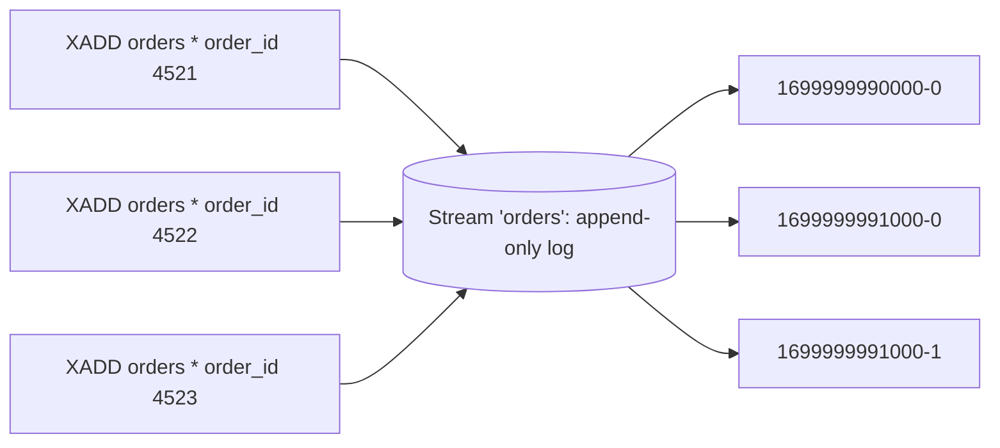
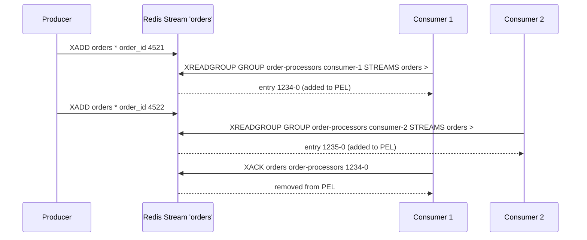

# Redis Streams

## Theory

### Streams Basics

Introduced in Redis 5.0, a **Stream** is an append-only log data type — conceptually similar to a Kafka topic or a commit log, but implemented as a native Redis data structure. Each entry appended to a stream is assigned a unique, monotonically increasing **ID** of the form `<millisecondsTime>-<sequence>` (e.g., `1699999999999-0`), which doubles as both a unique identifier and a natural ordering/offset mechanism. Internally, Redis stores stream entries in a **radix tree (rax)** of "listpack" nodes for memory-efficient, ordered storage, and — unlike Pub/Sub — a stream's entries persist as part of the keyspace (subject to normal RDB/AOF persistence) until explicitly trimmed or deleted.

Unlike a `List`, which is typically used as a simple queue where entries are removed on pop, a Stream is designed to be **read non-destructively and potentially by multiple independent readers**, each tracking its own position (or, when using consumer groups, having Redis track it for them).

```bash
# Append an entry with an auto-generated ID (the *)
redis-cli XADD orders '*' order_id 4521 status "created" amount 129.99

# Read the whole stream from the beginning
redis-cli XRANGE orders - +

# Number of entries currently in the stream
redis-cli XLEN orders
```



**Production scenario:** An order-management service uses a Stream (instead of a `List` or Pub/Sub channel) as the backbone for an event log of order lifecycle transitions, because it needs both durability (entries aren't lost if a consumer is briefly offline) and the ability for multiple independent downstream services (billing, inventory, notifications) to each read the full history at their own pace.

### Producers

A producer appends entries with `XADD`, specifying the stream key, an ID (usually `*` to let Redis auto-generate one based on the current time, guaranteeing monotonic ordering), and one or more field-value pairs (a stream entry is essentially a small hash/dictionary of fields). `XADD` also supports `NOMKSTREAM` (fail instead of implicitly creating the stream if it doesn't exist) and inline trimming options (`MAXLEN`/`MINID`) to cap the stream's size at write time.

```bash
redis-cli XADD orders '*' order_id 4521 status created
redis-cli XADD orders NOMKSTREAM '*' order_id 4522 status created   # fails if 'orders' doesn't exist yet
redis-cli XADD orders MAXLEN '~' 100000 '*' order_id 4523 status created  # cap stream length approximately
```

```java
// Spring Data Redis - producing to a stream
StreamOperations<String, Object, Object> streamOps = redisTemplate.opsForStream();

Map<String, Object> fields = Map.of("order_id", "4521", "status", "created");
RecordId id = streamOps.add(StreamRecords.mapBacked(fields).withStreamKey("orders"));
```

### Consumers

The simplest way to read a stream is `XREAD`, which reads entries after a given ID without any server-side tracking of "what has this client already seen" — the client is responsible for remembering the last ID it processed and passing it on the next call. Passing `$` as the ID means "only give me new entries from now on" (useful for a live tail), while `BLOCK <ms>` makes the call wait for new entries instead of returning immediately if none are available.

```bash
# Blocking read - wait up to 5 seconds for new entries after the given ID
redis-cli XREAD COUNT 10 BLOCK 5000 STREAMS orders '$'

# Non-blocking read of everything after a specific ID
redis-cli XREAD COUNT 100 STREAMS orders 1699999990000-0
```

This standalone `XREAD` model has no concept of acknowledgement, competing consumers, or automatic recovery from a crashed reader — for that, **consumer groups** (below) are needed.

### Consumer Groups

A **consumer group** lets multiple consumer processes cooperatively read from the same stream as competing consumers — each message within the group's view of the stream is delivered to exactly **one** consumer in the group (Redis load-balances entries across the group's active consumers), which is the pattern needed for horizontally scaling stream processing (similar to Kafka consumer groups sharing a topic's partitions). Redis tracks, per group, the ID of the last entry delivered to *any* consumer in that group, so consumers don't need to manage offsets themselves.

```bash
# Create a consumer group starting from the beginning of the stream
redis-cli XGROUP CREATE orders order-processors 0

# Each consumer reads new (undelivered) entries with '>' 
redis-cli XREADGROUP GROUP order-processors consumer-1 COUNT 1 STREAMS orders '>'
redis-cli XREADGROUP GROUP order-processors consumer-2 COUNT 1 STREAMS orders '>'
```



```java
// Spring Data Redis - StreamMessageListenerContainer with a consumer group
StreamMessageListenerContainer<String, MapRecord<String, String, String>> container =
    StreamMessageListenerContainer.create(connectionFactory);

container.receive(
    Consumer.from("order-processors", "consumer-1"),
    StreamOffset.create("orders", ReadOffset.lastConsumed()),
    record -> {
        System.out.println("Processing: " + record.getValue());
        redisTemplate.opsForStream().acknowledge("orders", "order-processors", record.getId());
    }
);
container.start();
```

**Production scenario:** A fleet of three worker instances processing order events from the `orders` stream join the same consumer group so that each order is handled by exactly one worker — scaling out by adding a fourth worker instance automatically shares the load without any code change, since Redis distributes entries across whichever consumers are currently active in the group.

### Message Acknowledgement

When a consumer in a group reads an entry via `XREADGROUP`, Redis does not consider it "done" — it is added to that consumer's entry in the **Pending Entries List (PEL)**, a per-group record of messages that have been delivered but not yet acknowledged. The consumer must explicitly call `XACK stream group id` once it has finished processing, which removes the entry from the PEL. This gives Streams **at-least-once delivery semantics**: if a consumer crashes after reading but before acknowledging, the message remains in the PEL and can be recovered and reprocessed (by this or another consumer), rather than being silently lost as would happen with Pub/Sub.

```bash
redis-cli XACK orders order-processors 1699999990000-0
# (integer) 1   <- one pending entry acknowledged and removed from the PEL
```

**Production scenario:** A payment-confirmation worker only calls `XACK` after it has successfully written a confirmation record to its own database — if the worker crashes mid-processing, the message stays pending and gets picked up again later, guaranteeing the payment confirmation logic eventually runs at least once, at the cost of needing idempotent processing to handle possible redelivery.

### Pending Entries

`XPENDING` inspects a consumer group's Pending Entries List — showing how many entries are pending, their ID range, and (with extended form) each entry's consumer, and how long it has been pending (idle time). When a consumer dies or hangs without acknowledging, `XCLAIM` (or the simpler, all-in-one `XAUTOCLAIM` added in Redis 6.2) transfers ownership of those pending entries to a different, healthy consumer so processing can continue.

```bash
# Summary view: how many pending entries, ID range, and per-consumer counts
redis-cli XPENDING orders order-processors

# Detailed view: entries idle for more than 60 seconds (likely from a dead consumer)
redis-cli XPENDING orders order-processors IDLE 60000 - + 10

# Claim entries idle > 60s and reassign them to 'consumer-2'
redis-cli XCLAIM orders order-processors consumer-2 60000 1699999990000-0

# Simpler one-shot equivalent: scan-and-claim in one call
redis-cli XAUTOCLAIM orders order-processors consumer-2 60000 0
```

**Production scenario:** A recovery job runs periodically, calling `XPENDING` to find entries idle for more than a few minutes (indicating their original consumer likely crashed), then uses `XAUTOCLAIM` to hand them to a healthy consumer instance, ensuring no order event is silently dropped due to a worker failure.

### Stream Trimming

Because stream entries are retained indefinitely by default, an actively-written stream will grow unbounded and consume ever-increasing memory unless it is explicitly trimmed. `XTRIM` (or `MAXLEN`/`MINID` options passed directly to `XADD`) removes older entries once the stream exceeds a size or ID threshold. The `~` (approximate) modifier lets Redis trim in a more efficient, best-effort way (removing whole internal macro-nodes rather than an exact count), which is significantly cheaper than exact trimming (`=` or no modifier) at high write volume, at the cost of the stream sometimes holding slightly more entries than the exact requested limit.

```bash
# Approximate trim - efficient, may retain slightly more than 100000 entries
redis-cli XTRIM orders MAXLEN '~' 100000

# Exact trim - guarantees exactly 100000 entries remain, more CPU-expensive
redis-cli XTRIM orders MAXLEN 100000

# Trim by minimum ID instead of count (e.g., drop everything older than a given timestamp-based ID)
redis-cli XTRIM orders MINID 1699990000000
```

| Data Structure | Persistence | Multiple Readers | Consumer Groups | Typical Role |
|---|---|---|---|---|
| Pub/Sub channel | None | Yes (all get every message) | No | Ephemeral broadcast |
| List (as queue) | Yes (until popped) | No (destructive pop) | No (manual sharding only) | Simple work queue |
| Stream | Yes (until trimmed) | Yes | Yes | Durable, replayable event log with competing consumers |

**Production scenario:** An `orders` stream feeding several downstream services is capped with `XTRIM orders MAXLEN ~ 1000000` on every write, bounding memory usage while still retaining enough recent history for consumer groups to recover from short outages, without growing forever.

### Interview Questions

- What is a Redis Stream, and how does it differ from a `List` used as a queue? — A Stream is an append-only log of entries with unique, monotonically increasing IDs that supports multiple independent consumers/consumer groups reading at their own pace with durable, at-least-once delivery, whereas a `List` used as a queue destructively pops items (gone the instant they're popped) with no re-delivery mechanism if a consumer crashes mid-processing.
- How are stream entry IDs structured, and what property do they guarantee? — IDs are structured as `<milliseconds>-<sequence>` (e.g., `1699999991000-1`), auto-generated when `*` is passed to `XADD`, guaranteeing monotonically increasing, unique ordering of entries even when multiple entries are added within the same millisecond.
- What is the difference between reading a stream with plain `XREAD` versus using a consumer group with `XREADGROUP`? — Plain `XREAD` has no server-side tracking of what a client has already seen — the client must remember and pass the last processed ID itself — while `XREADGROUP` uses a named consumer group that tracks delivery, load-balances entries across the group's active consumers, and records unacknowledged entries in a Pending Entries List for recovery.
- How does Redis load-balance entries across consumers within the same consumer group? — Each entry within the group's view of the stream is delivered to exactly one consumer in the group; Redis distributes entries across whichever consumers are currently issuing `XREADGROUP ... '>'` calls, so adding more consumer instances automatically shares the load without code changes.
- What is the Pending Entries List (PEL), and what is its purpose? — The PEL is a per-consumer-group record of messages that have been delivered to a consumer via `XREADGROUP` but not yet acknowledged with `XACK`; it lets Redis track in-flight work so that entries from a crashed consumer can be identified and reclaimed rather than silently lost.
- What delivery guarantee do Streams provide, and how does `XACK` relate to it? — Streams provide at-least-once delivery; an entry stays in the PEL until the consumer calls `XACK stream group id`, so if a consumer crashes after reading but before acknowledging, the message remains pending and can be recovered and reprocessed rather than being lost.
- What happens to a message if a consumer reads it via `XREADGROUP` but crashes before calling `XACK`? — The message remains in the group's Pending Entries List, since it was delivered but never acknowledged; a recovery process can later use `XPENDING` to find it (by idle time) and `XCLAIM`/`XAUTOCLAIM` to reassign it to a healthy consumer for reprocessing.
- How would you recover and reprocess messages stuck in a pending state due to a dead consumer? — Periodically run `XPENDING` with an `IDLE` threshold to find entries pending longer than expected (indicating their consumer likely crashed), then use `XCLAIM` or the simpler `XAUTOCLAIM` to transfer ownership of those entries to a healthy consumer so processing can continue.
- What is the difference between `XCLAIM` and `XAUTOCLAIM`? — `XCLAIM` requires you to already know the specific entry IDs to reassign to a new consumer, while `XAUTOCLAIM` (Redis 6.2+) is an all-in-one command that scans the PEL for entries idle past a threshold and claims them in a single call, without needing to look them up via `XPENDING` first.
- Why do streams need to be trimmed, and what is the trade-off between exact and approximate (`~`) trimming? — Stream entries are retained indefinitely by default, so an actively-written stream grows unbounded unless trimmed via `XTRIM`/`MAXLEN`/`MINID`; exact trimming guarantees the precise entry count but is more CPU-expensive, while approximate (`~`) trimming removes whole internal macro-nodes more efficiently at high write volume, at the cost of sometimes retaining slightly more entries than requested.
- Compare Redis Streams to Kafka — where would you choose one over the other? — Redis Streams offer a lightweight, durable event log with consumer groups embedded directly within an existing Redis deployment, suitable when you don't want to operate a separate system; Kafka is preferred for high-throughput, durable event streaming at scale with configurable exactly-once semantics, long retention, and a distributed partitioned architecture built specifically for that purpose.
- How would you design an idempotent consumer to safely handle at-least-once delivery semantics? — Since a crashed-and-recovered consumer may reprocess a message it already partially handled, design processing to be safe to repeat — e.g., check a processed-message ID against a dedup store before acting, or use upserts keyed by a stable business ID so replaying the same entry produces the same end state rather than a duplicate side effect.

