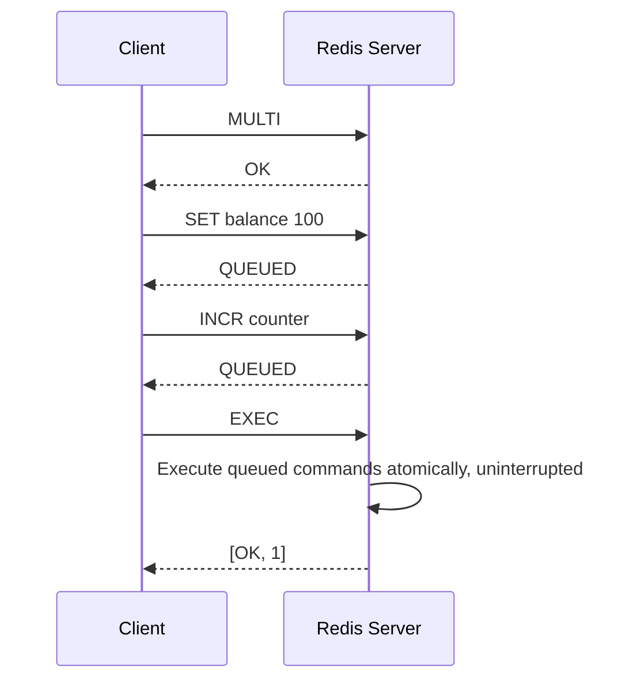
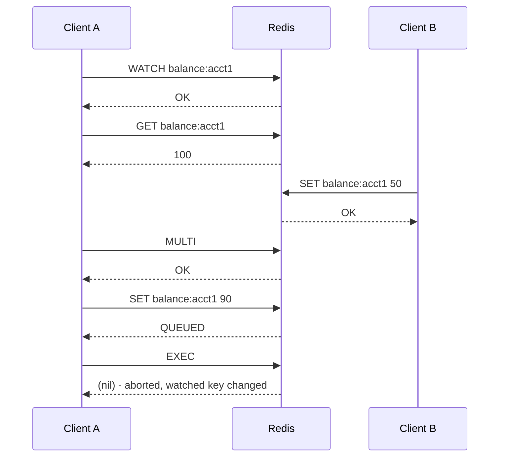

# Redis Transactions

## Theory

### Transaction Basics

A Redis transaction lets a client group multiple commands so that they are executed **sequentially and without interruption** from other clients, as a single unit. This is fundamentally different from the ACID transactions of a relational database: Redis transactions guarantee **isolation** (no other client's commands can interleave in the middle of your transaction, because Redis processes commands single-threaded) and **atomic execution as a batch**, but they do **not** provide rollback on runtime errors, and they don't offer configurable isolation levels or durability guarantees beyond Redis's normal persistence settings (RDB/AOF).

The transaction lifecycle has three phases: **queueing** (commands issued after `MULTI` are buffered per-connection rather than executed immediately), **execution** (`EXEC` runs every queued command back-to-back, uninterrupted by any other client), and **completion** (the client receives an array of replies, one per queued command, in order). If `EXEC` is never called (e.g., connection drops), the queued commands are discarded and never applied — nothing happens silently.



**Production scenario:** An order-processing service increments an inventory counter and writes an order-status key together; wrapping both in `MULTI`/`EXEC` guarantees no other client's command can be interleaved between the two writes, even though Redis offers no rollback if, say, the second command targets the wrong type.

### MULTI

`MULTI` marks the start of a transaction block on the current connection. After issuing `MULTI`, every subsequent command is not executed immediately — Redis validates its syntax, buffers it, and replies `QUEUED` instead of the command's normal reply. The actual execution is deferred until `EXEC` is called.

```bash
redis-cli
> MULTI
OK
> SET user:1:status "active"
QUEUED
> INCR user:1:login_count
QUEUED
> EXPIRE user:1:status 3600
QUEUED
```

Commands with obvious syntax errors at queue time (e.g., wrong number of arguments) cause Redis to flag the transaction; calling `EXEC` in that case aborts the entire transaction without running *any* queued command — this is the one case where Redis does refuse to execute a malformed transaction as a whole.

### EXEC

`EXEC` executes every command queued since `MULTI`, and Redis guarantees that no other client's command is processed in between — because Redis's command execution is single-threaded, once `EXEC` starts running the queued commands, they run to completion as an uninterrupted batch. The reply to `EXEC` is an array containing the reply of each queued command in the order they were queued.

```bash
> EXEC
1) OK
2) (integer) 5
3) (integer) 1
```

Crucially, if an individual command fails at **runtime** (e.g., `INCR` on a key holding a string that isn't numeric), Redis does **not** abort the transaction or roll back preceding commands — the error is reported only for that specific command's slot in the reply array, and every other queued command still executes. This is a common interview trap: Redis transactions are about *atomic scheduling*, not *all-or-nothing correctness*.

### DISCARD

`DISCARD` cancels a transaction that is currently being built with `MULTI`, throwing away all commands queued so far and returning the connection to its normal (non-transactional) state. No queued command is executed.

```bash
> MULTI
OK
> SET tempkey "value"
QUEUED
> DISCARD
OK
> GET tempkey
(nil)   # SET was never applied
```

**Production scenario:** A client library wraps a business operation in `MULTI`; if an application-level precondition check fails after some commands were already queued (but before `EXEC`), the client issues `DISCARD` to safely abandon the whole batch rather than executing a partial or invalid operation.

### WATCH

`WATCH` implements **optimistic locking** for Redis transactions. A client calls `WATCH key1 key2 ...` before `MULTI`; if any watched key is modified (by any client, including itself, between the `WATCH` and the `EXEC`) then Redis aborts the transaction, and `EXEC` returns a `nil` reply instead of running the queued commands. This lets a client implement **check-and-set** semantics: read a value, decide what to write based on it, and only commit if nothing changed it in the meantime.

```bash
# Client A - a compare-and-swap style balance transfer
redis-cli
> WATCH balance:acct1
OK
> GET balance:acct1
"100"
> MULTI
OK
> DECRBY balance:acct1 30
QUEUED
> EXEC
# If another client modified balance:acct1 between WATCH and EXEC:
(nil)
# Application must retry the whole read-modify-write sequence
```



```java
// Spring Data Redis: optimistic locking with WATCH via SessionCallback
RedisTemplate<String, String> redisTemplate = ...;

String result = redisTemplate.execute(new SessionCallback<String>() {
    @Override
    public String execute(RedisOperations operations) {
        operations.watch("balance:acct1");
        String current = (String) operations.opsForValue().get("balance:acct1");
        int newBalance = Integer.parseInt(current) - 30;

        operations.multi();
        operations.opsForValue().set("balance:acct1", String.valueOf(newBalance));
        List<Object> execResult = operations.exec();

        return execResult.isEmpty() ? "RETRY_NEEDED" : "OK";
    }
});
```

### Optimistic Locking

Redis's optimistic locking pattern combines `WATCH` + `MULTI` + `EXEC` to implement compare-and-swap (CAS) logic without ever holding an actual server-side lock. The client optimistically assumes no conflict will occur, reads the current state, computes the new state client-side, and submits the write transactionally — Redis itself checks (cheaply, via internal version/touch tracking on watched keys) whether the assumption held. If a conflicting write happened, `EXEC` fails harmlessly and the client is expected to **retry** the entire read-compute-write cycle, typically in a bounded loop with backoff.

This contrasts with **pessimistic locking** (e.g., an explicit `SET lock:key token NX PX ttl` distributed lock), where a client acquires exclusive access *before* reading/modifying data and blocks or waits for other clients.

| Aspect | Optimistic (`WATCH`/`MULTI`/`EXEC`) | Pessimistic (Distributed Lock) |
|---|---|---|
| Conflict handling | Detect after the fact, then retry | Prevent up front by blocking others |
| Contention cost | Cheap when conflicts are rare | Cost paid on every access, even without conflicts |
| Best for | Low-contention, fast read-modify-write cycles | High-contention or long-running critical sections |
| Failure mode | `EXEC` returns nil, client retries | Lock acquisition times out / blocks |

```bash
# Typical client-side retry loop pseudocode
while attempts_left:
    WATCH key
    value = GET key
    MULTI
    SET key new_value
    result = EXEC
    if result is not nil:
        break  # success
    attempts_left -= 1
```

**Production scenario:** A flash-sale inventory decrement (limited stock, many concurrent buyers) uses `WATCH`/`MULTI`/`EXEC` in a retry loop rather than a distributed lock, since most attempts won't conflict and optimistic locking avoids the overhead and failure modes of lock management under bursty traffic.

### Transaction Limitations

Redis transactions are intentionally lightweight, and this brings real limitations engineers must design around:

- **No rollback on runtime errors** — if the third of five queued commands fails at runtime (e.g., type mismatch), the first, second, fourth, and fifth commands still execute. There is no automatic undo.
- **No nested transactions** — calling `MULTI` while already inside a `MULTI` block returns an error; Redis has no concept of savepoints or nested transaction scopes.
- **All-or-nothing only applies to queue-time errors** — a malformed command (bad arity, unknown command) discovered while queueing marks the whole transaction as "dirty," and `EXEC` will refuse to run any of it, returning an `EXECABORT` error. This is different from a runtime error, which is command-specific.
- **No complex control flow** — you cannot make a queued command's behavior depend on the result of an earlier command within the same transaction (there's no "if the previous SET succeeded, then..."). For that kind of conditional, atomic, multi-step logic, **Lua scripting** (`EVAL`/`EVALSHA`) or **Redis Functions** (Redis 7+) are the correct tool, since a script executes as a single atomic unit with full access to intermediate results.
- **Long transactions block the server** — because Redis is single-threaded, a transaction with many commands (or one operating on very large data structures) blocks all other clients for its duration.

```bash
# EXECABORT example - a syntax error at queue time aborts the whole transaction
> MULTI
OK
> SET key1 value1
QUEUED
> NOTACOMMAND
(error) ERR unknown command 'NOTACOMMAND'
> EXEC
(error) EXECABORT Transaction discarded because of previous errors.
```

### Interview Questions

- How do Redis transactions differ from ACID transactions in a relational database? — Redis transactions (`MULTI`/`EXEC`) guarantee isolation via atomic, uninterrupted scheduling (no other client's command interleaves) but provide no rollback on runtime errors, unlike an RDBMS transaction which guarantees full atomicity/consistency including automatic rollback if any statement fails.
- Walk through the lifecycle of `MULTI`, queued commands, and `EXEC`. — `MULTI` starts the transaction block, causing every subsequent command to be syntax-validated and buffered (replying `QUEUED`) rather than executed immediately; calling `EXEC` then runs all queued commands as an uninterrupted batch (since Redis is single-threaded) and returns an array of each command's individual reply in queued order.
- What happens if a command queued inside a transaction fails at runtime? Does Redis roll back? — Redis does not abort the transaction or roll back preceding/subsequent commands; the runtime error (e.g., `INCR` on a non-numeric string) is reported only in that command's slot of the `EXEC` reply array, while every other queued command still executes normally.
- What is `EXECABORT` and when is it triggered? — `EXECABORT` is returned by `EXEC` when a queued command had an obvious syntax/queue-time error (e.g., unknown command, wrong arity), which marks the whole transaction as "dirty" so Redis refuses to run any of the queued commands.
- What does `DISCARD` do, and when would you use it? — `DISCARD` cancels a transaction currently being built with `MULTI`, throwing away all queued commands and returning the connection to normal state without executing anything; it's used when an application-level precondition fails after some commands were already queued but before `EXEC`.
- Explain how `WATCH` implements optimistic locking. What causes `EXEC` to return `nil`? — `WATCH key1 key2 ...` marks keys for monitoring before `MULTI`; if any watched key is modified by any client between `WATCH` and `EXEC`, Redis aborts the transaction and `EXEC` returns `nil` instead of running the queued commands, letting the client implement check-and-set semantics.
- Compare optimistic locking (`WATCH`/`MULTI`/`EXEC`) with a pessimistic distributed lock — when would you choose each? — Optimistic locking detects conflicts after the fact and retries, which is cheap when conflicts are rare (e.g., flash-sale inventory decrements with many concurrent, mostly non-conflicting buyers); pessimistic locking (`SET lock:key token NX PX ttl`) prevents conflicts up front by blocking others, better suited to high-contention or long-running critical sections where retries would be wasteful.
- Why can't you nest `MULTI` blocks in Redis? — Redis has no concept of savepoints or nested transaction scopes; calling `MULTI` while already inside a `MULTI` block simply returns an error, since transactions are a flat queue-then-execute mechanism, not a stack of scopes.
- Why are Lua scripts sometimes preferred over `MULTI`/`EXEC` transactions? — `MULTI`/`EXEC` cannot make a queued command's behavior depend on the result of an earlier command in the same transaction, whereas a Lua script (`EVAL`/`EVALSHA`) or Redis Function executes as a single atomic unit with full access to intermediate results, enabling conditional, multi-step atomic logic that transactions can't express.
- Can a client watch a key, and then have another one of its *own* commands (not from another client) invalidate the watch? Explain. — Yes; `WATCH` tracks whether the key's value changed between `WATCH` and `EXEC` regardless of which client made the change, so if the same client modifies the watched key outside the `MULTI` block before calling `EXEC`, the transaction is aborted just as if another client had done it.
- What is the isolation guarantee that Redis's single-threaded model provides for transactions, and what are its limits? — Because command execution is single-threaded, once `EXEC` begins, all queued commands run to completion as an uninterrupted batch with no other client's command interleaved — this guarantees atomic scheduling/isolation, but it does not guarantee all-or-nothing correctness, since individual runtime errors within the batch don't roll back other commands.
- How would you design a retry loop around `WATCH`/`MULTI`/`EXEC` for a high-contention key? — Loop with a bounded number of attempts: `WATCH` the key, read its current value, compute the new value client-side, wrap the write in `MULTI`/`EXEC`, and if `EXEC` returns `nil` (conflict detected), back off briefly and retry the whole read-compute-write cycle until it succeeds or attempts are exhausted.
- What happens to queued commands if the client connection drops before `EXEC`? — The transaction state (queued commands and any `WATCH`ed keys) is tied to that connection; if the connection drops before `EXEC` is called, the server discards the queued commands and no part of the transaction is executed.

