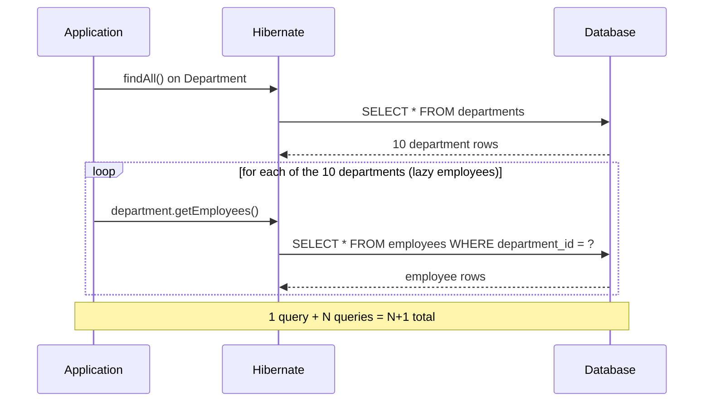

# Advanced SQL Concepts

## Recursive Queries

A recursive query uses a recursive Common Table Expression (`WITH RECURSIVE`) to repeatedly apply a query to its own previous results until no new rows are produced — the standard SQL technique for traversing hierarchical or graph-like data (org charts, category trees, bill-of-materials) stored in a single self-referencing table.

```sql
CREATE TABLE employees (
    id BIGINT PRIMARY KEY,
    full_name VARCHAR(150) NOT NULL,
    manager_id BIGINT REFERENCES employees(id)
);

-- All employees who report (directly or indirectly) to employee 1
WITH RECURSIVE org_chart AS (
    -- anchor member: the root employee
    SELECT id, full_name, manager_id, 0 AS depth
    FROM employees
    WHERE id = 1

    UNION ALL

    -- recursive member: join back to org_chart itself
    SELECT e.id, e.full_name, e.manager_id, oc.depth + 1
    FROM employees e
    JOIN org_chart oc ON e.manager_id = oc.id
)
SELECT * FROM org_chart ORDER BY depth, full_name;
```

The anchor member seeds the recursion, the recursive member repeatedly joins the CTE to itself, and the recursion stops automatically once a step produces zero new rows. Recursive CTEs must eventually terminate — a self-referencing table with a cycle (e.g. a data bug where an employee is set as their own indirect manager) can cause an infinite loop unless guarded with a depth limit or cycle detection (`WITH RECURSIVE ... UNION` naturally stops on no-new-rows, but cyclic data can still loop forever without an explicit depth cap).

## Lateral Joins (Overview)

A `LATERAL` join lets a subquery on the right-hand side reference columns from tables earlier in the `FROM` clause — something an ordinary subquery or join cannot do. This makes `LATERAL` the natural way to express "for each row on the left, compute/fetch the top N related rows."

```sql
-- For each customer, get their 3 most recent orders
SELECT c.id AS customer_id, c.name, recent.id AS order_id, recent.total, recent.created_at
FROM customers c
CROSS JOIN LATERAL (
    SELECT o.id, o.total, o.created_at
    FROM orders o
    WHERE o.customer_id = c.id
    ORDER BY o.created_at DESC
    LIMIT 3
) AS recent;
```

Without `LATERAL`, the subquery's `WHERE o.customer_id = c.id` couldn't reference `c.id` at all — a plain (non-lateral) subquery is evaluated independently of the outer query's current row. `LATERAL` is especially useful for "top N per group" queries, which are otherwise awkward to express without window functions.

## Common Performance Pitfalls

A handful of mistakes account for most real-world SQL performance problems encountered in JPA-backed applications:

- **Missing indexes on foreign keys** — every join or filter on a foreign key column benefits from an index; Postgres does *not* automatically index foreign key columns (only the referenced primary key is indexed automatically).
- **`SELECT *` / fetching unused columns** — pulling large columns (e.g. `JSONB` blobs, `TEXT`) that aren't needed wastes I/O and memory, especially across many rows.
- **Functions applied to indexed columns in `WHERE`** — `WHERE LOWER(email) = 'x'` prevents the database from using a plain index on `email`; a functional index (`CREATE INDEX ON users (LOWER(email))`) is needed instead.
- **Unbounded result sets** — forgetting `LIMIT`/pagination on a query that can grow without bound.
- **N+1 queries from lazy-loaded associations** — see below.
- **Overusing `OFFSET` for deep pagination** — see [Pagination](#pagination).
- **Not reviewing `EXPLAIN ANALYZE`** before shipping a query that runs against a large or fast-growing table.

## N+1 Query Problem (SQL Perspective)

The N+1 problem happens when code fetches a list of N parent rows with one query, then issues one additional query *per parent* to fetch related child data — resulting in `1 + N` total round-trips instead of one (or two) efficient queries. It's one of the most common Spring Data JPA performance pitfalls, almost always caused by lazy-loaded (`FetchType.LAZY`) associations accessed inside a loop.

```java
@Entity
public class Department {
    @Id
    private Long id;

    @OneToMany(mappedBy = "department", fetch = FetchType.LAZY)
    private List<Employee> employees;
}

// Triggers 1 query for departments, then N queries — one per department — for employees
List<Department> departments = departmentRepository.findAll();
for (Department d : departments) {
    System.out.println(d.getEmployees().size()); // lazy-loads employees, one query each
}
```

```sql
SELECT * FROM departments;                                  -- 1 query
SELECT * FROM employees WHERE department_id = 1;             -- +1
SELECT * FROM employees WHERE department_id = 2;             -- +1
-- ... repeated once per department row returned above
```



The standard fixes, from a SQL perspective, all boil down to fetching the needed data in one query instead of N follow-up queries:

- **`JOIN FETCH` in JPQL** — `SELECT d FROM Department d JOIN FETCH d.employees` produces a single `SELECT ... JOIN` instead of N+1 (be aware of result duplication for one-to-many fetch joins, and that it can't be safely combined with `LIMIT`/pagination for the "many" side without care — this can trigger Hibernate's in-memory pagination warning).
- **`@EntityGraph`** — declaratively specifies which lazy associations to eagerly fetch for a given repository method, without changing the entity's default fetch type globally.
- **Batch fetching** (`@BatchSize` / `hibernate.default_batch_fetch_size`) — instead of one query per parent, Hibernate groups the follow-up lazy-loads into a handful of `WHERE department_id IN (?, ?, ?, ...)` queries.

```java
@Query("SELECT d FROM Department d JOIN FETCH d.employees WHERE d.id IN :ids")
List<Department> findWithEmployees(@Param("ids") List<Long> ids);
```

## Optimistic vs Pessimistic Locking (SQL Perspective)

Both locking strategies solve the same problem — preventing lost updates when two transactions try to modify the same row concurrently — but they take opposite approaches to when conflicts are detected.

**Pessimistic locking** acquires a database-level row lock up front, blocking other transactions from modifying (or, depending on lock strength, even reading) the row until the current transaction commits or rolls back.

```sql
BEGIN;
SELECT * FROM accounts WHERE id = 1 FOR UPDATE; -- other transactions block here
UPDATE accounts SET balance = balance - 100 WHERE id = 1;
COMMIT;
```

```java
@Lock(LockModeType.PESSIMISTIC_WRITE)
@Query("SELECT a FROM Account a WHERE a.id = :id")
Account findByIdForUpdate(@Param("id") Long id);
```

**Optimistic locking** takes no lock at all; instead, it assumes conflicts are rare, and detects them at write time by checking that a version column hasn't changed since the row was read. If another transaction updated the row in the meantime, the `UPDATE` affects zero rows and the application raises a conflict error.

```sql
ALTER TABLE accounts ADD COLUMN version INT NOT NULL DEFAULT 0;

UPDATE accounts
SET balance = balance - 100, version = version + 1
WHERE id = 1 AND version = 5; -- 0 rows affected => someone else updated it first
```

```java
@Entity
public class Account {
    @Id
    private Long id;

    @Version
    private int version; // Hibernate manages the version column and the WHERE ... AND version = ? check

    private BigDecimal balance;
}
```

With `@Version`, Hibernate automatically appends `AND version = ?` to its `UPDATE` statement and throws `OptimisticLockException` if the row-count returned by the database is zero, meaning someone else committed a change first.

**Optimistic vs pessimistic locking**

| Aspect | Optimistic locking | Pessimistic locking |
|---|---|---|
| When conflict is detected | At write time (via version check) | Prevented up front (row is locked on read) |
| Database lock held | None | Row lock (`FOR UPDATE`) held until commit/rollback |
| Throughput under low contention | High (no blocking) | Lower (readers/writers can block) |
| Throughput under high contention | Lower (frequent retries needed) | Higher (no wasted work from conflicting retries) |
| Risk | Lost work on conflict — caller must retry | Deadlocks, blocked transactions, reduced concurrency |
| Spring/JPA mechanism | `@Version` field | `@Lock(LockModeType.PESSIMISTIC_WRITE)` / `PESSIMISTIC_READ` |
| Best suited for | Low-contention, high-read workloads (most web apps) | High-contention critical sections (e.g. financial transfers, inventory decrement) |

Real-life scenario: an e-commerce checkout decrementing inventory is a classic case for pessimistic locking (`SELECT ... FOR UPDATE`) because two concurrent checkouts racing for the last unit of stock must not both succeed. A user editing their own profile, by contrast, is a good fit for optimistic locking (`@Version`) — conflicts are rare, and on the rare occasion two edits collide, simply asking the user to retry is an acceptable trade-off for much better everyday throughput.

#### Interview Questions

1. **What causes the N+1 query problem in a Spring Data JPA application, and how do you detect it?**
   It's caused by accessing a `FetchType.LAZY` association (like `department.getEmployees()`) inside a loop over parent entities, triggering one additional query per parent instead of a single combined query. It's typically detected by enabling SQL logging (`spring.jpa.show-sql` / a query-count assertion library) and observing far more `SELECT` statements than expected for a given request.
2. **What are two different ways to fix an N+1 problem in JPA, and what trade-off does each involve?**
   `JOIN FETCH` (or `@EntityGraph`) eagerly loads the association in the same query, reducing round-trips to one but risking result-set duplication for one-to-many fetches and complicating pagination. Batch fetching (`@BatchSize`/`default_batch_fetch_size`) still issues multiple queries but groups them into a handful of `IN (...)` queries instead of one per row, which is safer with pagination but still more round-trips than a single join.
3. **Why can't `JOIN FETCH` be safely combined with `LIMIT`/pagination on the "many" side of a one-to-many relationship?**
   Because the join multiplies parent rows by the number of matching child rows before pagination is applied, a database-level `LIMIT` would cut off in the middle of a parent's children rather than limiting the number of distinct parents — Hibernate detects this and either warns or performs pagination in memory, which defeats the purpose of `LIMIT`.
4. **How does optimistic locking detect a conflicting concurrent update without taking a database lock?**
   Each row has a version column; when updating, the application includes the version it originally read in the `WHERE` clause (`WHERE id = ? AND version = ?`). If another transaction already updated and incremented the version, the `UPDATE` matches zero rows, signaling a conflict that Hibernate surfaces as `OptimisticLockException`.
5. **When would you choose pessimistic locking (`SELECT ... FOR UPDATE`) over optimistic locking (`@Version`)?**
   When conflicts are expected to be frequent and/or the cost of retrying after a failed optimistic update is high or user-visible — e.g. decrementing limited inventory during checkout, or transferring funds between accounts — where it's better to block briefly than to risk repeated failed attempts under contention.
6. **What SQL-level risk does pessimistic locking introduce that optimistic locking does not?**
   Held row locks can cause blocking and, if multiple transactions lock rows in different orders, deadlocks — the database must detect and abort one of the transactions. Optimistic locking never blocks another transaction; its downside is wasted work and a need to retry when a conflict is detected after the fact, rather than blocking.
7. **In the `accounts` table example, what does `UPDATE accounts SET balance = ..., version = version + 1 WHERE id = 1 AND version = 5` returning 0 affected rows actually tell you?**
   It means the row's current `version` was no longer `5` at the moment the `UPDATE` executed — some other transaction already read version 5, updated the row, and bumped the version — so this transaction's view of the data was stale and the update was safely rejected instead of silently overwriting the other change.
