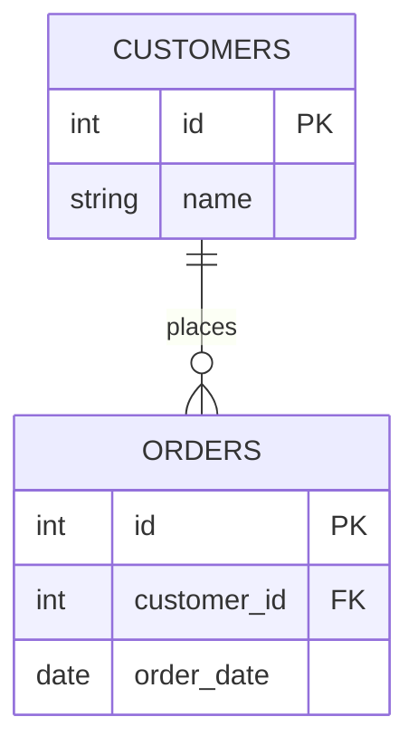

# Constraints

## PRIMARY KEY

A `PRIMARY KEY` uniquely identifies each row in a table. It implies both `UNIQUE` and `NOT NULL`, and a table can have only one primary key (though that key can span multiple columns — a composite key).

```sql
CREATE TABLE employees (
    id INT PRIMARY KEY,
    email VARCHAR(100)
);

-- Composite primary key
CREATE TABLE order_items (
    order_id   INT,
    product_id INT,
    quantity   INT,
    PRIMARY KEY (order_id, product_id)
);
```

Most databases automatically create a unique index backing the primary key, which also makes primary-key lookups fast.

## FOREIGN KEY

A `FOREIGN KEY` enforces referential integrity by requiring values in one table's column(s) to match existing values in another table's (usually primary/unique key) column(s).

```sql
CREATE TABLE orders (
    id          INT PRIMARY KEY,
    customer_id INT NOT NULL,
    FOREIGN KEY (customer_id) REFERENCES customers(id)
        ON DELETE CASCADE
        ON UPDATE CASCADE
);
```



- `ON DELETE`/`ON UPDATE` actions control what happens to child rows when the referenced parent row is deleted/updated: `CASCADE` (propagate), `SET NULL`, `SET DEFAULT`, `RESTRICT`/`NO ACTION` (block the operation).
- Enforcing foreign keys prevents orphaned rows (e.g., an order pointing to a deleted customer).

**Real-life scenario:** In an e-commerce schema, a foreign key from `orders.customer_id` to `customers.id` guarantees you can never insert an order for a non-existent customer, catching application bugs at the database level rather than silently corrupting data.

## UNIQUE

Ensures all values in a column (or combination of columns) are distinct across the table, while still allowing `NULL` (with database-specific nuances on multiple NULLs).

```sql
CREATE TABLE users (
    id    INT PRIMARY KEY,
    email VARCHAR(100) UNIQUE
);

-- Composite unique constraint
ALTER TABLE enrollments ADD CONSTRAINT uq_student_course UNIQUE (student_id, course_id);
```

**Gotcha:** In most databases (PostgreSQL, SQL Server, Oracle), multiple `NULL` values are allowed in a `UNIQUE` column because `NULL` is never considered equal to another `NULL`. MySQL follows the same standard behavior as well.

## NOT NULL

Ensures a column cannot store the `NULL` (unknown/missing) value — every row must supply a value for that column.

```sql
CREATE TABLE products (
    id   INT PRIMARY KEY,
    name VARCHAR(100) NOT NULL,
    sku  VARCHAR(50) NOT NULL
);
```

Enforcing `NOT NULL` where a value is logically always required avoids defensive `IS NULL` checks scattered throughout application code and catches missing-data bugs at insert time.

## CHECK

Enforces a boolean expression that must hold true for every row, allowing custom business-rule validation directly in the schema.

```sql
CREATE TABLE products (
    id    INT PRIMARY KEY,
    price NUMERIC(10, 2) CHECK (price > 0),
    stock INT NOT NULL CHECK (stock >= 0)
);

-- Table-level CHECK referencing multiple columns
ALTER TABLE bookings ADD CONSTRAINT chk_dates CHECK (end_date > start_date);
```

**Real-life scenario:** A `bookings` table can enforce `end_date > start_date` at the database level so that no application bug (in any service that writes to this table) can ever create an invalid reservation window.

## DEFAULT

Supplies an automatic value for a column when an `INSERT` doesn't explicitly provide one.

```sql
CREATE TABLE orders (
    id         INT PRIMARY KEY,
    status     VARCHAR(20) NOT NULL DEFAULT 'PENDING',
    created_at TIMESTAMPTZ NOT NULL DEFAULT now()
);

INSERT INTO orders (id) VALUES (1);  -- status becomes 'PENDING', created_at becomes now()
```

Defaults can be literals, expressions, or function calls (e.g., `now()`, `gen_random_uuid()`), evaluated at insert time.

## AUTO_INCREMENT / IDENTITY / SERIAL

Mechanisms for automatically generating sequential unique values for a column, typically used for surrogate primary keys.

| Database | Syntax |
|---|---|
| MySQL | `id INT AUTO_INCREMENT PRIMARY KEY` |
| PostgreSQL | `id SERIAL PRIMARY KEY` (legacy) or `id INT GENERATED ALWAYS AS IDENTITY PRIMARY KEY` (SQL-standard) |
| SQL Server | `id INT IDENTITY(1,1) PRIMARY KEY` |
| Oracle | `id NUMBER GENERATED ALWAYS AS IDENTITY PRIMARY KEY` (12c+) |

```sql
-- PostgreSQL, SQL-standard identity column (preferred over SERIAL)
CREATE TABLE products (
    id   INT GENERATED ALWAYS AS IDENTITY PRIMARY KEY,
    name VARCHAR(100) NOT NULL
);
```

`SERIAL` is PostgreSQL-specific sugar that creates a backing sequence implicitly; `GENERATED ALWAYS AS IDENTITY` is the newer, SQL-standard-compliant way and is generally preferred since it prevents accidentally overwriting the auto-generated value (unless `OVERRIDING SYSTEM VALUE` is explicitly used).

## Generated Columns (Overview)

A generated (computed) column derives its value automatically from an expression involving other columns in the same row, rather than being set directly by `INSERT`/`UPDATE`.

```sql
CREATE TABLE rectangles (
    width  NUMERIC NOT NULL,
    height NUMERIC NOT NULL,
    area   NUMERIC GENERATED ALWAYS AS (width * height) STORED
);
```

- `STORED` generated columns physically persist the computed value (recomputed on every write to source columns); some databases also support `VIRTUAL`/non-stored generated columns computed on read.
- Useful for derived/denormalized values that should always stay consistent with source data (e.g., `full_name` from `first_name || ' ' || last_name`), avoiding application-level bugs from manually keeping them in sync.

#### Interview Questions

1. **What's the difference between `PRIMARY KEY` and `UNIQUE` constraints?**
   Both enforce uniqueness, but a table can have only one `PRIMARY KEY` (which also implies `NOT NULL`), while it can have multiple `UNIQUE` constraints, and `UNIQUE` columns can typically contain `NULL` values (with `NULL` not considered equal to another `NULL`).
2. **Explain the difference between `ON DELETE CASCADE`, `SET NULL`, and `RESTRICT` for foreign keys.**
   `CASCADE` automatically deletes/updates child rows when the parent row is deleted/updated; `SET NULL` sets the foreign key column to `NULL` in child rows instead of deleting them (requires the FK column to be nullable); `RESTRICT`/`NO ACTION` blocks the parent delete/update entirely if dependent child rows exist, which is often the safest default for critical data.
3. **Why would you choose a `CHECK` constraint over enforcing the same rule only in application code?**
   A `CHECK` constraint guarantees the rule holds regardless of which application, script, or direct SQL client writes to the table, closing gaps that arise from multiple services or manual data fixes bypassing application validation. It moves the "last line of defense" for data integrity into the database itself.
4. **What's the difference between `SERIAL` and `GENERATED ALWAYS AS IDENTITY` in PostgreSQL?**
   `SERIAL` is legacy syntactic sugar that creates a backing sequence and sets the column default to `nextval()`, but the sequence and column are only loosely linked (you can accidentally insert an explicit conflicting value). `GENERATED ALWAYS AS IDENTITY` is the SQL-standard approach that more tightly controls the column, preventing explicit inserts unless you use `OVERRIDING SYSTEM VALUE`, and is the recommended modern approach.
5. **Can a `UNIQUE` column contain multiple `NULL` values? Why or why not?**
   Yes in most databases (PostgreSQL, SQL Server, Oracle, MySQL) — SQL's three-valued logic treats `NULL` as "unknown," so `NULL` is never considered equal to another `NULL`, meaning uniqueness checks don't flag multiple `NULL`s as duplicates.
6. **What is a generated/computed column, and what's a good use case?**
   A generated column automatically derives its value from an expression over other columns in the same row (e.g., `total = price * quantity`), stored or computed on read. It's useful for denormalized/derived data that must always stay consistent with its inputs, eliminating the need for application code or triggers to manually keep it in sync.
