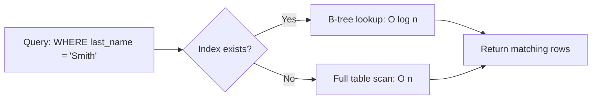

# Database Objects

## Databases

A database is the top-level container that holds schemas, tables, and other objects, along with its own configuration (character set, collation, connection limits). In most RDBMS, a server instance can host multiple independent databases, each isolated from the others (you typically can't join tables across databases without special cross-database features).

```sql
CREATE DATABASE ecommerce
  WITH ENCODING = 'UTF8';

-- Switch context (client/tool specific, e.g., psql)
\c ecommerce
```

- Provides isolation boundary for security, backup, and resource management.
- Each database has its own set of schemas/namespaces.
- In MySQL, "database" and "schema" are effectively synonyms; in PostgreSQL/Oracle/SQL Server, a database contains one or more schemas.

## Schemas

A schema is a logical namespace within a database that groups related tables, views, and other objects. Schemas allow multiple applications or teams to share a database while avoiding naming collisions, and they enable fine-grained access control.

```sql
CREATE SCHEMA sales;
CREATE SCHEMA inventory;

CREATE TABLE sales.orders (id INT PRIMARY KEY, amount NUMERIC);
CREATE TABLE inventory.products (id INT PRIMARY KEY, name VARCHAR(100));

-- Fully qualified reference
SELECT * FROM sales.orders;
```

**Real-life scenario:** A multi-tenant SaaS application might use one schema per tenant (`tenant_123.orders`) within a single database, simplifying tenant isolation and backup/restore per customer without provisioning a whole new database server.

## Tables

A table is the fundamental storage structure in a relational database — a two-dimensional structure of rows and columns, where each column has a defined data type and each row represents one record/entity instance.

```sql
CREATE TABLE employees (
    id          INT PRIMARY KEY,
    first_name  VARCHAR(50) NOT NULL,
    last_name   VARCHAR(50) NOT NULL,
    hire_date   DATE,
    salary      NUMERIC(10, 2)
);
```

- Rows are unordered by default — retrieval order is only guaranteed with an explicit `ORDER BY`.
- Tables can be permanent, temporary (session-scoped), or unlogged (PostgreSQL, skips WAL for speed at the cost of durability).

## Views

A view is a stored, named `SELECT` query that behaves like a virtual table — it doesn't store data itself (unlike a materialized view) but re-executes its underlying query every time it's referenced.

```sql
CREATE VIEW high_value_orders AS
SELECT order_id, customer_id, amount
FROM orders
WHERE amount > 1000;

SELECT * FROM high_value_orders WHERE customer_id = 42;
```

- Simplifies complex/repeated queries by giving them a reusable name.
- Can restrict column/row visibility for security (expose a view instead of the underlying table with sensitive columns).
- Some views are updatable (simple single-table views), allowing `INSERT`/`UPDATE`/`DELETE` through them.

**Advantages:** encapsulates complexity, improves security via column/row restriction, provides a stable interface even if underlying tables change (as long as the view definition is updated).

**Disadvantages:** adds a layer of indirection that can obscure performance issues; non-materialized views re-run the query each time, so they don't inherently improve performance.

## Materialized Views (Overview)

A materialized view is like a regular view, but its result set is physically stored (materialized) on disk. It must be explicitly refreshed to reflect underlying data changes, trading data freshness for query speed.

```sql
CREATE MATERIALIZED VIEW monthly_sales_summary AS
SELECT date_trunc('month', order_date) AS month, SUM(amount) AS total
FROM orders
GROUP BY 1;

-- Refresh when underlying data changes
REFRESH MATERIALIZED VIEW monthly_sales_summary;
-- Or without blocking reads (PostgreSQL, requires a unique index)
REFRESH MATERIALIZED VIEW CONCURRENTLY monthly_sales_summary;
```

| Aspect | View | Materialized View |
|---|---|---|
| Storage | No (virtual) | Yes (physical) |
| Freshness | Always current | Stale until refreshed |
| Query speed | Same as underlying query | Fast (pre-computed) |
| Use case | Simplify/secure queries | Expensive aggregations, reporting |

**Real-life scenario:** A dashboard showing monthly revenue trends across millions of rows can use a materialized view refreshed nightly, avoiding an expensive aggregation on every page load.

## Sequences

A sequence is a database object that generates a series of unique numeric values, typically used to produce primary key values independent of any particular table.

```sql
CREATE SEQUENCE order_id_seq START WITH 1 INCREMENT BY 1;

SELECT nextval('order_id_seq');  -- 1
SELECT nextval('order_id_seq');  -- 2

CREATE TABLE orders (
    id BIGINT PRIMARY KEY DEFAULT nextval('order_id_seq'),
    amount NUMERIC
);
```

- Sequences are independent objects — multiple tables can share one, or each table can have its own.
- They are not transactional in the strict sense: a rolled-back `INSERT` does **not** return the consumed sequence value, which can leave gaps in IDs. This is normal and expected behavior, not a bug.
- Underlies `SERIAL`/`IDENTITY`/`AUTO_INCREMENT` conveniences in most dialects.

## Indexes

An index is an auxiliary data structure (commonly a B-tree, sometimes a hash, GIN, or GiST structure) that speeds up row lookups by avoiding a full table scan, at the cost of extra storage and slower writes (since indexes must be maintained on every `INSERT`/`UPDATE`/`DELETE`).

```sql
CREATE INDEX idx_employees_last_name ON employees (last_name);

-- Composite index — column order matters
CREATE INDEX idx_orders_customer_date ON orders (customer_id, order_date);

-- Unique index (also enforces uniqueness)
CREATE UNIQUE INDEX idx_users_email ON users (email);
```



**Advantages:** dramatically faster reads/lookups, enforces uniqueness (unique indexes), supports efficient sorting and range queries.

**Disadvantages:** consumes additional disk space, slows down writes (`INSERT`/`UPDATE`/`DELETE` must update every index on the table), and an unused or poorly chosen index can actually hurt the optimizer's decisions.

**Real-life scenario:** A `users` table with millions of rows and frequent lookups by `email` (e.g., login) should have an index on `email` — without it, every login attempt triggers a full table scan.

#### Interview Questions

1. **What is the difference between a database and a schema?**
   A database is the top-level container with its own configuration and storage; a schema is a logical namespace inside a database used to group and organize related objects (tables, views) and control access. In MySQL, the two terms are used interchangeably, while PostgreSQL, Oracle, and SQL Server treat schema as a sub-container within a database.
2. **How does a materialized view differ from a regular view, and when would you choose one over the other?**
   A regular view is a virtual, always-current query definition with no stored data — it re-executes on every access. A materialized view physically stores the result set, offering much faster reads at the cost of staleness until manually or automatically refreshed. Use materialized views for expensive aggregations/reports where slightly stale data is acceptable; use regular views for simplifying/securing everyday queries that need current data.
3. **Why might adding an index sometimes make a query slower or not help at all?**
   Indexes speed up selective lookups but add overhead to writes and consume storage. If a query returns a large percentage of the table's rows, the optimizer may correctly choose a full table scan over an index scan because random-access index lookups can be slower than a sequential scan for low-selectivity queries. Also, if statistics are stale, the optimizer might choose a suboptimal plan even with an index present.
4. **Explain why gaps can appear in sequence-generated IDs, and whether that's a problem.**
   Sequences are non-transactional — calling `nextval()` consumes a value immediately, even if the surrounding transaction later rolls back or the application crashes before inserting. This causes gaps in ID sequences, which is expected behavior and generally not a problem since primary keys only need to be unique, not contiguous.
5. **What is a composite index, and why does column order matter?**
   A composite (multi-column) index is built on more than one column, and it's sorted first by the leading column, then the next, and so on. It can support queries filtering on the leading column alone or the leading column plus subsequent ones, but generally cannot efficiently support queries filtering only on a non-leading column, so the most selective/most-frequently-filtered column should typically come first.
6. **When would you use a schema-per-tenant design versus a database-per-tenant design in a multi-tenant application?**
   Schema-per-tenant shares one database instance/connection pool across tenants, reducing operational overhead and resource usage — good for many small tenants. Database-per-tenant gives stronger isolation (easier per-tenant backup/restore, resource limits, and security boundaries) at the cost of more operational complexity — better for fewer, larger, or compliance-sensitive tenants.
