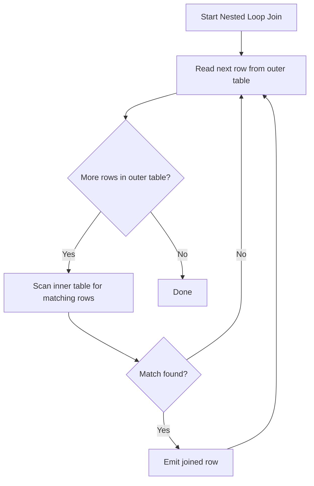

# Joins

Joins combine rows from two or more tables based on a related column, letting relational data (split across normalized tables) be reassembled at query time. The choice of join type determines which unmatched rows (if any) are kept.

| Join Type | Rows returned |
|---|---|
| `INNER JOIN` | Only rows with a match in both tables |
| `LEFT JOIN` | All left rows, plus matches from the right (unmatched right columns are `NULL`) |
| `RIGHT JOIN` | All right rows, plus matches from the left (unmatched left columns are `NULL`) |
| `FULL OUTER JOIN` | All rows from both sides; unmatched columns from either side are `NULL` |
| `CROSS JOIN` | Every combination of rows from both tables (Cartesian product) |

## INNER JOIN

`INNER JOIN` returns only rows where the join condition matches in *both* tables — rows without a match on either side are excluded entirely.

```sql
SELECT e.name, d.name AS department_name
FROM employees e
INNER JOIN departments d ON e.department_id = d.id;
```

`INNER JOIN` is the default/implicit join type — plain `JOIN` means `INNER JOIN`.

## LEFT JOIN

`LEFT JOIN` (or `LEFT OUTER JOIN`) returns all rows from the left table, plus matching rows from the right table; if no match exists, right-table columns are `NULL`.

```sql
-- All employees, including those without an assigned department
SELECT e.name, d.name AS department_name
FROM employees e
LEFT JOIN departments d ON e.department_id = d.id;

-- Find employees with NO department (classic "find the missing side" pattern)
SELECT e.name
FROM employees e
LEFT JOIN departments d ON e.department_id = d.id
WHERE d.id IS NULL;
```

**Real-world use:** reporting queries that must include "zero" cases, e.g., "list all customers and their order count, including customers with no orders."

## RIGHT JOIN

`RIGHT JOIN` (or `RIGHT OUTER JOIN`) is the mirror image of `LEFT JOIN` — all rows from the right table are kept, with unmatched left-table columns as `NULL`.

```sql
SELECT e.name, d.name AS department_name
FROM employees e
RIGHT JOIN departments d ON e.department_id = d.id; -- all departments, even empty ones
```

**Style note:** `RIGHT JOIN` is used far less often in practice since any `RIGHT JOIN` can be rewritten as a `LEFT JOIN` by swapping the table order — most style guides prefer standardizing on `LEFT JOIN` for readability/consistency.

## FULL OUTER JOIN

`FULL OUTER JOIN` returns all rows from both tables, matching where possible; unmatched rows from either side appear with `NULL`s for the other side's columns.

```sql
SELECT e.name, d.name AS department_name
FROM employees e
FULL OUTER JOIN departments d ON e.department_id = d.id;
-- Includes employees with no department AND departments with no employees
```

**Gotcha:** MySQL does not support `FULL OUTER JOIN` natively — it must be emulated with `LEFT JOIN UNION RIGHT JOIN` (or `LEFT JOIN UNION ALL` a `RIGHT JOIN ... WHERE left.id IS NULL`).

## CROSS JOIN

`CROSS JOIN` produces the Cartesian product of two tables — every row from the first table paired with every row from the second, with no join condition.

```sql
SELECT s.size, c.color
FROM sizes s
CROSS JOIN colors c; -- generates every size/color combination, e.g., for product variants
```

**Real-world use:** generating combinatorial data (e.g., all size/color variants of a product, or a calendar table joined against categories). **Gotcha:** accidentally omitting a join condition (`FROM a, b` with no `WHERE`) produces an unintended cross join, which can silently multiply row counts and is a common source of duplicate-row bugs in reports.

## SELF JOIN

A self-join joins a table to itself, typically to compare rows within the same table — most commonly for hierarchical/tree-structured data (e.g., employee/manager relationships).

```sql
SELECT e.name AS employee_name, m.name AS manager_name
FROM employees e
LEFT JOIN employees m ON e.manager_id = m.id;

-- Find employees who earn more than their manager
SELECT e.name, e.salary, m.name AS manager_name, m.salary AS manager_salary
FROM employees e
JOIN employees m ON e.manager_id = m.id
WHERE e.salary > m.salary;
```

Table aliases (`e`, `m`) are mandatory here since the table appears twice — without them, the database can't disambiguate which "copy" a column reference belongs to. A `LEFT JOIN` is typically used (rather than `INNER JOIN`) so top-level employees with no manager are still included.

## NATURAL JOIN (Concept)

`NATURAL JOIN` automatically joins two tables on all columns that share the same name, with no explicit `ON` clause.

```sql
-- If both tables have an identically-named "department_id" column:
SELECT * FROM employees NATURAL JOIN departments;
```

**Why it's generally discouraged:** the join condition is implicit and depends entirely on column naming — adding an unrelated column with a matching name to either table silently changes the join semantics, and it's not immediately obvious from reading the query which columns are actually being joined on. Explicit `JOIN ... ON` is almost always preferred for clarity and safety in production code.

## Join Execution Basics

The query optimizer chooses a physical join algorithm at execution time based on table sizes, available indexes, and statistics — the three classic strategies are:

- **Nested Loop Join** — for each row in the outer table, scan the inner table for matches. Efficient when the outer table is small and the inner table has a usable index on the join column; poor for large unindexed tables (O(n·m)).
- **Hash Join** — build an in-memory hash table on the smaller input's join key, then probe it with the larger input. Efficient for large, unsorted inputs without a useful index.
- **Merge Join** — if both inputs are already sorted on the join key (or can be cheaply sorted), scan both in tandem. Efficient for large, pre-sorted or indexed inputs.



**Practical takeaway:** ensure foreign key / join columns are indexed — this is usually the single biggest lever for join performance, since it allows the optimizer to choose an efficient nested loop or merge join instead of falling back to expensive full scans. Use `EXPLAIN` / `EXPLAIN ANALYZE` to see which strategy the optimizer actually chose.

#### Interview Questions

1. **What determines whether `JOIN` performance is fast or slow, and what's the single most impactful fix?**
   Performance largely depends on whether the join columns are indexed and how large/well-estimated the intermediate result sets are; without an index, the optimizer may be forced into a full-table-scan nested loop or an expensive hash join build. Adding an index on the foreign key / join column is usually the highest-leverage fix, alongside ensuring statistics are up to date so the optimizer picks the right algorithm.
2. **How does `NULL` in a join column affect the join result, and why?**
   Join conditions are ordinary predicates (typically `=`), and comparing `NULL = NULL` (or `NULL` to anything) evaluates to `UNKNOWN`, not `TRUE` — so rows with a `NULL` join column will never match in an `INNER JOIN` (or the "matching" side of an outer join), regardless of whether the other side also has `NULL`. This is why `LEFT JOIN ... WHERE right.col IS NULL` is a standard pattern for "find unmatched rows," rather than trying to join directly on `NULL`.
3. **Give a practical use case for a self-join.**
   Modeling hierarchical data stored flatly in one table, such as an `employees` table with a `manager_id` referencing another row in the same table — a self-join (`employees e JOIN employees m ON e.manager_id = m.id`) lets you retrieve each employee alongside their manager's details in a single query. Other common cases include comparing rows for duplicates, finding sequential/adjacent records, or comparing a row to a "previous" row of the same type.
4. **What's the difference between `LEFT JOIN` and `RIGHT JOIN`, and is one better than the other?**
   They're mirror images — `LEFT JOIN` keeps all rows from the left (first-listed) table, `RIGHT JOIN` keeps all rows from the right table, filling unmatched columns from the other side with `NULL`. Neither is inherently "better"; any `RIGHT JOIN` can be rewritten as a `LEFT JOIN` by swapping table order, and most teams standardize on `LEFT JOIN` alone for consistency and readability.
5. **Why can placing a filter condition in the `WHERE` clause instead of the `ON` clause change the results of an outer join?**
   For an outer join, filtering the "preserved" side's matched columns in `WHERE` (rather than `ON`) effectively converts the outer join back into an inner join for those rows, because `WHERE` is evaluated after the join and eliminates rows where the filtered column is `NULL` from non-matches. To keep outer-join semantics while still restricting the joined table, the condition must go in the `ON` clause instead.
6. **What are the three main physical join algorithms a query optimizer can choose from, and when is each typically used?**
   Nested loop join (good for small outer input with an index on the inner join column), hash join (good for large, unsorted inputs without a usable index — builds a hash table on the smaller side), and merge join (good when both inputs are already sorted on the join key, e.g., via an index). The optimizer picks based on table size estimates, available indexes, and statistics, visible via `EXPLAIN`/`EXPLAIN ANALYZE`.
