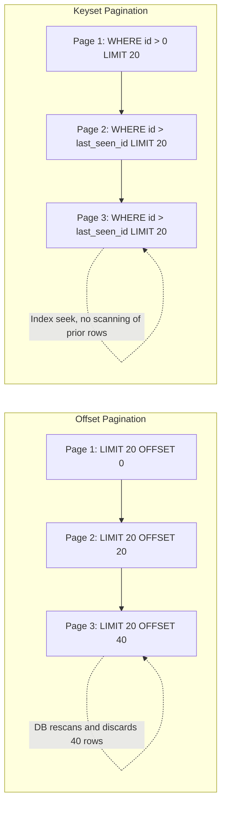

# Pagination

## LIMIT / OFFSET

`LIMIT` caps how many rows a query returns, and `OFFSET` skips a number of rows before starting to return results — together they're the simplest way to page through a result set.

```sql
-- Page 1 (rows 1-20)
SELECT id, title, created_at
FROM articles
ORDER BY created_at DESC
LIMIT 20 OFFSET 0;

-- Page 3 (rows 41-60)
SELECT id, title, created_at
FROM articles
ORDER BY created_at DESC
LIMIT 20 OFFSET 40;
```

`OFFSET` is easy to reason about and maps directly onto `Pageable`/`PageRequest` in Spring Data JPA, but it has a well-known performance problem: the database still has to *scan and discard* every skipped row before it can start returning the requested page, so `OFFSET 1000000` is dramatically slower than `OFFSET 0` even though both return the same number of rows.

## Keyset Pagination (Concept)

Keyset pagination (also called "seek" pagination) avoids `OFFSET` entirely by remembering the last row seen on the previous page and filtering for rows strictly after it, using an indexed column (typically the primary key or a sort column with a tiebreaker).

```sql
-- First page
SELECT id, title, created_at
FROM articles
ORDER BY created_at DESC, id DESC
LIMIT 20;

-- Next page: caller passes back the (created_at, id) of the last row from the previous page
SELECT id, title, created_at
FROM articles
WHERE (created_at, id) < ('2026-07-15 10:00:00', 8421)
ORDER BY created_at DESC, id DESC
LIMIT 20;
```

Because the `WHERE` clause can use an index seek (`created_at, id`) instead of scanning and counting rows, keyset pagination stays fast no matter how deep into the result set the page is — a major advantage for large tables or infinite-scroll style UIs. The trade-off is that you can no longer jump directly to an arbitrary page number (e.g. "go to page 47") — you can only move forward/backward relative to a known row.



**Offset vs keyset pagination**

| Aspect | Offset (`LIMIT`/`OFFSET`) | Keyset (seek) |
|---|---|---|
| Performance on deep pages | Degrades as offset grows (scans + discards rows) | Consistently fast (index seek) |
| Jump to arbitrary page | Yes | No — only next/previous relative to a cursor |
| Stable under concurrent inserts/deletes | No — rows can shift between pages | Yes — cursor is tied to actual row values |
| Implementation complexity | Simple | Slightly more complex (needs a stable sort + cursor) |
| Typical Spring Data support | `Pageable` / `PageRequest.of(page, size)` | `Slice`/custom `WHERE` + `Pageable` with `Sort`, or `ScrollPosition`/`Window` (`findBy...().scroll(...)`) |

## Cursor-Based Pagination (Concept)

Cursor-based pagination is the same underlying idea as keyset pagination, applied at the API layer: instead of exposing raw page numbers, the API returns an opaque "cursor" token (often an encoded representation of the last row's sort key) that the client sends back to fetch the next page. This decouples the API contract from the underlying SQL technique and is what most large-scale REST/GraphQL APIs (e.g. GitHub's API) use for list endpoints.

```sql
-- The API encodes something like base64("2026-07-15T10:00:00|8421") as the cursor
SELECT id, title, created_at
FROM articles
WHERE (created_at, id) < ('2026-07-15 10:00:00', 8421)
ORDER BY created_at DESC, id DESC
LIMIT 20;
```

Real-life scenario: an infinite-scroll social media feed cannot use `OFFSET` at scale — by the time a user has scrolled to page 500, `OFFSET` would force the database to scan hundreds of thousands of rows per request. A cursor referencing "the last post ID and timestamp I saw" lets every request perform the same constant-time index seek regardless of how far the user has scrolled, and it also avoids showing duplicate/skipped posts if new rows are inserted while the user scrolls.

#### Interview Questions

1. **Why does `OFFSET` get slower as the offset value increases, even though the number of returned rows (`LIMIT`) stays the same?**
   The database must still walk through and discard every row up to the offset before it can start returning the requested rows — there's no way to "jump" directly to row 100,000 without first counting past the preceding 99,999 in most standard execution plans, so cost grows roughly linearly with the offset.
2. **What problem can occur with `OFFSET`-based pagination if rows are inserted or deleted between page requests?**
   Because offset is a positional count rather than tied to actual row values, a row can shift between pages — e.g. a new row inserted at the top pushes everything down, causing the same row to appear twice across two page requests, or a row to be skipped entirely.
3. **How does keyset (seek) pagination avoid the performance problems of `OFFSET`?**
   Instead of counting rows to skip, it filters with `WHERE (sort_column, tiebreaker) < (last_seen_value, last_seen_id)`, which the database can satisfy with a direct index seek to the correct starting point, independent of how many rows come before it.
4. **What is the main limitation of keyset/cursor pagination compared to offset pagination?**
   You lose the ability to jump directly to an arbitrary page number (e.g., "go to page 50"); you can only navigate forward or backward relative to a specific cursor/row, which is fine for infinite-scroll UIs but awkward for numbered pagination controls.
5. **How does Spring Data JPA's `Pageable`/`Page` relate to offset pagination, and what alternative exists for keyset-style pagination?**
   `PageRequest.of(pageNumber, pageSize)` translates directly into a `LIMIT`/`OFFSET` query and also issues a `COUNT` query for total elements, inheriting the same deep-page performance cost. For keyset-style pagination, Spring Data supports `ScrollPosition`-based scrolling (`findBy...().scroll(ScrollPosition.keyset())`) which generates seek-style `WHERE` clauses instead of `OFFSET`.
6. **Why is a tiebreaker column (like the primary key) needed in keyset pagination's `ORDER BY`/`WHERE` clause even when sorting by another column such as `created_at`?**
   If the sort column isn't unique (e.g. multiple articles created at the exact same timestamp), sorting by it alone can't unambiguously determine "everything after this row." Adding a unique tiebreaker (typically `id`) guarantees a total, stable order so the cursor comparison `(created_at, id) < (...)` always identifies a consistent next page.
