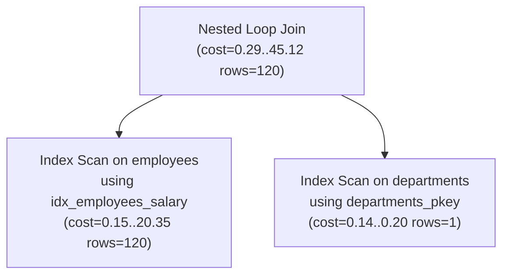

# Query Optimization

Query optimization is the process (largely automated by the database's planner/optimizer, but guided by the developer) of ensuring a query executes using the cheapest available strategy — the right indexes, join order, and access methods — for the actual data distribution.

## Execution Plan (EXPLAIN)

`EXPLAIN` shows the query plan the optimizer *would* use (or did use), without actually running the query — the step-by-step strategy (scan types, join methods, order of operations) and their estimated costs.

```sql
EXPLAIN
SELECT e.name, d.name AS department_name
FROM employees e
JOIN departments d ON e.department_id = d.id
WHERE e.salary > 80000;
```



Reading a plan is done **bottom-up / inside-out**: the innermost (deepest-indented) nodes execute first and feed their output up into the parent operations above them, ending at the root node which represents the final result.

## EXPLAIN ANALYZE

`EXPLAIN ANALYZE` actually **executes** the query and reports real measured timings and row counts alongside the planner's estimates, letting you directly compare estimated vs. actual to spot planner misjudgments.

```sql
EXPLAIN ANALYZE
SELECT e.name, d.name AS department_name
FROM employees e
JOIN departments d ON e.department_id = d.id
WHERE e.salary > 80000;

-- Example output snippet:
-- Nested Loop  (cost=0.29..45.12 rows=120 width=64) (actual time=0.05..1.2 rows=340 loops=1)
--   ->  Index Scan using idx_employees_salary on employees  (cost=0.15..20.35 rows=120 width=40) (actual time=0.02..0.4 rows=340 loops=1)
--   ->  Index Scan using departments_pkey on departments  (cost=0.14..0.20 rows=1 width=32) (actual time=0.001..0.001 rows=1 loops=340)
```

**Caution:** because it actually runs the query, `EXPLAIN ANALYZE` on a data-modifying statement (`INSERT`/`UPDATE`/`DELETE`) will genuinely apply those changes — wrap it in a transaction and `ROLLBACK` afterward if you just want to inspect the plan without committing changes. A large `rows` estimate vs. `actual` mismatch is the single strongest signal that table statistics are stale (fix with `ANALYZE`) or a query is structured in a way the planner can't estimate well.

## Index Scan

An index scan traverses the index structure (typically a B-tree) to find matching rows' locations, then fetches the actual row data — efficient when relatively few rows match the condition.

```sql
EXPLAIN SELECT * FROM employees WHERE email = 'jane@example.com';
-- Index Scan using idx_employees_email on employees  (cost=0.15..8.17 rows=1 width=64)
```

- **Index Only Scan** (PostgreSQL): if *all* requested columns are present in the index itself, the engine can skip fetching the actual table row entirely, which is faster still (requires the index to be a "covering" index for that query).
- Index scans involve extra random I/O (jumping between the index and the heap/table) compared to sequential I/O, so they're only a net win when they let the engine skip a large fraction of non-matching rows.

## Sequential Scan

A sequential scan (a.k.a. full table scan) reads every row of the table in physical storage order, checking each one against the query's condition.

```sql
EXPLAIN SELECT * FROM employees;
-- Seq Scan on employees  (cost=0.00..18.50 rows=850 width=64)
```

Contrary to intuition, a sequential scan isn't inherently "bad" — for queries expected to return a large fraction of a table's rows, or for small tables entirely, sequential I/O (reading data in physical order) can outperform the random I/O of repeated index lookups. The optimizer chooses between the two based on cost estimates, not a fixed rule.

| Aspect | Index Scan | Sequential Scan |
|---|---|---|
| I/O pattern | Random (index → heap lookups) | Sequential (reads pages in order) |
| Best for | Highly selective conditions (few matching rows) | Low selectivity, small tables, or most rows needed anyway |
| Overhead | Index traversal + row lookups | None beyond reading the whole table |
| Can be avoided by planner when | Predicate matches a large fraction of rows | An appropriate, selective index exists and is cheaper |

## Join Strategies

The optimizer chooses among several physical join algorithms based on table sizes, available indexes, and selectivity — the SQL `JOIN` syntax itself doesn't dictate which is used.

- **Nested Loop Join**: for each row of the outer table, scans (or index-probes) the inner table for matches. Efficient when the outer side is small and/or the inner side has a usable index on the join column; degrades badly on large, unindexed tables since it's effectively $O(n \times m)$.
- **Hash Join**: builds an in-memory hash table from the smaller ("build") input keyed on the join column, then scans the larger ("probe") input, checking each row against the hash table. Effective for large, unsorted inputs without useful indexes, but requires enough memory to hold the hash table (or spills to disk, which is slower).
- **Merge Join**: requires both inputs to be sorted (or sorts them first) on the join column, then walks both sorted streams in lockstep, merging matches. Efficient when both inputs are already sorted (e.g., via an index) or for very large equi-joins where a hash table wouldn't fit in memory.

```sql
EXPLAIN
SELECT o.id, c.name
FROM orders o
JOIN customers c ON o.customer_id = c.id;
-- e.g. Hash Join  (cost=15.00..350.00 rows=10000 width=48)
--        Hash Cond: (o.customer_id = c.id)
--        ->  Seq Scan on orders o
--        ->  Hash
--              ->  Seq Scan on customers c
```

## Cost-Based Optimization

Modern query optimizers are **cost-based**: they enumerate multiple candidate execution plans for a query, estimate each plan's cost using internal formulas fed by table/column statistics, and choose the plan with the lowest estimated cost — not necessarily the "obviously" fastest-looking one.

- Cost estimates combine factors like estimated row counts, I/O cost (page reads), and CPU cost (per-row processing), calibrated by configurable cost constants (e.g., PostgreSQL's `seq_page_cost`, `random_page_cost`, `cpu_tuple_cost`).
- Statistics (row counts, most-common-value lists, histograms of value distribution) are what let the optimizer estimate selectivity accurately — stale statistics after large data changes are a very common cause of a suddenly-bad query plan, fixed by running `ANALYZE`.
- Because it's a cost *estimate*, not a guarantee, the optimizer can occasionally choose a suboptimal plan (e.g., due to outdated statistics, complex correlated predicates it can't estimate well, or overly generic query parameters) — this is why comparing `EXPLAIN` estimates against `EXPLAIN ANALYZE` actuals is the standard troubleshooting technique.

## Query Performance Tuning Basics

Practical, high-leverage steps for diagnosing and fixing a slow query, roughly in order of investigation:

1. **Run `EXPLAIN ANALYZE`** on the slow query to see the actual plan, timings, and row counts — look for large estimated-vs-actual mismatches and the most expensive node(s).
2. **Check for missing or unused indexes** on columns used in `WHERE`, `JOIN`, and `ORDER BY` — but verify selectivity first; not every filter column needs one (see "When Not to Use Indexes").
3. **Update statistics** (`ANALYZE`) if estimates look far off from reality, especially after bulk loads/deletes.
4. **Avoid `SELECT *`** when only specific columns are needed — reduces I/O and can enable index-only scans.
5. **Rewrite queries that defeat index usage**, e.g., wrapping an indexed column in a function (`WHERE LOWER(email) = ...`) without a matching functional index, or using a leading wildcard `LIKE '%text'` which can't use a standard B-tree index.
6. **Check join order and join types** for unexpectedly large intermediate row counts — sometimes restructuring a query (e.g., pre-filtering via a CTE before joining) helps the optimizer produce a better plan.
7. **Watch for N+1 query patterns** at the application/ORM layer (very common with JPA/Hibernate lazy loading) — a single query with a `JOIN` or a bulk `IN` fetch is usually far cheaper than many round-trip queries.
8. **Limit result sets appropriately** (`LIMIT`/pagination) so the database doesn't compute or transfer more rows than the application actually needs.

#### Interview Questions

1. **What's the difference between `EXPLAIN` and `EXPLAIN ANALYZE`?**
   `EXPLAIN` shows the planner's *estimated* execution plan and costs without running the query. `EXPLAIN ANALYZE` actually executes the query and reports real measured row counts and timings alongside the estimates, which is essential for spotting cases where the planner's assumptions (based on statistics) don't match reality.
2. **When would the optimizer choose a sequential scan over an available index, and is that necessarily a problem?**
   When the query is expected to match a large fraction of the table's rows (low selectivity), or the table is small, a sequential scan's simple sequential I/O can be cheaper than the random I/O of repeated index lookups plus row fetches. This is usually not a problem — it's the cost-based optimizer correctly recognizing the index wouldn't actually help; forcing an index in that case can make the query slower, not faster.
3. **How do you read a nested execution plan — which node executes first?**
   Execution plans are read bottom-up / inside-out: the most deeply indented (innermost) nodes execute first and feed their results upward into their parent nodes, continuing until the root/outermost node produces the final result. Costs shown at each node are typically cumulative, including the cost of all child nodes beneath it.
4. **What's the difference between a hash join, a merge join, and a nested loop join, and when does the optimizer pick each?**
   A nested loop join scans/probes the inner table once per outer row — good for small outer inputs or when the inner side has a usable index. A hash join builds an in-memory hash table from the smaller input and probes it with the larger input — good for large, unsorted equi-joins with enough memory. A merge join requires both inputs sorted on the join key and merges them in lockstep — good when both sides are already sorted (e.g., via an index) or for very large joins where a hash table wouldn't fit in memory. The optimizer picks based on cost estimates from table size, available indexes, and memory settings.
5. **A query was fast yesterday and slow today with no code change — what's the first thing you'd check?**
   Whether the table's statistics are stale relative to a recent large data change (bulk insert/delete/update) — outdated statistics can cause the cost-based optimizer to choose a previously-good but now-suboptimal plan (e.g., switching from an index scan to a sequential scan, or picking a bad join order). Running `ANALYZE` (or checking auto-vacuum/auto-analyze settings) is usually the fastest first diagnostic step, followed by re-running `EXPLAIN ANALYZE` to compare the new plan.
6. **Give an example of when adding an index would *not* help query performance, and explain how you'd confirm it via the execution plan.**
   Indexing a low-selectivity column (e.g., a boolean flag with a near-even split) usually won't help, because a large fraction of rows match any given value, making a sequential scan cheaper than repeated index lookups. You'd confirm this by running `EXPLAIN` (or `EXPLAIN ANALYZE`) both with and without the index (or checking if the planner already ignores an existing one) and observing that the planner still chooses (or would choose) a sequential scan because its cost estimate is lower than the index-scan alternative.
