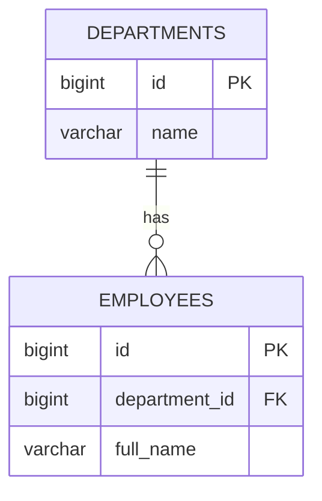
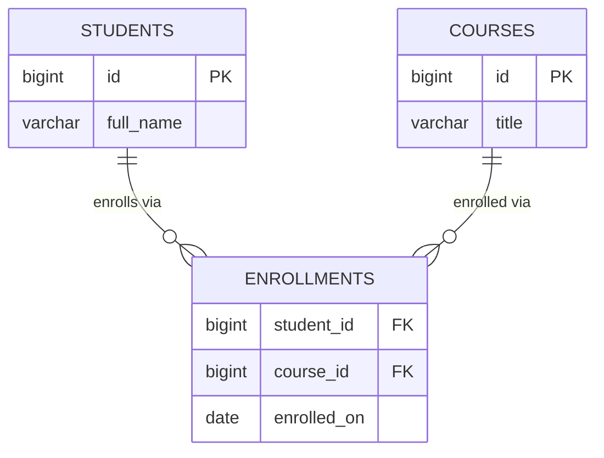
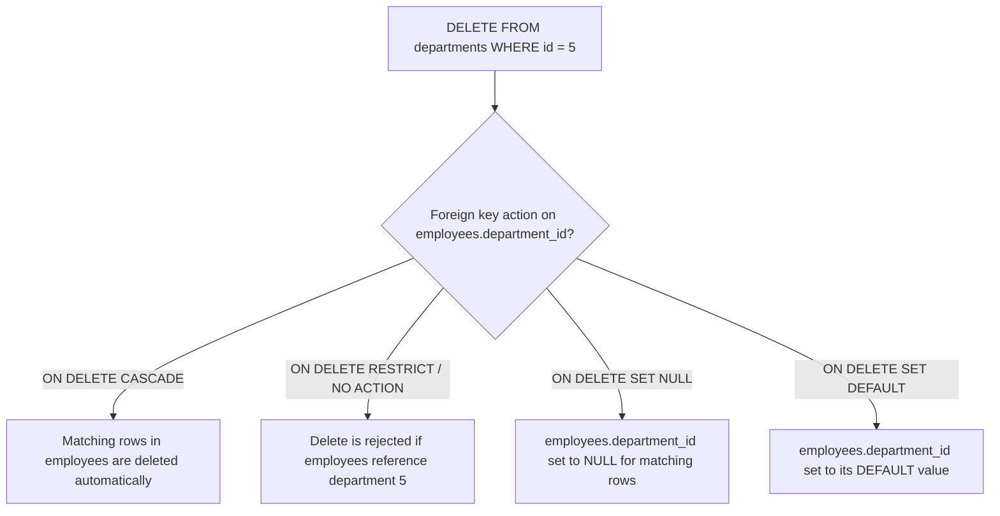

# SQL Relationships and Data Integrity

## One-to-One Queries

A one-to-one relationship means a row in one table corresponds to at most one row in another table. In SQL this is modeled with a foreign key column that also carries a `UNIQUE` constraint (or, alternatively, by making the foreign key column itself the primary key so both tables share the same identity).

Common real-life example: a `users` table holding authentication data and a `user_profiles` table holding optional, less frequently accessed details (bio, avatar, preferences). Splitting them keeps the hot authentication row small and lets the profile be lazily joined only when needed.

```sql
CREATE TABLE users (
    id BIGSERIAL PRIMARY KEY,
    username VARCHAR(50) NOT NULL UNIQUE
);

CREATE TABLE user_profiles (
    id BIGSERIAL PRIMARY KEY,
    user_id BIGINT NOT NULL UNIQUE REFERENCES users(id),
    bio TEXT,
    avatar_url VARCHAR(255)
);

-- Fetch a user together with their profile
SELECT u.username, p.bio, p.avatar_url
FROM users u
JOIN user_profiles p ON p.user_id = u.id
WHERE u.id = 42;

-- Not every user has a profile row yet -> use LEFT JOIN
SELECT u.username, p.bio
FROM users u
LEFT JOIN user_profiles p ON p.user_id = u.id
WHERE u.id = 42;
```

The `UNIQUE` constraint on `user_id` is what actually enforces "one-to-one" at the database level — without it, `user_profiles` would allow multiple rows per user, silently degrading it into a one-to-many relationship.

## One-to-Many Queries

The most common relationship: one parent row relates to many child rows, expressed by placing a foreign key on the "many" side that references the "one" side's primary key. Examples: one `department` has many `employees`; one `customer` has many `orders`.

```sql
CREATE TABLE departments (
    id BIGSERIAL PRIMARY KEY,
    name VARCHAR(100) NOT NULL
);

CREATE TABLE employees (
    id BIGSERIAL PRIMARY KEY,
    department_id BIGINT REFERENCES departments(id),
    full_name VARCHAR(150) NOT NULL
);

-- All employees in every department, including departments with none
SELECT d.name, e.full_name
FROM departments d
LEFT JOIN employees e ON e.department_id = d.id
ORDER BY d.name;

-- Count employees per department
SELECT d.name, COUNT(e.id) AS employee_count
FROM departments d
LEFT JOIN employees e ON e.department_id = d.id
GROUP BY d.name
ORDER BY employee_count DESC;
```



Choosing `INNER JOIN` vs `LEFT JOIN` here matters: `INNER JOIN` silently drops departments with zero employees, which is often *not* what a report needs.

## Many-to-Many Queries

A many-to-many relationship means rows on both sides can relate to multiple rows on the other side — a `student` can enroll in many `courses`, and a `course` can have many `students`. SQL has no native way to express this with a single foreign key, so it's always implemented with a **junction table** (also called an associative or bridge table) sitting between the two entities.

```sql
CREATE TABLE students (
    id BIGSERIAL PRIMARY KEY,
    full_name VARCHAR(150) NOT NULL
);

CREATE TABLE courses (
    id BIGSERIAL PRIMARY KEY,
    title VARCHAR(150) NOT NULL
);

CREATE TABLE enrollments (
    student_id BIGINT REFERENCES students(id),
    course_id BIGINT REFERENCES courses(id),
    enrolled_on DATE NOT NULL DEFAULT CURRENT_DATE,
    PRIMARY KEY (student_id, course_id)
);

-- Courses a specific student is enrolled in
SELECT c.title, e.enrolled_on
FROM enrollments e
JOIN courses c ON c.id = e.course_id
WHERE e.student_id = 7;

-- Students enrolled in a specific course
SELECT s.full_name, e.enrolled_on
FROM enrollments e
JOIN students s ON s.id = e.student_id
WHERE e.course_id = 101;
```



## Junction Tables

A junction table's primary responsibility is to hold the pair of foreign keys that represent one association, and optionally attributes that describe *that specific association* (e.g. `enrolled_on`, `grade`, `role`). Two design choices come up repeatedly:

- **Composite primary key** — `PRIMARY KEY (student_id, course_id)` prevents the same pair from being inserted twice and doubles as an index for lookups starting with `student_id`.
- **Surrogate primary key** — a separate `id BIGSERIAL PRIMARY KEY` plus a `UNIQUE (student_id, course_id)` constraint. This is preferred when the association itself needs to be referenced by other tables (e.g. `enrollment_grades.enrollment_id`).

```sql
-- Always index the "other" foreign key explicitly, since only the
-- leading column of a composite PK is efficiently searchable alone.
CREATE INDEX idx_enrollments_course_id ON enrollments (course_id);
```

Without that extra index, "find all students for course X" would force a full scan of `enrollments` because the composite primary key index `(student_id, course_id)` can't be used efficiently when `course_id` is searched alone.

## Foreign Key Navigation

Foreign key navigation is the act of following relationships across multiple joins to answer a question that spans several tables — e.g., "which instructor teaches the courses that student 7 is enrolled in?" This is the SQL equivalent of walking an object graph in application code.

```sql
CREATE TABLE instructors (
    id BIGSERIAL PRIMARY KEY,
    full_name VARCHAR(150) NOT NULL
);

ALTER TABLE courses ADD COLUMN instructor_id BIGINT REFERENCES instructors(id);

SELECT s.full_name AS student, c.title AS course, i.full_name AS instructor
FROM students s
JOIN enrollments e ON e.student_id = s.id
JOIN courses c ON c.id = e.course_id
JOIN instructors i ON i.id = c.instructor_id
WHERE s.id = 7;
```

Each hop is just another `JOIN` on a foreign key column. The main practical concerns are (1) making sure every foreign key column used in a join has an index, and (2) being deliberate about `INNER` vs `LEFT JOIN` at each hop so optional relationships (e.g. a course without an assigned instructor) don't unexpectedly remove rows from the result.

#### Interview Questions

1. **How do you enforce a true one-to-one relationship in SQL, and what happens if you forget the `UNIQUE` constraint on the foreign key?**
   Add a `UNIQUE` constraint (or make the FK column the primary key) on the referencing column. Without `UNIQUE`, nothing stops multiple child rows from pointing at the same parent, so the relationship silently becomes one-to-many even though the application logic assumes one-to-one.
2. **Why is a junction table necessary for many-to-many relationships instead of adding a foreign key to both sides?**
   A single foreign key column can only reference one row, so it cannot represent "many on both sides." A junction table stores one row per pairing, using a composite (or surrogate) key, and can also carry attributes specific to that pairing, like an enrollment date.
3. **When navigating three or more joined tables, why does the choice between `INNER JOIN` and `LEFT JOIN` at each hop matter?**
   `INNER JOIN` drops a row entirely if any hop has no match (e.g. a course with no assigned instructor), which can silently remove valid parent/child data from a report. `LEFT JOIN` preserves the left-side rows and returns `NULL` for the missing side, which is usually what's wanted for optional relationships.
4. **In a junction table with a composite primary key `(student_id, course_id)`, why might you still need a separate index on `course_id`?**
   A composite index is only efficiently searchable from its leading column(s); a lookup filtering solely by `course_id` can't use the `(student_id, course_id)` index effectively and would fall back to a full table scan without a dedicated index on `course_id`.
5. **What's the difference between using a composite primary key versus a surrogate primary key on a junction table?**
   A composite key `(student_id, course_id)` naturally prevents duplicate pairings and needs no extra column, but it's awkward to reference from other tables. A surrogate key (e.g. `id BIGSERIAL`) plus a `UNIQUE` constraint on the pair gives every association its own identity, which is useful when other tables need to point at a specific association row.
6. **How would you model a one-to-one relationship where you also want the child row to be deleted automatically when the parent is deleted?**
   Declare the foreign key with `ON DELETE CASCADE` in addition to the `UNIQUE` constraint, e.g. `user_id BIGINT UNIQUE REFERENCES users(id) ON DELETE CASCADE`, so removing a user automatically removes its profile row.

## Data Integrity

Referential actions determine what happens to child rows when a referenced parent row is updated or deleted. They're declared as part of the foreign key constraint using `ON DELETE` / `ON UPDATE` clauses, and choosing the right one is a key part of keeping data consistent without pushing extra cleanup logic into the application layer.

```sql
CREATE TABLE departments (
    id BIGSERIAL PRIMARY KEY,
    name VARCHAR(100) NOT NULL
);

CREATE TABLE employees (
    id BIGSERIAL PRIMARY KEY,
    department_id BIGINT REFERENCES departments(id)
        ON DELETE CASCADE
        ON UPDATE CASCADE,
    full_name VARCHAR(150) NOT NULL
);
```



## Cascading Deletes

`ON DELETE CASCADE` automatically deletes child rows when their referenced parent row is deleted. It's convenient for strict ownership relationships — e.g. deleting an `order` should delete its `order_items`, since an order item has no meaning without its order.

```sql
ALTER TABLE order_items
    DROP CONSTRAINT order_items_order_id_fkey,
    ADD CONSTRAINT order_items_order_id_fkey
        FOREIGN KEY (order_id) REFERENCES orders(id)
        ON DELETE CASCADE;

DELETE FROM orders WHERE id = 1001; -- order_items for order 1001 are removed too
```

Cascading deletes are powerful but dangerous: a single `DELETE` can ripple through several tables. In Spring Data JPA, `CascadeType.REMOVE` on an `@OneToMany` mirrors this behavior at the application level — but relying on the database's `ON DELETE CASCADE` is usually faster and safer since it happens atomically inside the database, without loading entities into memory first.

## Cascading Updates

`ON UPDATE CASCADE` propagates a change in the parent's key value to every child row that references it. This matters far less when primary keys are surrogate, auto-generated values that never change, but it's essential when a natural key (like a `country_code`) is used as a primary key and might legitimately be updated.

```sql
CREATE TABLE countries (
    code CHAR(2) PRIMARY KEY,
    name VARCHAR(100) NOT NULL
);

CREATE TABLE offices (
    id BIGSERIAL PRIMARY KEY,
    country_code CHAR(2) REFERENCES countries(code) ON UPDATE CASCADE
);

UPDATE countries SET code = 'UK' WHERE code = 'GB';
-- offices.country_code rows update from 'GB' to 'UK' automatically
```

## Restrict

`ON DELETE RESTRICT` (and `ON UPDATE RESTRICT`) blocks the delete/update of the parent row if any child row still references it, raising a foreign key violation error. It's the safest default for relationships where accidental data loss would be costly, since it forces an explicit decision (delete children first, or reassign them) before the parent can be removed.

```sql
ALTER TABLE employees
    ADD CONSTRAINT employees_department_id_fkey
        FOREIGN KEY (department_id) REFERENCES departments(id)
        ON DELETE RESTRICT;

DELETE FROM departments WHERE id = 5;
-- ERROR: update or delete on table "departments" violates foreign key
-- constraint "employees_department_id_fkey" on table "employees"
```

## No Action

`NO ACTION` is closely related to `RESTRICT` — both reject the operation if dependent rows exist — but they differ in *when* the check happens. `RESTRICT` checks immediately; `NO ACTION` (the SQL standard default when no clause is specified) allows the check to be deferred until the end of the transaction if the constraint is declared `DEFERRABLE`. In practice, for non-deferrable constraints (the common case), `RESTRICT` and `NO ACTION` behave identically.

```sql
CREATE TABLE employees (
    id BIGSERIAL PRIMARY KEY,
    department_id BIGINT REFERENCES departments(id) -- defaults to NO ACTION
);
```

## Set Null

`ON DELETE SET NULL` sets the foreign key column to `NULL` on child rows when the parent is deleted, instead of deleting or blocking. This fits optional relationships — e.g. deleting a `manager` shouldn't delete their reports, it should just leave them temporarily unassigned.

```sql
CREATE TABLE employees (
    id BIGSERIAL PRIMARY KEY,
    manager_id BIGINT REFERENCES employees(id) ON DELETE SET NULL,
    full_name VARCHAR(150) NOT NULL
);

DELETE FROM employees WHERE id = 3; -- direct reports now have manager_id = NULL
```

Note that `SET NULL` requires the foreign key column to be nullable — it cannot be used on a `NOT NULL` column.

## Set Default

`ON DELETE SET DEFAULT` resets the foreign key column to whatever `DEFAULT` value was declared for it, instead of `NULL`. This is useful when there's a well-known fallback row to reassign to, such as an "Unassigned" department or a "Guest" category.

```sql
CREATE TABLE departments (
    id BIGINT PRIMARY KEY,
    name VARCHAR(100) NOT NULL
);
INSERT INTO departments (id, name) VALUES (0, 'Unassigned');

CREATE TABLE employees (
    id BIGSERIAL PRIMARY KEY,
    department_id BIGINT NOT NULL DEFAULT 0
        REFERENCES departments(id) ON DELETE SET DEFAULT,
    full_name VARCHAR(150) NOT NULL
);

DELETE FROM departments WHERE id = 5;
-- employees that referenced department 5 now have department_id = 0
```

**Referential action comparison**

| Action | On parent delete/update | Requires nullable FK? | Typical use case |
|---|---|---|---|
| `CASCADE` | Propagates delete/update to children | No | Strict ownership (order → order items) |
| `RESTRICT` | Rejects the operation immediately if children exist | No | Protect critical reference data |
| `NO ACTION` | Rejects the operation (can be deferred to end of transaction if `DEFERRABLE`) | No | SQL-standard default, same as `RESTRICT` in most setups |
| `SET NULL` | Children's FK column set to `NULL` | Yes | Optional relationship (employee → manager) |
| `SET DEFAULT` | Children's FK column reset to its default value | No (default must exist) | Reassign to a known fallback row |

#### Interview Questions

1. **What is the practical difference between `ON DELETE RESTRICT` and `ON DELETE NO ACTION`?**
   Both reject the delete/update when dependent rows exist. The difference is timing: `RESTRICT` checks immediately and cannot be deferred, while `NO ACTION` can be deferred until the end of the transaction if the constraint is declared `DEFERRABLE`. For ordinary (non-deferrable) constraints they behave the same.
2. **When would you choose `SET NULL` over `CASCADE` for a foreign key?**
   Use `SET NULL` when the child row's existence doesn't depend on the parent — e.g. an employee record shouldn't be deleted just because their manager left; instead `manager_id` becomes `NULL`. Use `CASCADE` only when the child has no meaning without the parent, such as order line items.
3. **Why must a column used with `ON DELETE SET NULL` be nullable, and what error occurs otherwise?**
   `SET NULL` needs to write `NULL` into the foreign key column, so if the column has a `NOT NULL` constraint, the database raises a not-null constraint violation when the referential action tries to fire.
4. **How does `CascadeType.REMOVE` in Spring Data JPA compare to `ON DELETE CASCADE` in the database?**
   `CascadeType.REMOVE` is an application-level, ORM-managed cascade — Hibernate loads and deletes each associated entity individually (and can trigger lifecycle callbacks), which is slower and requires entities to be in the persistence context. `ON DELETE CASCADE` happens entirely inside the database in a single atomic operation and works regardless of what the application does, but it bypasses JPA entity lifecycle callbacks.
5. **What risk does `ON DELETE CASCADE` introduce in a deeply nested schema, and how would you mitigate it?**
   A cascade can ripple through several levels of related tables, causing much more data to be deleted than intended from a single `DELETE` statement — sometimes invisibly to whoever issued it. Mitigate by using cascade only for strict parent/child ownership, keeping `RESTRICT`/`SET NULL` for shared or optional references, and testing delete impact with `EXPLAIN` or a `SELECT` count of affected rows before deleting in production.
6. **What does `SET DEFAULT` require in order to work correctly, and what would happen if the default row itself is deleted?**
   The column must have a `DEFAULT` value that references an existing row (often a well-known "unassigned"/"guest" row). If that default row is deleted while other rows still depend on it via `SET DEFAULT`, subsequent deletes would fail their foreign key check (or, if the default row's own FK/constraints are violated first, the delete of the default row itself would be rejected).
