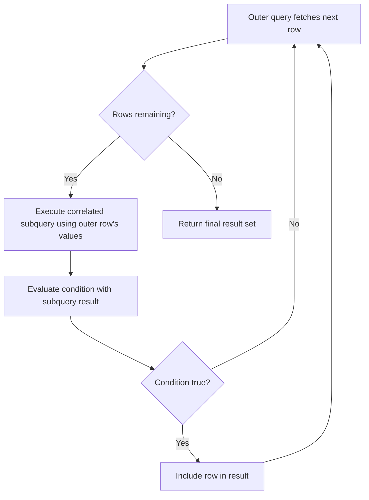
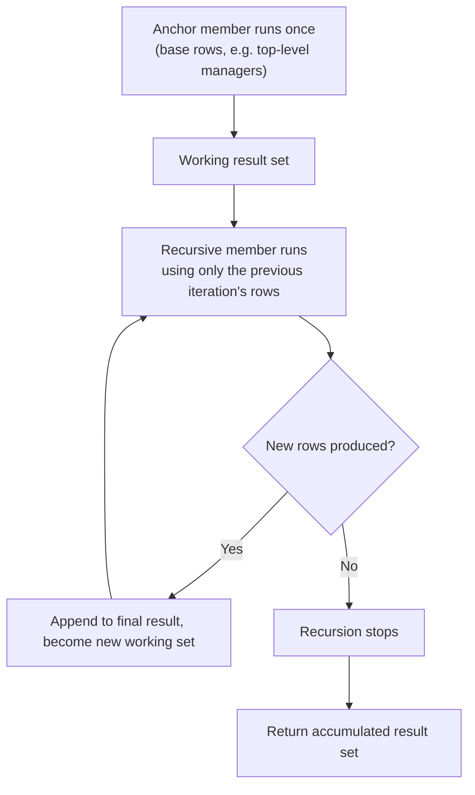

# Subqueries and CTEs

A subquery (or "inner query") is a `SELECT` statement nested inside another query — in a `WHERE`/`HAVING` condition, a `FROM` clause (as a derived table), or even the `SELECT` list itself.

## Scalar Subqueries

A scalar subquery returns exactly one row and one column — a single value — and can be used anywhere a literal value would be valid.

```sql
SELECT name, salary,
    (SELECT AVG(salary) FROM employees) AS company_avg_salary
FROM employees;

SELECT * FROM employees
WHERE salary > (SELECT AVG(salary) FROM employees);
```

**Gotcha:** if a scalar subquery unexpectedly returns more than one row at runtime, the database raises an error (e.g., "more than one row returned by a subquery used as an expression") rather than silently picking one — always ensure the inner query is inherently limited to one row (via aggregation, `LIMIT 1`, or a uniqueness guarantee).

## Row Subqueries

A row subquery returns a single row but multiple columns, typically compared using row constructor syntax `(col1, col2) = (subquery)`.

```sql
-- Find the employee(s) with the highest salary and earliest hire date combination
SELECT * FROM employees
WHERE (salary, hire_date) = (
    SELECT MAX(salary), MIN(hire_date) FROM employees
);
```

Row comparisons are less commonly used than scalar or table subqueries but are handy for atomically comparing multiple related columns at once without repeating the subquery per column.

## Table Subqueries

A table (or "derived table") subquery returns multiple rows and columns, and is used inside a `FROM` clause as if it were a regular table — it must be given an alias.

```sql
SELECT dept_summary.department, dept_summary.avg_salary
FROM (
    SELECT department, AVG(salary) AS avg_salary
    FROM employees
    GROUP BY department
) AS dept_summary
WHERE dept_summary.avg_salary > 70000;
```

**Gotcha:** most databases (including PostgreSQL and MySQL) *require* an alias for a derived table in `FROM` — omitting it is a syntax error, unlike a scalar subquery which doesn't need one.

## Correlated Subqueries

A correlated subquery references a column from the outer query, so conceptually it must be (re-)evaluated once per row of the outer query, rather than once overall.

```sql
-- For each employee, check if they earn more than their department's average
SELECT e.name, e.salary, e.department
FROM employees e
WHERE e.salary > (
    SELECT AVG(e2.salary)
    FROM employees e2
    WHERE e2.department = e.department  -- correlation: references outer row's department
);
```



**Performance note:** conceptually a correlated subquery runs once per outer row, which sounds expensive — in practice, modern query optimizers frequently rewrite correlated subqueries (especially `EXISTS`/`IN` forms) into equivalent semi-joins that execute far more efficiently than a literal row-by-row loop. Still, always check `EXPLAIN` output on large tables, since not every correlated pattern gets optimized well.

## EXISTS vs IN

Both `EXISTS` and `IN` can express "does a related row exist," but they differ in `NULL` handling and how the optimizer typically executes them.

```sql
-- IN form
SELECT * FROM customers c
WHERE c.id IN (SELECT customer_id FROM orders o WHERE o.total > 1000);

-- EXISTS form (correlated)
SELECT * FROM customers c
WHERE EXISTS (
    SELECT 1 FROM orders o WHERE o.customer_id = c.id AND o.total > 1000
);
```

| Aspect | `IN` | `EXISTS` |
|---|---|---|
| NULL safety (with `NOT`) | Unsafe — `NOT IN` breaks if list has NULLs | Safe — unaffected by NULLs in subquery |
| Correlation | Usually non-correlated (fixed list) | Usually correlated to outer query |
| Typical optimizer strategy | Materializes list, may hash/semi-join | Often rewritten to a semi-join, short-circuits on first match |
| Readability for "existence" checks | Less direct | More directly expresses intent |

**Best practice:** for existence checks (especially negated ones), prefer `NOT EXISTS` over `NOT IN` to avoid the `NULL` pitfall; for simple membership against a short, guaranteed-non-null literal list, `IN` remains perfectly idiomatic and clear.

#### Interview Questions

1. **What's the difference between a correlated and a non-correlated subquery, and why does it matter for performance?**
   A non-correlated subquery is fully independent of the outer query and can be evaluated once; a correlated subquery references a column from the outer query, so conceptually it's re-evaluated per outer row. In practice the optimizer often rewrites correlated `EXISTS`/`IN` patterns into an efficient semi-join, but it's still important to check the execution plan since not all correlated patterns get optimized.
2. **What happens if a scalar subquery returns more than one row at runtime?**
   The database raises a runtime error (e.g., "more than one row returned by a subquery used as an expression") rather than silently choosing one value — the query must guarantee at most one row is returned, typically via an aggregate function, a unique constraint, or `LIMIT 1`.
3. **Why must a derived table (subquery in `FROM`) always have an alias, unlike a scalar subquery in `SELECT`?**
   The database needs a name to qualify columns coming from the derived table when referencing them elsewhere in the outer query (e.g., in `WHERE`, `JOIN`, or the `SELECT` list); without an alias, there'd be no way to unambiguously refer to its columns, so most databases enforce it as a syntax requirement.
4. **When would you prefer a subquery over a `JOIN`, or vice versa?**
   A subquery (especially `EXISTS`/`IN`) is often clearer when you only need to check for a related row's existence or a single aggregate value and don't need any columns from the related table in the output. A `JOIN` is preferred when you need to actually select or aggregate columns from both tables together, since it avoids re-fetching related data separately and lets the optimizer consider join-specific strategies (hash/merge/nested loop).
5. **Why is `NOT EXISTS` generally safer than `NOT IN` for existence checks?**
   `NOT IN` breaks silently (returns zero rows) if the subquery result contains any `NULL`, because comparing against `NULL` yields `UNKNOWN` for every row. `NOT EXISTS` only checks for the presence of matching rows under the correlation condition and is unaffected by `NULL`s in the subquery's other columns, making it the safer default for negated existence checks.
6. **Can a subquery in the `SELECT` list (a scalar subquery) reference columns from the outer query?**
   Yes — that makes it a correlated scalar subquery, evaluated per outer row (e.g., computing a per-row percentage of a department total). It must still be guaranteed to return exactly one row and one column per evaluation, or the query will error at runtime.

## Common Table Expressions (CTE)

A Common Table Expression (CTE) is a named, temporary result set defined with a `WITH` clause immediately before a query, and referenced by name in that query as if it were a regular table. CTEs exist only for the duration of the statement — they aren't persisted like views.

## WITH Clause

The `WITH` clause lets you factor out a subquery into a readable, named block, which is especially useful when the same derived result is needed multiple times or when a query would otherwise nest several layers of subqueries.

```sql
WITH high_earners AS (
    SELECT id, name, department, salary
    FROM employees
    WHERE salary > 90000
)
SELECT department, COUNT(*) AS high_earner_count
FROM high_earners
GROUP BY department;
```

- Improves readability by giving a meaningful name to an intermediate result instead of an inline nested subquery.
- Scoped only to the single statement it precedes — cannot be referenced by later, separate statements.
- In PostgreSQL 12+, a non-recursive CTE that's referenced only once may be *inlined* (folded into the outer query) by the planner unless you force materialization with `AS MATERIALIZED`; older versions (and `AS NOT MATERIALIZED` vs `AS MATERIALIZED` explicitly) always materialized the CTE as an optimization fence. This matters because an inlined CTE lets predicates push down into it, while a materialized one is computed once and reused as-is.

## Recursive CTE (Overview)

A recursive CTE (`WITH RECURSIVE`) lets a query reference itself to walk hierarchical or graph-like data — e.g., an org chart, a bill-of-materials tree, or a category hierarchy. It's composed of an **anchor member** (the base case, executed once) and a **recursive member** (unioned with the anchor, executed repeatedly against the *previous iteration's* results until it returns no rows).

```sql
WITH RECURSIVE org_chart AS (
    -- Anchor member: top-level managers with no manager
    SELECT id, name, manager_id, 1 AS level
    FROM employees
    WHERE manager_id IS NULL

    UNION ALL

    -- Recursive member: employees whose manager is already in org_chart
    SELECT e.id, e.name, e.manager_id, oc.level + 1
    FROM employees e
    JOIN org_chart oc ON e.manager_id = oc.id
)
SELECT * FROM org_chart ORDER BY level, name;
```



- Must use `UNION ALL` (not `UNION`) in most engines when the goal is a simple accumulating traversal — using `UNION` adds a deduplication step and can also be used deliberately to prevent infinite loops on cyclic data.
- Always include a natural termination condition (the recursive term eventually returns zero rows); for genuinely cyclic graphs, track visited nodes explicitly to avoid infinite recursion, and set an engine-level safety limit (e.g., PostgreSQL's `SET max_recursive_iterations` isn't standard, but recursion depth can be capped with a counter column and a `WHERE level < N` guard).

## Multiple CTEs

A single `WITH` clause can define several CTEs, comma-separated; later CTEs may reference earlier ones defined in the same clause, building up a pipeline of named intermediate steps.

```sql
WITH dept_avg AS (
    SELECT department, AVG(salary) AS avg_salary
    FROM employees
    GROUP BY department
),
above_avg AS (
    SELECT e.name, e.department, e.salary
    FROM employees e
    JOIN dept_avg d ON e.department = d.department
    WHERE e.salary > d.avg_salary
)
SELECT * FROM above_avg ORDER BY department, salary DESC;
```

| Aspect | CTE (`WITH`) | Subquery | Temp Table |
|---|---|---|---|
| Scope | Single statement | Single statement | Session/transaction (persists across statements) |
| Readability | High — named, can chain multiple | Lower for deeply nested cases | High, but requires extra `CREATE`/`DROP` statements |
| Reusable within same query | Yes, by name, multiple times | Must repeat the subquery text | Yes |
| Indexable | No (unless materialized and engine-specific) | No | Yes |
| Typical use case | Readable multi-step transformations, recursion | One-off inline filtering/derivation | Multi-statement batch processing, large intermediate data |

#### Interview Questions

1. **What's the difference between a CTE and a subquery, and when would you prefer one over the other?**
   Both define an inline, temporary result, but a CTE is named up front via `WITH` and can be referenced multiple times in the outer query without repeating its definition, which improves readability for multi-step logic. A subquery is inline and unnamed; it's fine for a single, simple use but becomes hard to read if reused or deeply nested. CTEs are also required for recursion, which plain subqueries cannot express.
2. **Can a CTE be referenced more than once in the same query, and does that mean it's computed multiple times?**
   Yes, it can be referenced multiple times. Whether it's computed once or re-evaluated per reference depends on the engine and materialization: PostgreSQL may inline (and thus potentially re-evaluate) a non-recursive CTE referenced once, but a CTE referenced multiple times, or explicitly marked `AS MATERIALIZED`, is typically computed once and its result reused.
3. **What are the two required parts of a recursive CTE, and what stops the recursion?**
   The anchor member (base case, run once) and the recursive member (joins back to the CTE's own name, run repeatedly against only the most recently produced rows). Recursion stops naturally when the recursive member's query returns zero new rows for an iteration.
4. **Why use `UNION ALL` instead of `UNION` in most recursive CTEs?**
   `UNION ALL` avoids an expensive duplicate-elimination pass on every iteration, which matters for performance on deep or wide recursions. `UNION` is used deliberately only when you need to deduplicate — for example, to break out of a cycle in graph data where the same node could otherwise be revisited forever.
5. **Are CTEs indexed or optimized like a real table?**
   No — a plain CTE is not a persisted, indexable object; it's either inlined into the surrounding query or materialized as a temporary result for that one statement only. If you need an indexable, reusable structure across queries, use a temp table or a materialized view instead.
6. **How would you guard against infinite recursion when the underlying data might contain cycles (e.g., a manager hierarchy with a data-entry loop)?**
   Add a column tracking visited keys (e.g., an array of ancestor IDs) and a `WHERE NOT (child_id = ANY(visited_path))` condition in the recursive member, or cap the depth with a counter and `WHERE level < N`, since the database will otherwise loop until it exhausts memory or hits an engine-level recursion limit.
