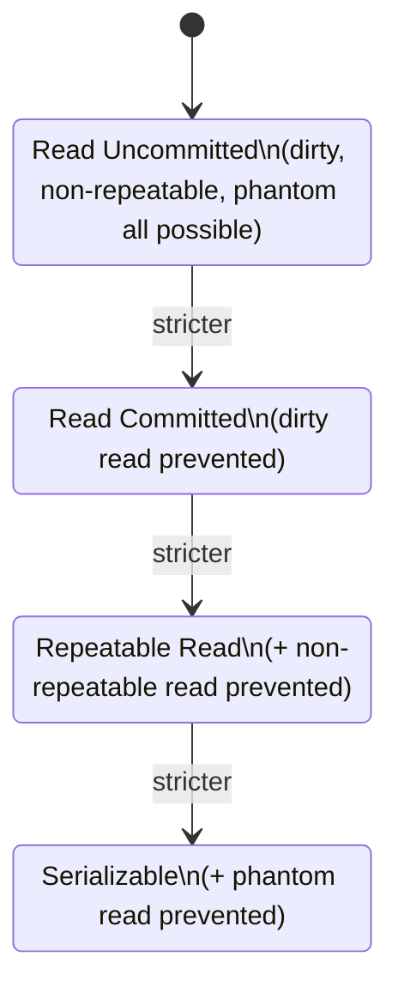

# Transactions

A transaction groups one or more statements into a single atomic unit of work — either all of its changes are applied (`COMMIT`) or none of them are (`ROLLBACK`) — and provides the ACID guarantees (Atomicity, Consistency, Isolation, Durability) relied on to keep data correct under concurrent access and failures.

## BEGIN

`BEGIN` (or `START TRANSACTION`) explicitly opens a transaction block, after which subsequent statements are grouped together until a `COMMIT` or `ROLLBACK`.

```sql
BEGIN;

UPDATE accounts SET balance = balance - 100 WHERE id = 1;
UPDATE accounts SET balance = balance + 100 WHERE id = 2;

COMMIT;
```

Everything between `BEGIN` and `COMMIT`/`ROLLBACK` is treated as one indivisible operation from the perspective of other transactions (subject to the active isolation level).

## COMMIT

`COMMIT` permanently applies all changes made during the transaction, making them visible to other transactions and durable against crashes (once committed, guaranteed to survive a subsequent power loss, per the "Durability" guarantee).

```sql
BEGIN;
INSERT INTO orders (customer_id, total) VALUES (42, 199.99);
UPDATE inventory SET quantity = quantity - 1 WHERE product_id = 7;
COMMIT;  -- both changes become permanent and visible together
```

If any statement in the transaction fails and the transaction isn't explicitly rolled back or handled, most engines (e.g., PostgreSQL) put the whole transaction into an aborted state where further statements are rejected until a `ROLLBACK` is issued.

## ROLLBACK

`ROLLBACK` discards all changes made since the transaction began (or since a named `SAVEPOINT`), restoring the data to its pre-transaction state.

```sql
BEGIN;
UPDATE accounts SET balance = balance - 100 WHERE id = 1;
-- Application logic detects a problem (e.g., insufficient funds check failed downstream)
ROLLBACK;  -- the balance update never actually happened
```

Typically triggered explicitly by application logic on error, or automatically by the database when a statement errors out inside a transaction (depending on the engine/driver's error-handling behavior).

## SAVEPOINT

A `SAVEPOINT` marks an intermediate point within a transaction that you can roll back to *without* discarding the entire transaction — useful for handling partial failures in a larger multi-step transaction.

```sql
BEGIN;
UPDATE accounts SET balance = balance - 100 WHERE id = 1;

SAVEPOINT before_bonus;
UPDATE accounts SET balance = balance + 10 WHERE id = 1;  -- e.g., a bonus calculation step
-- Suppose this bonus step is later found invalid:
ROLLBACK TO SAVEPOINT before_bonus;

UPDATE accounts SET balance = balance + 100 WHERE id = 2;
COMMIT;  -- first update and second update are kept; the bonus update was undone
```

## Transaction Isolation Levels

Isolation level controls how much one transaction's in-progress changes are visible to (or affected by) other concurrent transactions — a direct tradeoff between consistency guarantees and concurrency/performance.

```sql
BEGIN TRANSACTION ISOLATION LEVEL REPEATABLE READ;
-- ... statements ...
COMMIT;

-- Or set for the session:
SET TRANSACTION ISOLATION LEVEL SERIALIZABLE;
```

| Isolation Level | Dirty Read | Non-Repeatable Read | Phantom Read | Notes |
|---|---|---|---|---|
| Read Uncommitted | Possible | Possible | Possible | Rarely truly implemented (e.g., PostgreSQL treats it as Read Committed) |
| Read Committed | Prevented | Possible | Possible | Default in PostgreSQL, Oracle, SQL Server |
| Repeatable Read | Prevented | Prevented | Possible (standard-defined; PostgreSQL also prevents phantoms here) | Default in MySQL/InnoDB |
| Serializable | Prevented | Prevented | Prevented | Strictest; may cause serialization failures requiring retry |

- **Dirty read**: reading another transaction's *uncommitted* changes, which might later be rolled back — you'd be acting on data that never actually existed.
- **Non-repeatable read**: re-reading the same row twice within one transaction and getting different values, because another transaction committed an update to that row in between.
- **Phantom read**: re-running the same query twice within one transaction and getting a different *set of rows* (new rows appeared or disappeared), because another transaction committed an insert/delete matching the query's condition in between.



**Tradeoff:** stricter isolation levels prevent more anomalies but increase locking/blocking and reduce concurrency, and `SERIALIZABLE` can cause transactions to fail with a serialization error under contention, requiring the application to retry them.

## Auto Commit

Most database clients/drivers run in **auto-commit mode** by default — each individual statement is automatically wrapped in and committed as its own transaction unless you explicitly `BEGIN` a multi-statement transaction.

```sql
-- With autocommit ON (default), each statement below is its own transaction:
UPDATE accounts SET balance = balance - 100 WHERE id = 1;  -- committed immediately
UPDATE accounts SET balance = balance + 100 WHERE id = 2;  -- committed immediately, independently

-- To group them atomically, autocommit must be suspended via an explicit transaction:
BEGIN;
UPDATE accounts SET balance = balance - 100 WHERE id = 1;
UPDATE accounts SET balance = balance + 100 WHERE id = 2;
COMMIT;
```

This is a frequent source of bugs in application code (including Spring/JPA) — forgetting to open an explicit transaction boundary (e.g., missing `@Transactional`) means each repository call commits independently, so a failure partway through a multi-step operation leaves the database in a partially-updated state.

## Locking Basics

The database uses locks internally to enforce isolation guarantees and prevent concurrent transactions from corrupting each other's in-progress work.

- **Shared (read) lock**: allows multiple transactions to read the same row concurrently, but blocks a concurrent writer from modifying it.
- **Exclusive (write) lock**: held by a transaction modifying a row; blocks other transactions from reading (under stricter isolation) or writing that same row until released.
- **Row-level vs. table-level locking**: modern engines default to row-level locking (only the specific rows touched are locked), which allows far more concurrency than locking the entire table; explicit table locks (`LOCK TABLE`) are usually reserved for bulk operations like schema changes.
- **Deadlocks**: occur when two transactions each hold a lock the other needs, and each is waiting on the other — the database detects this cycle and forcibly aborts (rolls back) one of the transactions to break the deadlock, returning an error the application should catch and retry.

#### Interview Questions

1. **What do the four ACID properties guarantee, in one sentence each?**
   Atomicity — a transaction's statements all succeed or all fail together, with no partial application. Consistency — a transaction moves the database from one valid state to another, respecting all constraints. Isolation — concurrent transactions don't see each other's uncommitted intermediate state (to a degree controlled by isolation level). Durability — once committed, changes survive subsequent crashes/power loss.
2. **Explain the difference between a dirty read, a non-repeatable read, and a phantom read.**
   A dirty read sees another transaction's *uncommitted* changes, which could later be rolled back. A non-repeatable read occurs when re-reading the *same row* within one transaction returns different data because another transaction committed an update to it in between. A phantom read occurs when re-running the *same query* returns a different set of rows, because another transaction committed a matching insert or delete in between.
3. **Why is `Read Committed` the default isolation level in most databases rather than `Serializable`?**
   `Serializable` provides the strongest guarantees but at the cost of significantly reduced concurrency and a real risk of serialization failures requiring the application to retry transactions. `Read Committed` prevents dirty reads (the most obviously dangerous anomaly) while still allowing high concurrency, which is an acceptable tradeoff for the majority of everyday application workloads.
4. **What happens if you forget to wrap multiple related statements in an explicit transaction?**
   With autocommit on (the default in most drivers), each statement commits independently as soon as it executes. If a later statement in a logically-related sequence fails, earlier statements have already been permanently committed, leaving the database in an inconsistent, partially-updated state — this is why operations like a funds transfer must be explicitly wrapped in `BEGIN`/`COMMIT` (or `@Transactional` in Spring).
5. **What is a deadlock, and how does the database resolve it?**
   A deadlock happens when two (or more) transactions each hold a lock that the other is waiting to acquire, forming a cycle where none can proceed. The database's deadlock detector identifies the cycle and forcibly rolls back one of the transactions (chosen by some victim-selection heuristic), returning an error to that transaction's client, which should catch it and retry.
6. **What's the difference between a shared lock and an exclusive lock?**
   A shared (read) lock allows multiple transactions to hold it simultaneously on the same row, permitting concurrent reads, but blocks any transaction trying to acquire an exclusive lock for writing. An exclusive (write) lock is held by only one transaction at a time and blocks both other writers and (depending on isolation level) other readers, since the row is actively being modified.
