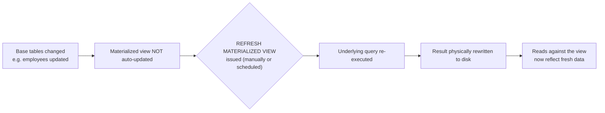

# Views

A view is a stored, named `SELECT` query that behaves like a virtual table — it doesn't store data itself (except a materialized view), but re-runs its underlying query each time it's referenced.

## Creating Views

A view is created with `CREATE VIEW name AS SELECT ...` and can then be queried, joined, and filtered just like a regular table.

```sql
CREATE VIEW active_employee_summary AS
SELECT id, name, department, salary
FROM employees
WHERE status = 'ACTIVE';

SELECT * FROM active_employee_summary WHERE department = 'Engineering';
```

- **Abstraction**: hides complex joins/filters behind a simple name, so consumers don't need to know the underlying schema details.
- **Security**: can expose only specific columns/rows of a sensitive table (e.g., excluding a `salary` or `ssn` column) and be granted to a role instead of granting direct table access.
- **Consistency**: centralizes a commonly-used query definition so business logic (e.g., "what counts as an active employee") isn't duplicated across the codebase.

## Updating Views

An existing view's definition can be replaced with `CREATE OR REPLACE VIEW` (without needing to `DROP` it first, as long as the column list/types are compatible), and in some cases you can `INSERT`/`UPDATE`/`DELETE` directly against a view.

```sql
CREATE OR REPLACE VIEW active_employee_summary AS
SELECT id, name, department, salary, hire_date
FROM employees
WHERE status = 'ACTIVE';

-- Updatable view example (simple, single-table, no aggregates)
CREATE VIEW engineering_employees AS
SELECT id, name, salary
FROM employees
WHERE department = 'Engineering'
WITH CHECK OPTION;

UPDATE engineering_employees SET salary = salary * 1.05 WHERE id = 42;
```

- A view is generally **updatable** only if it's based on a single table, has no `GROUP BY`/`DISTINCT`/aggregate functions/set operations, and each output column maps directly to one underlying column.
- `WITH CHECK OPTION` ensures that rows inserted/updated through the view still satisfy the view's own `WHERE` condition — without it, you could update a row through the view in a way that makes it silently "disappear" from the view.

## View Limitations

- A plain view has **no independent storage or indexing** — every query against it re-executes the underlying `SELECT`, so its performance is entirely bound to the performance of that underlying query (and any indexes on the base tables it touches).
- Only **simple** views (see above) are updatable; views involving joins, aggregates, `DISTINCT`, `UNION`, or window functions are typically read-only.
- Views cannot take parameters directly (unlike stored procedures/functions) — dynamic filtering must happen via `WHERE` clauses applied against the view from the calling query.
- Schema changes to underlying base tables (e.g., dropping a column a view depends on) can silently break dependent views, so views add a hidden coupling that must be tracked during migrations.

## Materialized Views (Concept)

A materialized view **stores** the query's result physically on disk at creation time (or last refresh), rather than recomputing it on every access — trading data freshness for query speed.

```sql
CREATE MATERIALIZED VIEW dept_salary_summary AS
SELECT department, AVG(salary) AS avg_salary, COUNT(*) AS employee_count
FROM employees
GROUP BY department;

-- Data is stale until explicitly refreshed:
REFRESH MATERIALIZED VIEW dept_salary_summary;

-- PostgreSQL: refresh without blocking concurrent reads (requires a unique index on the view)
REFRESH MATERIALIZED VIEW CONCURRENTLY dept_salary_summary;
```



| Aspect | View | Materialized View |
|---|---|---|
| Storage | None — just a stored query definition | Physically stores result set |
| Freshness | Always up to date (re-run each query) | Stale until explicitly refreshed |
| Query speed | Same as running the underlying query | Fast — reads pre-computed data |
| Indexable | No | Yes (can add indexes on the materialized result) |
| Write overhead | None | Refresh cost (can be expensive on large datasets) |
| Best for | Simple abstraction, always-current data, low query volume | Expensive aggregations/joins, read-heavy, tolerable staleness |

#### Interview Questions

1. **What's the fundamental difference between a view and a materialized view?**
   A regular view is just a stored query — it has no data of its own and re-executes the underlying `SELECT` every time it's queried, so it's always current but has no independent performance benefit. A materialized view physically stores the computed result, so reads are fast, but the data becomes stale until you explicitly (or on a schedule) `REFRESH` it.
2. **When is a view updatable, and what's the purpose of `WITH CHECK OPTION`?**
   A view is generally updatable only if it maps to a single base table with no aggregates, `DISTINCT`, `GROUP BY`, or set operations, so each row/column corresponds directly to an underlying row/column. `WITH CHECK OPTION` prevents inserts/updates through the view from producing rows that would violate the view's own `WHERE` predicate, which would otherwise let a row "vanish" from the view immediately after being written through it.
3. **Does creating a view improve query performance?**
   No — a plain view has no storage or indexing of its own; querying it just re-runs the underlying query, so performance depends entirely on the base tables, their indexes, and the query itself. Only a materialized view (or a view combined with proper indexing on the base tables) can improve performance.
4. **How do you keep a materialized view's data current, and what are the tradeoffs?**
   You must explicitly run `REFRESH MATERIALIZED VIEW` (optionally `CONCURRENTLY` in PostgreSQL to avoid blocking reads, which requires a unique index on the view), typically on a schedule or triggered after significant data changes. The tradeoff is staleness: between refreshes, the view can return outdated results, so it's best suited for expensive aggregations where slightly-stale data is acceptable in exchange for fast reads.
5. **Why might a view "break" after a schema migration even if the view itself wasn't touched?**
   Views depend on the structure of their underlying base tables; dropping or renaming a column the view references (or changing a column's type incompatibly) can invalidate the view or cause runtime errors, even though no one explicitly altered the view. This hidden coupling means schema changes should be checked against dependent views before deployment.
6. **Can you index a materialized view but not a regular view — why?**
   Yes. A materialized view stores actual physical rows like a table, so indexes can be created on it directly to speed up queries against the stored snapshot. A regular view has no physical storage of its own — any indexing benefit must come from indexes on the underlying base tables, since the view itself is just a saved query definition.
