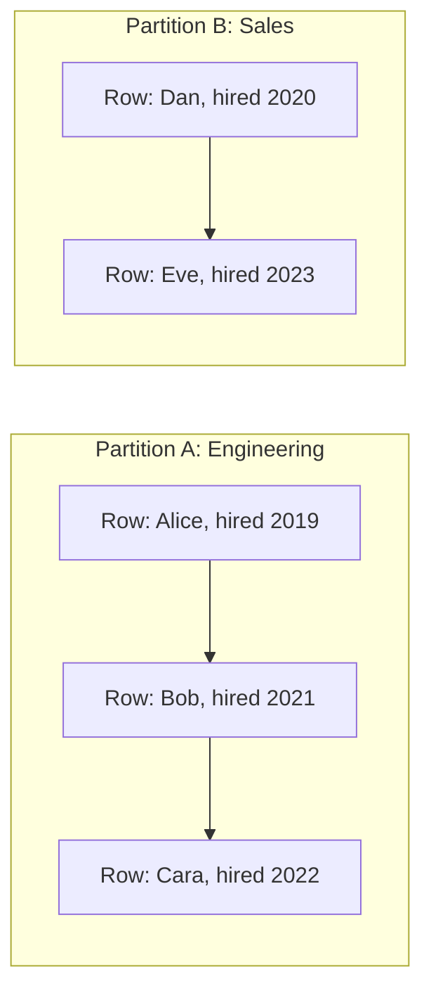

# Window Functions

A window function performs a calculation across a set of rows related to the current row — its "window" — without collapsing those rows into a single output row the way `GROUP BY` does. Every input row is preserved in the output, each with its computed window value alongside it, which makes window functions ideal for rankings, running totals, and row-to-row comparisons.

## OVER Clause

The `OVER (...)` clause is what turns an ordinary aggregate or ranking function into a window function — it defines the set of rows the function operates on for each row of the result, instead of collapsing the whole result into one row.

```sql
SELECT name, department, salary,
    AVG(salary) OVER () AS company_avg_salary
FROM employees;
```

- Without any arguments, `OVER ()` treats the entire result set as one window — every row sees the same overall average, but individual rows are still returned.
- Distinguishes a window function call from a regular aggregate: `AVG(salary)` in a plain `SELECT` with `GROUP BY` collapses rows; `AVG(salary) OVER (...)` keeps every row and attaches the computed value to it.

## PARTITION BY

`PARTITION BY` splits the rows into independent groups ("partitions"), and the window function is applied separately within each partition — conceptually similar to `GROUP BY`, but again without collapsing rows.

```sql
SELECT name, department, salary,
    AVG(salary) OVER (PARTITION BY department) AS dept_avg_salary
FROM employees;
```

Each employee row now shows their own department's average alongside their individual salary, letting you directly compare an individual value against its group aggregate in the same row — something a plain `GROUP BY` query cannot do without a self-join.

## ORDER BY in Window Functions

`ORDER BY` inside `OVER (...)` defines the logical row order used for order-sensitive functions (ranking, `LEAD`/`LAG`, running totals). It also implicitly establishes the default frame (`RANGE BETWEEN UNBOUNDED PRECEDING AND CURRENT ROW`) for aggregate window functions when no explicit frame clause is given.

```sql
SELECT name, department, hire_date,
    ROW_NUMBER() OVER (PARTITION BY department ORDER BY hire_date) AS hire_order
FROM employees;
```



## ROW_NUMBER

`ROW_NUMBER()` assigns a unique, strictly sequential integer (1, 2, 3, …) to each row within its partition, based on the `ORDER BY` — ties get arbitrarily-but-deterministically broken (determined by physical row order unless the `ORDER BY` is fully unambiguous).

```sql
SELECT name, salary,
    ROW_NUMBER() OVER (ORDER BY salary DESC) AS rank_num
FROM employees;
```

Common use case: pagination or "top N per group" queries (e.g., top 3 highest earners per department) by filtering on `rank_num <= 3` in an outer query or CTE, since `ROW_NUMBER()` can't be used directly in the same `WHERE` clause it's defined in.

## RANK

`RANK()` assigns the same rank to tied rows, then **skips** the next rank(s) accordingly — e.g., two rows tied for rank 1 means the next row gets rank 3, not 2.

```sql
SELECT name, salary,
    RANK() OVER (ORDER BY salary DESC) AS salary_rank
FROM employees;
```

## DENSE_RANK

`DENSE_RANK()` also gives tied rows the same rank, but leaves **no gaps** — the next distinct value always gets the very next integer.

```sql
SELECT name, salary,
    DENSE_RANK() OVER (ORDER BY salary DESC) AS salary_dense_rank
FROM employees;
```

| Salary | `ROW_NUMBER()` | `RANK()` | `DENSE_RANK()` |
|---|---|---|---|
| 100,000 | 1 | 1 | 1 |
| 100,000 | 2 | 1 | 1 |
| 90,000 | 3 | 3 | 2 |
| 80,000 | 4 | 4 | 3 |

- **`ROW_NUMBER`**: always unique, never ties, useful for deduplication and strict pagination.
- **`RANK`**: reflects "competition ranking" (1st, 1st, 3rd) — matches how sports standings usually work.
- **`DENSE_RANK`**: no gaps, useful when you want a compact "tier" number (e.g., salary tier 1, 2, 3…) regardless of how many ties occurred.

## LEAD

`LEAD(column, offset, default)` looks **forward** to a subsequent row within the same partition/order, without needing a self-join.

```sql
SELECT name, department, salary,
    LEAD(salary, 1) OVER (PARTITION BY department ORDER BY hire_date) AS next_hired_salary
FROM employees;
```

Common use case: comparing each row to the "next" chronological event — e.g., time between consecutive orders, or the salary of the next person hired.

## LAG

`LAG(column, offset, default)` looks **backward** to a preceding row within the same partition/order — the mirror image of `LEAD`.

```sql
SELECT name, order_date, amount,
    amount - LAG(amount, 1, 0) OVER (PARTITION BY customer_id ORDER BY order_date) AS change_from_prev_order
FROM orders;
```

This is the standard pattern for computing period-over-period deltas (e.g., month-over-month sales change) directly in SQL without a self-join.

## FIRST_VALUE

`FIRST_VALUE(column)` returns the value from the **first** row of the current window frame (as defined by `PARTITION BY`/`ORDER BY`/frame clause).

```sql
SELECT name, department, salary,
    FIRST_VALUE(name) OVER (PARTITION BY department ORDER BY salary DESC) AS top_earner_in_dept
FROM employees;
```

## LAST_VALUE

`LAST_VALUE(column)` returns the value from the **last** row of the current window frame — but this is the most common source of window-function bugs.

```sql
-- Naive usage often gives an unexpected result:
SELECT name, department, salary,
    LAST_VALUE(name) OVER (PARTITION BY department ORDER BY salary DESC) AS naive_last
FROM employees;

-- Correct usage — explicitly extend the frame to the whole partition:
SELECT name, department, salary,
    LAST_VALUE(name) OVER (
        PARTITION BY department ORDER BY salary DESC
        ROWS BETWEEN UNBOUNDED PRECEDING AND UNBOUNDED FOLLOWING
    ) AS true_last
FROM employees;
```

**Gotcha:** with an `ORDER BY` present and no explicit frame, the *default* frame is `RANGE BETWEEN UNBOUNDED PRECEDING AND CURRENT ROW` — meaning `LAST_VALUE` sees only up to the *current* row, so it effectively just returns the current row's own value rather than the true last row of the partition. You must explicitly widen the frame to `ROWS BETWEEN UNBOUNDED PRECEDING AND UNBOUNDED FOLLOWING` to get the intuitive "last row in partition" behavior.

## Running Totals

A running (cumulative) total is computed with an aggregate window function ordered by some column, accumulating from the start of the partition up to the current row.

```sql
SELECT order_date, amount,
    SUM(amount) OVER (ORDER BY order_date ROWS BETWEEN UNBOUNDED PRECEDING AND CURRENT ROW) AS running_total
FROM orders
ORDER BY order_date;
```

Because `ROWS BETWEEN UNBOUNDED PRECEDING AND CURRENT ROW` is also the default frame implied by a plain `ORDER BY` (with `RANGE` semantics) for aggregate window functions, the shorter form `SUM(amount) OVER (ORDER BY order_date)` produces the same running total in most cases — but explicitly specifying `ROWS` avoids subtle differences when there are duplicate `ORDER BY` values (with `RANGE`, all peer rows with equal order-by values are included together, which can pull in more rows than expected).

#### Interview Questions

1. **How does a window function differ from `GROUP BY`?**
   `GROUP BY` collapses multiple rows into one row per group, discarding individual row detail. A window function computes an aggregate or ranking value per row while still returning every original row — each row gets its own computed value "alongside" it rather than being merged away, which is why window functions can, for example, show both an employee's individual salary and their department average in the same row.
2. **What's the difference between `RANK()`, `DENSE_RANK()`, and `ROW_NUMBER()`?**
   `ROW_NUMBER()` always assigns unique sequential numbers with no ties. `RANK()` gives tied rows the same rank but then skips subsequent rank values (gaps). `DENSE_RANK()` also gives ties the same rank but never leaves gaps — the next distinct value always gets the immediately following integer.
3. **Why can `LAST_VALUE()` return a surprising/wrong-looking result by default?**
   Because the implicit default window frame when an `ORDER BY` is present is `RANGE BETWEEN UNBOUNDED PRECEDING AND CURRENT ROW`, so `LAST_VALUE` only "sees" rows up to the current one and typically just returns the current row's value. To get the true last row of the partition, you must explicitly set the frame to `ROWS BETWEEN UNBOUNDED PRECEDING AND UNBOUNDED FOLLOWING`.
4. **Can you use a window function's result directly in the `WHERE` clause of the same query?**
   No — window functions are logically evaluated after `WHERE`, `GROUP BY`, and `HAVING`, alongside the `SELECT` list, so their aliases can't be referenced in the same query's `WHERE`. To filter on a window function's result (e.g., "top 3 per department"), wrap the query in a CTE or subquery and filter in the outer query instead.
5. **How would you compute a "top N per group" query using window functions?**
   Use `ROW_NUMBER()` (or `RANK()`/`DENSE_RANK()` depending on tie-handling needs) partitioned by the group column and ordered by the ranking criterion, inside a CTE or subquery; then filter the outer query on `WHERE rn <= N`. This avoids a correlated subquery or self-join per group.
6. **What's the practical difference between `LEAD`/`LAG` and a self-join for comparing a row to an adjacent row?**
   `LEAD`/`LAG` express the intent directly and let the engine compute the adjacent value in a single pass over the ordered partition, which is typically far more efficient and readable than a self-join (which requires joining the table to itself on a computed adjacency condition and risks producing incorrect results with gaps or duplicate order keys).
